# 🪝 TaskMaster Hooks 系統

## 📁 檔案結構

```
.claude/hooks/
├── README.md                    # 本文件：Hooks 系統說明
├── hook-utils.sh               # 共用工具函數庫
├── session-start.sh            # 會話開始 Hook
├── user-prompt-submit.sh       # 用戶輸入提交 Hook
├── pre-tool-use.sh            # 工具使用前 Hook
└── post-write.sh              # 檔案寫入後 Hook
```

## 🎯 Hook 功能說明

### 1. `session-start.sh`
**觸發時機**: Claude Code 會話開始時

**主要功能**:
- 自動檢測 `CLAUDE_TEMPLATE.md` 檔案
- 判斷是否需要初始化 TaskMaster
- 顯示初始化提示訊息
- 調用 TaskMaster Node.js 處理器

**使用場景**:
```bash
# 每次啟動 Claude Code 時自動執行
# 無需手動調用
```

### 2. `user-prompt-submit.sh`
**觸發時機**: 用戶提交 prompt 時

**主要功能**:
- 檢測 TaskMaster 相關命令 (`/task-*`)
- 識別文檔相關操作
- 準備初始化環境
- 更新系統狀態

**使用場景**:
```bash
# 當用戶輸入包含以下內容時觸發：
# - /task-init
# - /task-status
# - /task-next
# - /hub-delegate
# - docs/ 路徑
# - .md 檔案操作
```

### 3. `pre-tool-use.sh`
**觸發時機**: Claude Code 工具使用前

**主要功能**:
- 提供 TaskMaster 狀態上下文
- 顯示當前專案資訊
- 工具特定的預處理
- 智能體委派準備

**支援工具**:
- `Write`: 檔案寫入提示
- `Edit`: 核心檔案編輯警告
- `Read`: VibeCoding 範本讀取上下文
- `Task`: 智能體委派準備

### 4. `post-write.sh`
**觸發時機**: Claude Code 寫入檔案後

**主要功能**:
- 接收並解析 PostToolUse JSON 資料（透過 stdin）
- 提取寫入的檔案路徑
- 檢測文檔檔案生成
- 觸發駕駛員審查流程
- 更新 TaskMaster 狀態
- 顯示審查通知

**資料接收方式**:
- 透過 **stdin** 接收 JSON 格式資料
- 使用 jq（如果已安裝）或 Python 解析 JSON
- 從 `tool_input.file_path` 或 `tool_response.filePath` 提取檔案路徑

**監控檔案類型**:
- 專案文檔 (`docs/*.md`)
- VibeCoding 範本
- TaskMaster 核心檔案
- Hooks 配置檔案

**重要修復 (2025-10-17)**:
- ✅ 修正 JSON 解析邏輯，改為從 stdin 讀取而非命令列參數
- ✅ 改用 `json.load(sys.stdin)` 避免 shell 變數轉義問題
- ✅ 移除 settings.local.json 中的模板變數 `{{args.file_path}}`
- ✅ 新增除錯模式支援（`TASKMASTER_DEBUG=true`）

### 5. `hook-utils.sh`
**功能**: 共用工具函數庫

**提供函數**:
- 日誌函數 (`log_info`, `log_success`, `log_warning`, `log_error`)
- 狀態檢查 (`check_taskmaster_status`, `check_required_files`)
- 檔案類型判斷 (`is_document_file`, `is_project_document`)
- 駕駛員通知 (`show_driver_notification`)
- 環境驗證 (`validate_environment`)

## 🔧 設定和使用

### 1. 權限設定
```bash
# 確保所有 hook 腳本具有執行權限
chmod +x .claude/hooks/*.sh
```

### 2. 環境變數
```bash
# 開啟除錯模式（可選）
export TASKMASTER_DEBUG=true
```

### 3. 日誌檔案
所有 Hook 活動記錄在：`.claude/hooks.log`

### 4. Claude Code 整合
hooks 通過 `.claude/settings.local.json` 整合到 Claude Code：

```json
{
  "hooks": {
    "SessionStart": [
      {
        "matcher": "*",
        "hooks": [
          {
            "type": "command",
            "command": ".claude/hooks/session-start.sh",
            "timeout": 30
          }
        ]
      }
    ],
    "UserPromptSubmit": [
      {
        "matcher": "*",
        "hooks": [
          {
            "type": "command",
            "command": ".claude/hooks/user-prompt-submit.sh '{{content}}'",
            "timeout": 15
          }
        ]
      }
    ]
  }
}
```

## 🎯 Hook 執行流程

```mermaid
graph TD
    A[Claude Code 啟動] --> B[session-start.sh]
    B --> C{偵測 CLAUDE_TEMPLATE.md?}
    C -->|是| D[顯示初始化提示]
    C -->|否| E[待命狀態]

    F[用戶輸入] --> G[user-prompt-submit.sh]
    G --> H{包含 /task-* 命令?}
    H -->|是| I[準備執行環境]
    H -->|否| J[檢查文檔操作]

    K[工具使用前] --> L[pre-tool-use.sh]
    L --> M[提供狀態上下文]

    N[檔案寫入後] --> O[post-write.sh]
    O --> P{是文檔檔案?}
    P -->|是| Q[觸發審查流程]
    P -->|否| R[記錄活動]
```



## 🛠️ 自定義 Hooks

### 創建新 Hook
```bash
# 1. 創建新的 hook 腳本
touch .claude/hooks/my-custom-hook.sh
chmod +x .claude/hooks/my-custom-hook.sh

# 2. 加入基本結構
cat << 'EOF' > .claude/hooks/my-custom-hook.sh
#!/bin/bash

# 載入共用工具函數
SCRIPT_DIR="$(cd "$(dirname "${BASH_SOURCE[0]}")" && pwd)"
source "$SCRIPT_DIR/hook-utils.sh"

# Hook 主邏輯
log_info "自定義 Hook 執行中..."
EOF

# 3. 在 settings.local.json 中註冊
```

### Hook 最佳實踐
1. **總是載入 `hook-utils.sh`** 使用共用函數
2. **適當的日誌記錄** 便於除錯和監控
3. **錯誤處理** 使用 `set -e` 和適當的錯誤檢查
4. **效能考慮** hooks 應該快速執行，避免阻塞
5. **狀態檢查** 在執行動作前檢查必要條件

## 🔍 除錯和監控

### 查看 Hook 日誌
```bash
# 實時監控 Hook 活動
tail -f .claude/hooks.log

# 查看最近的 Hook 活動
tail -n 50 .claude/hooks.log
```

### 手動測試 Hook
```bash
# 測試會話開始 Hook
.claude/hooks/session-start.sh

# 測試用戶輸入 Hook
.claude/hooks/user-prompt-submit.sh "/task-init MyProject"

# 測試檔案寫入 Hook
.claude/hooks/post-write.sh "docs/test.md"
```

### 除錯模式
```bash
# 啟用詳細日誌
export TASKMASTER_DEBUG=true

# 執行 Hook 查看除錯資訊
.claude/hooks/session-start.sh
```

## 🔧 常見問題排查

### PostToolUse Hook 未收到檔案路徑

**症狀**: Hook 日誌顯示 "無法從 JSON 中提取檔案路徑"

**原因**:
1. settings.local.json 中使用了錯誤的模板變數語法
2. JSON 解析邏輯錯誤（使用 shell 變數而非 stdin）

**解決方案**:
```json
// settings.local.json - 正確配置
"PostToolUse": [
  {
    "matcher": "Write",
    "hooks": [
      {
        "type": "command",
        "command": "bash .claude/hooks/post-write.sh",  // 不需要參數
        "timeout": 20
      }
    ]
  }
]
```

**驗證修復**:
```bash
# 1. 啟用除錯模式
export TASKMASTER_DEBUG=true

# 2. 觸發 Write 操作
# 3. 檢查日誌
tail -50 .claude/hooks.log | grep "檔案路徑"
```

## 📚 參考資源

- [Claude Code 官方文檔](https://docs.claude.com/claude-code)
- [Claude Code Hooks 文檔](https://docs.claude.com/en/docs/claude-code/hooks)
- [Conventional Commits](https://www.conventionalcommits.org/)
- [Semantic Versioning](https://semver.org/)
- [Git Best Practices](https://git-scm.com/book/en/v2)

---

**🎯 設計原則**: 所有 Hooks 都設計為非侵入性，確保即使在 Hook 失敗的情況下，Claude Code 的正常功能也不會受到影響。

**📅 最後更新**: 2025-10-17 - 修復 PostToolUse Hook JSON 解析問題