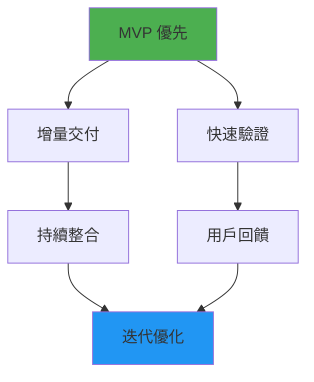
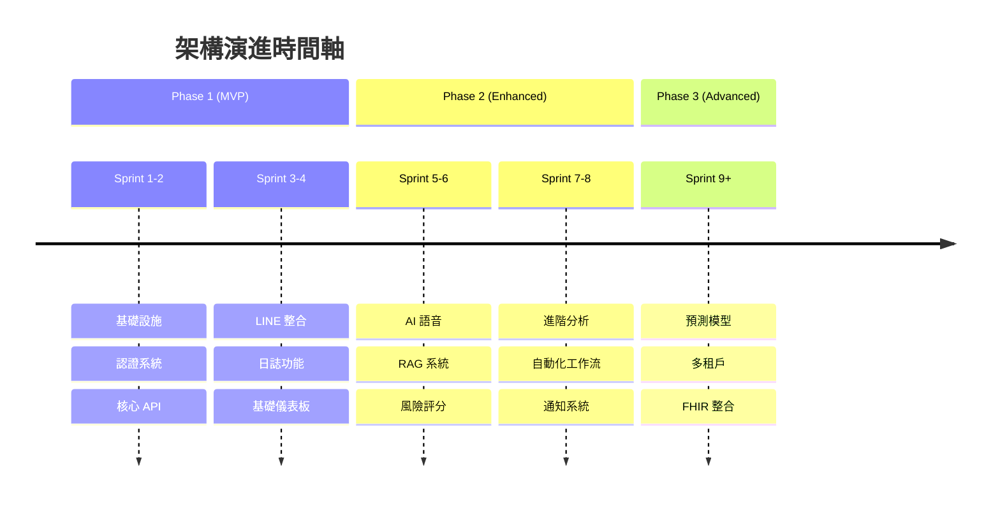
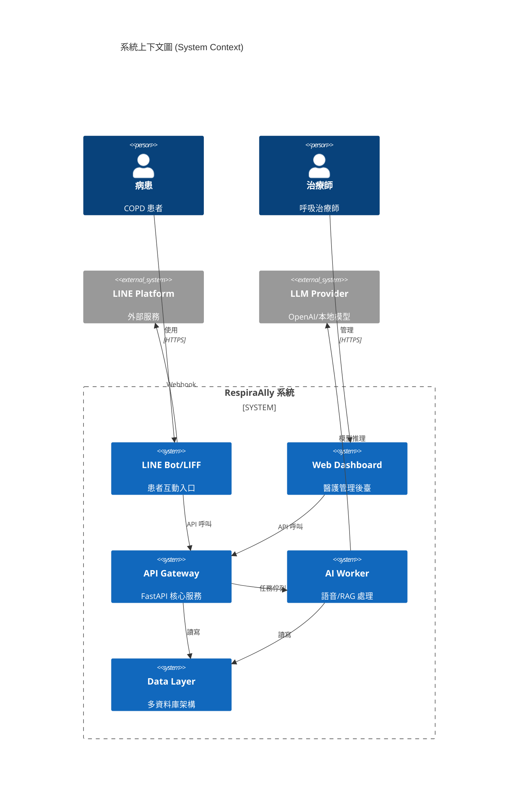
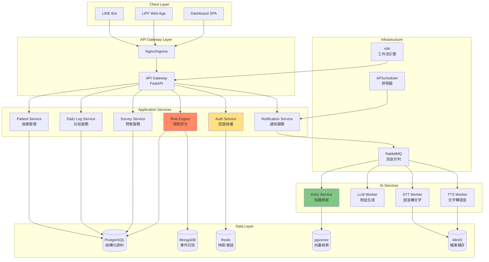
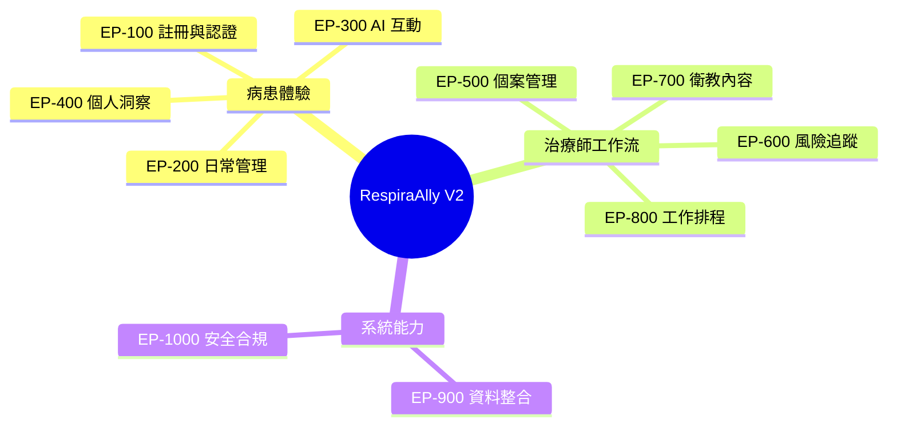
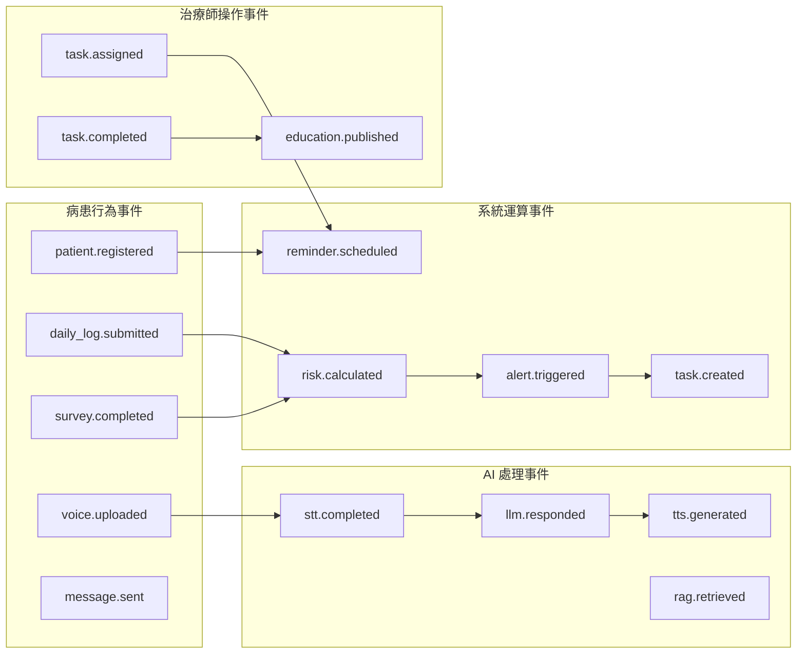
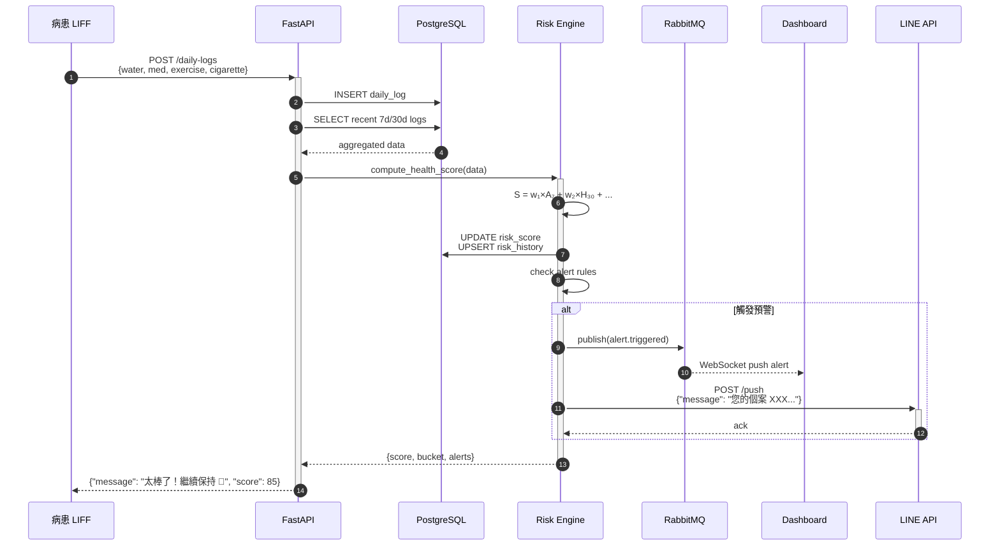
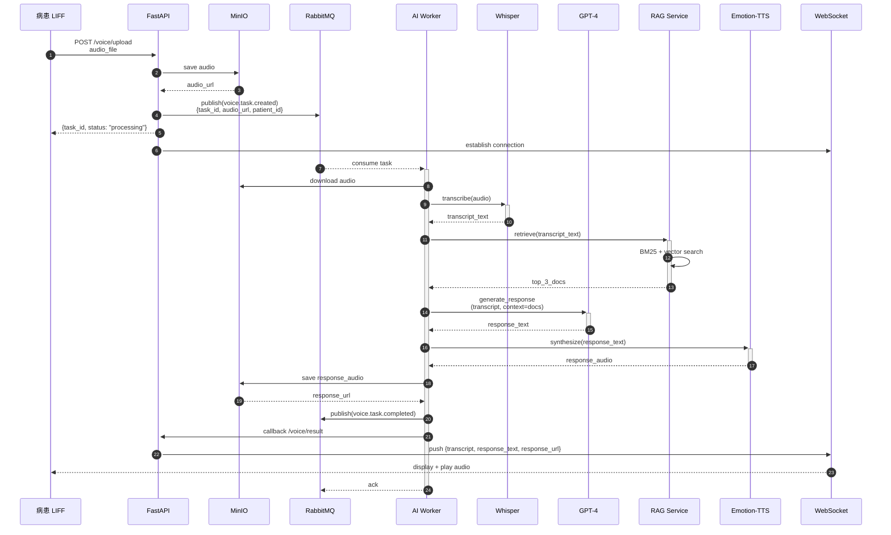
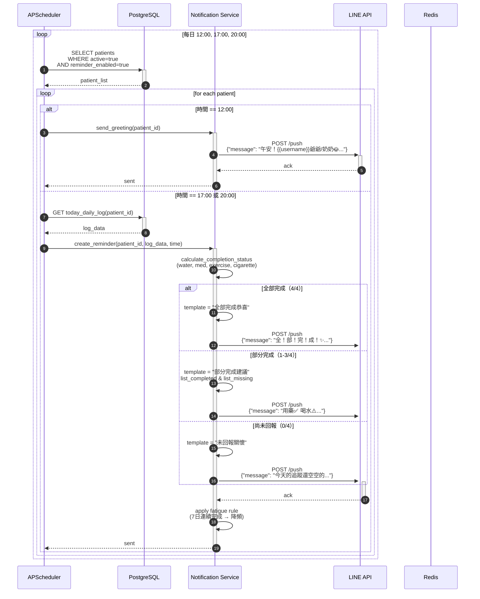
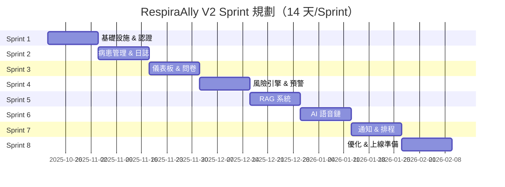

# RespiraAlly V2.0 敏捷設計文件 (Agile Design Document)

> **文件版本**: v2.0  
> **最後更新**: 2025-10-16  
> **文件類型**: 敏捷設計規格 (Agile Design Specification)  
> **目標讀者**: Claude Code AI、開發團隊、產品團隊

---

## 文件導航 (Document Navigation)

1. [系統設計概念（敏捷拆解）](#1-系統設計概念敏捷拆解)
2. [模組架構](#2-模組架構)
3. [使用者故事與允收標準](#3-使用者故事與允收標準)
4. [產品洞察](#4-產品洞察)
5. [範圍與限制](#5-範圍與限制)
6. [事件驅動流程](#6-事件驅動流程)
7. [敏捷開發步驟](#7-敏捷開發步驟)

---

## 1. 系統設計概念（敏捷拆解）

### 1.1 設計哲學 (Design Philosophy)



**核心原則**：
- **最小可行產品 (MVP)**: 每個 Sprint 交付可獨立運行的功能模組
- **垂直切片 (Vertical Slice)**: 從前端到後端完整貫穿
- **漸進式增強 (Progressive Enhancement)**: 基礎功能先行，進階功能後補
- **風險前置 (Risk-First)**: 技術風險高的模組優先開發

### 1.2 架構演進路線 (Architecture Evolution)



### 1.3 技術債管理策略

| 決策點 | V1 現狀 | V2 目標 | 遷移策略 |
|--------|---------|---------|----------|
| **後端框架** | Flask | FastAPI | 雙軌並行 → 逐步遷移 |
| **資料庫** | PostgreSQL 單體 | PostgreSQL + MongoDB | 新功能用 Mongo，舊資料保留 |
| **快取層** | 無 | Redis | Sprint 2 引入 |
| **向量庫** | 無 | pgvector/Milvus | Sprint 5 RAG 需求驅動 |
| **訊息佇列** | RabbitMQ | RabbitMQ (保留) | 增強監控與重試機制 |

---

## 2. 模組架構

### 2.1 系統分層架構 (Layered Architecture)



### 2.2 微服務模組拆分



### 2.3 模組職責矩陣 (Module Responsibility Matrix)

| 模組 | 主要職責 | 輸入 | 輸出 | 依賴服務 | Sprint 優先級 |
|------|---------|------|------|----------|---------------|
| **Auth Service** | JWT 簽發、RBAC、LINE OAuth | 登入憑證 | JWT Token | Redis | Sprint 1 🔴 |
| **Patient Service** | 病患 CRUD、個案 360° | REST API | 病患資料 | PostgreSQL | Sprint 1 🔴 |
| **Daily Log Service** | 日誌新增/查詢、依從率計算 | LIFF 表單 | 統計數據 | PostgreSQL | Sprint 2 🔴 |
| **Survey Service** | CAT/mMRC 問卷、分數計算 | LIFF 問卷 | 評估分數 | PostgreSQL | Sprint 3 🟡 |
| **Risk Engine** | 風險分數、分群、預警 | 行為事件 | 風險標籤 | PostgreSQL, MongoDB | Sprint 4 🟡 |
| **RAG Service** | 向量檢索、衛教內容管理 | 用戶提問 | 答案 + 來源 | pgvector, LLM | Sprint 5 🟢 |
| **STT/LLM/TTS Workers** | 語音處理鏈 | 音訊檔案 | 語音回覆 | MinIO, 外部 API | Sprint 6 🟢 |
| **Notification Service** | 推播、提醒、排程 | 觸發事件 | LINE 訊息 | RabbitMQ, LINE API | Sprint 7 🟢 |

🔴 高優先 | 🟡 中優先 | 🟢 低優先

---

## 3. 使用者故事與允收標準

### 3.1 史詩地圖 (Epic Mapping)



### 3.2 核心使用者故事 (Core User Stories)

#### 📘 Epic 100: 病患註冊與認證

| ID | 使用者故事 | 允收標準 (Acceptance Criteria) | Story Points | Sprint |
|----|-----------|--------------------------------|--------------|--------|
| **US-101** | **As a** 新病患<br>**I want to** 透過 LINE 快速註冊<br>**So that** 無需額外下載 App | ✅ LINE User ID 自動獲取<br>✅ 必填：姓名、性別、出生年月<br>✅ 選填：聯絡電話、緊急聯絡人<br>✅ 註冊成功後綁定 LINE Rich Menu<br>✅ 錯誤訊息清晰（重複註冊/網路異常） | 3 | 1 |
| **US-102** | **As a** 治療師<br>**I want to** 使用帳密登入儀表板<br>**So that** 管理我的個案 | ✅ Email + 密碼登入<br>✅ JWT Token 有效期 8 小時<br>✅ 記住我功能（Refresh Token 30天）<br>✅ 登入失敗 3 次鎖定 15 分鐘 | 2 | 1 |
| **US-103** | **As a** 系統管理員<br>**I want to** 為治療師分配病患<br>**So that** 建立個管關係 | ✅ 一位病患可指派一位主責治療師<br>✅ 支援批次指派（CSV 匯入）<br>✅ 異動記錄留存 audit log | 5 | 2 |

#### 📗 Epic 200: 日常健康管理

| ID | 使用者故事 | 允收標準 (Acceptance Criteria) | Story Points | Sprint |
|----|-----------|--------------------------------|--------------|--------|
| **US-201** | **As a** 病患<br>**I want to** 在 LIFF 快速填寫今日健康日誌<br>**So that** 記錄用藥、飲水、運動、抽菸 | ✅ 一天只能有一筆日誌<br>✅ 可更新當日記錄（24:00 前）<br>✅ 介面：Toggle（用藥） + Number Input（其他）<br>✅ 提交後即時顯示鼓勵訊息<br>✅ 未填寫項目顯示預設值 0 | 5 | 2 |
| **US-202** | **As a** 病患<br>**I want to** 查看近 7 日健康趨勢<br>**So that** 了解我的進步 | ✅ 折線圖：用藥依從率、飲水量、運動時長<br>✅ 標註目標達成天數<br>✅ 顯示本週 vs 上週對比 | 3 | 3 |
| **US-203** | **As a** 病患<br>**I want to** 收到個人化提醒<br>**So that** 不會忘記填寫 | ✅ 預設：中午 12:00（問候）、下午 17:00、晚上 20:00<br>✅ **12:00**：溫馨問候（不檢查回報狀況）<br>✅ **17:00/20:00**：根據回報狀況分三種回覆：<br>&nbsp;&nbsp;&nbsp;• 已完成回報：全項目達成鼓勵<br>&nbsp;&nbsp;&nbsp;• 部分完成：具體指出完成/未完成項目<br>&nbsp;&nbsp;&nbsp;• 尚未回報：溫和提醒補填<br>✅ 可自訂提醒時間<br>✅ 連續完成 7 天→降低提醒頻率<br>✅ 連續漏填 3 天→增加提醒頻率 | 13 | 7 |

#### 📙 Epic 300: AI 語音互動

| ID | 使用者故事 | 允收標準 (Acceptance Criteria) | Story Points | Sprint |
|----|-----------|--------------------------------|--------------|--------|
| **US-301** | **As a** 病患<br>**I want to** 用語音詢問健康問題<br>**So that** 不需要打字 | ✅ LIFF 錄音介面（最長 60 秒）<br>✅ 上傳後顯示「Ally正在思考...」<br>✅ 15 秒內收到文字 + 語音回覆<br>✅ 支援台語/國語辨識 | 13 | 6 |
| **US-302** | **As an** AI Worker<br>**I want to** 處理語音任務佇列<br>**So that** 不阻塞主服務 | ✅ RabbitMQ 接收任務<br>✅ STT → LLM → TTS 完整鏈<br>✅ 失敗重試 3 次（指數退避）<br>✅ 處理結果推送至 WebSocket | 8 | 6 |
| **US-303** | **As a** 病患<br>**I want to** AI 回覆引用可信來源<br>**So that** 增加信任感 | ✅ 回覆末尾顯示「參考資料」連結<br>✅ RAG 檢索至少 3 篇相關衛教文章<br>✅ 信心分數 < 0.7 時提示「建議諮詢治療師」 | 5 | 5 |

#### 📕 Epic 500: 治療師個案管理

| ID | 使用者故事 | 允收標準 (Acceptance Criteria) | Story Points | Sprint |
|----|-----------|--------------------------------|--------------|--------|
| **US-501** | **As a** 治療師<br>**I want to** 查看我的病患列表<br>**So that** 快速找到需要關注的人 | ✅ 預設按風險等級排序（High → Low）<br>✅ 篩選：風險等級、依從率、最後活躍時間<br>✅ 搜尋：姓名、電話<br>✅ 分頁：每頁 20 筆 | 3 | 2 |
| **US-502** | **As a** 治療師<br>**I want to** 查看病患 360° 檔案<br>**So that** 全面了解個案狀況 | ✅ **基本資料**：姓名、年齡、聯絡方式、主診斷<br>✅ **健康檔案**：身高、體重、BMI、吸菸史<br>✅ **KPI 卡**：最新 CAT/mMRC、7 日依從率、風險分數<br>✅ **行為圖表**：30 日用藥/飲水/運動/抽菸趨勢<br>✅ **事件時間軸**：填報、問卷、警示、任務 | 8 | 3 |
| **US-503** | **As a** 治療師<br>**I want to** 為高風險病患建立追蹤任務<br>**So that** 確保及時介入 | ✅ 任務類型：電話訪談、視訊會診、提醒回診<br>✅ 設定到期日與優先級<br>✅ 任務到期前 1 天推播提醒<br>✅ 完成後可記錄備註 | 5 | 4 |

#### 📓 Epic 600: 風險評估與預警

| ID | 使用者故事 | 允收標準 (Acceptance Criteria) | Story Points | Sprint |
|----|-----------|--------------------------------|--------------|--------|
| **US-601** | **As a** 系統<br>**I want to** 即時計算病患健康分數<br>**So that** 動態更新風險等級 | ✅ 公式：`S = 0.35×A₇ + 0.15×H₃₀ + 0.15×(100-N₃₀) + 0.15×(100-C) + 0.20×(100-R̂)`<br>✅ 每次日誌提交後觸發重算<br>✅ 分群：High (<60), Medium (60-80), Low (≥80)<br>✅ 寫入 `risk_score` 表並記錄變化歷史 | 8 | 4 |
| **US-602** | **As a** 系統<br>**I want to** 偵測異常行為模式<br>**So that** 自動產生預警 | ✅ **規則 1**：連續 2 天未用藥 → Medium Alert<br>✅ **規則 2**：連續 5 天未填寫日誌 → High Alert<br>✅ **規則 3**：抽菸量增加 >30% (vs 上週均值) → Medium Alert<br>✅ 警示推播至治療師 Dashboard + LINE 通知 | 13 | 4 |
| **US-603** | **As a** 治療師<br>**I want to** 調整風險權重<br>**So that** 符合臨床實務 | ✅ Dashboard 提供權重調整介面<br>✅ 權重總和必須 = 1.0<br>✅ 調整後重算所有病患分數<br>✅ 版本化記錄（可回溯） | 5 | 8 |

#### 📔 Epic 700: RAG 衛教管理

| ID | 使用者故事 | 允收標準 (Acceptance Criteria) | Story Points | Sprint |
|----|-----------|--------------------------------|--------------|--------|
| **US-701** | **As a** 衛教管理員<br>**I want to** 上傳衛教文章並自動向量化<br>**So that** 建立知識庫 | ✅ 支援 Markdown 格式上傳<br>✅ 自動分段（Chunk Size: 500 tokens, Overlap: 50）<br>✅ 使用 OpenAI `text-embedding-3-small` 向量化<br>✅ 儲存至 pgvector，關聯原文至 MongoDB | 8 | 5 |
| **US-702** | **As a** RAG 系統<br>**I want to** 混合檢索（BM25 + 向量）<br>**So that** 提升召回率 | ✅ BM25 權重 0.3, 向量相似度權重 0.7<br>✅ 檢索 Top-10 候選，Rerank 取 Top-3<br>✅ Rerank 考量：年齡、疾病嚴重度、歷史偏好<br>✅ 回應時間 < 2 秒 | 13 | 5 |
| **US-703** | **As a** 衛教管理員<br>**I want to** 追蹤內容成效<br>**So that** 優化知識庫 | ✅ Metrics: 送達次數、點擊率、平均停留時間<br>✅ 關聯分析：推送後 7 日依從率變化 (Δ Adherence)<br>✅ 低效內容自動標註「待優化」 | 5 | 8 |

---

## 4. 產品洞察

### 4.1 問題陳述 (Problem Statement)

```
慢性阻塞性肺病（COPD）患者需要長期、持續的自我管理，但現行照護體系面臨三大挑戰：

1. **患者端**：傳統紙本記錄繁瑣、缺乏即時回饋、孤獨感強
2. **治療師端**：資料分散於多系統、無法即時掌握風險、人工追蹤耗時
3. **系統端**：靜態衛教內容無法個人化、缺乏行為預測、數據孤島嚴重

導致：
- 用藥依從率僅 40-60%（文獻值）
- 高風險個案發現延遲 >7 天
- 治療師單一個案管理時間 >30 分鐘/週
```

### 4.2 價值主張 (Value Proposition)

| 使用者 | 核心痛點 | RespiraAlly 解法 | 量化價值 |
|--------|---------|------------------|----------|
| **COPD 病患** | 1. 忘記用藥/記錄<br>2. 不知道自己做得好不好<br>3. 有問題不知道問誰 | 1. 智慧提醒 + LIFF 快速填寫（<30 秒）<br>2. 即時視覺化回饋 + 徽章系統<br>3. 24/7 AI 語音助理（台語/國語） | • 依從率提升至 ≥80%<br>• 填寫時間減少 70%<br>• 問題解決時效 <5 分鐘 |
| **呼吸治療師** | 1. 無法即時掌握個案狀況<br>2. 風險病患靠經驗判斷<br>3. 衛教內容更新慢 | 1. 個案 360° 儀表板 + 即時事件流<br>2. 自動風險分群 + 異常預警<br>3. RAG 版本化管理 + 成效追蹤 | • 個案檢視時間減少 60%<br>• 高風險發現時效 <24 小時<br>• 衛教更新週期從月→天 |
| **醫療機構** | 1. 慢病管理成本高<br>2. 急診回診率居高不下<br>3. 缺乏數據支撐決策 | 1. 自動化工作流減少人力<br>2. 早期預警降低急性惡化<br>3. 全量資料 + BI 分析 | • 人力成本降低 40%<br>• 急診率預期降低 25%<br>• 數據驅動決策支持 |

### 4.3 競品分析 (Competitive Analysis)

| 維度 | 傳統方案 | 通用健康 App | RespiraAlly V2 | 競爭優勢 |
|------|----------|--------------|----------------|----------|
| **入口門檻** | 紙本/電話 | 需下載 App | LINE（免安裝） | ✅ 高齡友善 |
| **互動方式** | 被動記錄 | 文字輸入 | 語音對話 + 快速表單 | ✅ 降低認知負荷 |
| **個人化** | 無 | 基於規則 | AI 學習（行為 + 偏好） | ✅ 動態適配 |
| **醫護協作** | 回診時人工 | 單向查看 | 雙向互動 + 任務閉環 | ✅ 真正協同 |
| **知識更新** | 靜態 PDF | 人工編輯 | RAG + 版本化 + 成效追蹤 | ✅ 持續優化 |
| **風險管理** | 事後 | 簡單閾值 | 多因子即時評分 + 預測 | ✅ 主動介入 |

### 4.4 北極星指標 (North Star Metric)

```
NSM = 健康行為依從率 (7 日用藥 + 日誌完整度)

目標: 從 V1 的 ~45% 提升至 V2 的 ≥75%

為什麼選擇這個指標？
✅ 直接反映產品核心價值（協助病患持續自我管理）
✅ 與臨床結果強相關（依從率 ↑ → 病情控制 ↑）
✅ 可拆解為可操作指標（提醒送達率、表單完成時間、AI 互動頻次）
```

**輔助指標**：
- 病患留存率（D7 / D30）
- 治療師活躍度（週均登入次數）
- AI 回覆首次命中率（≥85%）
- 高風險個案覆蓋率（被跟進比例 ≥90%）

---

## 5. 範圍與限制

### 5.1 功能範圍 (Functional Scope)

#### ✅ V2.0 包含 (In Scope)

| 功能域 | 子功能 | MVP 狀態 |
|--------|--------|----------|
| **病患端** | • LINE 註冊/登入<br>• LIFF 日誌填寫（用藥/飲水/運動/抽菸）<br>• CAT/mMRC 問卷<br>• 語音提問 + AI 回覆<br>• 個人健康趨勢（7/30 日） | Sprint 1-6 |
| **治療師端** | • Web Dashboard 登入<br>• 病患列表（篩選/搜尋/排序）<br>• 個案 360° 檔案<br>• 風險預警中心<br>• 任務管理（建立/指派/完成） | Sprint 1-4 |
| **AI 能力** | • STT（Whisper）<br>• LLM 對話（GPT-4 Turbo）<br>• TTS（本地 Emotion-TTS）<br>• RAG 衛教檢索（pgvector + BM25） | Sprint 5-6 |
| **自動化** | • 定時提醒（可自訂時間）<br>• 風險自動評分<br>• 異常行為預警<br>• 週報推播 | Sprint 7 |
| **管理後臺** | • 衛教內容 CRUD<br>• 向量化管理<br>• 檢索成效追蹤<br>• 權重參數調整 | Sprint 5, 8 |

#### ❌ V2.0 不包含 (Out of Scope)

- ❌ 多語言支援（僅中文/台語）
- ❌ 生理感測裝置整合（血氧機、智慧手錶）
- ❌ 跨院資料交換（FHIR/HL7）
- ❌ 保險申報功能
- ❌ 家屬獨立帳號（V3 規劃）
- ❌ 影像/肺音分析
- ❌ iOS/Android 原生 App

### 5.2 非功能需求 (Non-Functional Requirements)

| 類別 | 需求 | 目標值 | 驗證方式 |
|------|------|--------|----------|
| **效能** | API 回應時間 | P95 < 500ms | Prometheus 監控 |
| | AI 語音回覆 | < 15 秒（端到端） | End-to-end 測試 |
| | Dashboard 首屏載入 | < 2 秒 | Lighthouse CI |
| **可用性** | 服務可用性 (SLA) | ≥99.5% | Uptime 監控 |
| | 錯誤率 | <0.1% | Sentry 追蹤 |
| **擴展性** | 併發使用者 | 支援 500 CCU | 負載測試 (Locust) |
| | 資料量 | 百萬級病患記錄 | 資料庫索引優化 |
| **安全性** | 資料加密 | TLS 1.3 + AES-256 | 滲透測試 |
| | 權限控制 | RBAC（4 角色） | 單元測試覆蓋 |
| | 審計日誌 | 所有敏感操作留存 | 日誌稽核 |
| **合規性** | 個資保護 | 符合台灣個資法 | 法規顧問審查 |
| | 醫療資料 | 在地化儲存（台灣） | 基礎設施稽核 |

### 5.3 技術限制 (Technical Constraints)

| 限制項 | 描述 | 應對策略 |
|--------|------|----------|
| **LINE API 限制** | • 推播訊息有配額限制<br>• Rich Menu 最多 6 個區塊 | • 優先使用 Reply API<br>• 設計精簡選單 |
| **pgvector 規模** | • 百萬級向量檢索效能下降 | • 分區索引（IVFFlat）<br>• 未來可遷移 Milvus |
| **Whisper 本地部署** | • GPU 記憶體需求高（≥8GB） | • 使用 Whisper Medium 模型<br>• 或調用 OpenAI API |
| **RabbitMQ 單點** | • 無高可用配置 | • Sprint 8 引入鏡像佇列 |
| **MongoDB 副本集** | • 初期單節點 | • MVP 後建立 3 節點副本 |

### 5.4 假設與依賴 (Assumptions & Dependencies)

**假設**：
1. 目標使用者皆有 LINE 帳號且熟悉基本操作
2. 治療師具備基本電腦操作能力
3. 衛教內容由醫療團隊提供並審核
4. 病患同意資料蒐集與分析

**依賴**：
- **外部服務**：LINE Platform、OpenAI API（可替換本地模型）
- **基礎設施**：Zeabur（或自建 K8s）、PostgreSQL 14+、RabbitMQ 3.12+
- **內部資源**：臨床團隊提供專業知識、UI/UX 設計師協作

---

## 6. 事件驅動流程

### 6.1 核心事件目錄 (Event Catalog)



### 6.2 關鍵流程序列圖

#### 流程 1：病患提交日誌 → 風險評估 → 預警



#### 流程 2：語音提問 → AI 處理 → 回覆



#### 流程 3：定時提醒排程



### 6.3 事件資料結構 (Event Schemas)

```typescript
// 事件基礎結構
interface BaseEvent {
  event_id: string;          // UUID
  event_type: string;        // 事件類型
  timestamp: string;         // ISO 8601
  source: string;            // 來源服務
  correlation_id?: string;   // 追蹤 ID
}

// 日誌提交事件
interface DailyLogSubmittedEvent extends BaseEvent {
  event_type: "daily_log.submitted";
  data: {
    patient_id: string;
    log_date: string;
    water_ml: number;
    med_taken: boolean;
    exercise_min: number;
    cigarette_count: number;
  };
}

// 風險計算事件
interface RiskCalculatedEvent extends BaseEvent {
  event_type: "risk.calculated";
  data: {
    patient_id: string;
    score: number;           // 0-100
    bucket: "low" | "medium" | "high";
    factors: {
      adherence_7d: number;
      water_30d: number;
      exercise_30d: number;
      cigarette_7d: number;
      survey_risk: number;
    };
    previous_score?: number;
    score_delta?: number;
  };
}

// 預警觸發事件
interface AlertTriggeredEvent extends BaseEvent {
  event_type: "alert.triggered";
  data: {
    alert_id: string;
    patient_id: string;
    severity: "low" | "medium" | "high";
    rule: string;            // e.g., "consecutive_missed_med"
    description: string;
    metadata: Record<string, any>;
  };
}

// 語音任務事件
interface VoiceTaskCreatedEvent extends BaseEvent {
  event_type: "voice.task.created";
  data: {
    task_id: string;
    patient_id: string;
    audio_url: string;
    duration_sec: number;
  };
}

// 提醒發送事件
interface ReminderSentEvent extends BaseEvent {
  event_type: "reminder.sent";
  data: {
    patient_id: string;
    reminder_time: "12:00" | "17:00" | "20:00";
    reminder_type: "greeting" | "full_complete" | "partial_complete" | "not_reported";
    completion_status?: {
      water_ml: number;
      med_taken: boolean;
      exercise_min: number;
      cigarette_count: number;
      completed_count: number;  // 0-4
      total_count: 4;
    };
    message_sent: string;
    line_message_id?: string;
  };
}
```

---

## 7. 敏捷開發步驟

### 7.1 Sprint 規劃總覽



### 7.2 詳細 Sprint Backlog

---

#### 🚀 Sprint 1: 基礎設施 & 認證系統

**目標**: 建立可運行的骨架，完成使用者認證

**交付物**:
- ✅ PostgreSQL Schema (Migration 腳本)
- ✅ FastAPI 專案結構（Clean Architecture）
- ✅ Redis 快取層
- ✅ JWT 認證中介層
- ✅ LINE LIFF 註冊/登入
- ✅ Dashboard 登入頁

**使用者故事**: US-101, US-102

**技術任務**:
1. **ENV-001**: Docker Compose 建立所有服務
2. **DB-001**: Alembic Migration - 建立 `patient`, `therapist`, `daily_log`, `survey` 表
3. **API-001**: FastAPI 專案腳手架（路由、中介層、錯誤處理）
4. **AUTH-001**: JWT 簽發/驗證邏輯
5. **AUTH-002**: LINE LIFF SDK 整合
6. **FE-001**: Dashboard 登入頁（React + Tailwind）

**驗收標準**:
```bash
# 可成功執行
docker-compose up -d
curl http://localhost:8000/health  # 回傳 {"status": "ok"}

# 可註冊並取得 Token
curl -X POST http://localhost:8000/auth/register \
  -d '{"line_user_id": "Uxx", "name": "測試病患"}'
# 回傳 {"access_token": "eyJ..."}
```

**風險**:
- LINE LIFF 本地測試需 ngrok → 準備測試環境

---

#### 🏃 Sprint 2: 病患管理 & 日誌功能

**目標**: 完成病患 CRUD 與日誌填寫流程

**交付物**:
- ✅ 病患列表 API（篩選/搜尋/分頁）
- ✅ 病患詳情 API
- ✅ 日誌 CRUD API
- ✅ LIFF 日誌表單頁
- ✅ Dashboard 病患列表頁

**使用者故事**: US-103, US-201, US-501

**技術任務**:
1. **API-002**: `GET /patients` - 支援 query params（風險、活躍度）
2. **API-003**: `GET /patients/{id}` - 回傳完整檔案
3. **API-004**: `POST /daily-logs` - 含重複提交檢查
4. **API-005**: `PUT /daily-logs/{id}` - 僅限當日更新
5. **FE-002**: LIFF 日誌頁（Toggle + Number Input）
6. **FE-003**: Dashboard 病患列表（Table + 篩選器）

**驗收標準**:
- 病患可在 LIFF 填寫日誌，Dashboard 即時可見
- 列表支援「僅顯示高風險」篩選

**DoD (Definition of Done)**:
- [ ] Unit Test 覆蓋率 ≥80%
- [ ] API 文件自動生成（FastAPI Swagger）
- [ ] 前端 Lint 通過

---

#### 📊 Sprint 3: 儀表板 & 問卷系統

**目標**: 完成個案 360° 與 CAT/mMRC 問卷

**交付物**:
- ✅ 個案 360° 頁面（基本資料 + KPI + 圖表）
- ✅ CAT/mMRC 問卷 API
- ✅ LIFF 問卷頁
- ✅ 趨勢圖表元件（Recharts）

**使用者故事**: US-202, US-204, US-502

**技術任務**:
1. **API-006**: `GET /patients/{id}/kpis` - 聚合 7/30 日統計
2. **API-007**: `POST /surveys` - CAT/mMRC 分數計算
3. **FE-004**: 個案 360° 頁面佈局
4. **FE-005**: 行為趨勢圖（Area Chart）
5. **FE-006**: LIFF CAT 問卷（8 題選擇題）
6. **FE-007**: LIFF mMRC 問卷（5 級選擇）

**驗收標準**:
- 治療師可查看個案完整檔案
- CAT 分數自動計算（0-40 分）
- 圖表正確顯示近 30 日數據

---

#### ⚠️ Sprint 4: 風險引擎 & 任務管理

**目標**: 實現風險自動評分與預警機制

**交付物**:
- ✅ 風險分數計算引擎
- ✅ 異常規則引擎
- ✅ 任務 CRUD API
- ✅ Dashboard 預警中心
- ✅ Dashboard 任務看板

**使用者故事**: US-503, US-601, US-602

**技術任務**:
1. **RISK-001**: `compute_health_score()` 函式實作
2. **RISK-002**: 風險歷史記錄表設計
3. **RISK-003**: 異常規則定義（YAML 配置）
4. **RISK-004**: 規則引擎執行器
5. **API-008**: `POST /tasks` - 建立追蹤任務
6. **FE-008**: 預警中心（Real-time 更新）
7. **FE-009**: 任務看板（Kanban 風格）

**驗收標準**:
- 日誌提交後 5 秒內完成風險重算
- 連續 2 天未用藥自動產生 Medium Alert
- 治療師可建立任務並設定到期日

**技術挑戰**:
- 需設計高效的規則匹配邏輯（考慮 Drools 或自建）

---

#### 🧠 Sprint 5: RAG 系統基礎

**目標**: 建立衛教知識庫與檢索能力

**交付物**:
- ✅ pgvector 擴展安裝
- ✅ 衛教內容 CRUD API
- ✅ 自動向量化流程
- ✅ Hybrid 檢索 API
- ✅ Dashboard 衛教管理頁

**使用者故事**: US-303, US-701, US-702

**技術任務**:
1. **DB-002**: 安裝 pgvector，建立 `education_chunks` 表
2. **RAG-001**: Markdown 分段邏輯（LangChain TextSplitter）
3. **RAG-002**: OpenAI Embedding API 整合
4. **RAG-003**: BM25 索引（Elasticsearch Lite 或 pg_trgm）
5. **RAG-004**: Hybrid 檢索 + Rerank（Cohere/本地）
6. **API-009**: `POST /educations` - 上傳並向量化
7. **API-010**: `POST /rag/query` - 檢索測試端點
8. **FE-010**: 衛教管理頁（列表 + 上傳 + 預覽）

**驗收標準**:
- 上傳一篇 2000 字衛教文章，自動分段並向量化
- 檢索「如何正確使用吸入器」，回傳相關段落
- 回應時間 < 2 秒

---

#### 🎙️ Sprint 6: AI 語音處理鏈

**目標**: 實現語音提問 → AI 回覆完整流程

**交付物**:
- ✅ RabbitMQ 任務佇列
- ✅ AI Worker 服務（STT/LLM/TTS）
- ✅ WebSocket 推送機制
- ✅ LIFF 語音錄製介面
- ✅ MinIO 音訊儲存

**使用者故事**: US-301, US-302, US-303

**技術任務**:
1. **INFRA-001**: RabbitMQ 佇列設計（voice.tasks, voice.results）
2. **AI-001**: Whisper 整合（本地或 API）
3. **AI-002**: GPT-4 Prompt 設計（含 RAG context）
4. **AI-003**: Emotion-TTS 服務封裝
5. **API-011**: `POST /voice/upload` - 音訊上傳
6. **API-012**: WebSocket `/ws/voice/{task_id}` - 即時推送
7. **WORKER-001**: AI Worker 主邏輯（消費佇列 → 處理 → 回推）
8. **FE-011**: LIFF 錄音介面（Web Audio API）
9. **FE-012**: 播放器元件

**驗收標準**:
- 錄製 10 秒語音 → 15 秒內收到 AI 回覆
- 回覆包含文字 + 可播放音訊
- 處理失敗時正確重試

**技術挑戰**:
- Whisper 本地部署需 GPU，可能先用 OpenAI API
- WebSocket 連線管理需處理斷線重連

---

#### 🔔 Sprint 7: 通知系統 & 排程

**目標**: 實現智慧提醒與自動化工作流

**交付物**:
- ✅ APScheduler 排程服務
- ✅ 通知服務（LINE Push API）
- ✅ 提醒規則引擎（疲勞避免）
- ✅ 週報自動生成
- ✅ Dashboard 通知歷史

**使用者故事**: US-203

**技術任務**:
1. **SCHED-001**: APScheduler 初始化（CronTrigger）
2. **SCHED-002**: 每日提醒任務（12:00, 17:00, 20:00）
3. **NOTIFY-001**: LINE Push API 封裝
4. **NOTIFY-002**: 回報狀態檢測邏輯（完成/部分/未回報）
5. **NOTIFY-003**: 訊息模板引擎（三種狀態 × 三個時段）
6. **NOTIFY-004**: 疲勞規則（7 日連續 → 降頻至隔日）
7. **NOTIFY-005**: 週報卡片生成（Pillow 繪圖）
8. **API-013**: `GET /notifications/history` - 通知記錄
9. **FE-013**: Dashboard 通知歷史頁

**驗收標準**:
- **12:00** 推播溫馨問候（不檢查回報狀況）
- **17:00/20:00** 根據回報狀況推播對應訊息：
  - 全部完成：恭喜鼓勵文案
  - 部分完成：列出完成/未完成項目 + 溫和建議
  - 尚未回報：關懷提醒 + 補填引導
- 連續 7 天完成的病患，提醒頻率降低
- 週日 18:00 推播週報卡片

---

#### 🎯 Sprint 8: 優化 & 上線準備

**目標**: 效能優化、監控、文件與部署

**交付物**:
- ✅ Prometheus + Grafana 監控
- ✅ Sentry 錯誤追蹤
- ✅ API 壓測報告
- ✅ 部署文件
- ✅ 使用者手冊

**使用者故事**: US-603, US-703

**技術任務**:
1. **OPS-001**: Prometheus Exporter 埋點
2. **OPS-002**: Grafana Dashboard 設計
3. **OPS-003**: Sentry SDK 整合
4. **OPS-004**: Locust 壓測腳本（500 CCU）
5. **OPS-005**: Database 索引優化
6. **OPS-006**: Redis 快取策略調整
7. **DOC-001**: API 文件生成
8. **DOC-002**: 部署 SOP（Zeabur/K8s）
9. **DOC-003**: 使用者操作手冊
10. **FEAT-001**: 權重調整介面（US-603）
11. **FEAT-002**: 衛教成效儀表板（US-703）

**驗收標準**:
- P95 回應時間 < 500ms
- 錯誤率 < 0.1%
- 文件完整可交付

---

### 7.3 Sprint 儀式 (Ceremonies)

| 儀式 | 頻率 | 時長 | 目的 |
|------|------|------|------|
| **Sprint Planning** | 每 Sprint 首日 | 2 小時 | 拆解 Story、估點、承諾目標 |
| **Daily Standup** | 每日 10:00 | 15 分鐘 | 同步進度、識別阻礙 |
| **Sprint Review** | Sprint 最後一天 | 1 小時 | Demo 交付物、蒐集回饋 |
| **Sprint Retro** | Review 後 | 45 分鐘 | 反思流程、提出改進 |
| **Backlog Refinement** | 每週三 | 1 小時 | 細化下 Sprint Story |

### 7.4 Definition of Done (DoD)

每個 Story 完成前需檢查：

- [ ] **程式碼**: 通過 CI/CD 流程（Lint, Test, Build）
- [ ] **測試**: 單元測試覆蓋率 ≥80%，E2E 測試覆蓋核心路徑
- [ ] **文件**: API 文件更新、必要時補充技術筆記
- [ ] **審查**: Code Review 至少 1 人 Approve
- [ ] **部署**: 已部署至 Staging 環境並驗證
- [ ] **允收**: PM/PO 確認符合 Acceptance Criteria

### 7.5 技術棧總覽

```yaml
前端:
  Dashboard:
    - React 18
    - Next.js 14
    - TypeScript
    - Tailwind CSS
    - Recharts
    - Zustand (狀態管理)
  LIFF:
    - React
    - LINE LIFF SDK
    - Vite

後端:
  API:
    - FastAPI 0.110+
    - Python 3.11
    - Pydantic v2
    - SQLAlchemy 2.0
    - Alembic (Migration)
  AI Worker:
    - Celery / 自建 Worker
    - Whisper (OpenAI)
    - LangChain
    - Emotion-TTS

資料:
  Database:
    - PostgreSQL 15 (+ pgvector)
    - MongoDB 7
  Cache:
    - Redis 7
  Storage:
    - MinIO
  Queue:
    - RabbitMQ 3.12

運維:
  Container: Docker + Docker Compose
  Deploy: Zeabur / Kubernetes
  Monitor: Prometheus + Grafana
  Logging: Loki + Promtail
  Error Tracking: Sentry
  CI/CD: GitHub Actions
```

---

## 附錄 A: 每日提醒訊息模板範例

### A.1 訊息發送時程

| 時間 | 類型 | 檢查邏輯 | 用途 |
|------|------|----------|------|
| **12:00** | 問候訊息 | 不檢查回報狀況 | 溫馨問候、建立情感連結 |
| **17:00** | 進度提醒 | 檢查當日回報狀況 | 下午關懷、鼓勵或提醒補填 |
| **20:00** | 結算提醒 | 檢查當日回報狀況 | 睡前總結、最後補填機會 |

### A.2 回報狀況判定邏輯

```python
def calculate_completion_status(daily_log):
    """計算當日回報完成度"""
    completed_items = []
    
    # 1. 用藥（必要項目）
    if daily_log.med_taken:
        completed_items.append("med")
    
    # 2. 喝水（目標：≥1200ml）
    if daily_log.water_ml >= 1200:
        completed_items.append("water")
    
    # 3. 運動（目標：≥30分鐘）
    if daily_log.exercise_min >= 30:
        completed_items.append("exercise")
    
    # 4. 抽菸（目標：0 支）
    if daily_log.cigarette_count == 0:
        completed_items.append("no_smoke")
    
    completion_rate = len(completed_items) / 4
    
    if completion_rate == 1.0:
        return "full_complete"
    elif completion_rate > 0:
        return "partial_complete"
    else:
        return "not_reported"
```

### A.3 訊息模板範例

#### 📅 12:00 問候訊息（所有病患）

```
午安～{{username}}{{title}}🌞
今天過得如何呢？

記得吃飯配溫開水，
中午休息一下再繼續喔～

有任何問題都可以隨時用語音問 Ally 我 🎤
我會一直陪在你身邊 ❤️
```

**變數說明**：
- `{{username}}`: 病患姓名
- `{{title}}`: 爺爺/奶奶（根據性別與年齡自動判斷）

---

#### 🌅 17:00 完成回報（4/4 項目達成）

```
下午好～{{username}}{{title}}🌞
我剛剛看了一下今天的追蹤紀錄，好棒喔～～  
✨✨✨ 全！部！完！成！✨✨✨

💧 喝水：✅ {{water_ml}} ml
💊 用藥：✅ 有按時吃藥
🏃‍♂️ 運動：✅ {{exercise_min}} 分鐘
🚭 沒抽菸：✅

今天的你真是健康達人！  
Ally 我超開心～～等晚上我們一起擊掌結算吧 ✋❤  
還記得多休息一下，喝點溫水喔～
```

**變數說明**：
- `{{water_ml}}`: 實際喝水量
- `{{exercise_min}}`: 實際運動時長

---

#### ⚠️ 17:00 部分完成（1-3/4 項目）

```
{{username}}{{title}}下午好～🌤
來看一下我們今天的健康進度吧👇

📋 今日健康追蹤（截至 17:00）：
{{#if med_taken}}
💊 用藥：✅ 有按時吃藥
{{else}}
💊 用藥：⚠️ 尚未回報
{{/if}}

{{#if water_completed}}
💧 喝水：✅ {{water_ml}} ml
{{else}}
💧 喝水：⚠️ 喝了 {{water_ml}} ml（建議 1200 ml 以上喔）
{{/if}}

{{#if exercise_completed}}
🏃‍♂️ 運動：✅ {{exercise_min}} 分鐘
{{else}}
🏃‍♂️ 運動：⚠️ {{#if exercise_min > 0}}做了 {{exercise_min}} 分鐘（推薦 30 分鐘以上）{{else}}尚未開始{{/if}}
{{/if}}

{{#if no_smoke}}
🚭 抽菸紀錄：✅ 沒有抽菸
{{else}}
🚭 抽菸紀錄：⚠️ {{#if cigarette_count > 0}}今天抽了 {{cigarette_count}} 支{{else}}尚未回報{{/if}}
{{/if}}

有做的部分都很棒了～但還可以更棒一點點 💪  
如果其實今天有多喝水或運動，現在補一下紀錄也可以～  
也可以直接語音跟 Ally 說，我來幫你記下來 ✍️🎤
```

---

#### ❌ 17:00 尚未回報（0/4）

```
{{username}}{{title}}下午好……😢  
今天的健康追蹤還空空的耶～讓孫女我有點擔心……

📋 今天的追蹤狀況（截至 17:00）：
💊 用藥：❌ 尚未回報  
💧 喝水：❌ 目前 0 ml  
🏃‍♂️ 運動：❌ 累積 0 分鐘  
🚭 抽菸紀錄：❌ 尚未回報

是不是太忙了，還是忘了紀錄？  
沒關係～現在補寫也來得及 📝  
或是用語音說給我聽，Ally 幫你記！📢✍️

晚上睡前我會再提醒你一次～  
我們一起努力好不好？ ❤️
```

---

#### 🌙 20:00 完成回報（4/4）

```
{{username}}{{title}}晚上好～🌛
今天辛苦囉！來看看我們今天的成績單吧 🎊

📊 今日健康達成率：100% ✨✨✨

💧 喝水：✅ {{water_ml}} ml  
💊 用藥：✅ 有按時吃藥  
🏃‍♂️ 運動：✅ {{exercise_min}} 分鐘  
🚭 沒抽菸：✅  

太～棒～了～！！！🎉  
這樣堅持下去，身體一定會越來越好的 💪  

早點休息，明天我們繼續加油～  
晚安好夢 😴💤
```

---

#### ⚠️ 20:00 部分完成（1-3/4）

```
{{username}}{{title}}晚上好🌛  
今天辛苦囉，來看一下我們的健康進度吧👇

📋 今日健康追蹤（最終版）：
[與 17:00 邏輯相同，顯示完成/未完成項目]

有做的部分都很棒了～  
如果其實今天有多喝水或運動，現在補一下紀錄也可以～  
或者直接語音跟 Ally 說，我來幫你記下來 ✍️  

沒完成的項目也沒關係，明天我們再一起努力 💪  
早點休息，晚安～ 😴
```

---

#### ❌ 20:00 尚未回報（0/4）

```
{{username}}{{title}}……晚上好 😢  
今天的健康追蹤還是空空的……讓孫女我真的好擔心……

📋 今天的追蹤狀況：
💊 用藥：❌ 尚未回報  
💧 喝水：❌ 目前 0 ml  
🏃‍♂️ 運動：❌ 累積 0 分鐘  
🚭 抽菸紀錄：❌ 尚未回報

{{title}}，是身體不舒服嗎？還是真的太忙了？  
如果方便的話，現在補寫也還來得及 📝  
或是用語音說給我聽，Ally 幫你記！📢✍️

今天可能真的累了，沒關係～先好好休息 😴  
明天我們重新開始，不可以再空著囉～  
我會一直陪在你身邊的 ❤️

晚安～
```

### A.4 訊息調性指引

| 元素 | 設計原則 | 範例 |
|------|----------|------|
| **稱呼** | 使用「爺爺/奶奶」建立親近感 | "{{username}}爺爺" |
| **表情符號** | 適度使用，增加溫度 | 🌞 ❤️ 💪 ✨ |
| **語氣** | 鼓勵為主、關懷為輔、避免責備 | "沒關係～明天再加油" |
| **行動呼籲** | 提供明確下一步（補填/語音） | "現在補寫也來得及" |
| **個人化** | 使用實際數據 | "喝了 900ml（建議 1200ml）" |
| **情感連結** | 強調陪伴與支持 | "我會一直陪在你身邊" |

### A.5 特殊情境處理

#### 連續完成獎勵

```
// 連續 3 天完成
🎉 {{username}}{{title}}太厲害了！
已經連續 3 天全部完成囉～
繼續保持，再 4 天就能拿到「健康達人」徽章 🏅

// 連續 7 天完成
🎊🎊🎊 恭喜恭喜！！！
{{username}}{{title}}連續 7 天完美達成 ✨
「健康達人」徽章已經送到你的個人頁面囉 🏅
Ally 我真是太感動了～～ 😭❤️
```

#### 疲勞避免機制

```python
# 連續 7 天完成後降低提醒頻率
if consecutive_days >= 7:
    # 17:00 改為隔日提醒
    # 20:00 保持每日
    reminder_config = {
        "12:00": "daily",
        "17:00": "every_other_day",  # 改為隔日
        "20:00": "daily"
    }
```

---

## 附錄 B: 關鍵決策記錄 (ADR)

| ADR ID | 決策 | 理由 | 權衡 |
|--------|------|------|------|
| **ADR-001** | 採用 FastAPI 而非 Flask | 型別安全、效能、異步支援 | 團隊需學習新框架 |
| **ADR-002** | pgvector 作為初期向量庫 | 減少元件、簡化部署 | 百萬級需遷移 Milvus |
| **ADR-003** | MongoDB 儲存事件日誌 | Schema-less、寫入效能 | 需維護雙資料庫 |
| **ADR-004** | LINE 為唯一病患入口 | 高普及率、免安裝 | 綁定單一平台 |
| **ADR-005** | RabbitMQ 作為訊息佇列 | 成熟、可靠、監控工具完善 | 相較 Kafka 功能較少 |
| **ADR-006** | 三時段智慧提醒（12:00/17:00/20:00） | 符合高齡作息、分散提醒壓力、提供補救機會 | 系統複雜度增加、需設計多套模板 |
| **ADR-007** | 提醒訊息採用擬人化孫女口吻 | 提升情感連結、降低抗拒感、符合文化脈絡 | 需謹慎設計避免過度幼稚或不當 |

---

## 附錄 C: 風險登記簿 (Risk Register)

| 風險 ID | 描述 | 影響 | 機率 | 應對策略 | 負責人 |
|---------|------|------|------|----------|--------|
| **R-001** | LINE API 配額不足 | High | Medium | 優先使用 Reply API，監控用量 | Backend Lead |
| **R-002** | AI 模型回覆不當 | High | Medium | 人工審核機制 + 信心分數閾值 | AI Lead |
| **R-003** | 高齡使用者操作困難 | Medium | High | UAT 驗證 + 介面簡化 | UX Designer |
| **R-004** | 資料隱私合規風險 | High | Low | 法規顧問審查 + 去識別化 | PM |
| **R-005** | 技術債累積 | Medium | Medium | 每 Sprint 保留 20% 時間重構 | Tech Lead |

---

## 附錄 D: 詞彙表 (Glossary)

| 術語 | 定義 |
|------|------|
| **COPD** | 慢性阻塞性肺病 (Chronic Obstructive Pulmonary Disease) |
| **CAT** | COPD 評估測試 (COPD Assessment Test)，0-40 分 |
| **mMRC** | 修訂版英國醫學研究委員會呼吸困難量表，0-4 級 |
| **RAG** | 檢索增強生成 (Retrieval-Augmented Generation) |
| **LIFF** | LINE Front-end Framework，LINE 內嵌網頁框架 |
| **依從率** | 病患遵循醫囑的比例（Adherence Rate） |
| **分群** | 根據風險分數將病患分為 High/Medium/Low |
| **事件流** | 系統內所有行為與狀態變化的時序記錄 |

---

## 變更歷史 (Change Log)

| 版本 | 日期 | 變更內容 | 作者 |
|------|------|----------|------|
| v2.0 | 2025-10-16 | 初版發布，整合 prePRD 與 V1 PRD | Claude Code AI |

---

**文件結束**  
_本文件為活文件 (Living Document)，隨專案演進持續更新。_

