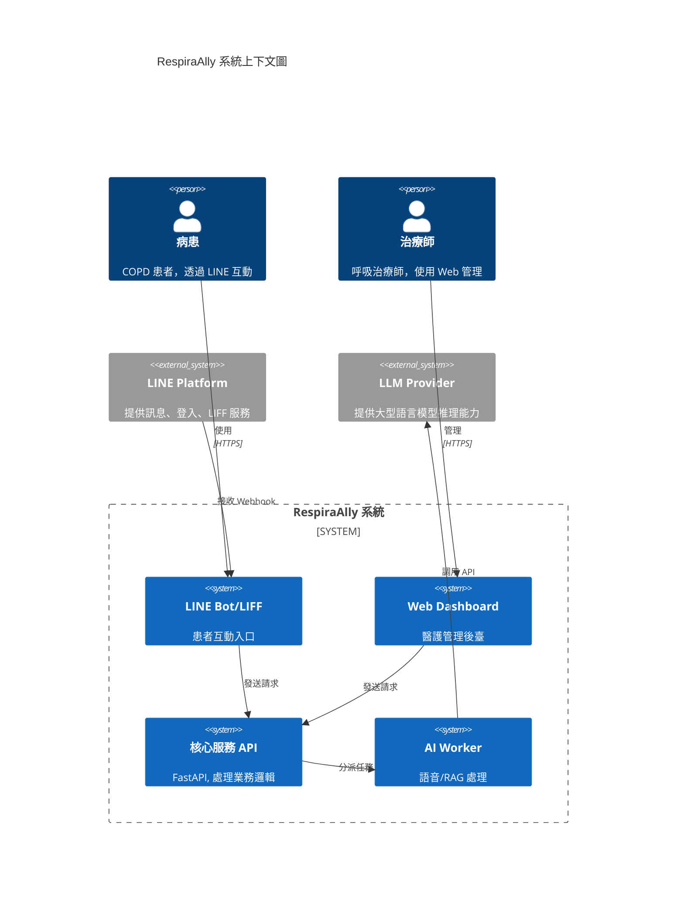
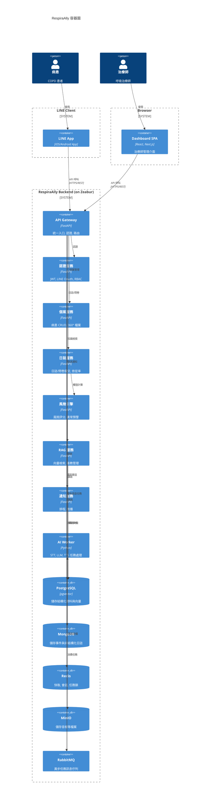
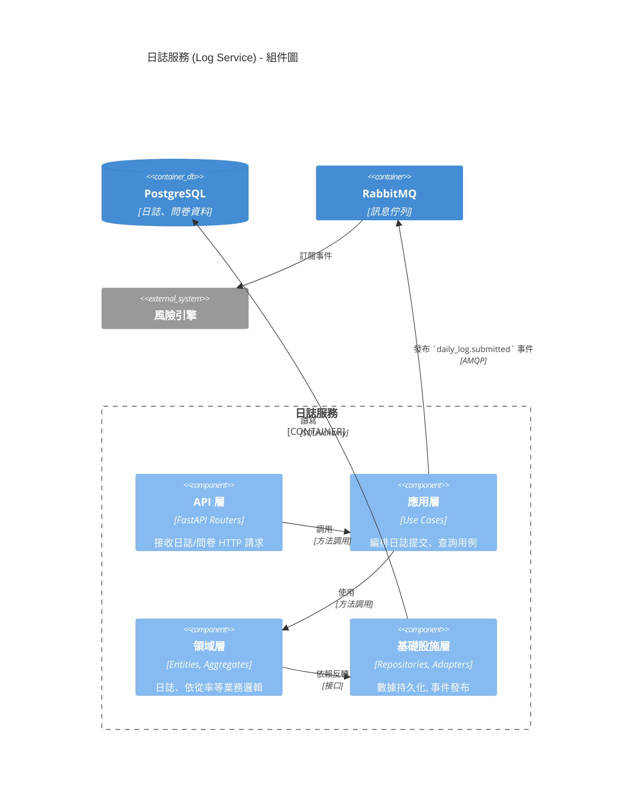
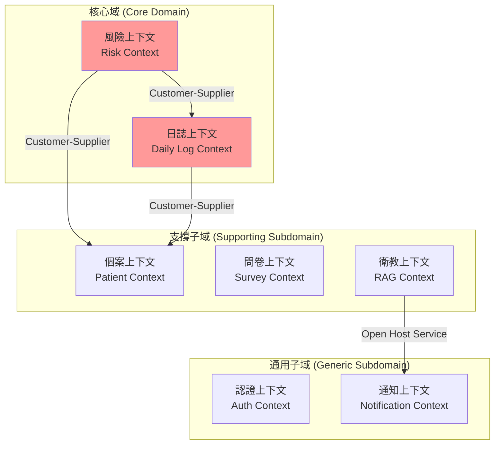
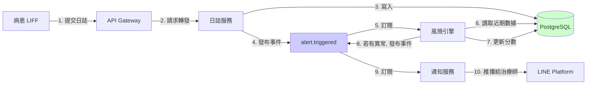

# RespiraAlly V2.0 整合性架構與設計文件

---

**文件版本:** v1.0  
**最後更新:** 2025-10-16  
**主要作者:** Claude Code AI  
**狀態:** 草稿 (Draft)

---

## 1. 架構概述 (Architecture Overview)

### 1.1 系統背景與目標
- **問題域**: 本系統旨在解決慢性阻塞性肺病（COPD）患者在長期自我管理中面臨的挑戰，包括記錄繁瑣、缺乏即時回饋、衛教個人化不足等問題。同時，也致力於改善呼吸治療師的工作流程，解決其資料分散、風險追蹤耗時的痛點。
- **關鍵驅動力**:
  - **業務驅動力**: 提升 COPD 病患的健康行為依從率至 75% 以上，降低醫療機構的慢病管理成本與急診率。
  - **技術驅動力**: 從 V1 的 Flask 單體架構遷移至 FastAPI 微服務架構，引入 AI 語音互動、RAG 知識庫、事件驅動等現代技術，解決 V1 的技術債與擴展性問題。
  - **品質驅動力**: 追求高可用性 (99.5%)、高效能 (API P95 < 500ms)、高安全性和合規性 (符合台灣個資法)。

### 1.2 利益相關者與關注點
| 角色 | 關注點 | 優先級 |
|---|---|---|
| COPD 病患 | 功能易用性、互動即時性、隱私安全 | 高 |
| 呼吸治療師 | 工作效率、風險預警準確性、個案資料完整性 | 高 |
| 產品經理 | 功能完整性、北極星指標達成率、上線時程 | 高 |
| 開發團隊 | 可維護性、技術棧現代化、CI/CD 效率 | 高 |
| 運維團隊 | 可部署性、可監控性、系統穩定性 | 中 |
| 法務合規 | 個資法合規、醫療資訊安全 | 高 |

### 1.3 品質屬性權衡 (Quality Attributes)

| 品質屬性 | 目標 | 度量方式 | 優先級 | 權衡考量 |
|---|---|---|---|---|
| **可用性 (Availability)** | ≥99.5% uptime | Prometheus 監控 | P0 | vs 成本 (初期接受部分單點) |
| **性能 (Performance)** | API P95 < 500ms | Prometheus 監控 | P0 | vs 開發速度 (關鍵路徑優先優化) |
| **安全性 (Security)** | 零資料洩露 | 滲透測試、日誌稽核 | P0 | vs 易用性 (兼顧便利與安全) |
| **可維護性 (Maintainability)** | 新功能交付 < 2週 | Lead Time | P1 | vs 性能 (採用 Clean Arch) |
| **擴展性 (Scalability)** | 支援 500 CCU | 負載測試 (Locust) | P1 | vs 複雜度 (MVP 後再引入 K8s) |

**關鍵權衡決策**:
- **性能 vs 可維護性**: 選擇 Clean Architecture + 微服務，犧牲少量初始開發速度與性能，換取長期可維護性與團隊並行開發能力。
- **一致性 vs 可用性**: 核心交易（如問卷提交）採強一致性，非核心資料（如事件日誌）採最終一致性。
- **成本 vs 可用性**: MVP 階段部署於 Zeabur，接受部分元件單點故障風險 (如 RabbitMQ)，上線後再遷移至高可用的 K8s 叢集。

---

## 2. C4 模型 - 多層次視圖

### 2.1 Level 1: 系統上下文圖 (System Context)


**外部系統依賴分析**:
- **LINE Platform**: 高依賴，是病患唯一入口。需設計降級訊息與監控其服務狀態。
- **LLM Provider**: 中依賴，AI 互動核心。可降級為罐頭回覆或提示服務不可用，並設計可抽換不同 LLM Provider 的適配層。

### 2.2 Level 2: 容器圖 (Container Diagram)



**容器職責與技術選型理由**:
- **API Gateway (FastAPI)**: 使用 FastAPI 作為統一入口，可利用其 Middleware 實現認證、日誌等橫切關注點，並簡化前端路由。
- **微服務 (FastAPI)**: 按照業務邊界拆分服務，便於獨立開發、部署與擴展。FastAPI 的異步特性與 Pydantic 型別檢查能提升開發效率與系統性能。
- **PostgreSQL + pgvector**: 選擇成熟的 PostgreSQL 處理關聯性資料，並利用 pgvector 擴充套件，在 MVP 階段將向量儲存與結構化資料放在一起，簡化架構。
- **MongoDB**: 用於儲存半結構化的事件日誌，其靈活的 Schema 有利於快速迭代與擴展。
- **RabbitMQ**: 選擇成熟可靠的 RabbitMQ 處理 AI 語音等耗時的異步任務，解耦主服務與背景 Worker。

### 2.3 Level 3: 組件圖 (Component Diagram) - 以日誌服務為例



---

## 3. DDD 戰略設計 (Strategic Design)

### 3.1 界限上下文映射 (Context Mapping)



**上下文關係說明**:
- **Customer-Supplier**: 風險上下文是日誌與個案上下文的下游客戶，它依賴上游提供的資料模型進行計算。
- **Open Host Service**: 衛教上下文提供開放的 API 服務，讓通知等其他上下文可以查詢並使用其內容。

### 3.2 統一語言 (Ubiquitous Language)

| 業務術語 | 定義 | 所屬上下文 |
|---|---|---|
| 健康日誌 (Daily Log) | 病患每日提交的健康行為記錄，包含用藥、飲水等。 | 日誌上下文 |
| 依從率 (Adherence Rate) | 病患遵循醫囑（如每日用藥）的比例。 | 日誌上下文 |
| 風險分數 (Risk Score) | 基於多因子計算的病患健康風險量化指標 (0-100)。 | 風險上下文 |
| 預警 (Alert) | 當偵測到異常行為模式時，系統自動產生的提醒。 | 風險上下文 |
| 知識區塊 (Chunk) | 從衛教文章中拆分出用於向量檢索的最小單位。 | 衛教上下文 |

---

## 4. 架構分層 (Layered Architecture)

遵循 **Clean Architecture** 原則，嚴格執行依賴倒置：

```
┌─────────────────────────────────────────────────┐
│  表現層 (Presentation Layer)                    │
│  - FastAPI Routers                              │
│  - WebSocket Endpoints                          │
└───────────────────┬─────────────────────────────┘
                    │
┌───────────────────▼─────────────────────────────┐
│  應用層 (Application Layer)                     │
│  - Use Cases / Application Services             │
│  - DTOs, Request/Response Models (Pydantic)     │
│  - Orchestration & Transaction Control          │
└───────────────────┬─────────────────────────────┘
                    │
┌───────────────────▼─────────────────────────────┐
│  領域層 (Domain Layer) - 核心業務邏輯           │
│  - Entities, Value Objects                      │
│  - Aggregates, Domain Services & Events         │
│  - Business Rules & Invariants                  │
└───────────────────┬─────────────────────────────┘
                    │
┌───────────────────▼─────────────────────────────┐
│  基礎設施層 (Infrastructure Layer)              │
│  - Repositories (SQLAlchemy)                    │
│  - External Adapters (LINE, OpenAI)             │
│  - Message Queue Publishers/Consumers (Pika)    │
└─────────────────────────────────────────────────┘
```

**依賴規則**:
- 外層可依賴內層，內層絕不可依賴外層。
- 領域層是獨立的，不依賴任何外部框架。
- 基礎設施層通過實現應用層定義的接口（如 Repository Port），來完成依賴反轉。

---

## 5. 數據架構 (Data Architecture)

### 5.1 數據流圖 (病患提交日誌)



### 5.2 數據模型設計原則
- **服務獨立數據庫**: 每個微服務邏輯上擁有獨立的 Schema，避免跨服務直接查詢。
- **最終一致性**: 跨服務的資料同步通過 RabbitMQ 事件驅動，接受最終一致性。
- **CQRS (讀寫分離)**: 在個案 360° 檔案等高讀取場景，考慮建立 read-only 的物化視圖 (Materialized View) 或寬表，與寫入模型分離。
- **數據遷移**: 使用 Alembic 管理 PostgreSQL 的 Schema 版本。

---

## 6. 部署架構 (Deployment Architecture) - MVP 階段

```mermaid
graph TD
  subgraph "Cloudflare"
    CDN[CDN / WAF]
  end
  
  subgraph "Zeabur Platform"
    LB[Load Balancer]

    subgraph "API Tier (Stateless Services)"
      API_Gateway[API Gateway]
      Auth_Svc[認證服務]
      Patient_Svc[個案服務]
      Log_Svc[日誌服務]
      Risk_Svc[風險引擎]
      RAG_Svc[RAG 服務]
    end

    subgraph "Worker Tier"
      AI_Worker[AI Worker]
      Scheduler[APScheduler]
    end

    subgraph "Data Tier (Managed Services)"
      Postgres_DB[(PostgreSQL)]
      MongoDB_DB[(MongoDB)]
      Redis_DB[(Redis)]
      MinIO_Store[(MinIO)]
      RabbitMQ_Broker{RabbitMQ}
    end
  end
  
  CDN --> LB
  LB --> API_Gateway
  API_Gateway --> Auth_Svc & Patient_Svc & Log_Svc & Risk_Svc & RAG_Svc

  Log_Svc --> RabbitMQ_Broker
  RabbitMQ_Broker --> AI_Worker
  Scheduler --> RAG_Svc & Patient_Svc
  
  API_Tier --讀寫--> Postgres_DB & MongoDB_DB & Redis_DB
  Worker_Tier --讀寫--> Postgres_DB & MinIO_Store
```



**部署特性 (MVP on Zeabur)**:
- **快速部署**: 利用 PaaS 平台 Zeabur 簡化部署流程，實現從 Git Push 到服務上線的自動化。
- **成本效益**: 初期使用託管服務，按需付費，避免過早投入大量基礎設施維護成本。
- **演進路徑**: 待業務成熟後，可將此架構平滑遷移至 Kubernetes (K8s) 叢集，以獲得更強的客製化能力與高可用性配置。

---

## 7. 架構決策記錄 (ADR)

關鍵 ADR 索引 (詳見 `docs/adr/` 目錄):
- **[ADR-001]** 採用 FastAPI 而非 Flask
- **[ADR-002]** pgvector 作為初期向量庫
- **[ADR-003]** MongoDB 儲存事件日誌
- **[ADR-004]** LINE 為唯一病患入口
- **[ADR-005]** RabbitMQ 作為訊息佇列
- **[ADR-006]** 三時段智慧提醒策略
- **[ADR-007]** 擬人化孫女口吻訊息
