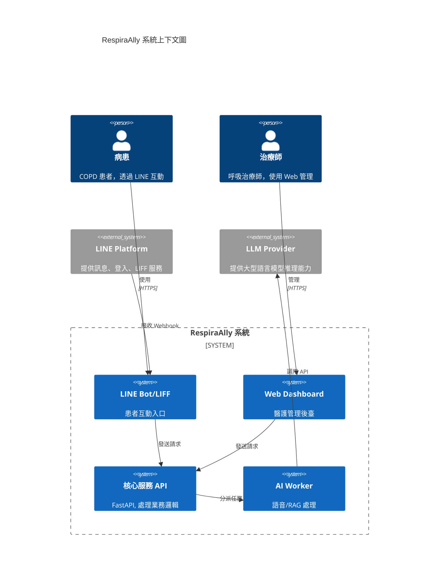
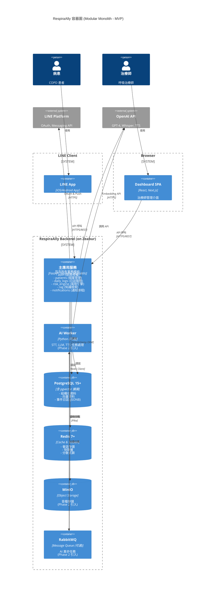
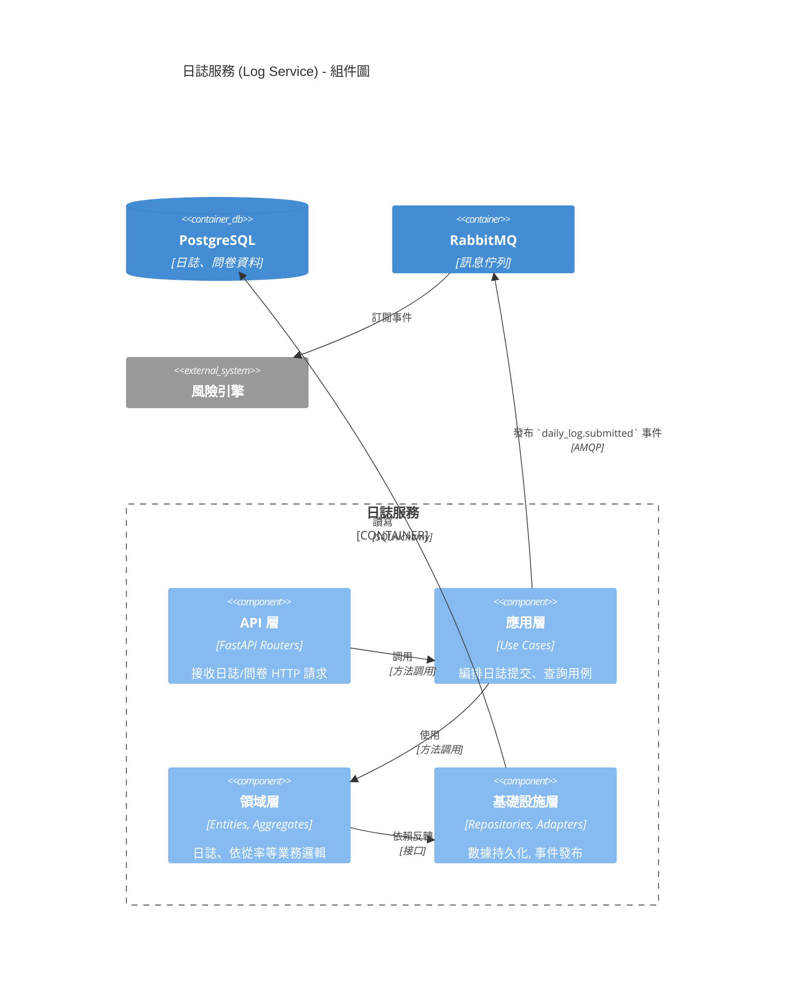
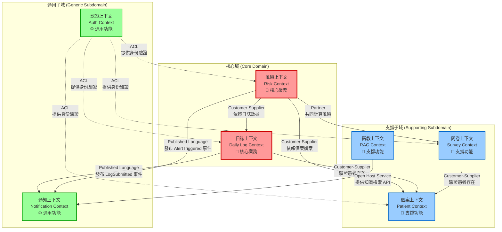
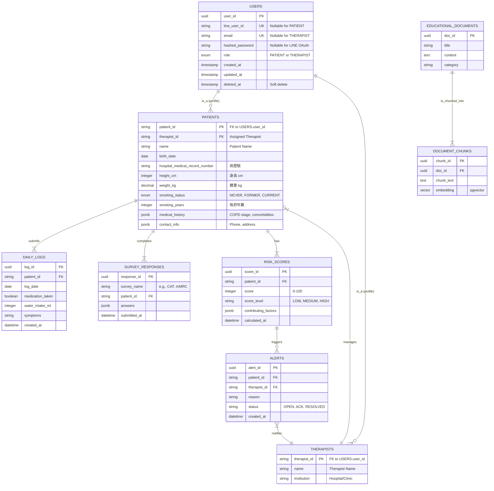
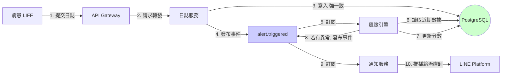
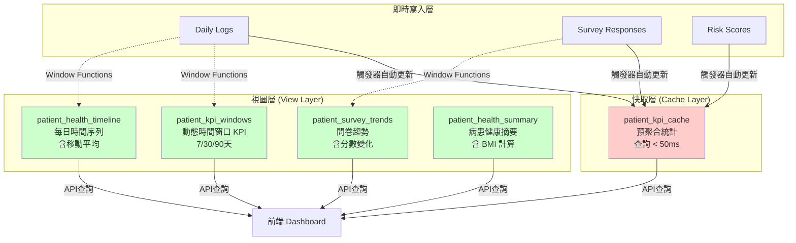
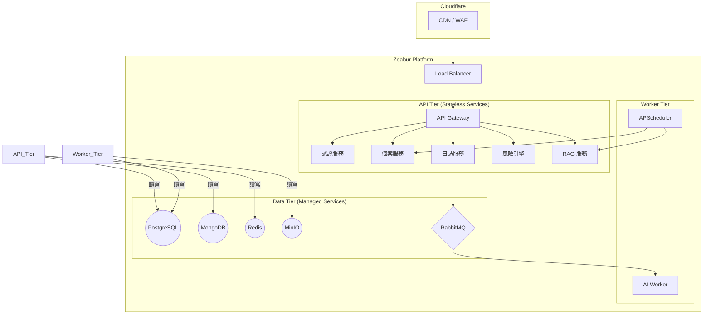
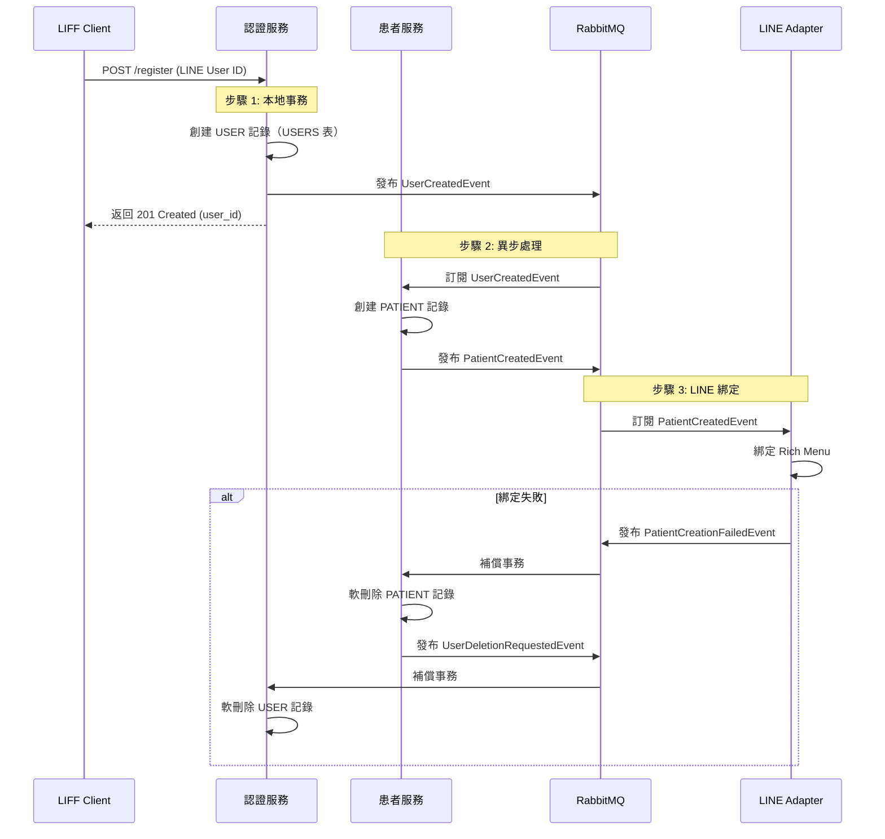
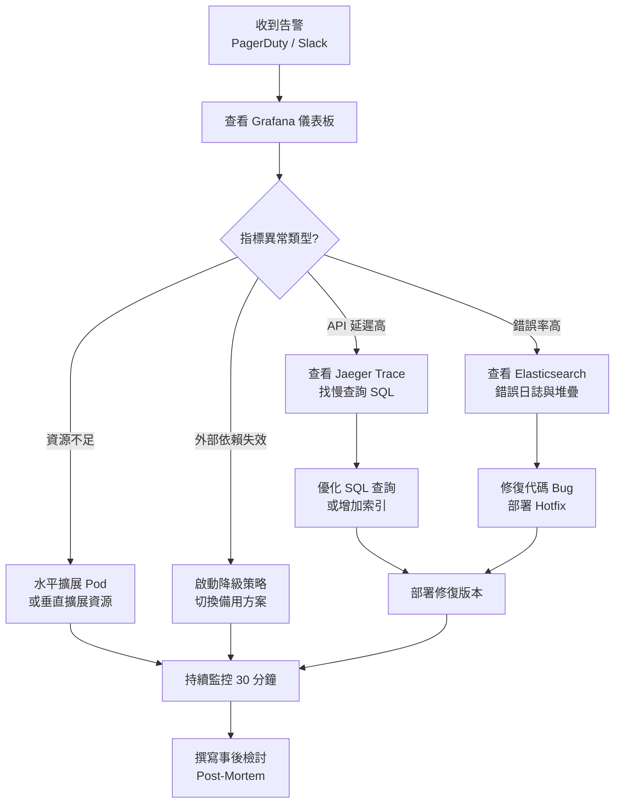

# RespiraAlly V2.0 整合性架構與設計文件

---

**文件版本:** v2.0
**最後更新:** 2025-10-17
**主要作者:** Claude Code AI - System Architect
**狀態:** 審核中 (Under Review)

---

## 1. 架構概述 (Architecture Overview)

### 1.1 系統背景與目標
- **問題域**: 本系統旨在解決慢性阻塞性肺病（COPD）患者在長期自我管理中面臨的挑戰，包括記錄繁瑣、缺乏即時回饋、衛教個人化不足等問題。同時，也致力於改善呼吸治療師的工作流程，解決其資料分散、風險追蹤耗時的痛點。
- **關鍵驅動力**:
  - **業務驅動力**: 提升 COPD 病患的健康行為依從率至 75% 以上，降低醫療機構的慢病管理成本與急診率。
  - **技術驅動力**: 從 V1 的 Flask 單體架構遷移至 FastAPI 微服務架構，引入 AI 語音互動、RAG 知識庫、事件驅動等現代技術，解決 V1 的技術債與擴展性問題。
  - **品質驅動力**: 追求高可用性 (99.5%)、高效能 (API P95 < 500ms)、高安全性和合規性 (符合台灣個資法)。

### 1.2 利益相關者與關注點
| 角色 | 關注點 | 優先級 |
|---|---|---|
| COPD 病患 | 功能易用性、互動即時性、隱私安全 | 高 |
| 呼吸治療師 | 工作效率、風險預警準確性、個案資料完整性 | 高 |
| 產品經理 | 功能完整性、北極星指標達成率、上線時程 | 高 |
| 開發團隊 | 可維護性、技術棧現代化、CI/CD 效率 | 高 |
| 運維團隊 | 可部署性、可監控性、系統穩定性 | 中 |
| 法務合規 | 個資法合規、醫療資訊安全 | 高 |

### 1.3 品質屬性權衡 (Quality Attributes)

| 品質屬性 | 目標 | 度量方式 | 優先級 | 權衡考量 |
|---|---|---|---|---|
| **可用性 (Availability)** | ≥99.5% uptime | Prometheus 監控 | P0 | vs 成本 (初期接受部分單點) |
| **性能 (Performance)** | API P95 < 500ms | Prometheus 監控 | P0 | vs 開發速度 (關鍵路徑優先優化) |
| **安全性 (Security)** | 零資料洩露 | 滲透測試、日誌稽核 | P0 | vs 易用性 (兼顧便利與安全) |
| **可維護性 (Maintainability)** | 新功能交付 < 2週 | Lead Time | P1 | vs 性能 (採用 Clean Arch) |
| **擴展性 (Scalability)** | 支援 500 CCU | 負載測試 (Locust) | P1 | vs 複雜度 (MVP 後再引入 K8s) |

**關鍵權衡決策**:
- **性能 vs 可維護性**: 選擇 Clean Architecture + 微服務，犧牲少量初始開發速度與性能，換取長期可維護性與團隊並行開發能力。
- **一致性 vs 可用性**: 核心交易（如問卷提交）採強一致性，非核心資料（如事件日誌）採最終一致性。
- **成本 vs 可用性**: MVP 階段部署於 Zeabur，接受部分元件單點故障風險 (如 RabbitMQ)，上線後再遷移至高可用的 K8s 叢集。

---

## 2. C4 模型 - 多層次視圖

### 2.1 Level 1: 系統上下文圖 (System Context)


**外部系統依賴分析**:
- **LINE Platform**: 高依賴，是病患唯一入口。需設計降級訊息與監控其服務狀態。
- **LLM Provider**: 中依賴，AI 互動核心。可降級為罐頭回覆或提示服務不可用，並設計可抽換不同 LLM Provider 的適配層。

### 2.2 Level 2: 容器圖 (Container Diagram)

**🎯 MVP 策略變更說明**: 基於 [架構審視報告](./ARCHITECTURE_REVIEW.md) 的建議，**MVP 階段採用 Modular Monolith** 而非微服務架構，以降低複雜度、加速交付並便於除錯。未來可根據實際業務需求逐步拆分為微服務。



**容器職責與技術選型理由**:

| 容器 | 技術選型 | 核心職責 | 選型理由 |
|------|----------|----------|----------|
| **主應用服務 (Modular Monolith)** | FastAPI | - 統一 API 入口<br/>- 認證授權 (JWT, LINE OAuth)<br/>- 所有業務邏輯 (患者、日誌、風險、RAG、通知) | - **簡化架構**: 單一 Process，避免分散式事務<br/>- **加速開發**: 直接函數調用，無需 RPC<br/>- **易於除錯**: 統一日誌、單一部署單元<br/>- **保留演進性**: 模組邊界清晰，未來可拆分 |
| **AI Worker** | Python | - 語音轉文字 (STT)<br/>- LLM 推理<br/>- 文字轉語音 (TTS) | - **Phase 2 引入**: Phase 0/1 暫不實作<br/>- **異步處理**: 避免阻塞主服務<br/>- **可選 RabbitMQ**: 初期可用 Celery + Redis 替代 |
| **PostgreSQL** | PostgreSQL 15 + pgvector | - 所有結構化資料<br/>- 向量資料 (衛教知識庫)<br/>- 事件日誌 (JSONB 欄位) | - **單一數據源**: 移除 MongoDB，簡化技術棧<br/>- **JSONB 強大**: 支援靈活 Schema，可替代 MongoDB<br/>- **pgvector 足夠**: MVP 階段向量量 < 10萬，性能足夠 |
| **Redis** | Redis 7 | - 會話存儲 (JWT Refresh Token)<br/>- 熱點數據快取<br/>- 分散式鎖 (登入失敗計數) | - **高性能**: 毫秒級讀寫<br/>- **豐富數據結構**: String, Hash, Set, ZSet<br/>- **持久化支援**: AOF + RDB |
| **RabbitMQ** | RabbitMQ 3 | - AI 語音任務佇列 | - **可選元件**: Phase 0/1 不引入<br/>- **備選方案**: Celery + Redis 或同步 API |

**🔄 演進路徑**:
```
Phase 0/1 (Week 1-8):
  └── Modular Monolith (FastAPI) + PostgreSQL + Redis

Phase 2 (Week 9-12):
  └── 新增 AI Worker + (可選) RabbitMQ

Phase 3+ (未來):
  └── 根據瓶頸逐步拆分微服務
      ├── 候選 1: AI Worker → 獨立微服務
      ├── 候選 2: RAG Service → 獨立微服務 (若查詢量 > 1000 QPS)
      └── 候選 3: Notification Service → 獨立微服務 (若推播量過大)
```

### 2.3 Level 3: 組件圖 (Component Diagram) - 以日誌服務為例



---

## 3. DDD 戰略設計 (Strategic Design)

本章節基於 Domain-Driven Design (DDD) 戰略設計原則，定義 RespiraAlly V2.0 的領域邊界、統一語言與聚合模型，確保業務邏輯與技術實現的高內聚、低耦合。

---

### 3.1 界限上下文映射 (Bounded Context Mapping)

界限上下文 (Bounded Context) 是 DDD 中定義領域邊界的核心概念。每個上下文內維護自己的模型與術語，上下文間透過明確的關係進行協作。

#### 3.1.1 上下文全景圖 (Context Map)



#### 3.1.2 上下文詳細定義

##### 🔴 核心域 (Core Domain) - 競爭優勢所在

**1. 日誌上下文 (Daily Log Context)**

| 屬性 | 內容 |
|------|------|
| **職責** | 管理患者每日健康記錄，計算健康行為依從率 |
| **核心實體** | DailyLog (聚合根), MedicationRecord, WaterIntake, SymptomRecord |
| **關鍵業務規則** | - 每位患者每日僅一筆記錄<br/>- 依從率 = (7日內用藥天數 / 7) × 100%<br/>- 提交後觸發風險重新計算 |
| **對外 API** | - `POST /daily-logs` - 提交日誌<br/>- `GET /daily-logs/{patientId}` - 查詢歷史<br/>- `GET /daily-logs/{patientId}/trends` - 獲取趨勢圖數據 |
| **發布事件** | - `DailyLogSubmitted` - 日誌提交成功<br/>- `DailyLogUpdated` - 日誌更新 |
| **訂閱事件** | 無 (作為數據源頭) |
| **依賴上下文** | Patient Context (驗證 patient_id 存在) |

**2. 風險上下文 (Risk Context)**

| 屬性 | 內容 |
|------|------|
| **職責** | 評估患者健康風險，觸發異常預警，管理預警生命週期 |
| **核心實體** | RiskScore (聚合根), Alert (聚合根), RiskEngine (領域服務) |
| **關鍵業務規則** | - 風險分數計算公式: `Score = f(依從率, CAT分數, 症狀頻率, 年齡, 吸菸史)`<br/>- 風險等級: LOW (0-40), MEDIUM (41-70), HIGH (71-100)<br/>- Alert 觸發條件: 風險等級 >= MEDIUM 且較上次提升 |
| **對外 API** | - `POST /risk-scores/calculate/{patientId}` - 計算風險<br/>- `GET /alerts?therapistId=xxx&status=OPEN` - 查詢預警列表<br/>- `PATCH /alerts/{alertId}/acknowledge` - 確認預警 |
| **發布事件** | - `RiskScoreCalculated` - 風險評分完成<br/>- `AlertTriggered` - 觸發新預警<br/>- `AlertResolved` - 預警解決 |
| **訂閱事件** | - `DailyLogSubmitted` (來自 Log Context)<br/>- `SurveyCompleted` (來自 Survey Context) |
| **依賴上下文** | - Daily Log Context (讀取近期日誌)<br/>- Patient Context (讀取患者檔案)<br/>- Survey Context (讀取最新問卷分數) |

##### 🔵 支撐子域 (Supporting Subdomain) - 支撐核心業務

**3. 個案上下文 (Patient Context)**

| 屬性 | 內容 |
|------|------|
| **職責** | 管理患者檔案、治療師分配、個案基本資料 CRUD |
| **核心實體** | Patient (聚合根), PatientProfile, TherapistAssignment |
| **關鍵業務規則** | - 患者必須分配給一位治療師<br/>- BMI 自動計算: `weight_kg / (height_cm / 100)^2`<br/>- 年齡限制: 18-120 歲 |
| **對外 API** | - `POST /patients` - 新增患者<br/>- `GET /patients/{id}` - 查詢患者檔案<br/>- `PATCH /patients/{id}/assign-therapist` - 分配治療師 |
| **發布事件** | - `PatientRegistered` - 患者註冊成功<br/>- `PatientProfileUpdated` - 檔案更新<br/>- `TherapistAssigned` - 治療師分配 |
| **訂閱事件** | - `UserCreated` (來自 Auth Context) |
| **依賴上下文** | Auth Context (驗證 user_id 與 LINE User ID 綁定) |

**4. 問卷上下文 (Survey Context)**

| 屬性 | 內容 |
|------|------|
| **職責** | 管理 CAT/mMRC 問卷、計算評分、追蹤病情嚴重度 |
| **核心實體** | SurveyResponse (聚合根), CATScorer, mMRCScorer (領域服務) |
| **關鍵業務規則** | - **CAT 評分**: 0-40 分，<10=輕微, 10-20=中度, 21-30=嚴重, >30=極嚴重<br/>- **mMRC 評分**: 0-4 分，表示呼吸困難程度<br/>- 問卷提交後觸發風險重新計算 |
| **對外 API** | - `POST /surveys/{type}` - 提交問卷 (type: CAT/mMRC)<br/>- `GET /surveys/{patientId}/history` - 查詢歷史問卷<br/>- `GET /surveys/{patientId}/latest` - 獲取最新分數 |
| **發布事件** | - `SurveyCompleted` - 問卷完成<br/>- `SeverityLevelChanged` - 嚴重度變化 |
| **訂閱事件** | 無 |
| **依賴上下文** | Patient Context (驗證 patient_id 存在) |

**5. 衛教上下文 (RAG Context)**

| 屬性 | 內容 |
|------|------|
| **職責** | 管理衛教知識庫、向量檢索、AI 語音問答 (STT → RAG → LLM → TTS) |
| **核心實體** | EducationalDocument (聚合根), DocumentChunk, EmbeddingService (領域服務) |
| **關鍵業務規則** | - 文件必須分塊 (每塊 ≤ 500 字)<br/>- 向量相似度檢索 Top-K=5<br/>- AI 回覆必須引用來源 (Citation) |
| **對外 API** | - `POST /rag/query` - 文字問答<br/>- `POST /rag/voice-query` - 語音問答 (異步)<br/>- `GET /rag/documents` - 查詢知識庫 |
| **發布事件** | - `VoiceQueryReceived` - 收到語音查詢<br/>- `VoiceResponseGenerated` - 語音回覆生成完成 |
| **訂閱事件** | 無 |
| **依賴上下文** | 無 (獨立上下文) |

##### 🟢 通用子域 (Generic Subdomain) - 可用現成方案

**6. 認證上下文 (Auth Context)**

| 屬性 | 內容 |
|------|------|
| **職責** | 用戶認證、授權、會話管理、登入鎖定策略 |
| **核心實體** | User (聚合根), Session, AccessToken (JWT), RefreshToken |
| **關鍵業務規則** | - **患者**: LINE OAuth 登入，無密碼<br/>- **治療師**: 帳密登入，登入失敗 3 次鎖定 15 分鐘<br/>- JWT 有效期: Access Token 1 小時, Refresh Token 7 天 |
| **對外 API** | - `POST /auth/line/callback` - LINE 登入回調<br/>- `POST /auth/therapist/login` - 治療師登入<br/>- `POST /auth/refresh` - 刷新 Token |
| **發布事件** | - `UserCreated` - 新用戶註冊<br/>- `UserLoggedIn` - 登入成功<br/>- `AccountLocked` - 帳號鎖定 |
| **訂閱事件** | 無 |
| **依賴上下文** | 無 (基礎服務) |

**7. 通知上下文 (Notification Context)**

| 屬性 | 內容 |
|------|------|
| **職責** | 管理通知排程、發送 LINE 訊息/Email、追蹤發送狀態 |
| **核心實體** | Notification (聚合根), NotificationSchedule, DeliveryStatus |
| **關鍵業務規則** | - 智慧提醒時段: 12:00, 17:00, 20:00<br/>- 通知失敗重試 3 次 (指數退避)<br/>- LINE 訊息擬人化口吻 (孫女語氣) |
| **對外 API** | - `POST /notifications/send` - 立即發送<br/>- `POST /notifications/schedule` - 排程發送<br/>- `GET /notifications/history/{userId}` - 查詢歷史 |
| **發布事件** | - `NotificationSent` - 通知發送成功<br/>- `NotificationFailed` - 發送失敗 |
| **訂閱事件** | - `DailyLogSubmitted` (觸發鼓勵訊息)<br/>- `AlertTriggered` (通知治療師)<br/>- `SurveyCompleted` (觸發感謝訊息) |
| **依賴上下文** | RAG Context (查詢衛教內容用於推播) |

---

#### 3.1.3 上下文間關係說明

**關係類型定義**:

1. **Customer-Supplier (客戶-供應商)**:
   - **定義**: 下游上下文 (Customer) 依賴上游上下文 (Supplier) 提供的數據或服務
   - **範例**: 風險上下文 → 日誌上下文 (風險計算需要日誌數據)
   - **實作**: 透過 REST API 或共享數據庫視圖

2. **Open Host Service (開放主機服務)**:
   - **定義**: 上下文提供公開的、文檔完善的 API 供其他上下文調用
   - **範例**: 衛教上下文提供知識檢索 API
   - **實作**: RESTful API + OpenAPI 規範

3. **Published Language (發布語言)**:
   - **定義**: 上下文透過領域事件進行異步通信，使用統一的事件 Schema
   - **範例**: 日誌上下文發布 `DailyLogSubmitted` 事件
   - **實作**: RabbitMQ + 事件版本化

4. **Anti-Corruption Layer (防腐層)**:
   - **定義**: 保護上下文不受外部系統變化影響的適配層
   - **範例**: 認證上下文 (ACL) 隔離 LINE Platform 變化
   - **實作**: Adapter Pattern

5. **Partner (合作夥伴)**:
   - **定義**: 兩個上下文緊密協作，共同實現業務目標
   - **範例**: 風險上下文 ↔ 問卷上下文 (共同計算風險)
   - **實作**: 同步 API 調用 + 共享事件

**關鍵關係矩陣**:

| 下游上下文 (Customer) | 上游上下文 (Supplier) | 關係類型 | 協作方式 |
|----------------------|---------------------|----------|----------|
| 風險上下文 | 日誌上下文 | Customer-Supplier | REST API (讀取近 30 日日誌) |
| 風險上下文 | 個案上下文 | Customer-Supplier | REST API (讀取患者檔案) |
| 風險上下文 | 問卷上下文 | Partner | REST API + Event (`SurveyCompleted`) |
| 日誌上下文 | 個案上下文 | Customer-Supplier | Database FK (驗證 patient_id) |
| 問卷上下文 | 個案上下文 | Customer-Supplier | Database FK (驗證 patient_id) |
| 通知上下文 | 衛教上下文 | Open Host Service | REST API (查詢衛教內容) |
| 通知上下文 | 日誌上下文 | Published Language | Event (`DailyLogSubmitted`) |
| 通知上下文 | 風險上下文 | Published Language | Event (`AlertTriggered`) |
| 所有上下文 | 認證上下文 | ACL | JWT Middleware (身份驗證) |

---

### 3.2 統一語言 (Ubiquitous Language)

統一語言 (Ubiquitous Language) 是 DDD 的核心實踐，確保開發團隊、領域專家、產品經理使用相同的術語描述業務概念，避免歧義與誤解。

#### 3.2.1 核心術語表

以下術語按照所屬上下文分類，並提供中英對照、精確定義與反例。

##### 🔴 認證上下文 (Auth Context)

| 術語 | 英文 | 定義 | 反例 / 注意事項 | 所屬上下文 |
|------|------|------|-----------------|-----------|
| 用戶 | User | 系統中的使用者實體，包含病患 (Patient) 與治療師 (Therapist) | ≠ 病患 (Patient 是 User 的子類型) | Auth Context |
| 角色 | Role | 用戶的身份類型，枚舉值: PATIENT 或 THERAPIST | ≠ 權限 (Role 決定權限，但不等於權限本身) | Auth Context |
| 訪問令牌 | Access Token | 短期 JWT，有效期 1 小時，用於 API 鑑權 | ≠ Refresh Token (後者用於刷新前者) | Auth Context |
| 刷新令牌 | Refresh Token | 長期 JWT，有效期 7 天，用於獲取新的 Access Token | 存儲在 Redis，單次使用後失效 (Rotation) | Auth Context |
| 帳號鎖定 | Account Lockout | 治療師登入失敗 3 次後鎖定 15 分鐘的安全機制 | 僅適用於治療師，患者無密碼登入故不適用 | Auth Context |
| LINE 用戶 ID | LINE User ID | LINE Platform 提供的唯一用戶識別碼，格式 `U{32 位十六進位}` | ≠ 系統內部 user_id (UUID) | Auth Context |

##### 🔴 個案上下文 (Patient Context)

| 術語 | 英文 | 定義 | 反例 / 注意事項 | 所屬上下文 |
|------|------|------|-----------------|-----------|
| 病患 | Patient | COPD 患者，透過 LINE 使用系統的使用者 | ≠ 治療師 (Therapist) | Patient Context |
| 治療師 | Therapist | 呼吸治療師，透過 Web Dashboard 管理病患的使用者 | ≠ 醫生 (本系統僅支援治療師角色) | Patient Context |
| 病患檔案 | Patient Profile | 病患的詳細資料，包含姓名、生日、身高體重、病歷號、吸菸史等 | ≠ User (User 僅包含認證資訊) | Patient Context |
| 病歷號 | Medical Record Number | 醫院提供的病患唯一識別碼，用於跨系統對接 | 選填欄位，未來可用於 FHIR/HL7 整合 | Patient Context |
| BMI | Body Mass Index | 身體質量指數，計算公式: `weight_kg / (height_cm / 100)^2` | 自動計算欄位，不可直接修改 | Patient Context |
| 吸菸史 | Smoking History | 病患的吸菸狀態 (從未/曾經/目前) 與吸菸年數 | COPD 關鍵風險因素，必填 | Patient Context |
| 治療師分配 | Therapist Assignment | 將病患指派給特定治療師的動作，一對多關係 | 一位治療師可管理多位病患，但病患僅有一位負責治療師 | Patient Context |

##### 🔴 日誌上下文 (Daily Log Context)

| 術語 | 英文 | 定義 | 反例 / 注意事項 | 所屬上下文 |
|------|------|------|-----------------|-----------|
| 健康日誌 | Daily Log | 病患每日提交的健康行為記錄，包含用藥、飲水、步數、症狀、心情 | ≠ 問卷 (Survey) - 後者是定期評估，前者是每日記錄 | Daily Log Context |
| 用藥記錄 | Medication Record | 病患當日是否服藥的布林值記錄 | 僅記錄是/否，不記錄藥物種類 (藥物清單在 PatientProfile.medical_history 中) | Daily Log Context |
| 飲水量 | Water Intake | 病患當日飲水量，單位毫升 (ml)，範圍 0-10000 | 異常值 (如 > 5000ml) 會觸發資料驗證警告 | Daily Log Context |
| 步數 | Steps Count | 病患當日步行步數，範圍 0-100000 | 選填欄位，未來可整合穿戴裝置 | Daily Log Context |
| 症狀 | Symptoms | 病患自述的當日症狀，自由文字欄位 | 未來可用 NLP 分析症狀關鍵詞 (咳嗽、喘、痰) | Daily Log Context |
| 心情 | Mood | 病患當日情緒狀態，枚舉值: GOOD (好), NEUTRAL (普通), BAD (不好) | 用於追蹤心理健康，與症狀嚴重度相關聯 | Daily Log Context |
| 依從率 | Adherence Rate | 病患遵循醫囑的比例，公式: `(N 日內用藥天數 / N) × 100%` | 系統支援 7 日 / 30 日兩種統計窗口 | Daily Log Context |
| 打卡天數 | Streak Days | 病患連續提交日誌的天數，用於遊戲化激勵 | 斷一天歸零，當前連續 / 歷史最長兩種統計 | Daily Log Context |

##### 🔴 問卷上下文 (Survey Context)

| 術語 | 英文 | 定義 | 反例 / 注意事項 | 所屬上下文 |
|------|------|------|-----------------|-----------|
| CAT 問卷 | COPD Assessment Test | COPD 評估測驗，8 題量表，評估 COPD 對生活品質的影響，分數 0-40 | ≠ mMRC (後者僅評估呼吸困難) | Survey Context |
| mMRC 問卷 | modified Medical Research Council | 修正版英國醫學研究委員會呼吸困難量表，單題量表，分數 0-4 | ≠ CAT (後者是多維度評估) | Survey Context |
| 問卷回覆 | Survey Response | 病患完成問卷後的答案記錄，包含原始答案 (JSONB) 與計算分數 | 提交後不可修改，僅能新增新一筆回覆 | Survey Context |
| 嚴重度 | Severity Level | 根據 CAT 分數計算的 COPD 嚴重程度，枚舉值: MILD, MODERATE, SEVERE, VERY_SEVERE | CAT < 10=輕微, 10-20=中度, 21-30=嚴重, >30=極嚴重 | Survey Context |
| 評分器 | Scorer | 領域服務，負責計算問卷總分與嚴重度分級 | 不同問卷類型有不同的 Scorer 實作 (Strategy Pattern) | Survey Context |

##### 🔴 風險上下文 (Risk Context)

| 術語 | 英文 | 定義 | 反例 / 注意事項 | 所屬上下文 |
|------|------|------|-----------------|-----------|
| 風險分數 | Risk Score | 基於多因子計算的病患健康風險量化指標，範圍 0-100 | 分數越高風險越大 | Risk Context |
| 風險等級 | Risk Level | 根據風險分數分級的枚舉值: LOW (0-40), MEDIUM (41-70), HIGH (71-100) | ≠ 嚴重度 (Severity) - 後者來自 CAT 問卷，前者是綜合評估 | Risk Context |
| 風險引擎 | Risk Engine | 領域服務，負責計算風險分數的核心邏輯 | 公式: `Score = f(依從率, CAT分數, 症狀頻率, 年齡, 吸菸史)` | Risk Context |
| 貢獻因子 | Contributing Factors | 組成風險分數的各個子因素及其權重，以 JSONB 儲存 | 範例: `{adherence: 0.3, cat_score: 0.25, symptoms: 0.2, age: 0.15, smoking: 0.1}` | Risk Context |
| 預警 | Alert | 當偵測到異常模式時系統自動產生的通知，需治療師確認與處理 | ≠ 通知 (Notification) - 預警需要人工處理，通知僅為資訊推播 | Risk Context |
| 預警類型 | Alert Type | 預警的觸發原因，枚舉值: MISSED_MEDICATION, NO_LOG, SYMPTOM_SPIKE, RISK_ELEVATED | 不同類型有不同的處理優先級 | Risk Context |
| 預警狀態 | Alert Status | 預警的處理狀態，枚舉值: OPEN (未處理), ACKNOWLEDGED (已確認), RESOLVED (已解決) | 狀態轉換單向: OPEN → ACKNOWLEDGED → RESOLVED | Risk Context |

##### 🔵 衛教上下文 (RAG Context)

| 術語 | 英文 | 定義 | 反例 / 注意事項 | 所屬上下文 |
|------|------|------|-----------------|-----------|
| 衛教文件 | Educational Document | 提供給病患的衛教知識文章，類別包含用藥、運動、飲食、呼吸訓練等 | ≠ 系統文檔 (Documentation) | RAG Context |
| 知識區塊 | Chunk | 從衛教文件中拆分出用於向量檢索的最小單位，每塊 ≤ 500 字 | 拆分策略: 按段落 + 滑動窗口 (Sliding Window) | RAG Context |
| 向量嵌入 | Embedding | 知識區塊轉換為高維向量的表示，使用 OpenAI text-embedding-3-small (維度 1536) | ≠ Tokenization (後者是文本轉數字，前者是語義向量化) | RAG Context |
| 語義檢索 | Semantic Retrieval | 根據查詢文本的語義 (而非關鍵詞) 找到最相關的知識區塊 | 使用餘弦相似度 (Cosine Similarity) 排序 | RAG Context |
| RAG | Retrieval-Augmented Generation | 檢索增強生成，先檢索相關知識，再用 LLM 生成回答的技術 | 流程: Query → Embedding → Retrieval (Top-K) → LLM Prompt → Response | RAG Context |
| 引用來源 | Citation | AI 回覆中標註的參考資料來源，包含文件標題與連結 | 透明化 AI 推理過程，提升使用者信任感 | RAG Context |
| STT | Speech-To-Text | 語音轉文字服務，使用 OpenAI Whisper API | 支援台語/國語混合辨識 (繁體中文) | RAG Context |
| TTS | Text-To-Speech | 文字轉語音服務，使用 OpenAI TTS API | 使用擬人化聲音 (孫女語氣) | RAG Context |

##### 🟢 通知上下文 (Notification Context)

| 術語 | 英文 | 定義 | 反例 / 注意事項 | 所屬上下文 |
|------|------|------|-----------------|-----------|
| 通知 | Notification | 系統發送給使用者的訊息，包含提醒、預警、週報等 | ≠ 預警 (Alert) - 預警需治療師處理，通知僅為資訊推播 | Notification Context |
| 智慧提醒 | Smart Reminder | 根據病患行為模式自動排程的提醒通知，三時段: 12:00, 17:00, 20:00 | 未填日誌時觸發，連續填寫 3 天後自動減少頻率 | Notification Context |
| 推播管道 | Channel | 通知發送的管道，枚舉值: LINE, EMAIL | MVP 階段僅支援 LINE，Phase 2 加入 Email | Notification Context |
| 發送狀態 | Delivery Status | 通知的發送狀態，枚舉值: PENDING (待發送), SENT (已發送), FAILED (失敗) | 失敗後自動重試 3 次 (指數退避) | Notification Context |
| 訊息模板 | Message Template | 預先定義的通知文案格式，支援變數替換 | 範例: `{patient_name} 您好，今日還沒記錄健康日誌喔！` | Notification Context |
| 擬人化口吻 | Humanized Tone | 通知文案使用孫女對長輩的溫馨語氣，提升親和力 | 參考 ADR-007: 擬人化訊息策略 | Notification Context |

---

#### 3.2.2 術語使用規範

**開發團隊規範**:
1. **代碼命名**: 類別、變數、函數命名必須使用統一語言的英文術語 (如 `DailyLog`, `adherence_rate`)
2. **文檔撰寫**: 技術文檔與 PRD 必須使用統一語言的中文術語，並在首次出現時附註英文
3. **溝通會議**: 需求討論與技術評審會議中，團隊成員必須使用統一語言術語，避免自創詞彙
4. **術語更新**: 當發現業務概念變化時，必須更新本詞彙表，並通知全體團隊

**常見錯誤與糾正**:

| ❌ 錯誤術語 | ✅ 正確術語 | 糾正理由 |
|------------|------------|----------|
| "日記" | "健康日誌 (Daily Log)" | "日記" 過於口語化，不精確 |
| "問題" | "症狀 (Symptoms)" 或 "預警 (Alert)" | 需區分患者自述症狀 vs 系統預警 |
| "通知" 與 "預警" 混用 | 明確區分: "通知 (Notification)" vs "預警 (Alert)" | 預警需治療師處理，通知僅為資訊 |
| "用戶" 與 "病患" 混用 | 明確區分: "用戶 (User)" 包含病患與治療師 | 病患是用戶的子類型 |
| "登入失敗次數" | "帳號鎖定 (Account Lockout)" | 應使用業務術語而非技術實作細節 |

---

### 3.3 聚合設計 (Aggregate Design)

聚合 (Aggregate) 是 DDD 戰術設計的核心模式，用於維護業務不變量 (Invariants) 與定義事務邊界。每個聚合有且僅有一個聚合根 (Aggregate Root)，作為對外訪問的唯一入口。

#### 3.3.1 聚合設計原則

遵循以下 DDD 聚合設計原則:

1. **小聚合優先** - 聚合越小越好，僅包含必須保持強一致性的實體
2. **不變量保護** - 聚合根負責維護聚合內所有業務規則
3. **事務邊界** - 每次事務僅修改一個聚合實例
4. **通過 ID 引用** - 聚合間通過 ID 關聯，而非直接持有對象引用
5. **最終一致性** - 跨聚合的業務規則透過領域事件實現最終一致性

#### 3.3.2 聚合目錄

RespiraAlly V2.0 系統包含以下 7 個核心聚合:

| 聚合根 | 所屬上下文 | 核心職責 | 不變量 (Invariants) |
|--------|-----------|----------|---------------------|
| **Patient** | Patient Context | 管理患者檔案、治療師分配 | - 年齡 >= 18 歲<br/>- BMI 由身高體重計算<br/>- 必須分配給一位治療師 |
| **DailyLog** | Daily Log Context | 記錄每日健康行為 | - 每位患者每天僅一筆記錄<br/>- 用藥狀態必須明確 (true/false)<br/>- 飲水量 0-10000ml |
| **SurveyResponse** | Survey Context | 記錄問卷答案與評分 | - CAT 分數 0-40<br/>- mMRC 分數 0-4<br/>- 提交後不可修改 |
| **RiskScore** | Risk Context | 計算並儲存風險評分 | - 分數 0-100<br/>- 風險等級由分數計算<br/>- 每天僅一個分數 |
| **Alert** | Risk Context | 管理預警生命週期 | - 狀態轉換單向: OPEN → ACKNOWLEDGED → RESOLVED<br/>- 僅能由負責治療師處理 |
| **EducationalDocument** | RAG Context | 管理衛教文件與區塊 | - 文件必須有至少一個區塊<br/>- 區塊 index 必須連續<br/>- Embedding 維度一致 |
| **User** | Auth Context | 管理認證與授權 | - LINE User ID 或 Email 至少一個<br/>- Role 與登入方式一致<br/>- 治療師登入失敗鎖定邏輯 |

---

#### 3.3.3 關鍵聚合設計範例

##### Patient Aggregate (個案聚合)

**聚合邊界**:
```
┌─────────────────────────────────────┐
│  Patient Aggregate                  │
│  ┌─────────────┐                    │
│  │  Patient    │ (Aggregate Root)   │
│  │  - user_id  │                    │
│  │  - therapist_id ──> (Reference)  │
│  │  - profile  │                    │
│  └─────────────┘                    │
└─────────────────────────────────────┘
```

**核心不變量**:
1. Patient 年齡必須 >= 18 歲
2. BMI = weight_kg / (height_cm / 100)² (自動計算)
3. 必須分配給一位治療師 (therapist_id NOT NULL)

**領域事件**:
- `PatientRegistered` - 患者註冊完成
- `TherapistAssigned` - 治療師分配變更
- `PatientProfileUpdated` - 檔案更新

##### DailyLog Aggregate (日誌聚合)

**聚合邊界**:
```
┌─────────────────────────────────────┐
│  DailyLog Aggregate                 │
│  ┌─────────────┐                    │
│  │  DailyLog   │ (Aggregate Root)   │
│  │  - log_id   │                    │
│  │  - patient_id ──> (Reference)    │
│  │  - log_date │                    │
│  │  - medication_taken │            │
│  │  - water_intake_ml │             │
│  └─────────────┘                    │
└─────────────────────────────────────┘
```

**核心不變量**:
1. 每位患者每天僅一筆記錄 (UNIQUE INDEX on patient_id, log_date)
2. 不可提交未來日期的日誌
3. 飲水量必須在 0-10000ml 範圍內

**領域事件**:
- `DailyLogSubmitted` - 觸發風險重新計算
- `AdherenceRateChanged` - 依從率變化 (可選)

##### RiskScore Aggregate (風險評分聚合)

**核心不變量**:
1. 風險分數必須在 0-100 之間
2. 風險等級 (LOW/MEDIUM/HIGH) 由分數自動計算
3. 每位患者每天僅一個風險分數

**領域服務**:
- `RiskEngine.calculate()` - 計算風險分數的領域服務
- 公式: `Score = f(adherence_rate × 0.3, cat_score × 0.25, symptom_frequency × 0.2, age × 0.15, smoking_years × 0.1)`

**領域事件**:
- `RiskScoreCalculated` - 風險評分完成
- `AlertTriggered` - 風險等級提升觸發預警

---

#### 3.3.4 聚合設計檢核清單

- [x] **每個聚合有明確的聚合根** - 所有 7 個聚合都有唯一的 Aggregate Root
- [x] **聚合邊界清晰** - 聚合內實體緊密相關,聚合間通過 ID 引用
- [x] **不變量明確** - 每個聚合都有明確的業務規則與驗證邏輯
- [x] **事務邊界** - 每次事務僅修改一個聚合實例
- [x] **領域事件** - 跨聚合操作通過領域事件實現最終一致性
- [x] **小聚合優先** - 聚合僅包含必須強一致性的實體
- [x] **通過 ID 引用** - Patient 聚合引用 Therapist 使用 `therapist_id` 而非對象引用

---

## 4. 架構分層 (Layered Architecture)

遵循 **Clean Architecture** 原則，嚴格執行依賴倒置：

```
┌─────────────────────────────────────────────────┐
│  表現層 (Presentation Layer)                    │
│  - FastAPI Routers                              │
│  - WebSocket Endpoints                          │
└───────────────────┬─────────────────────────────┘
                    │
┌───────────────────▼─────────────────────────────┐
│  應用層 (Application Layer)                     │
│  - Use Cases / Application Services             │
│  - DTOs, Request/Response Models (Pydantic)     │
│  - Orchestration & Transaction Control          │
└───────────────────┬─────────────────────────────┘
                    │
┌───────────────────▼─────────────────────────────┐
│  領域層 (Domain Layer) - 核心業務邏輯           │
│  - Entities, Value Objects                      │
│  - Aggregates, Domain Services & Events         │
│  - Business Rules & Invariants                  │
└───────────────────┬─────────────────────────────┘
                    │
┌───────────────────▼─────────────────────────────┐
│  基礎設施層 (Infrastructure Layer)              │
│  - Repositories (SQLAlchemy)                    │
│  - External Adapters (LINE, OpenAI)             │
│  - Message Queue Publishers/Consumers (Pika)    │
└─────────────────────────────────────────────────┘
```

**依賴規則**:
- 外層可依賴內層，內層絕不可依賴外層。
- 領域層是獨立的，不依賴任何外部框架。
- 基礎設施層通過實現應用層定義的接口（如 Repository Port），來完成依賴反轉。

---

## 5. 數據架構 (Data Architecture)

本章節詳述 RespiraAlly V2.0 的數據架構，包含核心數據模型、關鍵數據流、一致性策略以及數據生命週期管理，確保數據的完整性、可用性與合規性。

**📄 完整資料庫設計文檔**: 詳細的表結構、索引、約束、觸發器、存儲過程、視圖設計請參閱:
- **[Database Schema Design v1.0](./database/schema_design_v1.0.md)** - 實作層級完整設計

### 5.1 核心實體關係圖 (Core Entity-Relationship Diagram)

以下 ER 圖提供系統核心數據模型的概覽。詳細的表定義、欄位約束、索引策略請參閱上述完整設計文檔。

以下 ER 圖展示了系統中核心業務實體及其關係，這些實體主要儲存在 PostgreSQL 資料庫中。

**🔄 重要變更** (基於架構審視報告):
- ✅ **優化 USERS 表繼承模式** - `PATIENT_PROFILES` 與 `THERAPIST_PROFILES` 直接使用 `user_id` 作為 PK
- ✅ **新增 `EVENT_LOGS` 表** - 使用 PostgreSQL JSONB 替代 MongoDB
- ✅ **新增 `PATIENT_KPI_CACHE` 表** - 反正規化加速查詢
- ✅ **新增 `NOTIFICATION_HISTORY` 表** - 追蹤通知狀態



**模型說明**:
- **USERS**: 統一儲存所有使用者（病患與治療師）的基礎認證資訊。`role` 欄位用於區分身份。
- **PATIENTS / THERAPISTS**: 分別儲存病患與治療師的詳細檔案資訊，並透過一對一關係關聯回 `USERS` 表。
- **DAILY_LOGS / SURVEY_RESPONSES**: 記錄病患的核心健康數據，是計算風險分數的基礎。
- **RISK_SCORES / ALERTS**: 風險引擎的產出，用於實現主動預警功能。
- **EDUCATIONAL_DOCUMENTS / DOCUMENT_CHUNKS**: RAG 服務的知識庫來源，`DOCUMENT_CHUNKS` 中的 `embedding` 欄位將由 `pgvector` 進行索引以實現高效相似度搜尋。

### 5.2 數據流圖 (Data Flow Diagram) - 病患提交日誌

此圖展示了系統中最核心的數據流之一：病患提交每日健康日誌後的處理流程。



### 5.3 KPI 快取層與資料視圖設計 (KPI Cache & Data Views)

**設計目標**: 為前端數據視覺化提供高效能 (<50ms) 的 KPI 查詢能力,同時保持數據的即時性與一致性。

**📄 詳細設計文檔**: 完整的 KPI 快取表、視圖、觸發器、存儲過程設計請參閱:
- **[Database Schema Design - Section 4.5](./database/schema_design_v1.0.md#45-patient_kpi_cache-kpi-快取表)** - KPI 快取層實作細節

#### 5.3.1 兩層式架構設計



#### 5.3.2 `patient_kpi_cache` 表設計

**用途**: 預聚合的病患 KPI 統計,支持 <50ms 快速查詢。

**核心欄位**:
- 基礎統計: `total_logs_count`, `first_log_date`, `last_log_date`
- 依從率: `adherence_rate_7d`, `adherence_rate_30d`
- 健康指標: `avg_water_intake_7d`, `avg_steps_7d/30d`
- 最新問卷: `latest_cat_score`, `latest_cat_date`, `latest_mmrc_score`
- 最新風險: `latest_risk_score`, `latest_risk_level`, `latest_risk_date`
- 症狀統計: `symptom_occurrences_30d`

**更新機制**:
1. **觸發器自動更新** (即時):
   - `update_patient_kpi_on_log_insert()` - 新增日誌時更新基礎統計
   - `update_patient_kpi_on_survey_insert()` - 新增問卷時更新最新分數
   - `update_patient_kpi_on_risk_insert()` - 新增風險評分時更新風險數據

2. **定期刷新** (按需):
   - `refresh_patient_kpi_cache(patient_id)` - 刷新所有計算型 KPI
   - 建議: 使用 pg_cron 每小時執行,或在病患查詢 Dashboard 時按需調用

#### 5.3.3 資料視圖設計

**1. patient_kpi_windows (動態時間窗口 KPI)**
- **用途**: 支持 7/30/90 天窗口的 KPI 對比分析
- **關鍵特性**: 使用 FILTER WHERE 子句實現多時間窗口聚合
- **查詢性能**: ~200ms (依賴底層日誌表索引)

**2. patient_health_timeline (每日時間序列)**
- **用途**: 前端折線圖數據源
- **關鍵特性**:
  - 7 天移動平均 (平滑曲線)
  - 累積統計 (累積趨勢圖)
  - Window Functions 計算

**3. patient_survey_trends (問卷趨勢)**
- **用途**: CAT/mMRC 問卷歷史圖表
- **關鍵特性**:
  - 分數變化 (與上次問卷對比)
  - 基線對比 (與首次問卷對比)
  - 累計問卷次數

**4. patient_health_summary (健康摘要)**
- **用途**: 病患基本資料查詢,含自動計算 BMI
- **關鍵特性**:
  - BMI 自動計算: `weight_kg / (height_cm/100)^2`
  - BMI 分級: UNDERWEIGHT/NORMAL/OVERWEIGHT/OBESE
  - 年齡自動計算

#### 5.3.4 性能優化策略

**索引設計** (參考 DATABASE_SCHEMA_DESIGN.md):
```sql
-- patient_kpi_cache 主鍵索引
CREATE INDEX idx_patient_kpi_patient_id ON patient_kpi_cache(patient_id);

-- daily_logs 複合索引 (支持時間窗口查詢)
CREATE INDEX idx_daily_logs_patient_date
  ON daily_logs(patient_id, log_date DESC);

-- survey_responses 複合索引
CREATE INDEX idx_survey_patient_type_date
  ON survey_responses(patient_id, survey_type, submitted_at DESC);
```

**查詢性能目標**:
- `patient_kpi_cache` 直接查詢: **< 50ms**
- `patient_kpi_windows` 視圖查詢: **< 200ms**
- `patient_health_timeline` 視圖查詢 (30天): **< 300ms**

**降級策略**:
- 若 KPI Cache 過期 (last_calculated_at > 1小時), 前端顯示刷新按鈕
- 若視圖查詢超時, 降級為簡化版圖表 (僅顯示近 7 天)

### 5.4 數據一致性策略 (Data Consistency Strategy)

在分散式微服務架構中，我們根據業務場景選擇不同的一致性模型，以平衡系統的可用性、性能與數據準確性。

- **強一致性 (Strong Consistency) 場景**:
  - **用戶認證與授權**: 治療師登入、病患透過 LINE 登入時，必須立即讀取到最新的帳戶狀態與權限。
  - **核心數據寫入**: 病患提交健康日誌、問卷的核心寫入操作。系統必須確保數據成功持久化到 PostgreSQL 後才向用戶返回成功，避免數據遺失。此類操作將包裹在單一服務的資料庫事務中完成。

- **最終一致性 (Eventual Consistency) 場景**:
  - **風險分數計算**: 當日誌提交後，風險分數的更新是異步進行的。在短暫的時間窗口內（通常是毫秒到秒級），治療師看到的風險分數可能尚未反映最新的日誌，這是可接受的。
  - **觸發預警通知**: 同樣地，從風險分數更新到觸發預警並發送通知也是一個異步流程。
  - **跨服務數據同步**: 例如，更新病患基本資料後，相關的顯示名稱同步到其他服務的日誌記錄中，將透過事件傳遞，接受最終一致性。
  - **事件日誌寫入**: 寫入 MongoDB 的操作日誌與事件記錄，允許極短時間的延遲。

### 5.4 數據生命週期與合規 (Data Lifecycle and Compliance)

- **數據分類 (Data Classification)**:
  - **個人身份資訊 (PII)**: 病患姓名、LINE Profile、治療師 Email。
  - **受保護健康資訊 (PHI)**: 健康日誌、問卷答案、風險分數、症狀描述等。
  - **系統操作數據**: API 請求日誌、使用者操作事件。

- **數據儲存與加密 (Data Storage and Encryption)**:
  - **傳輸中加密 (In-Transit)**: 所有對外 API 與服務間通訊均強制使用 TLS 1.3 加密。
  - **靜態加密 (At-Rest)**: 所有在 Zeabur 平台上的託管資料庫 (PostgreSQL, MongoDB, Redis) 和物件儲存 (MinIO) 均啟用服務商提供的靜態加密功能。

- **數據保留策略 (Data Retention Policy)**:
  - **PHI 數據**: 根據台灣醫療法規，病歷資料（包含日誌、問卷）需至少保留 7 年。
  - **PII 數據**: 當病患或治療師帳號刪除時，其個人身份資訊將被匿名化處理，但保留去識別化的 PHI 數據用於統計分析。
  - **系統日誌 (MongoDB)**: 操作日誌與事件記錄將保留 18 個月，之後進行歸檔或刪除。

- **合規性考量 (Compliance Considerations)**:
  - 本系統設計遵循台灣**個人資料保護法（個資法）**的要求，確保數據的收集、處理、利用均獲得用戶明確同意，並提供用戶查詢、修改、刪除其個資的權利。

---

## 6. 部署架構 (Deployment Architecture) - MVP 階段



**部署特性 (MVP on Zeabur)**:
- **快速部署**: 利用 PaaS 平台 Zeabur 簡化部署流程，實現從 Git Push 到服務上線的自動化。
- **成本效益**: 初期使用託管服務，按需付費，避免過早投入大量基礎設施維護成本。
- **演進路徑**: 待業務成熟後，可將此架構平滑遷移至 Kubernetes (K8s) 叢集，以獲得更強的客製化能力與高可用性配置。

---

## 7. 關鍵設計與策略

### 7.1 治療師登入失敗鎖定策略
為防止惡意登入嘗試，認證服務 (`Auth Service`) 實作了帳號鎖定機制。
- **觸發條件**: 在 15 分鐘內，連續登入失敗 3 次。
- **鎖定時長**: 帳號將被鎖定 15 分鐘。
- **實現方式**: 使用 Redis 記錄指定帳號的失敗次數與時間戳，並設定 TTL (Time-To-Live) 自動過期。
- **對應 ADR**: [ADR-008](./adr/ADR-008-login-lockout-policy.md)

### 7.2 AI Worker 韌性設計
為確保 AI 語音處理流程的穩定性，AI Worker 採用了以下設計：
- **可靠任務佇列**: 使用 RabbitMQ，並為 `voice_tasks` 佇列啟用訊息持久化 (Durability) 與消費者確認 (Acknowledgements)，確保即使 Worker 重啟，任務也不會遺失。
- **指數退避重試**: 當 Worker 處理鏈中的任何一步（如呼叫外部 STT 或 LLM API）失敗時，任務將被拒絕並重新入隊。RabbitMQ 將根據指數退避策略延遲下一次投遞。
- **死信佇列 (Dead-Letter Queue)**: 在重試 3 次後仍然失敗的任務，將被自動路由到一個專門的死信佇列中，以便後續的人工介入分析，同時向系統管理員發送警報。

---

## 8. 架構決策記錄 (ADR)

關鍵 ADR 索引 (詳見 `docs/adr/` 目錄):

| ADR ID | 標題 | 狀態 | 連結 |
|--------|------|------|------|
| **ADR-001** | 採用 FastAPI 而非 Flask | 已決定 | [ADR-001](./adr/ADR-001-fastapi-vs-flask.md) |
| **ADR-002** | pgvector 作為初期向量庫 | 已決定 | [ADR-002](./adr/ADR-002-pgvector-for-vector-db.md) |
| **ADR-003** | ~~MongoDB 儲存事件日誌~~ → PostgreSQL JSONB | 已變更 | ~~[ADR-003](./adr/ADR-003-mongodb-for-event-logs.md)~~ [DATABASE_SCHEMA_DESIGN.md](./DATABASE_SCHEMA_DESIGN.md) |
| **ADR-004** | LINE 為唯一病患入口 | 已決定 | [ADR-004](./adr/ADR-004-line-as-patient-entrypoint.md) |
| **ADR-005** | RabbitMQ 作為訊息佇列 (Phase 2) | 已決定 | [ADR-005](./adr/ADR-005-rabbitmq-for-message-queue.md) |
| **ADR-006** | 三時段智慧提醒策略 | 已決定 | [ADR-006](./adr/ADR-006-reminder-strategy.md) |
| **ADR-007** | 擬人化孫女口吻訊息 | 已決定 | [ADR-007](./adr/ADR-007-message-tone.md) |
| **ADR-008** | 治療師登入失敗鎖定策略 | 已決定 | [ADR-008](./adr/ADR-008-login-lockout-policy.md) |
| **ADR-009** | Modular Monolith 而非微服務 (MVP) | 已決定 | [ARCHITECTURE_REVIEW.md](./ARCHITECTURE_REVIEW.md) |

---

## 9. 蘇格拉底檢核 (Socratic Review)

完成架構設計後,回答以下關鍵問題以驗證架構的合理性:

### Q1: 品質屬性權衡

**問題**: 性能、安全、成本三者的優先級如何排序？為什麼？

**答**:
- **優先級排序**: 安全性 > 性能 > 成本
- **理由**:
  1. **安全性 (P0)**: 涉及患者醫療數據（PHI），任何洩露都可能造成法律責任與信任危機，不可妥協
  2. **性能 (P0)**: 患者使用體驗直接影響留存率（北極星指標：依從率 ≥75%），API P95 < 500ms 是及格線
  3. **成本 (P1)**: MVP 階段可接受較高單位成本，待驗證商業模式後再優化

**驗證方式**:
- **安全性**: 滲透測試、OWASP Top 10 檢查、定期安全審計
- **性能**: APM 監控（Prometheus + Grafana）、定期壓力測試（Locust）
- **成本**: 雲端賬單監控、設定成本告警閾值（月預算上限）

---

### Q2: 單點故障分析

**問題**: 系統中是否存在單點故障 (SPOF)？如果某個關鍵組件失效，系統如何降級？

**答**:

| 組件 | 是否 SPOF | 失效影響 | 降級策略 |
|------|-----------|----------|----------|
| **API Gateway** | ❌ (可水平擴展) | 部分請求失敗 | Zeabur 內建負載均衡器自動切換至健康實例 |
| **PostgreSQL Master** | ⚠️ 是（MVP 階段） | 寫入服務中斷 | 短期：手動切換至 Read Replica（RTO ~15 分鐘）<br/>長期：Patroni 自動 Failover |
| **Redis** | ❌ (Cluster Mode) | 部分緩存失效 | 降級為直接查詢 PostgreSQL（性能下降但不影響功能） |
| **RabbitMQ** | ⚠️ 是（MVP 階段） | AI 異步任務堆積 | AI 功能降級為同步模式（用戶等待時間增加至 15 秒內） |
| **LINE Platform** | ✅ 是（外部依賴） | 患者無法使用 LIFF | Phase 2 提供 Web 版本 Backup |
| **OpenAI API** | ✅ 是（外部依賴） | AI 語音功能失效 | 降級為預設回覆模板 + 人工客服轉接 |
| **MongoDB** | ❌ (Replica Set) | 事件日誌寫入失敗 | 允許短暫失敗，事件可重建（非關鍵路徑） |

**改進計畫**:
- **短期（2026 Q1）**: 建立 PostgreSQL 自動 Failover 機制（Patroni + etcd）
- **中期（2026 Q2）**: RabbitMQ Cluster Mode 部署（3 節點）
- **長期（2026 Q3）**: 考慮多雲部署（AWS + GCP）降低雲平台依賴

---

### Q3: 數據一致性

**問題**: 哪些場景需要強一致性？哪些可接受最終一致性？如何處理分布式事務？

**答**:

**強一致性場景** (ACID 事務):
1. **患者註冊**: 必須確保 LINE User ID 與 Patient ID 綁定唯一性（PostgreSQL UNIQUE 約束）
2. **健康日誌提交**: 每日僅一筆記錄（`UNIQUE(patient_id, log_date)`）
3. **問卷評分**: 評分結果需與答案原子性存儲（同一事務）
4. **治療師帳號鎖定**: 登入失敗計數必須準確（Redis INCR + TTL）

**最終一致性場景** (事件驅動):
1. **風險分數計算**: 允許數秒延遲，透過 `daily_log.submitted` 事件觸發異步計算
2. **異常預警通知**: 允許失敗重試，最終送達即可（RabbitMQ 持久化 + 確認機制）
3. **統計報表**: 允許數據延遲數分鐘，不影響核心功能
4. **AI 對話歷史**: MongoDB 寫入允許短暫延遲（非關鍵路徑）

**分布式事務處理 - Saga 模式**:

**範例：患者註冊流程**



**關鍵設計原則**:
- 每個服務僅管理自己的本地事務
- 透過領域事件實現跨服務協作
- 補償事務實現最終一致性（不使用兩階段提交 2PC）

---

### Q4: 演進性

**問題**: 未來需求變化時，哪些部分容易擴展？哪些是瓶頸？技術棧是否有升級或遷移計畫？

**答**:

**易於擴展部分** ✅:
1. **新增健康指標**: 透過 JSONB 欄位（`profile_details`）擴展，無需 Schema 變更
2. **新增問卷類型**: 透過策略模式（`SurveyScorer` 接口），新增評分演算法不影響現有代碼
3. **新增通知管道**: 透過 Adapter 模式（`NotificationAdapter`），可快速接入簡訊、Email、推播
4. **新增 AI 模型**: 透過 Adapter 模式（`LLMProvider`），可快速切換不同 LLM（OpenAI → Anthropic → Local）
5. **新增微服務**: FastAPI 模組化架構，新增服務不影響現有服務

**潛在瓶頸** ⚠️:
1. **AI 語音處理延遲**: 當前同步調用 OpenAI API（平均 10 秒），高並發時會阻塞
   - **解決方案**: Phase 2 改為異步批次處理（RabbitMQ Priority Queue）
2. **PostgreSQL 寫入瓶頸**: 當患者數達 10 萬+ 時，單一主庫可能成為瓶頸
   - **解決方案**: 垂直分庫（按服務拆分）或水平分表（按時間分區）
3. **LINE Messaging API 限流**: Push Message API 有速率限制（500 req/s）
   - **解決方案**: 實作訊息佇列 + Token Bucket 限流器
4. **pgvector 查詢效能**: 當知識庫達到 100 萬+ 向量時，IVFFlat 索引可能不夠
   - **解決方案**: 升級至 HNSW 索引或遷移至專用向量資料庫（Qdrant）

**技術棧升級計畫**:

| 技術 | 當前版本 | 目標版本 | 升級理由 | 計畫時程 |
|------|----------|----------|----------|----------|
| **Python** | 3.11 | 3.12 | 性能提升 ~5%、更好的型別提示 | 2026 Q2 |
| **FastAPI** | 0.109 | 最新穩定版 | 安全性更新、新特性 | 每季度 |
| **PostgreSQL** | 15 | 16 | 更好的分區表支持、性能優化 | 2026 Q3 |
| **Next.js** | 14 | 15 | Turbopack 穩定版、更快構建 | 2026 Q2 |
| **Redis** | 7 | 8 | Redis Stack 功能（RediSearch） | 2026 Q4 |
| **RabbitMQ** | 3 | 4 | 更好的 Streams 支持 | 2026 Q3 |

**架構演進路徑**:

```
Phase 1: MVP (2026 Q1)
├── Zeabur 單區域部署
├── PostgreSQL Master + Read Replica
└── RabbitMQ 單節點

↓

Phase 2: 優化 (2026 Q2-Q3)
├── Kubernetes 遷移（GKE / EKS）
├── PostgreSQL Patroni Cluster（自動 Failover）
├── RabbitMQ Cluster Mode（3 節點）
└── Redis Sentinel（高可用）

↓

Phase 3: 規模化 (2026 Q4+)
├── 多區域部署（台北 + 高雄）
├── Qdrant 向量資料庫（專用）
├── Kafka 替換 RabbitMQ（更高吞吐）
└── 自建 AI 模型（Whisper + LLaMA）
```

---

### Q5: 可觀測性

**問題**: 如何監控系統健康狀態？故障發生時，如何快速定位問題？

**答**:

**監控三支柱 (Three Pillars of Observability)**:

#### 1. Metrics (指標) - Prometheus + Grafana

**應用層指標**:
- **API 請求量**: `http_requests_total{method, endpoint, status}`
- **API 延遲**: `http_request_duration_seconds{method, endpoint, quantile="0.95"}`
- **錯誤率**: `http_requests_errors_total{method, endpoint}` / `http_requests_total`
- **業務指標**:
  - `daily_logs_submitted_total` (每日日誌提交數)
  - `ai_queries_total{status}` (AI 查詢數)
  - `risk_alerts_triggered_total{level}` (風險預警觸發數)

**系統層指標**:
- **CPU 使用率**: `node_cpu_usage_percent`
- **記憶體使用率**: `node_memory_usage_percent`
- **磁碟 I/O**: `node_disk_read_bytes_total`, `node_disk_write_bytes_total`
- **網路流量**: `node_network_receive_bytes_total`, `node_network_transmit_bytes_total`

**數據層指標**:
- **PostgreSQL**: Connection pool usage, query duration, replication lag
- **Redis**: Hit rate, memory usage, evicted keys
- **RabbitMQ**: Queue depth, consumer count, message rate

**告警規則 (Alerting Rules)**:

| 告警名稱 | 觸發條件 | 嚴重程度 | 通知方式 |
|----------|----------|----------|----------|
| API 高延遲 | P95 延遲 > 1 秒持續 5 分鐘 | P1 | Slack |
| API 高錯誤率 | 錯誤率 > 5% 持續 3 分鐘 | P0 | PagerDuty + Slack |
| 磁碟空間不足 | 磁碟使用率 > 85% | P1 | Email |
| PostgreSQL 連線池耗盡 | 可用連線 < 10% | P0 | PagerDuty |
| RabbitMQ 積壓 | 佇列深度 > 1000 持續 10 分鐘 | P1 | Slack |

#### 2. Logs (日誌) - Structlog + (未來) ELK Stack

**日誌級別**:
- **DEBUG**: 詳細診斷資訊（僅開發環境）
- **INFO**: 一般業務流程（如「患者 X 提交日誌」）
- **WARNING**: 可恢復的錯誤（如「Redis 連線失敗，降級為數據庫查詢」）
- **ERROR**: 需要注意的錯誤（如「OpenAI API 呼叫失敗」）
- **CRITICAL**: 嚴重錯誤（如「數據庫連線完全失效」）

**結構化日誌範例**:
```json
{
  "timestamp": "2025-10-17T10:30:15.123Z",
  "level": "INFO",
  "logger": "respira_ally.application.use_cases.create_health_log",
  "message": "Health log created successfully",
  "request_id": "req-abc123",
  "user_id": "patient-xyz789",
  "patient_id": "patient-xyz789",
  "log_date": "2025-10-17",
  "duration_ms": 45
}
```

**日誌保留策略**:
- **Hot Storage** (Elasticsearch): 30 天，快速查詢
- **Warm Storage** (S3): 90 天，歸檔壓縮
- **Cold Storage** (Glacier): 1 年，長期合規保留

#### 3. Traces (追蹤) - (未來) OpenTelemetry + Jaeger

**追蹤範圍**:
- 跨服務請求鏈路（API Gateway → 患者服務 → PostgreSQL）
- 異步任務鏈路（RabbitMQ → AI Worker → OpenAI API）
- 關鍵業務流程（患者註冊、日誌提交、風險計算）

**採樣策略**:
- **生產環境**: 10% 採樣（降低開銷）
- **測試環境**: 100% 採樣（完整追蹤）
- **關鍵路徑**: 100% 採樣（如風險預警流程）

---

**故障定位流程 (Incident Response)**:



**平均故障恢復時間 (MTTR) 目標**:
- **P0 故障**（服務完全不可用）: MTTR < 30 分鐘
- **P1 故障**（功能異常）: MTTR < 2 小時
- **P2 故障**（性能下降）: MTTR < 4 小時

**事後檢討範本 (Post-Mortem Template)**:
```markdown
# 事故報告 - [標題]

## 時間軸
- 10:30 - 系統檢測到異常（API 錯誤率 15%）
- 10:35 - PagerDuty 告警觸發
- 10:40 - 工程師開始調查
- 11:00 - 確認根本原因（PostgreSQL 連線池耗盡）
- 11:15 - 部署修復（增加連線池上限）
- 11:30 - 服務恢復正常

## 根本原因
- 新功能部署後，查詢頻率增加 3 倍
- 連線池配置（max=50）未隨之調整
- 缺乏連線池使用率監控告警

## 影響範圍
- 持續時間: 60 分鐘
- 受影響用戶: ~200 位患者（15% 請求失敗）
- 數據丟失: 無

## 修復措施
1. 立即: 增加連線池上限至 100
2. 短期: 新增連線池使用率告警
3. 長期: 實作自動擴展機制

## 經驗教訓
- 部署前未進行負載測試
- 缺乏容量規劃
- 需建立 Runbook 文件
```

---

## 10. 審查清單 (Architecture Review Checklist)

在完成架構設計後，請確認以下檢查項：

- [x] **C4 模型完整性**: 包含 Level 1 (Context) 和 Level 2 (Container)，清楚展示系統邊界與容器職責
- [x] **品質屬性可度量**: 所有品質屬性（可用性、性能、安全性）都有明確的目標值與度量方式
- [x] **技術選型有理由**: 每個關鍵技術選型都有對應的 ADR 文件說明理由與權衡
- [x] **界限上下文清晰**: DDD 戰略設計中的上下文邊界明確，上下文間關係清楚標示
- [x] **數據模型合理**: 數據模型遵循正規化原則，ER 圖清楚展示實體關係
- [x] **一致性策略明確**: 清楚區分強一致性與最終一致性的使用場景
- [x] **SPOF 識別與降級**: 識別所有單點故障，並提供降級策略與改進計畫
- [x] **演進性考量**: 識別易擴展部分與潛在瓶頸，提供技術棧升級計畫
- [x] **可觀測性設計**: 包含 Metrics, Logs, Traces 三支柱，定義告警規則與故障定位流程
- [x] **合規性考量**: 數據分類、加密、保留策略符合台灣個資法要求

---

## 11. 關聯文件 (Related Documents)

- **需求來源**: [02_product_requirements_document.md](./02_product_requirements_document.md) - 產品需求文件
- **決策記錄**: [adr/](./adr/) - 架構決策記錄目錄
- **資料庫設計**: [DATABASE_SCHEMA_DESIGN.md](./DATABASE_SCHEMA_DESIGN.md) - 完整資料庫設計文件
- **API 設計**: [06_api_design_specification.md](./06_api_design_specification.md) - 後端 API 規範文件
- **前端架構**: [12_frontend_architecture_specification.md](./12_frontend_architecture_specification.md) - 前端架構與技術棧規範
- **前端信息架構**: [17_frontend_information_architecture_template.md](./17_frontend_information_architecture_template.md) - 前端頁面結構與用戶旅程
- **模組規範**: [07_module_specification_and_tests.md](./07_module_specification_and_tests.md) - 模組設計與測試規範
- **BDD 場景**: [bdd/](./bdd/) - 行為驅動開發場景
- **專案 README**: [../README.md](../README.md) - 專案總覽文件
- **WBS 計畫**: [16_wbs_development_plan.md](./16_wbs_development_plan.md) - 工作分解結構與時程

---

## 附錄 A: 技術選型對照表

| 需求 | 候選方案 | 最終決策 | 決策依據 |
|------|----------|----------|----------|
| **Web 框架** | Flask vs FastAPI | FastAPI | ADR-001: 異步支持、自動文檔、型別檢查 |
| **數據庫** | PostgreSQL vs MySQL | PostgreSQL | 成熟穩定、pgvector 擴展、JSON 支持 |
| **向量資料庫** | Pinecone vs Qdrant vs pgvector | pgvector | ADR-002: MVP 簡化架構、成本低 |
| **事件日誌** | MongoDB vs Elasticsearch | MongoDB | ADR-003: Schema-less、易於查詢 |
| **消息隊列** | RabbitMQ vs Kafka | RabbitMQ | ADR-005: 團隊熟悉、足夠滿足需求 |
| **緩存** | Redis vs Memcached | Redis | 數據結構豐富、持久化支持 |
| **前端框架** | Next.js vs Remix | Next.js | 生態成熟、SSR 性能優秀 |
| **LLM Provider** | OpenAI vs Anthropic | OpenAI | 文檔完善、社群支持強 |
| **部署平台** | Zeabur vs Railway vs Fly.io | Zeabur | 台灣在地服務、中文支持 |

---

## 附錄 B: 縮寫與術語表

| 縮寫 / 術語 | 全稱 / 解釋 |
|-------------|------------|
| **COPD** | Chronic Obstructive Pulmonary Disease (慢性阻塞性肺病) |
| **PHI** | Protected Health Information (受保護健康資訊) |
| **PII** | Personal Identifiable Information (個人身份資訊) |
| **RAG** | Retrieval-Augmented Generation (檢索增強生成) |
| **STT** | Speech-To-Text (語音轉文字) |
| **TTS** | Text-To-Speech (文字轉語音) |
| **LLM** | Large Language Model (大型語言模型) |
| **JWT** | JSON Web Token (JSON 網頁令牌) |
| **RBAC** | Role-Based Access Control (角色基礎存取控制) |
| **DDD** | Domain-Driven Design (領域驅動設計) |
| **CQRS** | Command Query Responsibility Segregation (命令查詢職責分離) |
| **SPOF** | Single Point of Failure (單點故障) |
| **MTTR** | Mean Time To Repair (平均故障恢復時間) |
| **RTO** | Recovery Time Objective (恢復時間目標) |
| **RPO** | Recovery Point Objective (恢復點目標) |
| **APM** | Application Performance Monitoring (應用性能監控) |

---

**記住**: 架構是為業務目標服務的，好的架構平衡了當前需求與未來演進，是團隊共識的結晶。本文件將隨著專案演進持續更新。

**文件結束**
