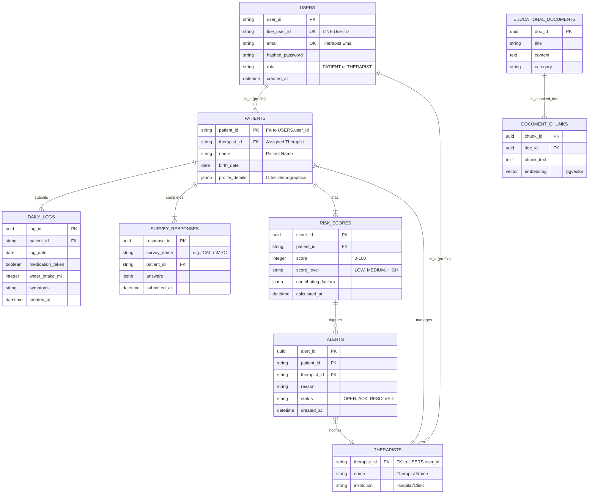

# RespiraAlly V2.0 整合性架構與設計文件

---

**文件版本:** v2.0
**最後更新:** 2025-10-17
**主要作者:** Claude Code AI - System Architect
**狀態:** 審核中 (Under Review)

---

## 1. 架構概述 (Architecture Overview)

### 1.1 系統背景與目標
- **問題域**: 本系統旨在解決慢性阻塞性肺病（COPD）患者在長期自我管理中面臨的挑戰，包括記錄繁瑣、缺乏即時回饋、衛教個人化不足等問題。同時，也致力於改善呼吸治療師的工作流程，解決其資料分散、風險追蹤耗時的痛點。
- **關鍵驅動力**:
  - **業務驅動力**: 提升 COPD 病患的健康行為依從率至 75% 以上，降低醫療機構的慢病管理成本與急診率。
  - **技術驅動力**: 從 V1 的 Flask 單體架構遷移至 FastAPI 微服務架構，引入 AI 語音互動、RAG 知識庫、事件驅動等現代技術，解決 V1 的技術債與擴展性問題。
  - **品質驅動力**: 追求高可用性 (99.5%)、高效能 (API P95 < 500ms)、高安全性和合規性 (符合台灣個資法)。

### 1.2 利益相關者與關注點
| 角色 | 關注點 | 優先級 |
|---|---|---|
| COPD 病患 | 功能易用性、互動即時性、隱私安全 | 高 |
| 呼吸治療師 | 工作效率、風險預警準確性、個案資料完整性 | 高 |
| 產品經理 | 功能完整性、北極星指標達成率、上線時程 | 高 |
| 開發團隊 | 可維護性、技術棧現代化、CI/CD 效率 | 高 |
| 運維團隊 | 可部署性、可監控性、系統穩定性 | 中 |
| 法務合規 | 個資法合規、醫療資訊安全 | 高 |

### 1.3 品質屬性權衡 (Quality Attributes)

| 品質屬性 | 目標 | 度量方式 | 優先級 | 權衡考量 |
|---|---|---|---|---|
| **可用性 (Availability)** | ≥99.5% uptime | Prometheus 監控 | P0 | vs 成本 (初期接受部分單點) |
| **性能 (Performance)** | API P95 < 500ms | Prometheus 監控 | P0 | vs 開發速度 (關鍵路徑優先優化) |
| **安全性 (Security)** | 零資料洩露 | 滲透測試、日誌稽核 | P0 | vs 易用性 (兼顧便利與安全) |
| **可維護性 (Maintainability)** | 新功能交付 < 2週 | Lead Time | P1 | vs 性能 (採用 Clean Arch) |
| **擴展性 (Scalability)** | 支援 500 CCU | 負載測試 (Locust) | P1 | vs 複雜度 (MVP 後再引入 K8s) |

**關鍵權衡決策**:
- **性能 vs 可維護性**: 選擇 Clean Architecture + 微服務，犧牲少量初始開發速度與性能，換取長期可維護性與團隊並行開發能力。
- **一致性 vs 可用性**: 核心交易（如問卷提交）採強一致性，非核心資料（如事件日誌）採最終一致性。
- **成本 vs 可用性**: MVP 階段部署於 Zeabur，接受部分元件單點故障風險 (如 RabbitMQ)，上線後再遷移至高可用的 K8s 叢集。

---

## 2. C4 模型 - 多層次視圖

### 2.1 Level 1: 系統上下文圖 (System Context)


**外部系統依賴分析**:
- **LINE Platform**: 高依賴，是病患唯一入口。需設計降級訊息與監控其服務狀態。
- **LLM Provider**: 中依賴，AI 互動核心。可降級為罐頭回覆或提示服務不可用，並設計可抽換不同 LLM Provider 的適配層。

### 2.2 Level 2: 容器圖 (Container Diagram)


**容器職責與技術選型理由**:
- **API Gateway (FastAPI)**: 使用 FastAPI 作為統一入口，可利用其 Middleware 實現認證、日誌等橫切關注點，並簡化前端路由。
- **微服務 (FastAPI)**: 按照業務邊界拆分服務，便於獨立開發、部署與擴展。FastAPI 的異步特性與 Pydantic 型別檢查能提升開發效率與系統性能。
- **PostgreSQL + pgvector**: 選擇成熟的 PostgreSQL 處理關聯性資料，並利用 pgvector 擴充套件，在 MVP 階段將向量儲存與結構化資料放在一起，簡化架構。
- **MongoDB**: 用於儲存半結構化的事件日誌，其靈活的 Schema 有利於快速迭代與擴展。
- **RabbitMQ**: 選擇成熟可靠的 RabbitMQ 處理 AI 語音等耗時的異步任務，解耦主服務與背景 Worker。

### 2.3 Level 3: 組件圖 (Component Diagram) - 以日誌服務為例


---

## 3. DDD 戰略設計 (Strategic Design)

### 3.1 界限上下文映射 (Context Mapping)


**上下文關係說明**:
- **Customer-Supplier**: 風險上下文是日誌與個案上下文的下游客戶，它依賴上游提供的資料模型進行計算。
- **Open Host Service**: 衛教上下文提供開放的 API 服務，讓通知等其他上下文可以查詢並使用其內容。

### 3.2 統一語言 (Ubiquitous Language)

| 業務術語 | 定義 | 所屬上下文 |
|---|---|---|
| 健康日誌 (Daily Log) | 病患每日提交的健康行為記錄，包含用藥、飲水等。 | 日誌上下文 |
| 依從率 (Adherence Rate) | 病患遵循醫囑（如每日用藥）的比例。 | 日誌上下文 |
| 風險分數 (Risk Score) | 基於多因子計算的病患健康風險量化指標 (0-100)。 | 風險上下文 |
| 預警 (Alert) | 當偵測到異常行為模式時，系統自動產生的提醒。 | 風險上下文 |
| 知識區塊 (Chunk) | 從衛教文章中拆分出用於向量檢索的最小單位。 | 衛教上下文 |

---

## 4. 架構分層 (Layered Architecture)

遵循 **Clean Architecture** 原則，嚴格執行依賴倒置：

```
┌─────────────────────────────────────────────────┐
│  表現層 (Presentation Layer)                    │
│  - FastAPI Routers                              │
│  - WebSocket Endpoints                          │
└───────────────────┬─────────────────────────────┘
                    │
┌───────────────────▼─────────────────────────────┐
│  應用層 (Application Layer)                     │
│  - Use Cases / Application Services             │
│  - DTOs, Request/Response Models (Pydantic)     │
│  - Orchestration & Transaction Control          │
└───────────────────┬─────────────────────────────┘
                    │
┌───────────────────▼─────────────────────────────┐
│  領域層 (Domain Layer) - 核心業務邏輯           │
│  - Entities, Value Objects                      │
│  - Aggregates, Domain Services & Events         │
│  - Business Rules & Invariants                  │
└───────────────────┬─────────────────────────────┘
                    │
┌───────────────────▼─────────────────────────────┐
│  基礎設施層 (Infrastructure Layer)              │
│  - Repositories (SQLAlchemy)                    │
│  - External Adapters (LINE, OpenAI)             │
│  - Message Queue Publishers/Consumers (Pika)    │
└─────────────────────────────────────────────────┘
```

**依賴規則**:
- 外層可依賴內層，內層絕不可依賴外層。
- 領域層是獨立的，不依賴任何外部框架。
- 基礎設施層通過實現應用層定義的接口（如 Repository Port），來完成依賴反轉。

---

## 5. 數據架構 (Data Architecture)

本章節詳述 RespiraAlly V2.0 的數據架構，包含核心數據模型、關鍵數據流、一致性策略以及數據生命週期管理，確保數據的完整性、可用性與合規性。

### 5.1 核心實體關係圖 (Core Entity-Relationship Diagram)

以下 ER 圖展示了系統中核心業務實體及其關係，這些實體主要儲存在 PostgreSQL 資料庫中。



**模型說明**:
- **USERS**: 統一儲存所有使用者（病患與治療師）的基礎認證資訊。`role` 欄位用於區分身份。
- **PATIENTS / THERAPISTS**: 分別儲存病患與治療師的詳細檔案資訊，並透過一對一關係關聯回 `USERS` 表。
- **DAILY_LOGS / SURVEY_RESPONSES**: 記錄病患的核心健康數據，是計算風險分數的基礎。
- **RISK_SCORES / ALERTS**: 風險引擎的產出，用於實現主動預警功能。
- **EDUCATIONAL_DOCUMENTS / DOCUMENT_CHUNKS**: RAG 服務的知識庫來源，`DOCUMENT_CHUNKS` 中的 `embedding` 欄位將由 `pgvector` 進行索引以實現高效相似度搜尋。

### 5.2 數據流圖 (Data Flow Diagram) - 病患提交日誌

此圖展示了系統中最核心的數據流之一：病患提交每日健康日誌後的處理流程。


### 5.3 數據一致性策略 (Data Consistency Strategy)

在分散式微服務架構中，我們根據業務場景選擇不同的一致性模型，以平衡系統的可用性、性能與數據準確性。

- **強一致性 (Strong Consistency) 場景**:
  - **用戶認證與授權**: 治療師登入、病患透過 LINE 登入時，必須立即讀取到最新的帳戶狀態與權限。
  - **核心數據寫入**: 病患提交健康日誌、問卷的核心寫入操作。系統必須確保數據成功持久化到 PostgreSQL 後才向用戶返回成功，避免數據遺失。此類操作將包裹在單一服務的資料庫事務中完成。

- **最終一致性 (Eventual Consistency) 場景**:
  - **風險分數計算**: 當日誌提交後，風險分數的更新是異步進行的。在短暫的時間窗口內（通常是毫秒到秒級），治療師看到的風險分數可能尚未反映最新的日誌，這是可接受的。
  - **觸發預警通知**: 同樣地，從風險分數更新到觸發預警並發送通知也是一個異步流程。
  - **跨服務數據同步**: 例如，更新病患基本資料後，相關的顯示名稱同步到其他服務的日誌記錄中，將透過事件傳遞，接受最終一致性。
  - **事件日誌寫入**: 寫入 MongoDB 的操作日誌與事件記錄，允許極短時間的延遲。

### 5.4 數據生命週期與合規 (Data Lifecycle and Compliance)

- **數據分類 (Data Classification)**:
  - **個人身份資訊 (PII)**: 病患姓名、LINE Profile、治療師 Email。
  - **受保護健康資訊 (PHI)**: 健康日誌、問卷答案、風險分數、症狀描述等。
  - **系統操作數據**: API 請求日誌、使用者操作事件。

- **數據儲存與加密 (Data Storage and Encryption)**:
  - **傳輸中加密 (In-Transit)**: 所有對外 API 與服務間通訊均強制使用 TLS 1.3 加密。
  - **靜態加密 (At-Rest)**: 所有在 Zeabur 平台上的託管資料庫 (PostgreSQL, MongoDB, Redis) 和物件儲存 (MinIO) 均啟用服務商提供的靜態加密功能。

- **數據保留策略 (Data Retention Policy)**:
  - **PHI 數據**: 根據台灣醫療法規，病歷資料（包含日誌、問卷）需至少保留 7 年。
  - **PII 數據**: 當病患或治療師帳號刪除時，其個人身份資訊將被匿名化處理，但保留去識別化的 PHI 數據用於統計分析。
  - **系統日誌 (MongoDB)**: 操作日誌與事件記錄將保留 18 個月，之後進行歸檔或刪除。

- **合規性考量 (Compliance Considerations)**:
  - 本系統設計遵循台灣**個人資料保護法（個資法）**的要求，確保數據的收集、處理、利用均獲得用戶明確同意，並提供用戶查詢、修改、刪除其個資的權利。

---

## 6. 部署架構 (Deployment Architecture) - MVP 階段


**部署特性 (MVP on Zeabur)**:
- **快速部署**: 利用 PaaS 平台 Zeabur 簡化部署流程，實現從 Git Push 到服務上線的自動化。
- **成本效益**: 初期使用託管服務，按需付費，避免過早投入大量基礎設施維護成本。
- **演進路徑**: 待業務成熟後，可將此架構平滑遷移至 Kubernetes (K8s) 叢集，以獲得更強的客製化能力與高可用性配置。

---

## 7. 關鍵設計與策略

### 7.1 治療師登入失敗鎖定策略
為防止惡意登入嘗試，認證服務 (`Auth Service`) 實作了帳號鎖定機制。
- **觸發條件**: 在 15 分鐘內，連續登入失敗 3 次。
- **鎖定時長**: 帳號將被鎖定 15 分鐘。
- **實現方式**: 使用 Redis 記錄指定帳號的失敗次數與時間戳，並設定 TTL (Time-To-Live) 自動過期。
- **對應 ADR**: [ADR-008](./adr/ADR-008-login-lockout-policy.md)

### 7.2 AI Worker 韌性設計
為確保 AI 語音處理流程的穩定性，AI Worker 採用了以下設計：
- **可靠任務佇列**: 使用 RabbitMQ，並為 `voice_tasks` 佇列啟用訊息持久化 (Durability) 與消費者確認 (Acknowledgements)，確保即使 Worker 重啟，任務也不會遺失。
- **指數退避重試**: 當 Worker 處理鏈中的任何一步（如呼叫外部 STT 或 LLM API）失敗時，任務將被拒絕並重新入隊。RabbitMQ 將根據指數退避策略延遲下一次投遞。
- **死信佇列 (Dead-Letter Queue)**: 在重試 3 次後仍然失敗的任務，將被自動路由到一個專門的死信佇列中，以便後續的人工介入分析，同時向系統管理員發送警報。

---

## 8. 架構決策記錄 (ADR)

關鍵 ADR 索引 (詳見 `docs/adr/` 目錄):

| ADR ID | 標題 | 狀態 | 連結 |
|--------|------|------|------|
| **ADR-001** | 採用 FastAPI 而非 Flask | 已決定 | [ADR-001](./adr/ADR-001-fastapi-vs-flask.md) |
| **ADR-002** | pgvector 作為初期向量庫 | 已決定 | [ADR-002](./adr/ADR-002-pgvector-for-vector-db.md) |
| **ADR-003** | MongoDB 儲存事件日誌 | 已決定 | [ADR-003](./adr/ADR-003-mongodb-for-event-logs.md) |
| **ADR-004** | LINE 為唯一病患入口 | 已決定 | [ADR-004](./adr/ADR-004-line-as-patient-entrypoint.md) |
| **ADR-005** | RabbitMQ 作為訊息佇列 | 已決定 | [ADR-005](./adr/ADR-005-rabbitmq-for-message-queue.md) |
| **ADR-006** | 三時段智慧提醒策略 | 已決定 | [ADR-006](./adr/ADR-006-reminder-strategy.md) |
| **ADR-007** | 擬人化孫女口吻訊息 | 已決定 | [ADR-007](./adr/ADR-007-message-tone.md) |
| **ADR-008** | 治療師登入失敗鎖定策略 | 已決定 | [ADR-008](./adr/ADR-008-login-lockout-policy.md) |

---

## 9. 蘇格拉底檢核 (Socratic Review)

完成架構設計後,回答以下關鍵問題以驗證架構的合理性:

### Q1: 品質屬性權衡

**問題**: 性能、安全、成本三者的優先級如何排序？為什麼？

**答**:
- **優先級排序**: 安全性 > 性能 > 成本
- **理由**:
  1. **安全性 (P0)**: 涉及患者醫療數據（PHI），任何洩露都可能造成法律責任與信任危機，不可妥協
  2. **性能 (P0)**: 患者使用體驗直接影響留存率（北極星指標：依從率 ≥75%），API P95 < 500ms 是及格線
  3. **成本 (P1)**: MVP 階段可接受較高單位成本，待驗證商業模式後再優化

**驗證方式**:
- **安全性**: 滲透測試、OWASP Top 10 檢查、定期安全審計
- **性能**: APM 監控（Prometheus + Grafana）、定期壓力測試（Locust）
- **成本**: 雲端賬單監控、設定成本告警閾值（月預算上限）

---

### Q2: 單點故障分析

**問題**: 系統中是否存在單點故障 (SPOF)？如果某個關鍵組件失效，系統如何降級？

**答**:

| 組件 | 是否 SPOF | 失效影響 | 降級策略 |
|------|-----------|----------|----------|
| **API Gateway** | ❌ (可水平擴展) | 部分請求失敗 | Zeabur 內建負載均衡器自動切換至健康實例 |
| **PostgreSQL Master** | ⚠️ 是（MVP 階段） | 寫入服務中斷 | 短期：手動切換至 Read Replica（RTO ~15 分鐘）<br/>長期：Patroni 自動 Failover |
| **Redis** | ❌ (Cluster Mode) | 部分緩存失效 | 降級為直接查詢 PostgreSQL（性能下降但不影響功能） |
| **RabbitMQ** | ⚠️ 是（MVP 階段） | AI 異步任務堆積 | AI 功能降級為同步模式（用戶等待時間增加至 15 秒內） |
| **LINE Platform** | ✅ 是（外部依賴） | 患者無法使用 LIFF | Phase 2 提供 Web 版本 Backup |
| **OpenAI API** | ✅ 是（外部依賴） | AI 語音功能失效 | 降級為預設回覆模板 + 人工客服轉接 |
| **MongoDB** | ❌ (Replica Set) | 事件日誌寫入失敗 | 允許短暫失敗，事件可重建（非關鍵路徑） |

**改進計畫**:
- **短期（2026 Q1）**: 建立 PostgreSQL 自動 Failover 機制（Patroni + etcd）
- **中期（2026 Q2）**: RabbitMQ Cluster Mode 部署（3 節點）
- **長期（2026 Q3）**: 考慮多雲部署（AWS + GCP）降低雲平台依賴

---

### Q3: 數據一致性

**問題**: 哪些場景需要強一致性？哪些可接受最終一致性？如何處理分布式事務？

**答**:

**強一致性場景** (ACID 事務):
1. **患者註冊**: 必須確保 LINE User ID 與 Patient ID 綁定唯一性（PostgreSQL UNIQUE 約束）
2. **健康日誌提交**: 每日僅一筆記錄（`UNIQUE(patient_id, log_date)`）
3. **問卷評分**: 評分結果需與答案原子性存儲（同一事務）
4. **治療師帳號鎖定**: 登入失敗計數必須準確（Redis INCR + TTL）

**最終一致性場景** (事件驅動):
1. **風險分數計算**: 允許數秒延遲，透過 `daily_log.submitted` 事件觸發異步計算
2. **異常預警通知**: 允許失敗重試，最終送達即可（RabbitMQ 持久化 + 確認機制）
3. **統計報表**: 允許數據延遲數分鐘，不影響核心功能
4. **AI 對話歷史**: MongoDB 寫入允許短暫延遲（非關鍵路徑）

**分布式事務處理 - Saga 模式**:

**範例：患者註冊流程**


**關鍵設計原則**:
- 每個服務僅管理自己的本地事務
- 透過領域事件實現跨服務協作
- 補償事務實現最終一致性（不使用兩階段提交 2PC）

---

### Q4: 演進性

**問題**: 未來需求變化時，哪些部分容易擴展？哪些是瓶頸？技術棧是否有升級或遷移計畫？

**答**:

**易於擴展部分** ✅:
1. **新增健康指標**: 透過 JSONB 欄位（`profile_details`）擴展，無需 Schema 變更
2. **新增問卷類型**: 透過策略模式（`SurveyScorer` 接口），新增評分演算法不影響現有代碼
3. **新增通知管道**: 透過 Adapter 模式（`NotificationAdapter`），可快速接入簡訊、Email、推播
4. **新增 AI 模型**: 透過 Adapter 模式（`LLMProvider`），可快速切換不同 LLM（OpenAI → Anthropic → Local）
5. **新增微服務**: FastAPI 模組化架構，新增服務不影響現有服務

**潛在瓶頸** ⚠️:
1. **AI 語音處理延遲**: 當前同步調用 OpenAI API（平均 10 秒），高並發時會阻塞
   - **解決方案**: Phase 2 改為異步批次處理（RabbitMQ Priority Queue）
2. **PostgreSQL 寫入瓶頸**: 當患者數達 10 萬+ 時，單一主庫可能成為瓶頸
   - **解決方案**: 垂直分庫（按服務拆分）或水平分表（按時間分區）
3. **LINE Messaging API 限流**: Push Message API 有速率限制（500 req/s）
   - **解決方案**: 實作訊息佇列 + Token Bucket 限流器
4. **pgvector 查詢效能**: 當知識庫達到 100 萬+ 向量時，IVFFlat 索引可能不夠
   - **解決方案**: 升級至 HNSW 索引或遷移至專用向量資料庫（Qdrant）

**技術棧升級計畫**:

| 技術 | 當前版本 | 目標版本 | 升級理由 | 計畫時程 |
|------|----------|----------|----------|----------|
| **Python** | 3.11 | 3.12 | 性能提升 ~5%、更好的型別提示 | 2026 Q2 |
| **FastAPI** | 0.109 | 最新穩定版 | 安全性更新、新特性 | 每季度 |
| **PostgreSQL** | 15 | 16 | 更好的分區表支持、性能優化 | 2026 Q3 |
| **Next.js** | 14 | 15 | Turbopack 穩定版、更快構建 | 2026 Q2 |
| **Redis** | 7 | 8 | Redis Stack 功能（RediSearch） | 2026 Q4 |
| **RabbitMQ** | 3 | 4 | 更好的 Streams 支持 | 2026 Q3 |

**架構演進路徑**:

```
Phase 1: MVP (2026 Q1)
├── Zeabur 單區域部署
├── PostgreSQL Master + Read Replica
└── RabbitMQ 單節點

↓

Phase 2: 優化 (2026 Q2-Q3)
├── Kubernetes 遷移（GKE / EKS）
├── PostgreSQL Patroni Cluster（自動 Failover）
├── RabbitMQ Cluster Mode（3 節點）
└── Redis Sentinel（高可用）

↓

Phase 3: 規模化 (2026 Q4+)
├── 多區域部署（台北 + 高雄）
├── Qdrant 向量資料庫（專用）
├── Kafka 替換 RabbitMQ（更高吞吐）
└── 自建 AI 模型（Whisper + LLaMA）
```

---

### Q5: 可觀測性

**問題**: 如何監控系統健康狀態？故障發生時，如何快速定位問題？

**答**:

**監控三支柱 (Three Pillars of Observability)**:

#### 1. Metrics (指標) - Prometheus + Grafana

**應用層指標**:
- **API 請求量**: `http_requests_total{method, endpoint, status}`
- **API 延遲**: `http_request_duration_seconds{method, endpoint, quantile="0.95"}`
- **錯誤率**: `http_requests_errors_total{method, endpoint}` / `http_requests_total`
- **業務指標**:
  - `daily_logs_submitted_total` (每日日誌提交數)
  - `ai_queries_total{status}` (AI 查詢數)
  - `risk_alerts_triggered_total{level}` (風險預警觸發數)

**系統層指標**:
- **CPU 使用率**: `node_cpu_usage_percent`
- **記憶體使用率**: `node_memory_usage_percent`
- **磁碟 I/O**: `node_disk_read_bytes_total`, `node_disk_write_bytes_total`
- **網路流量**: `node_network_receive_bytes_total`, `node_network_transmit_bytes_total`

**數據層指標**:
- **PostgreSQL**: Connection pool usage, query duration, replication lag
- **Redis**: Hit rate, memory usage, evicted keys
- **RabbitMQ**: Queue depth, consumer count, message rate

**告警規則 (Alerting Rules)**:

| 告警名稱 | 觸發條件 | 嚴重程度 | 通知方式 |
|----------|----------|----------|----------|
| API 高延遲 | P95 延遲 > 1 秒持續 5 分鐘 | P1 | Slack |
| API 高錯誤率 | 錯誤率 > 5% 持續 3 分鐘 | P0 | PagerDuty + Slack |
| 磁碟空間不足 | 磁碟使用率 > 85% | P1 | Email |
| PostgreSQL 連線池耗盡 | 可用連線 < 10% | P0 | PagerDuty |
| RabbitMQ 積壓 | 佇列深度 > 1000 持續 10 分鐘 | P1 | Slack |

#### 2. Logs (日誌) - Structlog + (未來) ELK Stack

**日誌級別**:
- **DEBUG**: 詳細診斷資訊（僅開發環境）
- **INFO**: 一般業務流程（如「患者 X 提交日誌」）
- **WARNING**: 可恢復的錯誤（如「Redis 連線失敗，降級為數據庫查詢」）
- **ERROR**: 需要注意的錯誤（如「OpenAI API 呼叫失敗」）
- **CRITICAL**: 嚴重錯誤（如「數據庫連線完全失效」）

**結構化日誌範例**:
```json
{
  "timestamp": "2025-10-17T10:30:15.123Z",
  "level": "INFO",
  "logger": "respira_ally.application.use_cases.create_health_log",
  "message": "Health log created successfully",
  "request_id": "req-abc123",
  "user_id": "patient-xyz789",
  "patient_id": "patient-xyz789",
  "log_date": "2025-10-17",
  "duration_ms": 45
}
```

**日誌保留策略**:
- **Hot Storage** (Elasticsearch): 30 天，快速查詢
- **Warm Storage** (S3): 90 天，歸檔壓縮
- **Cold Storage** (Glacier): 1 年，長期合規保留

#### 3. Traces (追蹤) - (未來) OpenTelemetry + Jaeger

**追蹤範圍**:
- 跨服務請求鏈路（API Gateway → 患者服務 → PostgreSQL）
- 異步任務鏈路（RabbitMQ → AI Worker → OpenAI API）
- 關鍵業務流程（患者註冊、日誌提交、風險計算）

**採樣策略**:
- **生產環境**: 10% 採樣（降低開銷）
- **測試環境**: 100% 採樣（完整追蹤）
- **關鍵路徑**: 100% 採樣（如風險預警流程）

---

**故障定位流程 (Incident Response)**:


**平均故障恢復時間 (MTTR) 目標**:
- **P0 故障**（服務完全不可用）: MTTR < 30 分鐘
- **P1 故障**（功能異常）: MTTR < 2 小時
- **P2 故障**（性能下降）: MTTR < 4 小時

**事後檢討範本 (Post-Mortem Template)**:
```markdown
# 事故報告 - [標題]

## 時間軸
- 10:30 - 系統檢測到異常（API 錯誤率 15%）
- 10:35 - PagerDuty 告警觸發
- 10:40 - 工程師開始調查
- 11:00 - 確認根本原因（PostgreSQL 連線池耗盡）
- 11:15 - 部署修復（增加連線池上限）
- 11:30 - 服務恢復正常

## 根本原因
- 新功能部署後，查詢頻率增加 3 倍
- 連線池配置（max=50）未隨之調整
- 缺乏連線池使用率監控告警

## 影響範圍
- 持續時間: 60 分鐘
- 受影響用戶: ~200 位患者（15% 請求失敗）
- 數據丟失: 無

## 修復措施
1. 立即: 增加連線池上限至 100
2. 短期: 新增連線池使用率告警
3. 長期: 實作自動擴展機制

## 經驗教訓
- 部署前未進行負載測試
- 缺乏容量規劃
- 需建立 Runbook 文件
```

---

## 10. 審查清單 (Architecture Review Checklist)

在完成架構設計後，請確認以下檢查項：

- [x] **C4 模型完整性**: 包含 Level 1 (Context) 和 Level 2 (Container)，清楚展示系統邊界與容器職責
- [x] **品質屬性可度量**: 所有品質屬性（可用性、性能、安全性）都有明確的目標值與度量方式
- [x] **技術選型有理由**: 每個關鍵技術選型都有對應的 ADR 文件說明理由與權衡
- [x] **界限上下文清晰**: DDD 戰略設計中的上下文邊界明確，上下文間關係清楚標示
- [x] **數據模型合理**: 數據模型遵循正規化原則，ER 圖清楚展示實體關係
- [x] **一致性策略明確**: 清楚區分強一致性與最終一致性的使用場景
- [x] **SPOF 識別與降級**: 識別所有單點故障，並提供降級策略與改進計畫
- [x] **演進性考量**: 識別易擴展部分與潛在瓶頸，提供技術棧升級計畫
- [x] **可觀測性設計**: 包含 Metrics, Logs, Traces 三支柱，定義告警規則與故障定位流程
- [x] **合規性考量**: 數據分類、加密、保留策略符合台灣個資法要求

---

## 11. 關聯文件 (Related Documents)

- **需求來源**: [02_product_requirements_document.md](./02_product_requirements_document.md) - 產品需求文件
- **決策記錄**: [adr/](./adr/) - 架構決策記錄目錄
- **API 設計**: [06_api_design_specification.md](./06_api_design_specification.md) - API 規範文件（待建立）
- **模組規範**: [07_module_specification_and_tests.md](./07_module_specification_and_tests.md) - 模組設計文件（待建立）
- **BDD 場景**: [bdd/](./bdd/) - 行為驅動開發場景
- **專案 README**: [../PROJECT_README.md](../PROJECT_README.md) - 專案總覽文件
- **WBS 計畫**: [WBS_DEVELOPMENT_PLAN.md](./WBS_DEVELOPMENT_PLAN.md) - 工作分解結構與時程

---

## 附錄 A: 技術選型對照表

| 需求 | 候選方案 | 最終決策 | 決策依據 |
|------|----------|----------|----------|
| **Web 框架** | Flask vs FastAPI | FastAPI | ADR-001: 異步支持、自動文檔、型別檢查 |
| **數據庫** | PostgreSQL vs MySQL | PostgreSQL | 成熟穩定、pgvector 擴展、JSON 支持 |
| **向量資料庫** | Pinecone vs Qdrant vs pgvector | pgvector | ADR-002: MVP 簡化架構、成本低 |
| **事件日誌** | MongoDB vs Elasticsearch | MongoDB | ADR-003: Schema-less、易於查詢 |
| **消息隊列** | RabbitMQ vs Kafka | RabbitMQ | ADR-005: 團隊熟悉、足夠滿足需求 |
| **緩存** | Redis vs Memcached | Redis | 數據結構豐富、持久化支持 |
| **前端框架** | Next.js vs Remix | Next.js | 生態成熟、SSR 性能優秀 |
| **LLM Provider** | OpenAI vs Anthropic | OpenAI | 文檔完善、社群支持強 |
| **部署平台** | Zeabur vs Railway vs Fly.io | Zeabur | 台灣在地服務、中文支持 |

---

## 附錄 B: 縮寫與術語表

| 縮寫 / 術語 | 全稱 / 解釋 |
|-------------|------------|
| **COPD** | Chronic Obstructive Pulmonary Disease (慢性阻塞性肺病) |
| **PHI** | Protected Health Information (受保護健康資訊) |
| **PII** | Personal Identifiable Information (個人身份資訊) |
| **RAG** | Retrieval-Augmented Generation (檢索增強生成) |
| **STT** | Speech-To-Text (語音轉文字) |
| **TTS** | Text-To-Speech (文字轉語音) |
| **LLM** | Large Language Model (大型語言模型) |
| **JWT** | JSON Web Token (JSON 網頁令牌) |
| **RBAC** | Role-Based Access Control (角色基礎存取控制) |
| **DDD** | Domain-Driven Design (領域驅動設計) |
| **CQRS** | Command Query Responsibility Segregation (命令查詢職責分離) |
| **SPOF** | Single Point of Failure (單點故障) |
| **MTTR** | Mean Time To Repair (平均故障恢復時間) |
| **RTO** | Recovery Time Objective (恢復時間目標) |
| **RPO** | Recovery Point Objective (恢復點目標) |
| **APM** | Application Performance Monitoring (應用性能監控) |

---

**記住**: 架構是為業務目標服務的，好的架構平衡了當前需求與未來演進，是團隊共識的結晶。本文件將隨著專案演進持續更新。

**文件結束**
