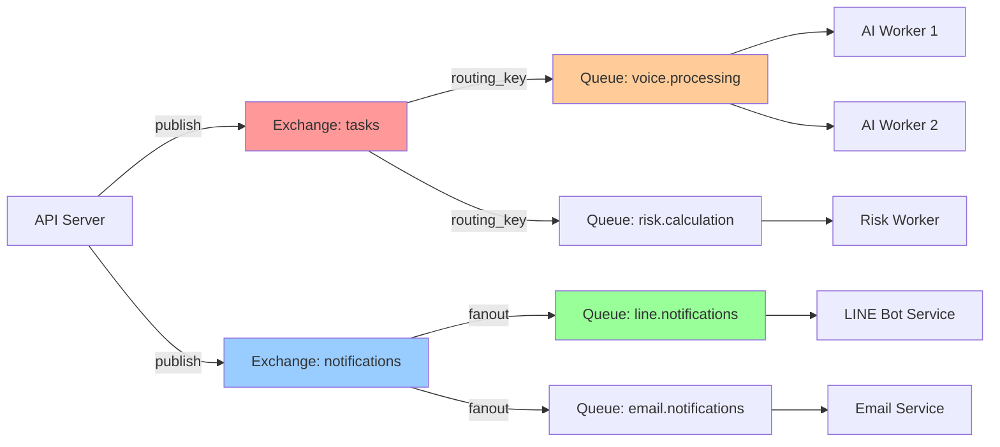

# RespiraAlly API 設計規範

---

**文件版本:** `v1.0.0`
**最後更新:** `2025-10-18`
**主要作者:** `Claude Code AI`
**狀態:** `草稿 (Draft)`

**相關文檔:**
- **系統架構:** [./05_architecture_and_design.md](./05_architecture_and_design.md) - 整體架構設計
- **資料庫設計:** [./DATABASE_SCHEMA_DESIGN.md](./DATABASE_SCHEMA_DESIGN.md) - 資料庫結構與設計
- **前端架構:** [./12_frontend_architecture_specification.md](./12_frontend_architecture_specification.md) - 前端技術棧與規範
- **前端信息架構:** [./17_frontend_information_architecture_template.md](./17_frontend_information_architecture_template.md) - 前端頁面結構與路由
- **OpenAPI 定義文件:** `(待建立)`

---

## 1. 引言 (Introduction)

### 1.1 目的
為 `RespiraAlly V2.0` 的**後端服務**提供統一、明確、易於遵循的 **API 接口契約**，定義後端 FastAPI 應用的所有 HTTP/WebSocket 端點、請求/回應格式、認證授權機制、錯誤處理策略,確保前端與後端間的高效協作。

**本文檔專注於後端服務責任:**
- ✅ 後端 API 端點設計 (RESTful API、WebSocket)
- ✅ 請求/回應數據模型 (Pydantic Schemas)
- ✅ 認證授權機制 (JWT、RBAC)
- ✅ 錯誤處理與狀態碼
- ✅ 後端性能要求 (P95 < 500ms)

**本文檔不包含:**
- ❌ 前端 UI/UX 設計 (參考前端架構文件)
- ❌ 前端頁面路由 (參考 17_frontend_information_architecture_template.md)
- ❌ 前端狀態管理 (參考 12_frontend_architecture_specification.md)

**架構說明**: 基於 [ARCHITECTURE_REVIEW.md](./ARCHITECTURE_REVIEW.md) 的建議，**MVP 階段 (Phase 0-2) 採用 Modular Monolith 架構**，所有業務模組（auth, patients, daily_logs, voice 等）運行在同一個 FastAPI 應用實例中。Phase 3 後可根據實際需求拆分為微服務。

### 1.2 快速入門
*   **第 1 步: 獲取 Access Token**
    *   治療師通過 `POST /auth/token` 端點使用 Email 和密碼登入獲取。
    *   病患通過 LINE LIFF 登入流程自動獲取。
*   **第 2 步: 發送您的第一個請求**
    ```bash
    curl -X GET 'https://api.respira.ally/v1/health' \
    -H 'Authorization: Bearer YOUR_ACCESS_TOKEN'
    ```
*   **預期回應:**
    ```json
    { "status": "ok" }
    ```

---

## 2. 設計原則與約定

### 2.1 API 風格
*   **風格:** RESTful API。
*   **核心原則:** 資源導向、無狀態、標準 HTTP 方法。

### 2.2 基本 URL
*   **生產環境:** `https://api.respira.ally/v1`
*   **預備環境:** `https://staging-api.respira.ally/v1`

### 2.3 請求與回應格式
*   **格式:** `application/json` (UTF-8 編碼)。

### 2.4 標準 HTTP Headers
*   **所有請求:**
    *   `Authorization: Bearer <access_token>`: 包含認證用的 JWT。
    *   `X-Request-ID`: 用於追蹤請求的唯一 ID (UUID)。
*   **所有回應:**
    *   `X-Request-ID`: 從請求傳入或由伺服器生成的唯一 ID。
*   **冪等性請求 (POST):**
    *   `Idempotency-Key`: 用於保證 POST 請求的冪等性。

### 2.5 命名約定
*   **資源路徑:** 小寫，多個單詞用連字符 `-` 連接，名詞複數形式 (e.g., `/daily-logs`)。
*   **JSON 欄位 & 查詢參數:** `snake_case` (e.g., `patient_id`, `page_size`)。

### 2.6 日期與時間格式
*   所有日期時間字段均使用 **ISO 8601** 格式，並包含 UTC 時區標識 (e.g., `2025-10-16T12:00:00Z`)。

---

## 3. 認證與授權

*   **認證機制:** JWT (JSON Web Tokens)。Access Token 有效期 8 小時，Refresh Token 有效期 30 天。
*   **授權模型:** 基於角色的訪問控制 (RBAC)。定義的角色至少包括 `patient`, `therapist`, `admin`。部分端點會檢查資源所有權（例如，病患只能存取自己的日誌）。

---

## 4. 通用 API 行為

### 4.1 分頁
*   **策略:** 基於偏移量 (Offset-based) 的分頁。
*   **查詢參數:** `skip` (預設 0), `limit` (預設 20，最大 100)。
*   **回應結構:**
    ```json
    {
      "total": 120,
      "items": [ ... ],
      "skip": 0,
      "limit": 20
    }
    ```

### 4.2 排序
*   **查詢參數:** `sort_by` (e.g., `sort_by=-risk_score` 表示按風險分數降序)。

### 4.3 過濾
*   直接使用欄位名作為查詢參數 (e.g., `/patients?risk_bucket=high`)。

---

## 5. 錯誤處理

### 5.1 標準錯誤回應格式
```json
{
  "detail": {
    "type": "validation_error",
    "code": "parameter_missing",
    "message": "Field required",
    "loc": ["body", "name"]
  }
}
```
*註: 此結構遵循 FastAPI 的預設錯誤格式。*

### 5.2 通用 HTTP 狀態碼
*   `200 OK`, `201 Created`, `204 No Content`
*   `400 Bad Request`, `401 Unauthorized`, `403 Forbidden`, `404 Not Found`
*   `500 Internal Server Error`

---

## 6. API 端點詳述

### 6.1 資源：認證 (Auth)

#### `POST /auth/register` (病患註冊)
*   **描述:** 透過 LINE LIFF 註冊新病患。
*   **請求體:** `PatientCreate`
*   **成功回應 (201 Created):** `TokenResponse`

#### `POST /auth/token` (治療師登入)
*   **描述:** 治療師使用 Email/密碼登入獲取 Token。
*   **請求體:** `OAuth2PasswordRequestForm`
*   **成功回應 (200 OK):** `TokenResponse`

### 6.2 資源：日誌 (Daily Logs)

*   **資源路徑:** `/daily-logs`

#### `POST /daily-logs` (提交日誌)
*   **描述:** 病患提交當日的健康日誌。若當日已存在記錄，則更新。
*   **授權:** `patient` 角色，且為資源所有者。
*   **請求體:** `DailyLogCreate`
*   **成功回應 (201 Created 或 200 OK):** `DailyLog`
*   **冪等性:** 支持。

### 6.3 資源：病患 (Patients)

*   **資源路徑:** `/patients`

#### `GET /patients` (查詢病患列表)
*   **描述:** 治療師查詢其負責的病患列表，支援篩選、排序、分頁。
*   **授權:** `therapist` 角色。
*   **查詢參數:** `risk_bucket`, `adherence_rate_lte`, `last_active_gte`, `sort_by`, `skip`, `limit`
*   **成功回應 (200 OK):** `PatientListResponse`

#### `GET /patients/{patient_id}` (查詢病患 360° 檔案)
*   **描述:** 治療師查詢單一病患的完整檔案。
*   **授權:** `therapist` 角色，且為該病患的負責人。
*   **成功回應 (200 OK):** `Patient360`

#### `GET /patients/{patient_id}/kpis` (查詢病患 KPI)
*   **描述:** 查詢病患的 KPI 快取資料 (依從率、健康指標、最新問卷等)。
*   **授權:** `patient` (自己) 或 `therapist` (負責該病患)。
*   **查詢參數:**
    *   `refresh` (可選): 若為 `true`,先刷新 KPI 快取再返回
*   **成功回應 (200 OK):** `PatientKPI`
*   **性能要求:** < 50ms (直接查詢 patient_kpi_cache 表)

#### `GET /patients/{patient_id}/health-timeline` (查詢健康時間序列)
*   **描述:** 查詢病患的每日健康數據時間序列 (用於前端折線圖)。
*   **授權:** `patient` (自己) 或 `therapist` (負責該病患)。
*   **查詢參數:**
    *   `days` (可選): 返回近 N 天數據,預設 30,最大 90
    *   `include_ma` (可選): 是否包含移動平均線,預設 true
*   **成功回應 (200 OK):** `List[TrendPoint]`
*   **性能要求:** < 300ms (查詢 patient_health_timeline 視圖)

#### `GET /patients/{patient_id}/survey-trends` (查詢問卷趨勢)
*   **描述:** 查詢病患的 CAT/mMRC 問卷歷史趨勢。
*   **授權:** `patient` (自己) 或 `therapist` (負責該病患)。
*   **查詢參數:**
    *   `survey_type` (可選): 篩選問卷類型 ("CAT" 或 "mMRC"),不提供則返回所有
    *   `limit` (可選): 最多返回 N 筆,預設 10
*   **成功回應 (200 OK):** `List[SurveyTrend]`

#### `POST /patients/{patient_id}/kpis/refresh` (刷新病患 KPI 快取)
*   **描述:** 手動觸發 KPI 快取刷新 (調用 `refresh_patient_kpi_cache` 存儲過程)。
*   **授權:** `therapist` 角色。
*   **成功回應 (200 OK):**
    ```json
    {
      "message": "KPI cache refreshed successfully",
      "patient_id": "patient-uuid",
      "refreshed_at": "2025-10-18T10:30:00Z"
    }
    ```

### 6.4 資源：語音 (Voice)

*   **資源路徑:** `/voice`

#### `POST /voice/upload` (上傳語音)
*   **描述:** 病患上傳語音檔案以進行 AI 提問。此為異步處理。
*   **授權:** `patient` 角色。
*   **請求:** `multipart/form-data`，包含音訊檔案。
*   **成功回應 (202 Accepted):**
    ```json
    {
      "task_id": "some-unique-task-id",
      "status": "processing",
      "websocket_url": "wss://api.respira.ally/v1/ws/voice/some-unique-task-id"
    }
    ```

#### `WS /ws/voice/{task_id}` (接收語音處理結果)
*   **描述:** 用於接收語音任務處理結果的 WebSocket 端點。

---

## 6.5 非同步處理: RabbitMQ 訊息格式 (Asynchronous Processing: RabbitMQ Message Formats)

### 6.5.1 概述 (Overview)

RespiraAlly V2.0 使用 **RabbitMQ** 作為訊息佇列 (Message Queue) 來實作**非同步任務處理**與**事件驅動架構**。這確保了:
- ✅ **低延遲回應**: API 立即回應 202 Accepted，任務在背景執行
- ✅ **可靠性**: 訊息持久化，Worker 崩潰後可重試
- ✅ **水平擴展**: 多個 Worker 並行處理訊息
- ✅ **解耦**: API Server 與 AI Worker 透過訊息佇列解耦

**架構參考**: 詳見 [ADR-005: RabbitMQ for Message Queue](./adr/ADR-005-rabbitmq-for-message-queue.md)

**RabbitMQ 拓撲結構** (Topology):



### 6.5.2 訊息格式標準 (Message Format Standard)

所有 RabbitMQ 訊息遵循統一的 JSON 格式:

```python
class BaseMessage(BaseModel):
    """所有訊息的基礎模型"""
    task_id: str  # UUID v4, 用於追蹤與冪等性
    task_type: str  # 任務類型 (voice_processing, risk_calculation, notification)
    created_at: datetime  # 訊息建立時間 (ISO 8601 UTC)
    retry_count: int = 0  # 重試次數
    payload: Dict[str, Any]  # 任務特定資料
```

**訊息屬性 (Message Properties)**:

| 屬性 | 值 | 說明 |
|------|-----|------|
| `content_type` | `application/json` | 訊息格式 |
| `delivery_mode` | `2` (persistent) | 持久化 (重啟後保留) |
| `priority` | `0-9` (預設 5) | 優先級 (緊急任務設為 9) |
| `expiration` | `300000` (5min, ms) | 訊息過期時間 (避免積壓) |
| `message_id` | UUID v4 | 訊息唯一識別 (同 task_id) |
| `timestamp` | Unix timestamp | 發送時間戳 |
| `app_id` | `respira-api` | 發送方應用 |

---

### 6.5.3 任務佇列 (Task Queues)

#### 6.5.3.1 語音處理任務 (Voice Processing Task)

**Exchange**: `tasks` (Direct Exchange)
**Queue**: `voice.processing`
**Routing Key**: `voice.process`
**Concurrency**: 最多 3 個 Worker 並行處理
**Retry Policy**: 最多重試 3 次,指數退避 (30s, 60s, 120s)

**訊息格式 (Message Format)**:

```python
class VoiceProcessingTask(BaseModel):
    task_id: str  # UUID, 用於追蹤與冪等性
    task_type: Literal["voice_processing"]
    created_at: datetime
    retry_count: int = 0
    payload: VoiceTaskPayload

class VoiceTaskPayload(BaseModel):
    """語音處理任務負載"""
    # 使用者資訊
    user_id: str  # 病患 LINE User ID
    patient_id: int  # 資料庫主鍵 (選填,Worker 可自行查詢)

    # 音檔資訊
    audio_id: str  # 音檔唯一識別 (用於冪等性鎖)
    audio_url: str  # MinIO 儲存桶 URL
    audio_duration_ms: int  # 音檔長度 (毫秒)
    audio_format: Literal["webm", "ogg", "m4a", "wav"]  # 音檔格式

    # 處理選項
    enable_memory: bool = True  # 是否啟用記憶檢索
    enable_rag: bool = True  # 是否啟用 RAG 知識庫
    is_partial: bool = False  # 是否為部分語音 (串流模式)

    # WebSocket 通知
    ws_connection_id: Optional[str] = None  # WebSocket 連線 ID (用於即時推送結果)

    # 優先級提示
    is_emergency: bool = False  # 是否為緊急通報
```

**發送範例 (Publishing Example)**:

```python
import pika
import json
from datetime import datetime, timezone
from uuid import uuid4

def publish_voice_task(
    user_id: str,
    audio_id: str,
    audio_url: str,
    audio_duration_ms: int
):
    """發布語音處理任務到 RabbitMQ"""
    connection = pika.BlockingConnection(
        pika.ConnectionParameters(host='rabbitmq')
    )
    channel = connection.channel()

    # 宣告 Exchange 與 Queue (冪等操作)
    channel.exchange_declare(
        exchange='tasks',
        exchange_type='direct',
        durable=True
    )
    channel.queue_declare(
        queue='voice.processing',
        durable=True,
        arguments={
            'x-max-priority': 10,  # 啟用優先級佇列
            'x-message-ttl': 300000  # 5min TTL
        }
    )
    channel.queue_bind(
        queue='voice.processing',
        exchange='tasks',
        routing_key='voice.process'
    )

    # 組裝訊息
    task_id = str(uuid4())
    message = {
        "task_id": task_id,
        "task_type": "voice_processing",
        "created_at": datetime.now(timezone.utc).isoformat(),
        "retry_count": 0,
        "payload": {
            "user_id": user_id,
            "audio_id": audio_id,
            "audio_url": audio_url,
            "audio_duration_ms": audio_duration_ms,
            "audio_format": "webm",
            "enable_memory": True,
            "enable_rag": True,
            "is_partial": False,
            "ws_connection_id": None,
            "is_emergency": False
        }
    }

    # 發送訊息
    channel.basic_publish(
        exchange='tasks',
        routing_key='voice.process',
        body=json.dumps(message, ensure_ascii=False),
        properties=pika.BasicProperties(
            content_type='application/json',
            delivery_mode=2,  # persistent
            priority=5,
            message_id=task_id,
            timestamp=int(datetime.now().timestamp()),
            app_id='respira-api'
        )
    )

    connection.close()
    return task_id
```

**消費範例 (Consuming Example)**:

```python
def process_voice_task(ch, method, properties, body):
    """AI Worker 消費語音任務"""
    try:
        # 1. 解析訊息
        task = json.loads(body)
        task_id = task['task_id']
        payload = task['payload']

        # 2. 檢查冪等性 (音檔級鎖)
        lock_id = f"{payload['user_id']}#audio:{payload['audio_id']}"
        if not acquire_audio_lock(lock_id, ttl_sec=180):
            logger.warning(f"Task {task_id} already processing, skipping")
            ch.basic_ack(delivery_tag=method.delivery_tag)
            return

        # 3. 執行 STT → LLM → TTS 管道
        try:
            result = voice_pipeline(
                user_id=payload['user_id'],
                audio_id=payload['audio_id'],
                audio_url=payload['audio_url'],
                enable_memory=payload['enable_memory'],
                enable_rag=payload['enable_rag']
            )

            # 4. 發送成功通知
            publish_notification({
                "user_id": payload['user_id'],
                "type": "voice_response",
                "data": {"text": result['text'], "audio_url": result['audio_url']}
            })

            # 5. ACK 訊息
            ch.basic_ack(delivery_tag=method.delivery_tag)

        finally:
            release_audio_lock(lock_id)

    except Exception as e:
        logger.error(f"Voice task {task_id} failed: {e}")

        # 6. 重試邏輯 (最多 3 次)
        if task['retry_count'] < 3:
            # NACK with requeue (指數退避由 RabbitMQ DLX 處理)
            ch.basic_nack(delivery_tag=method.delivery_tag, requeue=False)
        else:
            # 超過重試次數,發送失敗通知
            publish_notification({
                "user_id": payload['user_id'],
                "type": "voice_error",
                "data": {"error": "處理失敗,請稍後再試"}
            })
            ch.basic_ack(delivery_tag=method.delivery_tag)

# 啟動消費者
channel.basic_qos(prefetch_count=1)  # 每次只處理 1 個任務 (避免過載)
channel.basic_consume(
    queue='voice.processing',
    on_message_callback=process_voice_task,
    auto_ack=False
)
channel.start_consuming()
```

#### 6.5.3.2 風險計算任務 (Risk Calculation Task)

**Exchange**: `tasks`
**Queue**: `risk.calculation`
**Routing Key**: `risk.calculate`
**觸發時機**: 每當病患提交健康日誌或問卷後觸發

**訊息格式**:

```python
class RiskCalculationTask(BaseModel):
    task_id: str
    task_type: Literal["risk_calculation"]
    created_at: datetime
    retry_count: int = 0
    payload: RiskTaskPayload

class RiskTaskPayload(BaseModel):
    patient_id: int  # 病患 ID
    trigger_event: Literal["daily_log", "survey", "manual"]  # 觸發事件
    event_id: int  # 觸發事件的 ID (daily_log_id 或 survey_id)
    calculate_type: Literal["incremental", "full_recalc"]  # 增量或完整重算
```

**發送範例**:

```python
def publish_risk_calculation(patient_id: int, trigger_event: str, event_id: int):
    """發布風險計算任務"""
    task_id = str(uuid4())
    message = {
        "task_id": task_id,
        "task_type": "risk_calculation",
        "created_at": datetime.now(timezone.utc).isoformat(),
        "retry_count": 0,
        "payload": {
            "patient_id": patient_id,
            "trigger_event": trigger_event,
            "event_id": event_id,
            "calculate_type": "incremental"
        }
    }

    channel.basic_publish(
        exchange='tasks',
        routing_key='risk.calculate',
        body=json.dumps(message),
        properties=pika.BasicProperties(
            content_type='application/json',
            delivery_mode=2,
            priority=7,  # 風險計算優先級較高
            message_id=task_id
        )
    )
    return task_id
```

---

### 6.5.4 通知佇列 (Notification Queues)

#### 6.5.4.1 LINE 通知 (LINE Notifications)

**Exchange**: `notifications` (Fanout Exchange - 廣播模式)
**Queue**: `line.notifications`
**用途**: 發送 LINE 推播訊息給病患

**訊息格式**:

```python
class LineNotification(BaseModel):
    notification_id: str  # UUID
    notification_type: Literal["line_push"]
    created_at: datetime
    payload: LineNotificationPayload

class LineNotificationPayload(BaseModel):
    user_id: str  # LINE User ID
    message_type: Literal[
        "voice_response",  # 語音回應
        "daily_reminder",  # 每日提醒
        "risk_alert",  # 風險警報
        "system_message"  # 系統訊息
    ]
    data: Dict[str, Any]  # 訊息特定資料

    # LINE 推播選項
    priority: int = 5  # 1-10, 10 為最高優先級
    notification_disabled: bool = False  # 是否靜音通知
```

**發送範例**:

```python
def publish_line_notification(
    user_id: str,
    message_type: str,
    data: Dict[str, Any],
    priority: int = 5
):
    """發布 LINE 通知"""
    notification_id = str(uuid4())
    message = {
        "notification_id": notification_id,
        "notification_type": "line_push",
        "created_at": datetime.now(timezone.utc).isoformat(),
        "payload": {
            "user_id": user_id,
            "message_type": message_type,
            "data": data,
            "priority": priority,
            "notification_disabled": False
        }
    }

    channel.basic_publish(
        exchange='notifications',
        routing_key='',  # Fanout 不需要 routing key
        body=json.dumps(message, ensure_ascii=False),
        properties=pika.BasicProperties(
            content_type='application/json',
            delivery_mode=2,
            priority=priority,
            message_id=notification_id
        )
    )
    return notification_id

# 使用範例: 發送語音回應通知
publish_line_notification(
    user_id="U1234567890abcdef",
    message_type="voice_response",
    data={
        "text": "阿公早安,今天有比較好嗎?",
        "audio_url": "https://storage.respira.ally/audio/response_123.m4a"
    },
    priority=8
)

# 使用範例: 發送風險警報
publish_line_notification(
    user_id="U1234567890abcdef",
    message_type="risk_alert",
    data={
        "alert_level": "HIGH",
        "alert_reason": "3天未服藥且呼吸困難加劇",
        "action_required": "請盡快聯絡您的呼吸治療師"
    },
    priority=10  # 最高優先級
)
```

#### 6.5.4.2 Email 通知 (Email Notifications)

**Exchange**: `notifications`
**Queue**: `email.notifications`
**用途**: 發送 Email 給治療師 (如緊急通報)

**訊息格式**:

```python
class EmailNotification(BaseModel):
    notification_id: str
    notification_type: Literal["email"]
    created_at: datetime
    payload: EmailNotificationPayload

class EmailNotificationPayload(BaseModel):
    to: List[str]  # 收件者 Email 列表
    subject: str  # 主旨
    body_html: str  # HTML 內容
    body_text: str  # 純文字內容 (fallback)
    priority: Literal["low", "normal", "high", "urgent"]
    attachments: List[str] = []  # 附件 URL 列表
```

**發送範例**:

```python
# 緊急通報: 病患觸發自殺警報
publish_email_notification(
    to=["therapist@hospital.com"],
    subject="【緊急】病患 A 觸發自殺警報",
    body_html="""
    <h2>緊急通報</h2>
    <p>病患: 王小明 (ID: 123)</p>
    <p>警報原因: 檢測到自殺計畫意圖</p>
    <p>原始訊息: "我打算今晚結束這一切"</p>
    <p>請立即聯絡病患並評估風險</p>
    """,
    priority="urgent"
)
```

---

### 6.5.5 死信佇列 (Dead Letter Queue, DLQ)

**用途**: 處理失敗且無法重試的訊息,避免阻塞主佇列

**設定範例**:

```python
# 宣告主佇列時設定 DLX
channel.queue_declare(
    queue='voice.processing',
    durable=True,
    arguments={
        'x-dead-letter-exchange': 'dlx',  # 死信 Exchange
        'x-dead-letter-routing-key': 'voice.failed',  # 死信 Routing Key
        'x-max-priority': 10
    }
)

# 宣告死信佇列
channel.exchange_declare(exchange='dlx', exchange_type='direct', durable=True)
channel.queue_declare(queue='voice.processing.dlq', durable=True)
channel.queue_bind(
    queue='voice.processing.dlq',
    exchange='dlx',
    routing_key='voice.failed'
)
```

**DLQ 監控與處理**:

```python
def monitor_dlq():
    """定期檢查 DLQ,記錄錯誤並通知維運團隊"""
    dlq_length = channel.queue_declare(
        queue='voice.processing.dlq',
        passive=True  # 僅查詢,不建立
    ).method.message_count

    if dlq_length > 10:
        # 發送告警到 Slack/Email
        send_alert(f"DLQ 積壓 {dlq_length} 則訊息,請檢查 Worker 健康狀態")

# Cron Job: 每 5 分鐘檢查一次
# */5 * * * * python monitor_dlq.py
```

---

### 6.5.6 訊息追蹤與除錯 (Message Tracing & Debugging)

**RabbitMQ Management Plugin**:
- **URL**: `http://rabbitmq:15672`
- **功能**: 即時查看佇列長度、訊息速率、Consumer 狀態

**分散式追蹤 (Distributed Tracing)**:

使用 **OpenTelemetry** + **Jaeger** 追蹤訊息流:

```python
from opentelemetry import trace
from opentelemetry.propagate import inject

tracer = trace.get_tracer(__name__)

def publish_with_tracing(message: Dict):
    """發布訊息並注入 Trace Context"""
    with tracer.start_as_current_span("publish_voice_task") as span:
        # 注入 Trace Context 到訊息 headers
        headers = {}
        inject(headers)

        channel.basic_publish(
            exchange='tasks',
            routing_key='voice.process',
            body=json.dumps(message),
            properties=pika.BasicProperties(
                headers=headers,  # 傳遞 Trace ID
                content_type='application/json',
                delivery_mode=2
            )
        )

        span.set_attribute("task_id", message['task_id'])
        span.set_attribute("user_id", message['payload']['user_id'])
```

---

### 6.5.7 效能最佳化建議 (Performance Optimization Tips)

| 最佳化項目 | 建議 | 預期效果 |
|-----------|------|----------|
| **Prefetch Count** | 設定為 1 (避免 Worker 過載) | 平衡負載分配 |
| **Connection Pooling** | 使用連線池 (如 pika pool) | 減少連線開銷 |
| **Batch Publishing** | 批次發送 (每 100 則或每 1s) | 提升吞吐量 30% |
| **Message Compression** | 大訊息使用 gzip 壓縮 | 減少網路傳輸 50% |
| **TTL 設定** | 設定合理的 TTL (如 5min) | 避免訊息積壓 |
| **Lazy Queue** | 大流量佇列啟用 Lazy Queue | 減少記憶體使用 |

**批次發送範例**:

```python
from queue import Queue
import threading
import time

message_buffer = Queue(maxsize=100)

def batch_publisher():
    """批次發送器 (每 100 則或每 1 秒)"""
    while True:
        messages = []
        deadline = time.time() + 1.0  # 1 秒後發送

        while time.time() < deadline and len(messages) < 100:
            try:
                msg = message_buffer.get(timeout=0.1)
                messages.append(msg)
            except:
                break

        if messages:
            for msg in messages:
                channel.basic_publish(...)

# 啟動批次發送器 (背景執行緒)
threading.Thread(target=batch_publisher, daemon=True).start()
```

---

### 6.5.8 安全性考量 (Security Considerations)

| 安全項目 | 措施 | 實作 |
|---------|------|------|
| **連線加密** | TLS 1.3 | `amqps://` 協定 |
| **認證** | PLAIN/AMQPLAIN | 強密碼 + 定期輪換 |
| **授權** | RabbitMQ ACL | 限制 User 只能存取特定佇列 |
| **訊息加密** | 敏感資料欄位加密 | AES-256 (參考 Memory Security) |
| **訊息簽章** | HMAC-SHA256 | 防止訊息竄改 |

**訊息簽章範例**:

```python
import hmac
import hashlib

SECRET_KEY = os.getenv("RABBITMQ_MESSAGE_SECRET")

def sign_message(message: Dict) -> Dict:
    """計算訊息 HMAC 簽章"""
    payload = json.dumps(message, sort_keys=True)
    signature = hmac.new(
        SECRET_KEY.encode(),
        payload.encode(),
        hashlib.sha256
    ).hexdigest()

    message['_signature'] = signature
    return message

def verify_message(message: Dict) -> bool:
    """驗證訊息簽章"""
    signature = message.pop('_signature', None)
    if not signature:
        return False

    payload = json.dumps(message, sort_keys=True)
    expected = hmac.new(
        SECRET_KEY.encode(),
        payload.encode(),
        hashlib.sha256
    ).hexdigest()

    return hmac.compare_digest(signature, expected)
```

---

## 7. 資料模型 (Pydantic Schemas)

### 7.1 `PatientCreate`
```python
class PatientCreate(BaseModel):
    line_user_id: str
    name: str
    gender: Literal["MALE", "FEMALE", "OTHER"]
    birth_date: date

    # 醫院整合資訊
    hospital_medical_record_number: Optional[str] = None

    # 體徵數據
    height_cm: Optional[conint(ge=50, le=250)] = None
    weight_kg: Optional[confloat(ge=20.0, le=300.0)] = None

    # 吸菸史
    smoking_status: Optional[Literal["NEVER", "FORMER", "CURRENT"]] = None
    smoking_years: Optional[conint(ge=0, le=100)] = None

    # 聯絡資訊
    phone: Optional[str] = None
```

### 7.2 `DailyLogCreate`
```python
class DailyLogCreate(BaseModel):
    med_taken: bool
    water_ml: conint(ge=0)
    exercise_min: conint(ge=0)
    cigarette_count: conint(ge=0)
```

### 7.3 `PatientKPI`
```python
class PatientKPI(BaseModel):
    """病患 KPI 快取資料 - 從 patient_kpi_cache 表查詢"""
    total_logs_count: int
    first_log_date: Optional[date]
    last_log_date: Optional[date]

    # 依從率
    adherence_rate_7d: Optional[int]  # 百分比 0-100
    adherence_rate_30d: Optional[int]

    # 健康指標
    avg_water_intake_7d: Optional[int]
    avg_water_intake_30d: Optional[int]
    avg_steps_7d: Optional[int]
    avg_steps_30d: Optional[int]

    # 最新問卷
    latest_cat_score: Optional[int]
    latest_cat_date: Optional[date]
    latest_mmrc_score: Optional[int]
    latest_mmrc_date: Optional[date]

    # 最新風險
    latest_risk_score: Optional[int]
    latest_risk_level: Optional[Literal["LOW", "MEDIUM", "HIGH"]]
    latest_risk_date: Optional[date]

    # 症狀統計
    symptom_occurrences_30d: int

    last_calculated_at: datetime

class TrendPoint(BaseModel):
    log_date: date
    medication_taken: Optional[bool]
    water_intake_ml: Optional[int]
    steps_count: Optional[int]
    water_intake_7d_ma: Optional[float]  # 移動平均
    steps_7d_ma: Optional[float]

class SurveyTrend(BaseModel):
    survey_type: str
    submitted_at: datetime
    total_score: int
    severity_level: str
    score_change: Optional[int]  # 與上次的差異
    score_change_from_baseline: Optional[int]  # 與首次的差異

class Patient360(Patient): # 繼承自基礎 Patient 模型
    kpis: PatientKPI
    health_timeline: List[TrendPoint]  # 近 30 日每日數據
    survey_trends: List[SurveyTrend]   # 問卷歷史
    event_timeline: List[Event]
```
