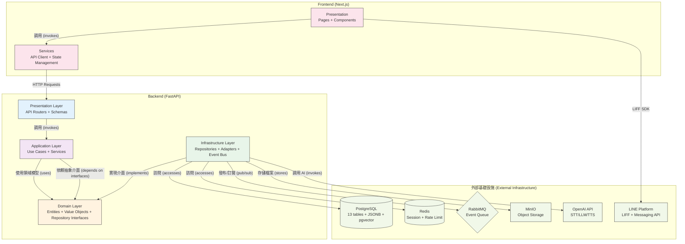
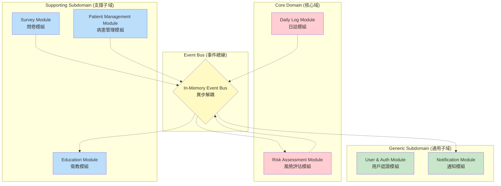
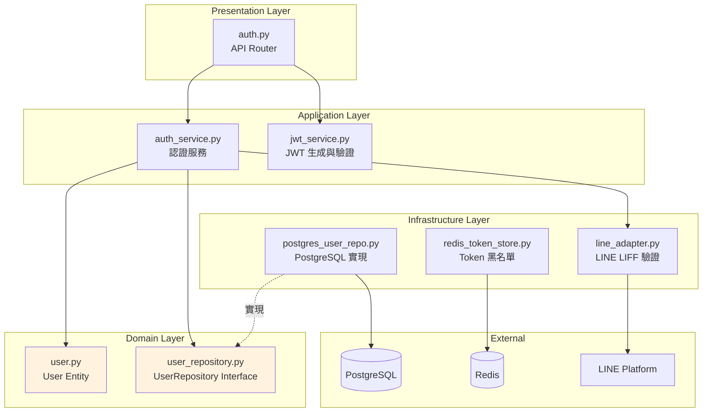

# 模組依賴關係分析 (Module Dependency Analysis) - RespiraAlly V2.0

---

**文件版本 (Document Version):** `v1.0`

**最後更新 (Last Updated):** `2025-10-19`

**主要作者 (Lead Author):** `Claude Code AI - System Architect`

**審核者 (Reviewers):** `Backend Lead, Frontend Lead, DevOps Engineer`

**狀態 (Status):** `草稿 (Draft) - Sprint 0 → Sprint 1 轉換期`

---

## 目錄 (Table of Contents)

1. [概述 (Overview)](#1-概述-overview)
2. [核心依賴原則 (Core Dependency Principles)](#2-核心依賴原則-core-dependency-principles)
3. [高層級模組依賴 (High-Level Module Dependencies)](#3-高層級模組依賴-high-level-module-dependencies)
4. [模組/層級職責定義 (Module/Layer Responsibility Definition)](#4-模組層級職責定義-modulelayer-responsibility-definition)
5. [關鍵依賴路徑分析 (Key Dependency Path Analysis)](#5-關鍵依賴路徑分析-key-dependency-path-analysis)
6. [依賴風險與管理 (Dependency Risks and Management)](#6-依賴風險與管理-dependency-risks-and-management)
7. [外部依賴管理 (External Dependency Management)](#7-外部依賴管理-external-dependency-management)
8. [Sprint 1 依賴檢查清單](#8-sprint-1-依賴檢查清單)

---

## 1. 概述 (Overview)

### 1.1 文檔目的 (Document Purpose)

本文檔旨在分析和定義 **RespiraAlly V2.0** (COPD Healthcare Platform) 的內部模組與外部套件之間的依賴關係，確保系統遵循以下原則：

- **依賴倒置原則 (DIP)**: 高層業務邏輯不依賴低層技術實現
- **無循環依賴原則 (ADP)**: 所有依賴形成有向無環圖 (DAG)
- **穩定依賴原則 (SDP)**: 依賴關係朝向更穩定的模組

**關鍵目標**:
- 在 Sprint 1 開始前建立清晰的模組邊界
- 為 JWT 認證、數據庫存取、事件驅動等關鍵路徑建立依賴規範
- 預防循環依賴與不當耦合

### 1.2 分析範圍 (Analysis Scope)

- **分析層級**: 模組級 (Module-level) + 套件級 (Package-level)
- **包含範圍**:
  - ✅ FastAPI Backend 內部依賴 (Clean Architecture 4 層)
  - ✅ 7 個 DDD 模組間依賴 (Patient, DailyLog, Survey, Risk, Alert, Education, User)
  - ✅ 外部函式庫依賴 (FastAPI, SQLAlchemy, Pydantic, LangChain 等)
  - ✅ Next.js Frontend 內部依賴 (Presentation → Services → API Client)
- **排除項目**:
  - Python/Node.js 標準庫
  - 開發工具 (pytest, black, ruff 等)
  - 測試專用 mock 套件

---

## 2. 核心依賴原則 (Core Dependency Principles)

### 2.1 依賴倒置原則 (Dependency Inversion Principle - DIP)

> "High-level modules should not depend on low-level modules. Both should depend on abstractions."

**在 RespiraAlly 中的實踐**:

```python
# ❌ 錯誤示範 - 應用層直接依賴具體實現
from infrastructure.repositories.postgres_patient_repo import PostgresPatientRepository

class PatientService:
    def __init__(self):
        self.repo = PostgresPatientRepository()  # 直接依賴 PostgreSQL
```

```python
# ✅ 正確示範 - 應用層依賴抽象接口
from domain.repositories.patient_repository import PatientRepository  # 抽象接口
from typing import Protocol

class PatientService:
    def __init__(self, patient_repo: PatientRepository):
        self.patient_repo = patient_repo  # 依賴注入抽象
```

**依賴反轉體現在**:
1. **Domain Layer** 定義 Repository 介面 (抽象)
2. **Application Layer** 依賴抽象介面
3. **Infrastructure Layer** 實現具體介面 (PostgreSQL, Redis 等)

### 2.2 無循環依賴原則 (Acyclic Dependencies Principle - ADP)

**嚴格禁止的循環依賴場景**:

```python
# ❌ 禁止 - Module A 與 Module B 循環依賴
# daily_log/service.py
from risk.calculator import RiskCalculator  # daily_log → risk

# risk/calculator.py
from daily_log.models import DailyLog  # risk → daily_log (循環!)
```

**解決方案 - 事件驅動解耦**:

```python
# ✅ 正確 - 使用事件打破循環
# daily_log/service.py
from infrastructure.event_bus import event_bus
event_bus.publish(DailyLogSubmitted(patient_id, data))  # 發布事件

# risk/event_handlers.py
@event_bus.subscribe(DailyLogSubmitted)
async def handle_daily_log_submitted(event: DailyLogSubmitted):
    # 異步處理風險計算，無需直接依賴 daily_log
    await calculate_risk(event.patient_id)
```

### 2.3 穩定依賴原則 (Stable Dependencies Principle - SDP)

**穩定性層級** (由穩定到不穩定):

1. **Domain Layer** (最穩定 - 業務規則很少變)
2. **Application Layer** (中等穩定 - 用例編排偶爾變)
3. **Infrastructure Layer** (較不穩定 - 技術實現常變)
4. **Presentation Layer** (最不穩定 - UI/API 經常調整)

**依賴規則**: 不穩定層可依賴穩定層，反之禁止。

---

## 3. 高層級模組依賴 (High-Level Module Dependencies)

### 3.1 Clean Architecture 分層依賴圖



### 3.2 Modular Monolith 模組依賴圖

RespiraAlly 採用 **Modular Monolith** 架構，7 個 DDD 模組通過 **Event Bus** 解耦。



**關鍵設計決策**:
- ✅ 模組間**禁止直接調用** (避免耦合)
- ✅ 僅通過 **Event Bus** 異步通信
- ✅ User 模組可被其他模組直接依賴 (作為基礎模組)

### 3.3 依賴規則說明 (Dependency Rule Explanation)

| 依賴類型 | 允許 | 禁止 | 範例 |
|---------|------|------|------|
| **跨層依賴** | Presentation → Application → Domain | Domain → Infrastructure | ✅ `api/routers` 調用 `services`<br/>❌ `domain/entities` 導入 `repositories` |
| **跨模組依賴** | 通過 Event Bus 異步通信 | 直接導入其他模組 | ✅ `event_bus.publish(DailyLogSubmitted)`<br/>❌ `from risk.calculator import ...` |
| **外部依賴** | Infrastructure Layer 封裝 | Domain/Application 直接調用 | ✅ `AIServiceAdapter` 封裝 OpenAI<br/>❌ 直接 `import openai` 在 Domain |

---

## 4. 模組/層級職責定義 (Module/Layer Responsibility Definition)

### 4.1 Clean Architecture 分層職責

| 層級 | 主要職責 | 程式碼路徑 | 關鍵類別範例 |
|------|---------|-----------|-------------|
| **Presentation Layer** | 處理 HTTP 請求、API 端點定義、請求/響應驗證 (Pydantic Schemas) | `backend/app/api/v1/` | `PatientRouter`, `AuthRouter`, `DailyLogSchema` |
| **Application Layer** | 編排業務流程、協調領域對象、發布領域事件 | `backend/app/services/` | `PatientService`, `AuthService`, `RiskCalculationService` |
| **Domain Layer** | 包含核心業務邏輯、實體、值對象、聚合根、Repository 介面定義 | `backend/app/domain/` | `Patient (Entity)`, `RiskScore (Value Object)`, `PatientRepository (Interface)` |
| **Infrastructure Layer** | 實現數據庫訪問、外部服務適配器、事件發布/訂閱 | `backend/app/infrastructure/` | `PostgresPatientRepository`, `OpenAIAdapter`, `RabbitMQEventBus` |

### 4.2 DDD 模組職責

| 模組名稱 | 核心職責 | 主要聚合 | 關鍵事件 |
|---------|---------|---------|---------|
| **Patient Management** | 病患基本資料、個案列表 | `Patient` | `PatientRegistered`, `PatientUpdated` |
| **Daily Log** | 日誌記錄 (症狀、用藥、活動) | `DailyLog` | `DailyLogSubmitted`, `DailyLogValidated` |
| **Survey** | CAT/mMRC 問卷管理 | `SurveyResponse` | `SurveyCompleted`, `SurveyScoreCalculated` |
| **Risk Assessment** | 風險分數計算、異常規則引擎 | `RiskScore` | `RiskScoreCalculated`, `HighRiskDetected` |
| **Alert** | 預警任務管理 | `Alert` | `AlertTriggered`, `AlertResolved` |
| **Education** | 衛教內容管理、RAG 檢索 | `EducationalDocument` | `DocumentIndexed`, `DocumentRetrieved` |
| **User & Auth** | 用戶認證、權限管理 | `User` | `UserLoggedIn`, `TokenRefreshed` |
| **Notification** | 通知提醒、週報生成 | `Notification` | `NotificationSent`, `ReminderScheduled` |

---

## 5. 關鍵依賴路徑分析 (Key Dependency Path Analysis)

### 5.1 場景 1: 用戶註冊與登入 (Sprint 1 核心流程)

**業務流程**: 病患通過 LINE LIFF 註冊 → 後端驗證 LINE Token → 建立用戶 → 返回 JWT

**依賴調用鏈**:

```
1. Frontend (Next.js LIFF Page)
   ↓ HTTP POST /v1/auth/register
2. Presentation Layer: api/v1/auth.py::register()
   ↓ 調用
3. Application Layer: services/auth_service.py::register_user()
   ↓ 使用
4. Domain Layer: domain/user/user.py::User (Entity)
   ↓ 通過介面
5. Infrastructure Layer: repositories/postgres_user_repo.py::save()
   ↓ SQL INSERT
6. PostgreSQL Database
```

**路徑檢查**:
- ✅ 單向依賴 (上層 → 下層)
- ✅ 依賴倒置 (Application 依賴 `UserRepository` 介面，不依賴具體實現)
- ✅ 無循環依賴

**關鍵組件依賴**:

```python
# Presentation Layer (api/v1/auth.py)
from services.auth_service import AuthService
from schemas.auth import RegisterRequest, TokenResponse

# Application Layer (services/auth_service.py)
from domain.user.user import User
from domain.repositories.user_repository import UserRepository  # 抽象

# Infrastructure Layer (repositories/postgres_user_repo.py)
from domain.repositories.user_repository import UserRepository
from sqlalchemy.orm import Session
```

### 5.2 場景 2: 日誌提交觸發風險評估 (Sprint 2-4 核心流程)

**業務流程**: 病患提交日誌 → 事件發布 → 風險計算服務訂閱 → 計算風險分數 → 預警判斷

**依賴調用鏈 (事件驅動)**:

```
1. Frontend (LIFF 日誌表單)
   ↓ HTTP POST /v1/daily-logs
2. Presentation Layer: api/v1/daily_logs.py::create_daily_log()
   ↓ 調用
3. Application Layer: services/daily_log_service.py::submit_log()
   ↓ 發布事件
4. Infrastructure Layer: event_bus.py::publish(DailyLogSubmitted)
   ↓ 異步訂閱
5. Application Layer: services/risk_service.py::handle_daily_log_submitted()
   ↓ 調用
6. Domain Layer: domain/risk/risk_calculator.py::calculate()
   ↓ 持久化
7. Infrastructure Layer: repositories/postgres_risk_repo.py::save()
```

**路徑檢查**:
- ✅ **模組解耦**: DailyLog 模組與 Risk 模組通過事件通信，無直接依賴
- ✅ **異步處理**: 日誌提交立即返回，風險計算異步進行
- ⚠️ **事件順序性**: 需要保證同一病患的事件按順序處理 (見風險管理章節)

### 5.3 場景 3: AI 語音對話處理 (Sprint 6 核心流程)

**業務流程**: 病患語音提問 → STT 轉文字 → LLM 生成回答 → RAG 檢索衛教 → TTS 合成語音

**依賴調用鏈**:

```
1. Frontend (LIFF 語音錄製)
   ↓ HTTP POST /v1/ai/voice-query
2. Presentation Layer: api/v1/ai.py::process_voice()
   ↓ 調用
3. Application Layer: services/ai_service.py::process_voice_query()
   ↓ 發布任務到隊列
4. Infrastructure Layer: rabbitmq_adapter.py::publish_task()
   ↓ RabbitMQ
5. AI Worker Service (獨立進程)
   ↓ 調用
6. Infrastructure Layer: adapters/openai_adapter.py::transcribe() (STT)
   ↓ 調用
7. Application Layer: services/rag_service.py::retrieve_context()
   ↓ 調用
8. Infrastructure Layer: adapters/openai_adapter.py::chat() (LLM)
   ↓ 調用
9. Infrastructure Layer: adapters/openai_adapter.py::synthesize() (TTS)
   ↓ WebSocket 推送
10. Frontend (LIFF 接收語音)
```

**路徑檢查**:
- ✅ **適配器模式**: OpenAI API 通過 `OpenAIAdapter` 封裝，Domain 層不知道具體實現
- ✅ **異步處理**: 通過 RabbitMQ 解耦 HTTP 請求與耗時 AI 處理
- ⚠️ **依賴穩定性**: OpenAI API 為外部依賴，需降級策略 (見風險管理章節)

---

## 6. 依賴風險與管理 (Dependency Risks and Management)

### 6.1 循環依賴 (Circular Dependencies)

#### 檢測工具

```bash
# Python 循環依賴檢測
pip install pydeps
pydeps backend/app --max-bacon=2 --cluster

# 或使用 import-linter
pip install import-linter
lint-imports
```

#### 解決策略

| 循環類型 | 解決方案 | 範例 |
|---------|---------|------|
| **模組間循環** | 使用事件驅動打破循環 | DailyLog ↔ Risk → 改為 DailyLog → Event Bus → Risk |
| **層級間循環** | 依賴倒置 (定義介面) | Infrastructure → Domain → 改為 Infrastructure 實現 Domain 定義的介面 |
| **檔案間循環** | 提取共享類型到獨立檔案 | `types.py` 提取共用 TypedDict |

#### Sprint 1 必須檢查的潛在循環

- ❌ `auth_service.py` ↔ `user_repository.py`
- ❌ `daily_log_service.py` ↔ `risk_service.py`
- ❌ `event_bus.py` ↔ `event_handlers.py`

**預防措施**: 每次 PR 必須執行 `pydeps` 檢查

### 6.2 不穩定依賴 (Unstable Dependencies)

#### 外部依賴穩定性評估

| 依賴項 | 穩定性 | 風險等級 | 隔離策略 |
|--------|--------|---------|---------|
| **OpenAI API** | 中 (Beta 功能可能變) | 🟡 中 | `OpenAIAdapter` 適配器封裝 + 備用降級邏輯 |
| **LINE Platform API** | 高 (成熟商業產品) | 🟢 低 | `LINEAdapter` 封裝 + 監控 LINE Status Page |
| **LangChain** | 低 (快速迭代中) | 🔴 高 | **僅用於 RAG 檢索**，鎖定版本 `langchain==0.1.0`，準備自行實現 |
| **pgvector** | 中 (PostgreSQL 擴展) | 🟡 中 | 未來可遷移至 Milvus，保持抽象介面 `VectorStore` |

#### 隔離層實作範例

```python
# ❌ 不好的設計 - 直接依賴
from langchain.vectorstores import Chroma

class RAGService:
    def __init__(self):
        self.vectorstore = Chroma(...)  # 直接耦合

# ✅ 好的設計 - 適配器模式
from abc import ABC, abstractmethod

class VectorStore(ABC):  # Domain Layer 定義抽象
    @abstractmethod
    def similarity_search(self, query: str) -> List[Document]:
        pass

class LangChainVectorStoreAdapter(VectorStore):  # Infrastructure Layer 實現
    def __init__(self, langchain_store):
        self._store = langchain_store

    def similarity_search(self, query: str) -> List[Document]:
        # 封裝 LangChain 具體調用
        return self._store.similarity_search(query)

class RAGService:
    def __init__(self, vectorstore: VectorStore):  # 依賴抽象
        self.vectorstore = vectorstore
```

### 6.3 事件處理失敗風險

**問題**: 事件訂閱者處理失敗時的策略未定義

**風險場景**:
1. `DailyLogSubmitted` 事件發布後，`RiskCalculationService` 處理失敗
2. 風險分數未計算，但日誌已提交
3. 數據不一致

**緩解措施** (Sprint 1 必須實現):

```python
# infrastructure/event_bus.py
class EventBus:
    MAX_RETRIES = 3
    RETRY_DELAYS = [1, 2, 4]  # 指數退避 (秒)

    async def publish(self, event: DomainEvent):
        for handler in self._handlers[type(event)]:
            for attempt in range(self.MAX_RETRIES):
                try:
                    await handler(event)
                    break  # 成功則跳出
                except Exception as e:
                    if attempt == self.MAX_RETRIES - 1:
                        # 最後一次失敗，發送到 DLQ
                        await self._send_to_dlq(event, handler, e)
                        await self._alert_ops(event, handler, e)
                    else:
                        await asyncio.sleep(self.RETRY_DELAYS[attempt])
```

**Dead Letter Queue (DLQ) 策略**:
- 失敗事件存入 `event_logs` 表 (status = 'failed')
- 每小時自動重試 DLQ 中的事件
- 失敗率 > 5% 觸發 Slack 告警

---

## 7. 外部依賴管理 (External Dependency Management)

### 7.1 Backend 外部依賴清單

| 外部依賴 | 版本 | 用途說明 | 風險評估 | 替代方案 |
|---------|------|---------|---------|---------|
| **fastapi** | `^0.104.0` | Web 框架 | 🟢 低 (主流、活躍) | - |
| **sqlalchemy** | `^2.0.22` | ORM | 🟢 低 (成熟、穩定) | - |
| **alembic** | `^1.12.0` | 數據庫遷移 | 🟢 低 | - |
| **pydantic** | `^2.5.0` | 數據驗證 | 🟢 低 | - |
| **redis** | `^5.0.0` | 快取、Session | 🟢 低 | Memcached (不推薦) |
| **openai** | `^1.3.0` | AI 服務 (STT/LLM/TTS) | 🟡 中 (API 變更頻繁) | Azure OpenAI, 本地 Whisper |
| **langchain** | `^0.1.0` | RAG 框架 | 🔴 高 (快速迭代) | **鎖定版本** 或自行實現 |
| **pgvector** | `^0.2.3` | 向量搜尋 (PostgreSQL 擴展) | 🟡 中 | Milvus, Qdrant |
| **boto3** | `^1.29.0` | MinIO S3 客戶端 | 🟢 低 | - |
| **pika** | `^1.3.0` | RabbitMQ 客戶端 | 🟢 低 | - |
| **python-jose** | `^3.3.0` | JWT 處理 | 🟢 低 | PyJWT |
| **passlib** | `^1.7.4` | 密碼雜湊 | 🟢 低 | argon2-cffi |
| **httpx** | `^0.25.0` | HTTP 客戶端 (調用 LINE API) | 🟢 低 | requests |

### 7.2 Frontend 外部依賴清單

| 外部依賴 | 版本 | 用途說明 | 風險評估 |
|---------|------|---------|---------|
| **next** | `^14.0.0` | React 框架 | 🟢 低 |
| **react** | `^18.2.0` | UI 框架 | 🟢 低 |
| **typescript** | `^5.2.0` | 類型系統 | 🟢 低 |
| **zustand** | `^4.4.0` | 狀態管理 | 🟢 低 |
| **@liff/sdk** | `^2.21.0` | LINE LIFF SDK | 🟡 中 (LINE 官方維護) |
| **recharts** | `^2.10.0` | 圖表庫 | 🟢 低 |
| **tailwindcss** | `^3.3.0` | CSS 框架 | 🟢 低 |
| **axios** | `^1.6.0` | HTTP 客戶端 | 🟢 低 |

### 7.3 依賴更新策略

#### 自動化工具

```yaml
# .github/dependabot.yml
version: 2
updates:
  - package-ecosystem: "pip"
    directory: "/backend"
    schedule:
      interval: "weekly"
    open-pull-requests-limit: 5

  - package-ecosystem: "npm"
    directory: "/frontend"
    schedule:
      interval: "weekly"
```

#### 更新流程

1. **Dependabot 自動開 PR** → 2. **CI 自動測試** → 3. **人工審查** → 4. **合併到 main**

**審查重點**:
- Breaking Changes 檢查 (查看 CHANGELOG)
- 執行完整測試套件 (Unit + Integration)
- 性能基準測試 (若為核心依賴)

#### 鎖定版本的依賴 (不自動更新)

- `langchain` - 鎖定 `0.1.0` (快速迭代期)
- `openai` - 鎖定 `1.3.0` (API 穩定版本)

**原因**: 避免 API 破壞性變更影響生產

---

## 8. Sprint 1 依賴檢查清單

### 8.1 開發前檢查 (Pre-Development Checklist)

- [ ] **JWT 認證組件依賴規劃完成** (見下節詳細規劃)
- [ ] **數據庫 Repository 介面定義** (Domain Layer)
- [ ] **Event Bus 抽象介面定義** (MVP 使用 in-memory 實現)
- [ ] **外部服務 Adapter 介面定義** (LINE, OpenAI)
- [ ] **確認無循環依賴** (執行 `pydeps` 檢查)

### 8.2 開發中檢查 (During Development)

- [ ] 每個新模組必須遵循 Clean Architecture 分層
- [ ] 跨模組調用**僅通過事件**，禁止直接導入
- [ ] 所有外部依賴**必須通過 Adapter 封裝**
- [ ] Repository 實現**必須注入抽象介面**
- [ ] 每次 PR 執行循環依賴檢測

### 8.3 Code Review 檢查 (Review Checklist)

- [ ] 是否違反依賴倒置原則？(高層依賴低層?)
- [ ] 是否存在循環依賴？(A → B → A)
- [ ] 是否直接調用其他模組？(應使用事件)
- [ ] 是否直接導入外部 SDK？(應使用 Adapter)
- [ ] Repository 是否正確注入？(DI pattern)

---

## 📋 附錄 A: JWT 認證組件依賴規劃 (Sprint 1 核心)

### A.1 組件架構



### A.2 檔案依賴清單

| 檔案路徑 | 依賴項 | 依賴類型 | 注意事項 |
|---------|--------|---------|---------|
| `api/v1/auth.py` | `services.auth_service`<br/>`schemas.auth` | Application Layer | ✅ 符合分層 |
| `services/auth_service.py` | `domain.user.user`<br/>`domain.repositories.user_repository`<br/>`infrastructure.adapters.line_adapter` | Domain + Infrastructure | ⚠️ Infrastructure 需 DI 注入 |
| `services/jwt_service.py` | `python-jose`<br/>`datetime`<br/>`config.settings` | 外部庫 + 配置 | ✅ 無領域依賴 |
| `domain/user/user.py` | `pydantic`<br/>`datetime` | 僅基礎庫 | ✅ 零外部依賴 |
| `domain/repositories/user_repository.py` | `abc`<br/>`domain.user.user` | 抽象基類 | ✅ 純介面定義 |
| `infrastructure/repositories/postgres_user_repo.py` | `sqlalchemy`<br/>`domain.repositories.user_repository`<br/>`domain.user.user` | ORM + Domain | ✅ 實現介面 |
| `infrastructure/adapters/line_adapter.py` | `httpx`<br/>`config.settings` | HTTP 客戶端 | ✅ 封裝 LINE API |

### A.3 依賴注入範例

```python
# main.py (FastAPI 啟動入口)
from fastapi import FastAPI, Depends
from sqlalchemy.orm import Session
from infrastructure.repositories.postgres_user_repo import PostgresUserRepository
from services.auth_service import AuthService

app = FastAPI()

def get_db():
    db = SessionLocal()
    try:
        yield db
    finally:
        db.close()

def get_user_repository(db: Session = Depends(get_db)):
    return PostgresUserRepository(db)

def get_auth_service(user_repo = Depends(get_user_repository)):
    return AuthService(user_repo)

# api/v1/auth.py
from fastapi import APIRouter, Depends
from services.auth_service import AuthService

router = APIRouter()

@router.post("/register")
async def register(
    request: RegisterRequest,
    auth_service: AuthService = Depends(get_auth_service)  # DI 注入
):
    return await auth_service.register_user(request)
```

---

## 📝 變更記錄 (Change Log)

| 版本 | 日期 | 變更內容 | 作者 |
|------|------|---------|------|
| v1.0 | 2025-10-19 | 初版建立 - Sprint 0 → Sprint 1 轉換期依賴分析 | Claude Code AI |

---

**審查狀態**: 待 Backend Lead, DevOps Engineer 審核
**下次更新**: Sprint 1 Week 1 (2025-10-25) - 補充實際實作中發現的依賴問題
