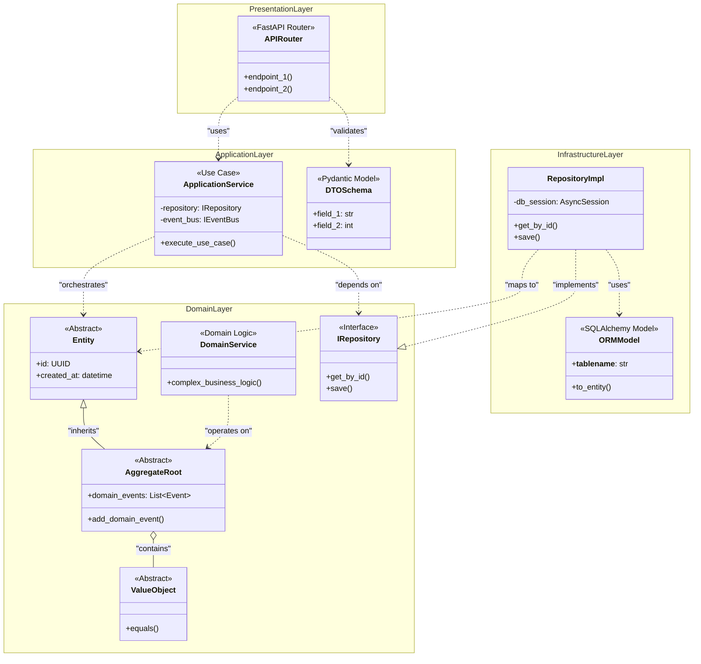
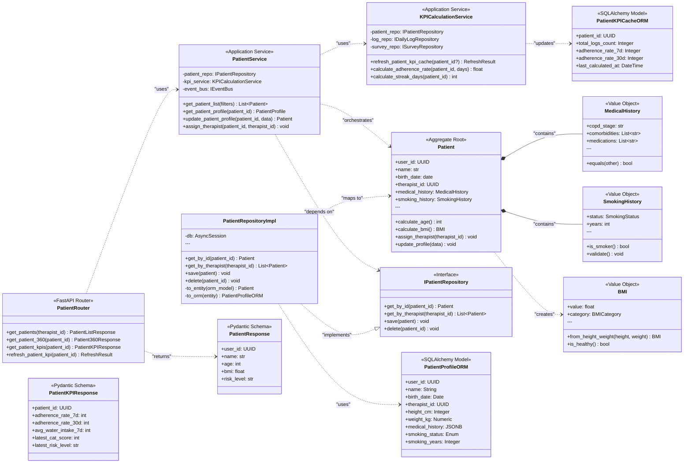
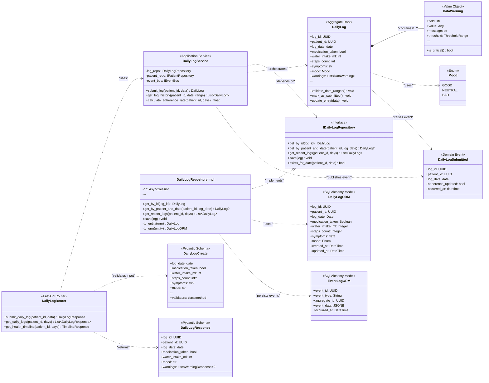
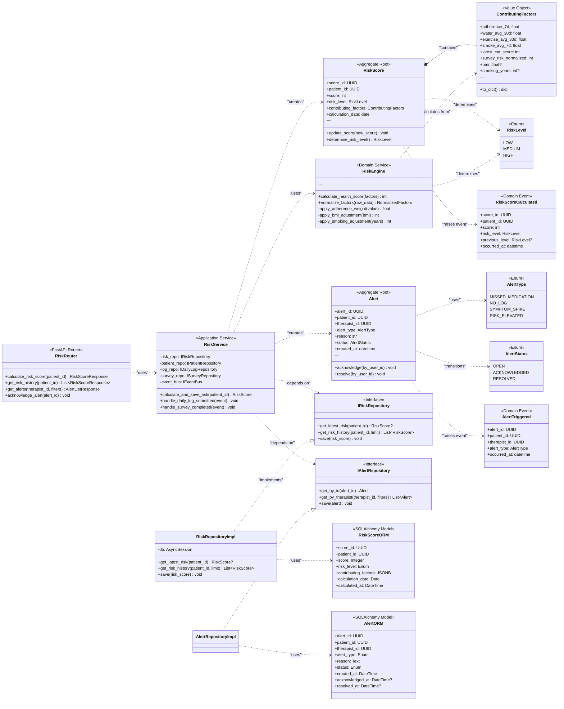

# 類別/組件關係文檔 (Class/Component Relationships Document) - RespiraAlly V2.0

---

**文件版本 (Document Version):** `v1.0`

**最後更新 (Last Updated):** `2025-10-20`

**主要作者 (Lead Author):** `Claude Code AI - Software Architect`

**審核者 (Reviewers):** `[待審核]`

**狀態 (Status):** `草稿 (Draft)`

**相關設計文檔 (Related Design Documents):**
*   系統架構文檔 (SA): [05_architecture_and_design.md](./05_architecture_and_design.md)
*   資料庫設計文檔 (DB): [database/schema_design_v1.0.md](./database/schema_design_v1.0.md)
*   API 設計規範 (API): [06_api_design_specification.md](./06_api_design_specification.md)
*   專案結構指南 (PS): [08_project_structure_guide.md](./08_project_structure_guide.md)

---

## 目錄 (Table of Contents)

1.  [概述 (Overview)](#1-概述-overview)
2.  [核心類別圖 (Core Class Diagram)](#2-核心類別圖-core-class-diagram)
3.  [主要類別/組件職責 (Key Class/Component Responsibilities)](#3-主要類別組件職責-key-classcomponent-responsibilities)
4.  [關係詳解 (Relationship Details)](#4-關係詳解-relationship-details)
5.  [設計模式應用 (Design Pattern Applications)](#5-設計模式應用-design-pattern-applications)
6.  [SOLID 原則遵循情況 (SOLID Principles Adherence)](#6-solid-原則遵循情況-solid-principles-adherence)
7.  [接口契約 (Interface Contracts)](#7-接口契約-interface-contracts)
8.  [技術選型與依賴 (Technical Choices & Dependencies)](#8-技術選型與依賴-technical-choices--dependencies)
9.  [附錄 (Appendix)](#9-附錄-appendix)

---

## 1. 概述 (Overview)

### 1.1 文檔目的 (Document Purpose)

本文檔旨在通過 UML 類別圖和詳細描述，清晰地呈現 **RespiraAlly V2.0** 中主要類別、組件和接口之間的靜態結構關係。它作為開發團隊理解和維護代碼庫結構的關鍵參考，並確保設計遵循良好的物件導向原則。

**設計哲學**:
- **Linus 式數據結構優先**: "Bad programmers worry about the code. Good programmers worry about data structures and their relationships."
- **Clean Architecture**: 嚴格分層，依賴反轉，領域邏輯與技術細節解耦
- **DDD Bounded Context**: 模組邊界清晰，統一語言，聚合設計

### 1.2 架構背景 (Architecture Context)

**架構模式**: Modular Monolith + Event-Driven Architecture (Phase 0-2 MVP)

```
┌─────────────────────────────────────────────────────┐
│          FastAPI 應用 (單一 Process)                 │
├─────────────────────────────────────────────────────┤
│                                                     │
│  ┌──────────────┐  ┌──────────────┐  ┌──────────┐  │
│  │ Auth Context │  │ Patient Ctx  │  │ Log Ctx  │  │
│  └──────────────┘  └──────────────┘  └──────────┘  │
│                                                     │
│  ┌──────────────┐  ┌──────────────┐  ┌──────────┐  │
│  │ Risk Context │  │ Survey Ctx   │  │ RAG Ctx  │  │
│  └──────────────┘  └──────────────┘  └──────────┘  │
│                                                     │
│  ┌──────────────┐                                  │
│  │Notify Context│  ← Event Bus (In-Memory)         │
│  └──────────────┘                                  │
│                                                     │
└─────────────────────────────────────────────────────┘
         ↓                   ↓                  ↓
   PostgreSQL            Redis            RabbitMQ (Phase 2)
```

**關鍵設計決策**:
- ✅ **單一部署單元**: 所有模組運行在同一 FastAPI 應用中，簡化部署與除錯
- ✅ **清晰模組邊界**: 每個 Bounded Context 有獨立的 Domain / Application / Infrastructure 層
- ✅ **事件驅動通信**: 模組間通過 Domain Events 解耦，便於未來拆分微服務
- ✅ **依賴反轉**: Infrastructure 層實現 Domain 層定義的接口 (Ports)

### 1.3 建模範圍 (Modeling Scope)

*   **包含範圍**:
    - 核心業務邏輯類別 (Entities, Aggregates, Domain Services)
    - 應用服務類別 (Use Cases, Application Services)
    - Repository 接口與實現
    - 資料模型 (SQLAlchemy ORM Models, Pydantic Schemas)
    - 主要介面 (API Routers, Service Interfaces)

*   **排除範圍**:
    - 前端 UI 組件
    - 第三方函式庫的內部類別
    - 測試專用類別 (Mocks, Fixtures)
    - 自動生成的 Alembic Migration 代碼

*   **抽象層級**: 專注於公開的屬性 (public properties) 和方法 (methods)，忽略私有實現細節

### 1.4 UML 符號說明 (UML Notation Conventions)

*   **繼承 (Inheritance):** `--|>` (is-a) - 子類別繼承父類別。
*   **實現 (Implementation):** `..|>` (implements) - 類別實現接口。
*   **組合 (Composition):** `*--` (has-a, strong ownership) - 組件的生命週期依賴於容器。
*   **聚合 (Aggregation):** `o--` (has-a, weak ownership) - 組件的生命週期獨立於容器。
*   **依賴 (Dependency):** `..>` (uses-a) - 一個類別的方法使用了另一個類別。
*   **關聯 (Association):** `-->` (has-a) - 類別之間的一般關係。

---

## 2. 核心類別圖 (Core Class Diagram)

### 2.1 整體架構分層圖 (Layered Architecture Overview)



**圖表說明**:
此圖展示了 RespiraAlly 的 Clean Architecture 分層結構。最關鍵的設計原則是 **依賴反轉 (Dependency Inversion)**：
- ✅ Application Layer 依賴 Domain Layer 的接口 (IRepository)
- ✅ Infrastructure Layer 實現 Domain Layer 的接口
- ✅ Domain Layer 完全獨立，無任何外部依賴
- ❌ 內層絕不依賴外層

---

### 2.2 模組視圖：Patient Context (個案管理上下文)



**圖表說明**:

**Patient Aggregate (聚合根)** 的核心職責:
- 📌 **身份識別**: `user_id` 作為聚合唯一標識
- 📌 **業務不變性**: 年齡必須 ≥18 歲、吸菸年數不可超過年齡
- 📌 **封裝變更**: 所有修改通過 `update_profile()` / `assign_therapist()` 方法
- 📌 **計算屬性**: `calculate_age()` / `calculate_bmi()` 確保一致性

**Value Objects (值物件)** 的特性:
- 🔹 **不可變**: 一旦建立不可修改，只能整體替換
- 🔹 **無身份**: 通過值相等判斷 (`equals()`)
- 🔹 **自我驗證**: `SmokingHistory.validate()` 確保吸菸狀態與年數一致性

**Repository Pattern (存儲庫模式)**:
- ✅ **接口定義在 Domain Layer** (`IPatientRepository`)
- ✅ **實現在 Infrastructure Layer** (`PatientRepositoryImpl`)
- ✅ **依賴反轉**: Application 依賴接口而非實現
- ✅ **數據映射**: ORM Model ↔ Domain Entity 的雙向轉換

---

### 2.3 模組視圖：Daily Log Context (健康日誌上下文)



**圖表說明**:

**DailyLog Aggregate (聚合根)** 的業務邏輯:
- 📌 **資料驗證**: `validate_data_ranges()` 檢查水分攝取、運動時間是否在合理範圍 (CR-001 需求)
- 📌 **警告機制**: 超過正常範圍時生成 `DataWarning`，提示用戶確認
- 📌 **唯一性約束**: 每位病患每日僅一筆記錄 (Database Unique Constraint + Application Check)
- 📌 **領域事件**: 日誌提交後觸發 `DailyLogSubmitted` 事件，通知風險引擎重新計算

**Event-Driven Design (事件驅動設計)**:
```python
# 提交日誌後發布事件
log.mark_as_submitted()
event = DailyLogSubmitted(
    log_id=log.log_id,
    patient_id=log.patient_id,
    log_date=log.log_date,
    occurred_at=datetime.utcnow()
)
event_bus.publish(event)  # 其他模組可訂閱此事件
```

**數據驗證策略 (CR-001 需求整合)**:
1. **Pydantic Schema 驗證**: 基本型別與範圍檢查
2. **Domain Entity 驗證**: 業務規則驗證 (`validate_data_ranges()`)
3. **Database Constraint**: 最後防線 (Check Constraints)

---

### 2.4 模組視圖：Risk Context (風險評估上下文)



**圖表說明**:

**RiskEngine (領域服務)** 的計算邏輯:
```python
def calculate_health_score(
    adherence_7d: float,         # 7 日依從率 (0.0 - 1.0)
    water_avg_30d: float,        # 30 日平均飲水量 (ml)
    exercise_avg_30d: float,     # 30 日平均運動時長 (min)
    smoke_avg_7d: float,         # 7 日平均抽菸量 (支)
    latest_cat_score: int,       # 最新 CAT 問卷分數 (0 - 40)
    survey_risk_normalized: int, # 最新問卷正規化風險 (0 - 100)
    bmi: Optional[float] = None, # BMI 值
    smoking_years: Optional[int] = None, # 吸菸年數
) -> int:
    """
    計算病患健康分數 (0-100)

    公式:
    S_base = 0.30×A₇ + 0.15×H₃₀ + 0.15×(100-N₃₀) + 0.15×(100-C) + 0.20×(100-R̂)

    調整因子:
    - BMI < 18.5: -5 分
    - BMI >= 27: -8 分
    - 吸菸 >= 20 年: -10 分

    S_final = clamp(S_base + adjustments, 0, 100)
    """
```

**風險等級判定**:
```python
def determine_risk_level(score: int) -> RiskLevel:
    if score >= 70:
        return RiskLevel.HIGH
    elif score >= 40:
        return RiskLevel.MEDIUM
    else:
        return RiskLevel.LOW
```

**事件驅動整合**:
1. **訂閱 `DailyLogSubmitted` 事件** → 觸發風險重新計算
2. **訂閱 `SurveyCompleted` 事件** → 更新 CAT/mMRC 分數並重算風險
3. **發布 `RiskScoreCalculated` 事件** → 通知 Notification Context 發送推播
4. **發布 `AlertTriggered` 事件** → 通知治療師查看高風險病患

---

## 3. 主要類別/組件職責 (Key Class/Component Responsibilities)

### 3.1 領域層 (Domain Layer) 核心類別

| 類別/組件 (Class/Component) | 核心職責 (Core Responsibility) | 主要協作者 (Key Collaborators) | 所屬模組 |
| :--- | :--- | :--- | :--- |
| **Patient** (Aggregate Root) | 管理病患基本資料、病史、吸菸史，計算 BMI 與年齡，分配治療師 | `MedicalHistory`, `SmokingHistory`, `BMI` | Patient Context |
| **DailyLog** (Aggregate Root) | 管理每日健康日誌，驗證數據合理性，生成警告，觸發依從率更新 | `DataWarning`, `Mood`, `DailyLogSubmitted` | Daily Log Context |
| **RiskScore** (Aggregate Root) | 儲存風險評分結果，判定風險等級，追蹤評分歷史 | `ContributingFactors`, `RiskLevel`, `RiskScoreCalculated` | Risk Context |
| **Alert** (Aggregate Root) | 管理預警生命週期 (建立、確認、解決)，追蹤處理狀態 | `AlertType`, `AlertStatus`, `AlertTriggered` | Risk Context |
| **RiskEngine** (Domain Service) | 執行複雜風險計算邏輯，正規化因子，應用調整權重 | `ContributingFactors`, `RiskLevel` | Risk Context |
| **MedicalHistory** (Value Object) | 封裝 COPD 階段、合併症、用藥清單，確保不可變性 | - | Patient Context |
| **SmokingHistory** (Value Object) | 封裝吸菸狀態與年數，驗證一致性 (狀態與年數) | `SmokingStatus` | Patient Context |
| **BMI** (Value Object) | 根據身高體重計算 BMI，分類健康狀態 | `BMICategory` | Patient Context |
| **DataWarning** (Value Object) | 表示數據驗證警告，標記超出正常範圍的欄位 | `ThresholdRange` | Daily Log Context |
| **ContributingFactors** (Value Object) | 封裝風險計算的所有輸入因子 (依從率、CAT 分數等) | - | Risk Context |

### 3.2 應用層 (Application Layer) 核心服務

| 類別/組件 (Class/Component) | 核心職責 (Core Responsibility) | 主要協作者 (Key Collaborators) | 所屬模組 |
| :--- | :--- | :--- | :--- |
| **PatientService** | 編排病患 CRUD 用例、治療師分配、檔案更新 | `IPatientRepository`, `KPICalculationService` | Patient Context |
| **KPICalculationService** | 計算與刷新 KPI 快取 (依從率、平均值、連續天數) | `IPatientRepository`, `IDailyLogRepository` | Patient Context |
| **DailyLogService** | 處理日誌提交、查詢歷史、計算依從率、發布事件 | `IDailyLogRepository`, `IPatientRepository`, `IEventBus` | Daily Log Context |
| **RiskService** | 觸發風險計算、處理事件訂閱、管理預警 | `IRiskRepository`, `IAlertRepository`, `RiskEngine` | Risk Context |
| **SurveyService** | 處理 CAT/mMRC 問卷提交、計算分數、判定嚴重度 | `ISurveyRepository`, `CATScorer`, `mMRCScorer` | Survey Context |
| **RAGService** | 處理衛教知識檢索、向量相似度搜尋、AI 問答 | `IDocumentRepository`, `EmbeddingService`, `LLMClient` | RAG Context |
| **NotificationService** | 管理通知排程、發送 LINE 訊息、追蹤發送狀態 | `INotificationRepository`, `LINEClient`, `IEventBus` | Notification Context |

### 3.3 基礎設施層 (Infrastructure Layer) 核心實現

| 類別/組件 (Class/Component) | 核心職責 (Core Responsibility) | 主要協作者 (Key Collaborators) | 所屬模組 |
| :--- | :--- | :--- | :--- |
| **PatientRepositoryImpl** | 實現 Patient Aggregate 的持久化邏輯，ORM ↔ Entity 映射 | `PatientProfileORM`, `Patient` | Patient Context |
| **DailyLogRepositoryImpl** | 實現 DailyLog Aggregate 的持久化，支援日期範圍查詢 | `DailyLogORM`, `DailyLog` | Daily Log Context |
| **RiskRepositoryImpl** | 實現 RiskScore 的儲存與歷史查詢 | `RiskScoreORM`, `RiskScore` | Risk Context |
| **DocumentChunkRepositoryImpl** | 實現向量檢索 (pgvector)，Top-K 相似度搜尋 | `DocumentChunkORM`, `DocumentChunk` | RAG Context |
| **EventBusImpl** | In-Memory 事件總線 (Phase 0-1)，RabbitMQ 實現 (Phase 2) | `DomainEvent`, `EventHandlers` | Shared Infrastructure |
| **LINEClient** | LINE Messaging API 適配器，發送推播訊息 | `LINEPlatformAPI` | Notification Context |

---

## 4. 關係詳解 (Relationship Details)

### 4.1 繼承/實現 (Inheritance/Implementation)

#### 4.1.1 Repository Pattern - 依賴反轉的經典應用

```python
# Domain Layer - 定義接口 (Port)
from abc import ABC, abstractmethod
from typing import List, Optional
from uuid import UUID

class IPatientRepository(ABC):
    """Patient Aggregate 的 Repository 接口"""

    @abstractmethod
    async def get_by_id(self, patient_id: UUID) -> Optional[Patient]:
        """根據 ID 查詢病患"""
        pass

    @abstractmethod
    async def get_by_therapist(self, therapist_id: UUID) -> List[Patient]:
        """查詢治療師負責的所有病患"""
        pass

    @abstractmethod
    async def save(self, patient: Patient) -> None:
        """儲存或更新病患"""
        pass

# Infrastructure Layer - 實現接口 (Adapter)
class PatientRepositoryImpl(IPatientRepository):
    def __init__(self, db_session: AsyncSession):
        self.db = db_session

    async def get_by_id(self, patient_id: UUID) -> Optional[Patient]:
        stmt = select(PatientProfileORM).where(PatientProfileORM.user_id == patient_id)
        result = await self.db.execute(stmt)
        orm_model = result.scalar_one_or_none()
        return self._to_entity(orm_model) if orm_model else None

    async def save(self, patient: Patient) -> None:
        orm_model = self._to_orm(patient)
        self.db.add(orm_model)
        await self.db.commit()

    def _to_entity(self, orm: PatientProfileORM) -> Patient:
        """ORM Model → Domain Entity"""
        return Patient(
            user_id=orm.user_id,
            name=orm.name,
            birth_date=orm.birth_date,
            # ...
        )

    def _to_orm(self, entity: Patient) -> PatientProfileORM:
        """Domain Entity → ORM Model"""
        return PatientProfileORM(
            user_id=entity.user_id,
            name=entity.name,
            # ...
        )
```

**設計目的**:
- ✅ **測試性**: Application Service 可注入 Mock Repository 進行單元測試
- ✅ **可替換性**: 未來可替換為 NoSQL 或其他持久化方案，無需修改 Domain / Application 層
- ✅ **依賴反轉**: 高層模組 (Application) 不依賴低層模組 (Infrastructure)

---

### 4.2 組合/聚合 (Composition/Aggregation)

#### 4.2.1 Patient Aggregate 的組合關係

```python
class Patient:
    """Patient Aggregate Root - 組合 Value Objects"""

    def __init__(
        self,
        user_id: UUID,
        name: str,
        birth_date: date,
        medical_history: MedicalHistory,  # Composition (強所有權)
        smoking_history: SmokingHistory,  # Composition
    ):
        self.user_id = user_id
        self.name = name
        self.birth_date = birth_date
        self._medical_history = medical_history  # 生命週期依賴 Patient
        self._smoking_history = smoking_history  # 生命週期依賴 Patient

    def update_medical_history(self, new_history: MedicalHistory):
        """更新病史 - 整體替換 Value Object"""
        self._medical_history = new_history  # 不可變物件，只能替換

    def calculate_bmi(self, height_cm: int, weight_kg: float) -> BMI:
        """計算 BMI - 建立新的 Value Object"""
        return BMI.from_height_weight(height_cm, weight_kg)
```

**Composition vs Aggregation 差異**:
- **Composition** (`Patient *-- MedicalHistory`): `MedicalHistory` 的生命週期完全依賴 `Patient`，Patient 刪除時一併刪除
- **Aggregation** (`DailyLog o-- Patient`): `DailyLog` 知道它屬於哪個 `Patient`，但兩者生命週期獨立

---

### 4.3 依賴 (Dependency)

#### 4.3.1 Application Service 依賴 Domain Service

```python
class RiskService:
    """Application Service - 編排用例"""

    def __init__(
        self,
        risk_repo: IRiskRepository,
        patient_repo: IPatientRepository,
        log_repo: IDailyLogRepository,
        risk_engine: RiskEngine,  # 依賴 Domain Service
    ):
        self._risk_repo = risk_repo
        self._patient_repo = patient_repo
        self._log_repo = log_repo
        self._risk_engine = risk_engine  # 注入依賴

    async def calculate_and_save_risk(self, patient_id: UUID) -> RiskScore:
        """用例: 計算並儲存風險分數"""
        # 1. 收集數據
        patient = await self._patient_repo.get_by_id(patient_id)
        recent_logs = await self._log_repo.get_recent_logs(patient_id, days=30)

        # 2. 準備計算因子
        factors = self._prepare_factors(patient, recent_logs)

        # 3. 呼叫 Domain Service 執行複雜計算
        score = self._risk_engine.calculate_health_score(
            adherence_7d=factors.adherence_7d,
            water_avg_30d=factors.water_avg_30d,
            # ...
        )

        # 4. 建立 Aggregate
        risk_score = RiskScore(
            patient_id=patient_id,
            score=score,
            contributing_factors=factors,
        )

        # 5. 持久化
        await self._risk_repo.save(risk_score)
        return risk_score
```

**設計原則**:
- ✅ Application Service 負責 **編排** (Orchestration)，不包含業務邏輯
- ✅ Domain Service 負責 **複雜業務計算**，無副作用 (Stateless)
- ✅ 通過 **依賴注入 (DI)** 傳入依賴，便於測試

---

## 5. 設計模式應用 (Design Pattern Applications)

| 設計模式 (Design Pattern) | 應用場景/涉及類別 | 設計目的/解決的問題 |
| :--- | :--- | :--- |
| **Repository Pattern** | `IPatientRepository` → `PatientRepositoryImpl`<br/>`IDailyLogRepository` → `DailyLogRepositoryImpl` | 將數據訪問邏輯從業務邏輯中分離，允許在不修改業務代碼的情況下切換持久化方案 (PostgreSQL → MongoDB → In-Memory)。 |
| **Aggregate Pattern (DDD)** | `Patient`, `DailyLog`, `RiskScore`, `Alert` | 確保業務不變性的邊界，所有對 Aggregate 內部實體的修改必須通過 Aggregate Root，保證數據一致性。 |
| **Value Object Pattern** | `MedicalHistory`, `SmokingHistory`, `BMI`, `DataWarning` | 表示無身份標識的概念，通過值相等判斷，不可變性保證線程安全與可預測性。 |
| **Domain Service Pattern** | `RiskEngine`, `CATScorer`, `mMRCScorer` | 封裝無法歸屬於單一 Entity 的業務邏輯，保持 Entity 的職責單一性。 |
| **Event-Driven Architecture** | `DailyLogSubmitted`, `RiskScoreCalculated`, `AlertTriggered` | 實現模組間解耦，便於未來拆分微服務，支援異步處理與可審計性。 |
| **Dependency Injection (DI)** | FastAPI 的 `Depends()` 機制 | 降低組件之間的耦合度，提高代碼的可測試性與可維護性。 |
| **Factory Pattern** | `BMI.from_height_weight()`, `Patient.create()` | 封裝複雜物件的創建過程，隱藏構造細節，提供語意化的建構方法。 |
| **Adapter Pattern** | `LINEClient` (封裝 LINE Messaging API)<br/>`RepositoryImpl` (ORM ↔ Entity 轉換) | 適配外部系統的接口，保護 Domain 層不受外部變化影響 (Anti-Corruption Layer)。 |
| **Strategy Pattern** | `IEventBus` → `InMemoryEventBus` / `RabbitMQEventBus` | 允許在運行時切換事件總線實現，Phase 0-1 使用 In-Memory，Phase 2 切換為 RabbitMQ。 |
| **Observer Pattern** | Event Handlers 訂閱 Domain Events | 實現發布-訂閱模式，一個事件可被多個 Handler 處理 (如 `DailyLogSubmitted` → 風險計算 + KPI 更新 + 通知發送)。 |

---

## 6. SOLID 原則遵循情況 (SOLID Principles Adherence)

### 6.1 單一職責原則 (Single Responsibility Principle)

**評估**: ✅ **遵循**

**證據**:
- ✅ **`Patient` Aggregate**: 僅負責管理病患基本資料與醫療史，不包含日誌或風險計算邏輯
- ✅ **`RiskEngine` Domain Service**: 僅負責風險計算邏輯，不處理持久化或事件發布
- ✅ **`PatientService` Application Service**: 僅負責用例編排，不包含業務計算或數據訪問細節

**反例避免**:
```python
# ❌ 違反 SRP - Service 包含太多職責
class PatientService:
    def create_patient(self, data):
        # 驗證邏輯
        # 計算 BMI
        # 儲存到資料庫
        # 發送通知
        # 記錄審計日誌
        # ...

# ✅ 遵循 SRP - 職責分離
class PatientService:
    def create_patient(self, data: PatientCreate) -> Patient:
        patient = Patient.create(data)  # Entity 負責驗證
        self._patient_repo.save(patient)  # Repository 負責持久化
        self._event_bus.publish(PatientRegistered(patient.user_id))  # Event Bus 負責通知
        return patient
```

---

### 6.2 開放/封閉原則 (Open/Closed Principle)

**評估**: ✅ **遵循**

**證據**:
- ✅ **擴展開放**: 新增風險計算因子時，只需修改 `RiskEngine` 的計算公式，無需修改 `RiskService`
- ✅ **修改封閉**: 新增持久化方案 (MongoDB) 時，實現新的 `IPatientRepository`，無需修改 Application 層

**範例**:
```python
# 新增營養評估因子 (CR-003 需求)
class RiskEngine:
    def calculate_health_score(
        self,
        # 原有因子
        adherence_7d: float,
        cat_score: int,
        # 新增因子 - 向後相容
        mna_sf_score: Optional[int] = None,  # 營養量表分數
    ) -> int:
        base_score = self._calculate_base(adherence_7d, cat_score)

        # 新增營養調整邏輯
        if mna_sf_score is not None and mna_sf_score < 8:
            base_score -= 10  # 營養不良扣分

        return clamp(base_score, 0, 100)
```

---

### 6.3 里氏替換原則 (Liskov Substitution Principle)

**評估**: ✅ **遵循**

**證據**:
- ✅ **Repository 可替換**: `PatientRepositoryImpl` 可被 `MockPatientRepository` 替換，不影響程式正確性
- ✅ **Event Bus 可替換**: `InMemoryEventBus` 可被 `RabbitMQEventBus` 替換，不影響業務邏輯

**測試範例**:
```python
# 單元測試 - 使用 Mock Repository
class TestPatientService:
    def test_create_patient(self):
        # Arrange
        mock_repo = MockPatientRepository()  # 替換實現
        service = PatientService(patient_repo=mock_repo)

        # Act
        patient = service.create_patient(PatientCreate(...))

        # Assert
        assert mock_repo.saved_patients[0] == patient  # 行為一致
```

---

### 6.4 介面隔離原則 (Interface Segregation Principle)

**評估**: ✅ **遵循**

**證據**:
- ✅ **小而專一的接口**: `IPatientRepository` 只包含 Patient Aggregate 的持久化方法，不包含日誌相關方法
- ✅ **避免胖接口**: 沒有建立包含所有 CRUD 方法的 `IGenericRepository`

**範例**:
```python
# ✅ 遵循 ISP - 接口專一
class IPatientRepository(ABC):
    @abstractmethod
    async def get_by_id(self, patient_id: UUID) -> Optional[Patient]: ...

    @abstractmethod
    async def save(self, patient: Patient) -> None: ...

class IDailyLogRepository(ABC):
    @abstractmethod
    async def get_by_patient_and_date(
        self, patient_id: UUID, log_date: date
    ) -> Optional[DailyLog]: ...

    @abstractmethod
    async def save(self, log: DailyLog) -> None: ...

# ❌ 違反 ISP - 胖接口
class IGenericRepository(ABC):
    @abstractmethod
    async def get_patient(...): ...
    @abstractmethod
    async def get_daily_log(...): ...
    @abstractmethod
    async def get_risk_score(...): ...
    # 客戶端被強迫依賴它們不使用的方法
```

---

### 6.5 依賴反轉原則 (Dependency Inversion Principle)

**評估**: ✅ **遵循**

**證據**:
- ✅ **高層模組不依賴低層模組**: `PatientService` 依賴 `IPatientRepository` (抽象)，而非 `PatientRepositoryImpl` (具體實現)
- ✅ **兩者都依賴於抽象**: Repository 接口定義在 Domain Layer，實現在 Infrastructure Layer

**依賴方向圖**:
```
┌─────────────────────────────────────┐
│   Application Layer                 │
│   (PatientService)                  │
│        ↓ depends on                 │
│   IPatientRepository (Interface)    │
└─────────────────────────────────────┘
         ↑ implements
┌─────────────────────────────────────┐
│   Infrastructure Layer               │
│   (PatientRepositoryImpl)           │
└─────────────────────────────────────┘
```

**FastAPI 依賴注入範例**:
```python
# API Layer - 依賴注入
from fastapi import Depends

async def get_patient_repo() -> IPatientRepository:
    """依賴注入工廠函數"""
    db = await get_db_session()
    return PatientRepositoryImpl(db)

@router.get("/patients/{patient_id}")
async def get_patient(
    patient_id: UUID,
    patient_repo: IPatientRepository = Depends(get_patient_repo),  # 注入抽象
):
    patient = await patient_repo.get_by_id(patient_id)
    return patient
```

---

## 7. 接口契約 (Interface Contracts)

### 7.1 `IPatientRepository`

**目的**: 定義 Patient Aggregate 的持久化操作契約。

**方法 (Methods)**:

#### 7.1.1 `get_by_id(patient_id: UUID) -> Optional[Patient]`

*   **描述**: 根據提供的 `patient_id` 查找並返回一個 `Patient` 實體。
*   **前置條件**:
    - `patient_id` 必須是有效的 UUID。
*   **後置條件**:
    - 如果找到，返回對應的 `Patient` 實體。
    - 如果未找到，返回 `None`。
    - 返回的 `Patient` 實體已完整載入所有 Value Objects (`MedicalHistory`, `SmokingHistory`)。
*   **副作用**: 無 (純查詢)。
*   **異常**: 無 (不找到返回 `None` 而非拋出異常)。

#### 7.1.2 `get_by_therapist(therapist_id: UUID) -> List[Patient]`

*   **描述**: 查詢指定治療師負責的所有病患。
*   **前置條件**:
    - `therapist_id` 必須是有效的 UUID。
*   **後置條件**:
    - 返回病患列表 (可能為空列表)。
    - 列表按 `created_at` 降序排列。
*   **副作用**: 無。
*   **性能要求**: < 200ms (使用索引 `idx_patient_therapist`)。

#### 7.1.3 `save(patient: Patient) -> None`

*   **描述**: 將一個 `Patient` 實體儲存或更新到數據源。
*   **前置條件**:
    - `patient` 是一個有效的 `Patient` 實例。
    - `patient` 已通過業務規則驗證 (年齡 >= 18, 吸菸年數 <= 年齡)。
*   **後置條件**:
    - `patient` 的狀態已被持久化到資料庫。
    - 若 `patient.user_id` 已存在，執行更新 (UPDATE)。
    - 若 `patient.user_id` 不存在，執行插入 (INSERT)。
    - 自動更新 `updated_at` 時間戳。
*   **副作用**: 修改資料庫狀態。
*   **異常**:
    - `IntegrityError`: 違反資料庫約束 (如重複的 `email`)。
    - `ValidationError`: Entity 驗證失敗。

---

### 7.2 `IDailyLogRepository`

**目的**: 定義 DailyLog Aggregate 的持久化與查詢操作。

**方法 (Methods)**:

#### 7.2.1 `get_by_patient_and_date(patient_id: UUID, log_date: date) -> Optional[DailyLog]`

*   **描述**: 查詢指定病患在特定日期的健康日誌。
*   **前置條件**:
    - `patient_id` 必須是有效的 UUID。
    - `log_date` 必須是有效的日期。
*   **後置條件**:
    - 如果找到，返回對應的 `DailyLog` 實體。
    - 如果未找到 (該日未提交日誌)，返回 `None`。
*   **副作用**: 無。
*   **性能要求**: < 50ms (使用複合索引 `idx_daily_logs_patient_date`)。

#### 7.2.2 `get_recent_logs(patient_id: UUID, days: int) -> List[DailyLog]`

*   **描述**: 查詢病患近 N 天的健康日誌。
*   **前置條件**:
    - `patient_id` 必須是有效的 UUID。
    - `days` 必須在 1-90 之間。
*   **後置條件**:
    - 返回日誌列表，按 `log_date` 降序排列。
    - 若無數據，返回空列表。
*   **副作用**: 無。
*   **性能要求**: < 100ms (使用索引)。

#### 7.2.3 `save(log: DailyLog) -> None`

*   **描述**: 儲存或更新健康日誌。
*   **前置條件**:
    - `log` 是一個有效的 `DailyLog` 實例。
    - `log` 已通過數據驗證 (`validate_data_ranges()`)。
*   **後置條件**:
    - 若 `(patient_id, log_date)` 組合已存在，執行更新 (Upsert)。
    - 若不存在，執行插入。
    - 自動更新 `updated_at` 時間戳。
*   **副作用**:
    - 修改資料庫狀態。
    - 可能觸發 KPI 快取更新 (通過 Database Trigger)。
*   **異常**:
    - `ValidationError`: 數據驗證失敗 (如水分攝取 > 10000ml)。

---

### 7.3 `IRiskRepository`

**目的**: 定義 RiskScore Aggregate 的持久化與歷史查詢。

**方法 (Methods)**:

#### 7.3.1 `get_latest_risk(patient_id: UUID) -> Optional[RiskScore]`

*   **描述**: 查詢病患最新的風險評分。
*   **前置條件**:
    - `patient_id` 必須是有效的 UUID。
*   **後置條件**:
    - 返回 `calculation_date` 最新的 `RiskScore`。
    - 若無歷史評分，返回 `None`。
*   **副作用**: 無。
*   **性能要求**: < 50ms (使用索引 `idx_risk_scores_patient_latest`)。

#### 7.3.2 `get_risk_history(patient_id: UUID, limit: int = 10) -> List[RiskScore]`

*   **描述**: 查詢病患的風險評分歷史。
*   **前置條件**:
    - `patient_id` 必須是有效的 UUID。
    - `limit` 必須在 1-100 之間。
*   **後置條件**:
    - 返回最近 `limit` 筆評分記錄，按 `calculation_date` 降序。
*   **副作用**: 無。

#### 7.3.3 `save(risk_score: RiskScore) -> None`

*   **描述**: 儲存風險評分結果。
*   **前置條件**:
    - `risk_score` 是一個有效的 `RiskScore` 實例。
    - `risk_score.score` 在 0-100 範圍內。
*   **後置條件**:
    - 風險評分已持久化。
    - `risk_level` 根據 `score` 自動設定 (通過 Database Trigger)。
    - 每日每病患僅一筆評分 (Database Unique Constraint: `patient_id, calculation_date`)。
*   **副作用**: 修改資料庫狀態。
*   **異常**:
    - `IntegrityError`: 違反唯一性約束 (同一天重複計算)。

---

## 8. 技術選型與依賴 (Technical Choices & Dependencies)

| 類別/組件 | 語言/框架 | 關鍵庫/工具 | 版本/約束 | 適用範圍 | 選擇理由 | 備選方案 | 風險/成熟度 | 關聯 ADR |
| :-- | :-- | :-- | :-- | :-- | :-- | :-- | :-- | :-- |
| **API Layer** | Python 3.11+ | FastAPI | 0.104+ | Presentation Layer | 高性能 (async)、自動文檔生成、型別安全 | Flask, Django | 成熟 (⭐⭐⭐⭐⭐) | [ADR-001](./adr/ADR-001-fastapi-vs-flask.md) |
| **ORM** | Python | SQLAlchemy | 2.0+ | Infrastructure Layer | 強大的查詢能力、支援 async、生態成熟 | Django ORM, Tortoise ORM | 成熟 (⭐⭐⭐⭐⭐) | - |
| **數據驗證** | Python | Pydantic | 2.0+ | Application / API | 型別驗證、自動序列化、與 FastAPI 深度整合 | Marshmallow, Cerberus | 成熟 (⭐⭐⭐⭐⭐) | - |
| **Database** | PostgreSQL | PostgreSQL | 15+ | Data Storage | ACID 事務、JSONB、pgvector 擴展 | MySQL, MongoDB | 成熟 (⭐⭐⭐⭐⭐) | - |
| **Vector DB** | PostgreSQL Extension | pgvector | 0.5+ | RAG / Embedding Storage | 架構簡潔、無需額外服務、強一致性 | Milvus, Pinecone | 中等 (⭐⭐⭐⭐) | [ADR-002](./adr/ADR-002-pgvector-for-vector-db.md) |
| **Cache** | Redis | Redis | 7+ | Session / Cache | 高性能、豐富數據結構、持久化支援 | Memcached | 成熟 (⭐⭐⭐⭐⭐) | - |
| **Message Queue** | RabbitMQ | RabbitMQ | 3.12+ | Event Bus (Phase 2) | 可靠性高、支援複雜路由、運維團隊熟悉 | Kafka, Redis Streams | 成熟 (⭐⭐⭐⭐⭐) | [ADR-005](./adr/ADR-005-rabbitmq-for-message-queue.md) |
| **Testing** | Python | pytest, pytest-asyncio | - | All Layers | 強大的 fixture 系統、支援 async 測試 | unittest | 成熟 (⭐⭐⭐⭐⭐) | - |
| **Migration** | Python | Alembic | 1.12+ | Database Schema | 與 SQLAlchemy 深度整合、版本控制 | Django Migrations | 成熟 (⭐⭐⭐⭐⭐) | - |
| **AI / LLM** | Python | OpenAI Python SDK | 1.0+ | RAG / AI Worker | 官方 SDK、支援 Streaming、型別提示 | LangChain, LlamaIndex | 成熟 (⭐⭐⭐⭐) | - |
| **LINE Integration** | Python | line-bot-sdk | 3.0+ | Notification Context | 官方 SDK、支援 LIFF 與 Messaging API | 自行實現 HTTP Client | 成熟 (⭐⭐⭐⭐⭐) | [ADR-004](./adr/ADR-004-line-as-patient-entrypoint.md) |

### 8.1 外部依賴 (基礎設施/雲服務)

| 服務 | 用途 | 關鍵配置 | 風險緩解 |
| :-- | :-- | :-- | :-- |
| **PostgreSQL 15+** | 所有結構化數據、向量數據 (pgvector)、事件日誌 (JSONB) | 連線池: 20 core + 10 overflow<br/>WAL 歸檔: 啟用 | 主從複製、定期備份 |
| **Redis 7+** | 會話存儲 (JWT Refresh Token)、KPI 快取、分散式鎖 | 持久化: AOF + RDB<br/>最大記憶體: 2GB | Sentinel 監控、定期快照 |
| **RabbitMQ 3.12+** | AI 語音任務佇列 (Phase 2)、領域事件分發 | 持久化: Queue Durable<br/>重試策略: 指數退避 | 叢集部署、死信佇列 |
| **OpenAI API** | STT (Whisper)、LLM (GPT-4)、TTS、Embedding | Rate Limit: 500 RPM<br/>超時: 30s | 重試機制、降級回覆 |
| **LINE Platform** | OAuth、Messaging API、LIFF | Webhook 重試: 3 次<br/>訊息佇列: RabbitMQ 緩衝 | 降級訊息、監控 Webhook 失敗率 |

### 8.2 非功能約束 (NFR)

**性能要求**:
- API P95 < 500ms (除 AI 語音處理)
- KPI 查詢 < 50ms (使用快取表)
- AI 語音端到端回覆 < 15 秒

**可用性要求**:
- 服務可用性 ≥99.5% (Phase 3 後)
- 資料庫故障自動切換 < 30 秒
- 零停機部署 (藍綠部署)

**安全性要求**:
- 傳輸加密: HTTPS / TLS 1.3
- 靜態加密: 資料庫透明加密 (TDE)
- 認證授權: JWT + RBAC
- 敏感資料脫敏: 病歷號部分遮蔽

**可觀測性要求**:
- 結構化日誌: JSON 格式 (含 Request ID)
- 分散式追蹤: Jaeger (Phase 3)
- 監控指標: Prometheus + Grafana
- 健康檢查: `/health` 端點 (5 秒間隔)

---

## 9. 附錄 (Appendix)

### 9.1 完整模組列表 (Complete Module List)

| 模組名稱 | 對應 Bounded Context | 核心 Aggregates | 主要職責 | 優先級 |
| :--- | :--- | :--- | :--- | :--- |
| `auth` | Auth Context | `User`, `Session` | 用戶認證、授權、會話管理 | P0 (Phase 0) |
| `patients` | Patient Context | `Patient`, `PatientProfile` | 病患檔案管理、治療師分配 | P0 (Phase 0) |
| `daily_logs` | Daily Log Context | `DailyLog` | 健康日誌提交、依從率計算 | P0 (Phase 0) |
| `surveys` | Survey Context | `SurveyResponse` | CAT/mMRC 問卷管理、分數計算 | P1 (Phase 1) |
| `risk` | Risk Context | `RiskScore`, `Alert` | 風險評分、異常預警 | P1 (Phase 1) |
| `rag` | RAG Context | `EducationalDocument`, `DocumentChunk` | 衛教知識庫、向量檢索 | P2 (Phase 2) |
| `notifications` | Notification Context | `Notification`, `NotificationSchedule` | 智慧提醒、LINE 推播 | P1 (Phase 1) |
| `ai_worker` | AI Processing | `VoiceTask` | STT、LLM、TTS 異步處理 | P2 (Phase 2) |

### 9.2 代碼範例：完整 Aggregate 實現

#### 9.2.1 `Patient` Aggregate Root

```python
# backend/src/respira_ally/domain/models/patient.py

from dataclasses import dataclass, field
from datetime import date, datetime
from typing import Optional
from uuid import UUID, uuid4

from .value_objects import MedicalHistory, SmokingHistory, BMI, BMICategory
from .events import PatientRegistered, TherapistAssigned


@dataclass
class Patient:
    """
    Patient Aggregate Root

    職責:
    - 管理病患基本資料與醫療史
    - 計算衍生屬性 (年齡、BMI)
    - 確保業務不變性 (年齡 >= 18, 吸菸年數 <= 年齡)
    - 發布領域事件
    """

    # 聚合標識
    user_id: UUID

    # 基本資料
    name: str
    birth_date: date
    gender: str  # MALE, FEMALE, OTHER

    # 組合 Value Objects
    medical_history: MedicalHistory
    smoking_history: SmokingHistory

    # 關聯
    therapist_id: Optional[UUID] = None

    # 體徵數據 (用於計算 BMI)
    height_cm: Optional[int] = None
    weight_kg: Optional[float] = None

    # 審計欄位
    created_at: datetime = field(default_factory=datetime.utcnow)
    updated_at: datetime = field(default_factory=datetime.utcnow)

    # 領域事件容器
    _domain_events: list = field(default_factory=list, init=False, repr=False)

    def __post_init__(self):
        """建構後驗證"""
        self._validate_invariants()

    def _validate_invariants(self):
        """驗證業務不變性"""
        # 年齡必須 >= 18 歲
        age = self.calculate_age()
        if age < 18:
            raise ValueError(f"Patient must be at least 18 years old, got {age}")

        # 吸菸年數不可超過年齡
        if self.smoking_history.years and self.smoking_history.years > age:
            raise ValueError(
                f"Smoking years ({self.smoking_history.years}) cannot exceed age ({age})"
            )

    # ============ 計算屬性 ============

    def calculate_age(self) -> int:
        """計算當前年齡"""
        today = date.today()
        age = today.year - self.birth_date.year
        if (today.month, today.day) < (self.birth_date.month, self.birth_date.day):
            age -= 1
        return age

    def calculate_bmi(self) -> Optional[BMI]:
        """計算 BMI (若有身高體重數據)"""
        if self.height_cm and self.weight_kg:
            return BMI.from_height_weight(self.height_cm, self.weight_kg)
        return None

    # ============ 業務方法 ============

    @classmethod
    def create(
        cls,
        name: str,
        birth_date: date,
        gender: str,
        medical_history: MedicalHistory,
        smoking_history: SmokingHistory,
        **kwargs
    ) -> "Patient":
        """工廠方法：建立新病患"""
        patient = cls(
            user_id=uuid4(),
            name=name,
            birth_date=birth_date,
            gender=gender,
            medical_history=medical_history,
            smoking_history=smoking_history,
            **kwargs
        )

        # 發布領域事件
        patient._add_domain_event(
            PatientRegistered(
                user_id=patient.user_id,
                name=patient.name,
                age=patient.calculate_age(),
                occurred_at=datetime.utcnow()
            )
        )

        return patient

    def assign_therapist(self, therapist_id: UUID):
        """分配治療師"""
        if self.therapist_id == therapist_id:
            return  # 已分配相同治療師，無需操作

        old_therapist_id = self.therapist_id
        self.therapist_id = therapist_id
        self.updated_at = datetime.utcnow()

        # 發布領域事件
        self._add_domain_event(
            TherapistAssigned(
                patient_id=self.user_id,
                old_therapist_id=old_therapist_id,
                new_therapist_id=therapist_id,
                occurred_at=datetime.utcnow()
            )
        )

    def update_profile(
        self,
        name: Optional[str] = None,
        height_cm: Optional[int] = None,
        weight_kg: Optional[float] = None,
        medical_history: Optional[MedicalHistory] = None,
        smoking_history: Optional[SmokingHistory] = None,
    ):
        """更新檔案資料"""
        if name:
            self.name = name
        if height_cm:
            self.height_cm = height_cm
        if weight_kg:
            self.weight_kg = weight_kg
        if medical_history:
            self.medical_history = medical_history
        if smoking_history:
            self.smoking_history = smoking_history

        self.updated_at = datetime.utcnow()
        self._validate_invariants()  # 重新驗證

    # ============ 領域事件 ============

    def _add_domain_event(self, event):
        """添加領域事件"""
        self._domain_events.append(event)

    def collect_domain_events(self) -> list:
        """收集並清空領域事件"""
        events = self._domain_events[:]
        self._domain_events.clear()
        return events
```

#### 9.2.2 `BMI` Value Object

```python
# backend/src/respira_ally/domain/models/value_objects.py

from dataclasses import dataclass
from enum import Enum


class BMICategory(Enum):
    """BMI 分類"""
    UNDERWEIGHT = "過輕"
    NORMAL = "正常"
    OVERWEIGHT = "過重"
    OBESE = "肥胖"


@dataclass(frozen=True)  # 不可變
class BMI:
    """
    BMI Value Object

    特性:
    - 不可變 (frozen=True)
    - 無身份標識
    - 通過值相等判斷
    """

    value: float
    category: BMICategory

    @classmethod
    def from_height_weight(cls, height_cm: int, weight_kg: float) -> "BMI":
        """工廠方法：根據身高體重計算 BMI"""
        if height_cm <= 0 or weight_kg <= 0:
            raise ValueError("Height and weight must be positive")

        bmi_value = weight_kg / ((height_cm / 100) ** 2)
        bmi_value = round(bmi_value, 1)  # 保留一位小數

        # 判定分類
        if bmi_value < 18.5:
            category = BMICategory.UNDERWEIGHT
        elif bmi_value < 24:
            category = BMICategory.NORMAL
        elif bmi_value < 27:
            category = BMICategory.OVERWEIGHT
        else:
            category = BMICategory.OBESE

        return cls(value=bmi_value, category=category)

    def is_healthy(self) -> bool:
        """判斷是否為健康範圍"""
        return self.category == BMICategory.NORMAL

    def __str__(self):
        return f"{self.value} ({self.category.value})"
```

### 9.3 測試範例：單元測試

```python
# backend/tests/domain/test_patient.py

import pytest
from datetime import date
from uuid import uuid4

from respira_ally.domain.models.patient import Patient
from respira_ally.domain.models.value_objects import MedicalHistory, SmokingHistory, BMI


class TestPatientAggregate:
    """Patient Aggregate 單元測試"""

    def test_create_patient_success(self):
        """測試：成功建立病患"""
        # Arrange
        medical_history = MedicalHistory(
            copd_stage="III",
            comorbidities=["高血壓"],
            medications=["類固醇吸入劑"]
        )
        smoking_history = SmokingHistory(status="FORMER", years=10)

        # Act
        patient = Patient.create(
            name="王大明",
            birth_date=date(1960, 5, 15),
            gender="MALE",
            medical_history=medical_history,
            smoking_history=smoking_history,
            height_cm=170,
            weight_kg=70.0
        )

        # Assert
        assert patient.user_id is not None
        assert patient.name == "王大明"
        assert patient.calculate_age() >= 18
        assert len(patient.collect_domain_events()) == 1  # PatientRegistered 事件

    def test_create_patient_under_18_should_fail(self):
        """測試：未滿 18 歲應失敗"""
        # Arrange
        under_18_birthdate = date.today().replace(year=date.today().year - 17)

        # Act & Assert
        with pytest.raises(ValueError, match="at least 18 years old"):
            Patient.create(
                name="未成年",
                birth_date=under_18_birthdate,
                gender="MALE",
                medical_history=MedicalHistory(),
                smoking_history=SmokingHistory(status="NEVER", years=0),
            )

    def test_calculate_bmi(self):
        """測試：BMI 計算"""
        # Arrange
        patient = Patient.create(
            name="王大明",
            birth_date=date(1960, 5, 15),
            gender="MALE",
            medical_history=MedicalHistory(),
            smoking_history=SmokingHistory(status="NEVER", years=0),
            height_cm=170,
            weight_kg=70.0
        )

        # Act
        bmi = patient.calculate_bmi()

        # Assert
        assert bmi is not None
        assert bmi.value == 24.2  # 70 / (1.7^2) ≈ 24.2
        assert bmi.category.value == "過重"

    def test_assign_therapist_publishes_event(self):
        """測試：分配治療師發布事件"""
        # Arrange
        patient = Patient.create(
            name="王大明",
            birth_date=date(1960, 5, 15),
            gender="MALE",
            medical_history=MedicalHistory(),
            smoking_history=SmokingHistory(status="NEVER", years=0),
        )
        patient.collect_domain_events()  # 清空初始事件

        therapist_id = uuid4()

        # Act
        patient.assign_therapist(therapist_id)

        # Assert
        assert patient.therapist_id == therapist_id
        events = patient.collect_domain_events()
        assert len(events) == 1
        assert events[0].__class__.__name__ == "TherapistAssigned"


class TestBMIValueObject:
    """BMI Value Object 單元測試"""

    def test_from_height_weight_normal(self):
        """測試：正常 BMI"""
        bmi = BMI.from_height_weight(height_cm=170, weight_kg=65)
        assert bmi.value == 22.5
        assert bmi.category.value == "正常"
        assert bmi.is_healthy() is True

    def test_from_height_weight_obese(self):
        """測試：肥胖 BMI"""
        bmi = BMI.from_height_weight(height_cm=160, weight_kg=75)
        assert bmi.value == 29.3
        assert bmi.category.value == "肥胖"
        assert bmi.is_healthy() is False

    def test_value_object_immutability(self):
        """測試：Value Object 不可變性"""
        bmi = BMI.from_height_weight(height_cm=170, weight_kg=70)

        with pytest.raises(AttributeError):
            bmi.value = 25.0  # 嘗試修改應失敗
```

---

## 文件審核記錄 (Review History)

| 日期       | 審核人     | 版本 | 變更摘要/主要反饋 |
| :--------- | :--------- | :--- | :---------------- |
| 2025-10-20 | Claude Code AI | v1.0 | 初稿完成，待團隊審核 |

---

**設計原則總結**:

✅ **Linus 式數據結構優先**: 先設計好 Aggregate 與 Value Object，代碼自然清晰
✅ **Clean Architecture**: 依賴反轉，Domain 層獨立，可測試性高
✅ **DDD Bounded Context**: 模組邊界清晰，統一語言，聚合設計
✅ **SOLID 原則**: 單一職責、開放封閉、里氏替換、接口隔離、依賴反轉全面遵循
✅ **Event-Driven**: 模組間解耦，便於未來拆分微服務

**記住**: "Show me your data structures, and I won't usually need your code; it'll be obvious." - Linus Torvalds

---

**文件結束**
