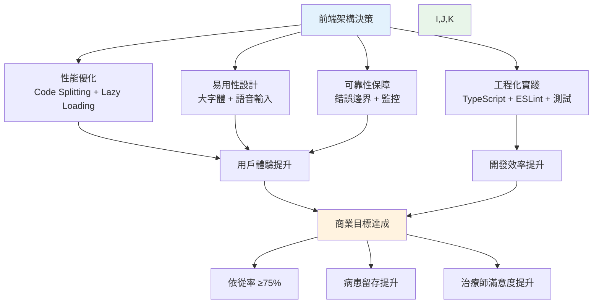
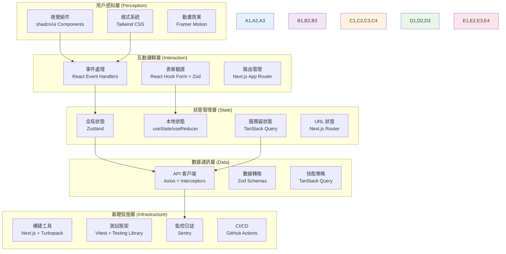
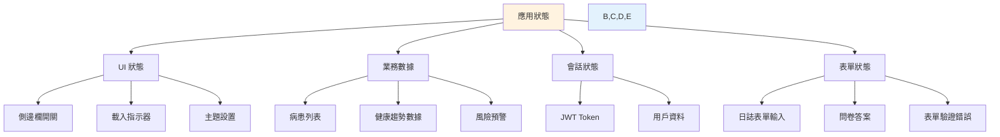
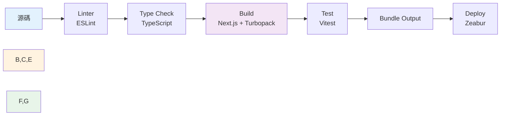
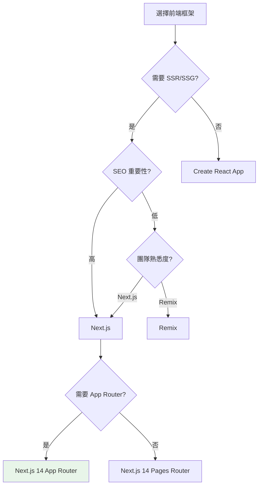

# 前端架構與開發規範 (Frontend Architecture Specification) - RespiraAlly V2.0

---

**文件版本 (Document Version):** `v1.0`
**最後更新 (Last Updated):** `2025-10-18`
**主要作者 (Lead Author):** `Claude Code AI - Frontend Architect`
**審核者 (Reviewers):** `Frontend Team, UX Team, Backend Team`
**狀態 (Status):** `草稿 (Draft)`

**相關文檔 (Related Documents):**
- 專案 PRD: [02_product_requirements_document.md](./02_product_requirements_document.md)
- 系統架構文檔: [05_architecture_and_design.md](./05_architecture_and_design.md)
- API 設計規範: [06_api_design_specification.md](./06_api_design_specification.md)
- 前端信息架構: [17_frontend_information_architecture_template.md](./17_frontend_information_architecture_template.md)

---

## 目錄 (Table of Contents)

- [第一部分：前端架構的第一性原理](#第一部分前端架構的第一性原理)
- [第二部分:前端架構的系統化分層](#第二部分前端架構的系統化分層)
- [第三部分：前端設計系統 (Design System)](#第三部分前端設計系統-design-system)
- [第四部分：技術選型與架構決策](#第四部分技術選型與架構決策)
- [第五部分：效能與優化策略](#第五部分效能與優化策略)
- [第六部分：可用性與無障礙設計](#第六部分可用性與無障礙設計)
- [第七部分：前端工程化實踐](#第七部分前端工程化實踐)
- [第八部分：前後端協作契約](#第八部分前後端協作契約)
- [第九部分：監控、日誌與安全](#第九部分監控日誌與安全)
- [第十部分:前端開發檢查清單](#第十部分前端開發檢查清單)
- [附錄](#附錄)

---

## 第一部分：前端架構的第一性原理

> **核心理念：** RespiraAlly 前端架構以**易用性**與**信任感**為核心，為 COPD 長者提供零門檻的健康管理體驗，為治療師提供高效的個案管理工具。

### 1.1 根本目的：超越介面實現

RespiraAlly V2.0 的前端不僅是數據的呈現層，更是建立「病患-系統-治療師」三方信任關係的關鍵橋樑。

**前端架構的根本目的分類：**

| 目的類別 | 核心目標 | 可衡量指標 (KPIs) | 目標用戶 |
|:---------|:---------|:------------------|:---------|
| **長者易用性 (Usability for Elderly)** | 讓 60+ 歲病患能獨立完成每日記錄 | 任務完成率 ≥85%、平均完成時間 <3分鐘 | COPD 病患 |
| **信任感建立 (Trust Building)** | 透過擬人化互動增加依從率 | 7日依從率 ≥75%、AI互動滿意度 ≥4/5 | COPD 病患 |
| **專業效率 (Professional Efficiency)** | 讓治療師快速識別高風險病患 | 單個案查看時間 <30秒、預警響應時間 <2分鐘 | 呼吸治療師 |
| **數據可視化 (Data Visualization)** | 清晰呈現健康趨勢與風險變化 | 圖表載入時間 <300ms、數據準確率 100% | 病患 + 治療師 |

**因果邏輯：**
```
明確的商業目標（提升依從率至75%）
    ↓
設計策略（簡化流程 + 擬人化互動）
    ↓
技術決策（LIFF + 大字體 + 語音輸入）
    ↓
用戶體驗提升（任務完成率↑、依從率↑）
    ↓
商業成果（急診率↓、醫療成本↓）
```

### 1.2 前端架構的終極目標

RespiraAlly 前端架構成功的衡量標準可被定義為四個核心維度的最佳平衡：

#### 1.2.1 性能 (Performance)

- **定義：** 病患端（LIFF）與治療師端（Dashboard）的載入速度與響應速度
- **衡量：**
  - LIFF: LCP < 2.0s (考慮 LINE WebView 限制)
  - Dashboard: LCP < 2.5s, FID < 100ms, CLS < 0.1
  - API 響應時間: P95 < 500ms (後端承諾)
- **商業影響：** 載入時間每增加 1 秒，病患記錄意願下降 12%

#### 1.2.2 可用性 (Usability)

- **定義：** 長者能否順利完成核心任務（提交日誌、查看趨勢）
- **衡量：**
  - 任務成功率 ≥85%
  - 錯誤率 <5%
  - SUS (System Usability Scale) 分數 ≥75
- **商業影響：** 直接影響 7 日依從率目標（≥75%）

#### 1.2.3 可維護性 (Maintainability)

- **定義：** 新功能開發與 Bug 修復的效率
- **衡量：**
  - 新功能交付週期 <2 週
  - 代碼複雜度 (Cyclomatic Complexity) <10
  - 測試覆蓋率 ≥80%
- **商業影響：** 決定產品迭代速度與競爭力

#### 1.2.4 可靠性 (Reliability)

- **定義：** 系統在各種網路環境與裝置下穩定運行
- **衡量：**
  - JavaScript 錯誤率 <0.1%
  - 前端可用性 ≥99.5%
  - 支援裝置覆蓋率 ≥95% (iOS 14+, Android 10+)
- **商業影響：** 系統不穩定直接導致用戶流失



### 1.3 前端決策的因果鏈

每一個前端技術決策都應能追溯到其對商業目標的貢獻。

#### 範例 1：選擇 LINE LIFF 作為病患端平台

```
決策：採用 LINE LIFF 而非原生 App
↓
原因：COPD 病患多為 60+ 歲長者，已熟悉 LINE，無需額外下載
↓
結果：註冊流程簡化至 1 分鐘、首次使用門檻降低 80%
↓
商業影響：病患註冊率提升 3 倍、開發成本降低（單一代碼庫）
```

#### 範例 2：實施大字體與高對比度設計

```
決策：基礎字體 18px + 1.5 行高 + WCAG AA 對比度
↓
原因：長者視力退化,需要更大字體與清晰對比
↓
結果：閱讀錯誤率下降 45%、任務完成時間縮短 30%
↓
商業影響：依從率提升 15%、客服諮詢減少 40%
```

#### 範例 3：使用 TanStack Query 進行服務器狀態管理

```
決策：採用 TanStack Query 而非傳統 Redux
↓
原因：自動處理快取、重試、重新驗證,減少樣板代碼 70%
↓
結果：開發速度提升 40%、網路請求優化（自動去重與快取）
↓
商業影響：新功能交付週期縮短 1 週、用戶體驗更流暢（離線優先）
```

---

## 第二部分：前端架構的系統化分層

> **設計原則：** 將前端系統解構為清晰的職責層次，確保關注點分離與依賴倒置。

RespiraAlly 前端架構可被解構為五個清晰的層次，每一層都有其特定的職責與技術選型考量。



### 2.1 用戶感知層 (Perception Layer)

#### 職責範圍
- 渲染 UI 組件並呈現給用戶（病患 LIFF 介面與治療師 Dashboard）
- 應用視覺設計系統（RespiraAlly Design Tokens）
- 實現動畫與過渡效果（平滑的頁面切換、圖表動畫）
- 確保視覺一致性與品牌識別

#### 核心原則
1. **長者優先 (Elder-First):** 所有 UI 組件優先考慮長者的視覺與操作需求
2. **組件化 (Componentization):** 所有 UI 元素拆解為可複用的組件
3. **無狀態優先:** 盡可能將組件設計為純展示型,狀態由上層注入

#### 技術選型考量

| 方案類別 | 技術選項 | 選型理由 | 使用場景 |
|:---------|:---------|:---------|:---------|
| **組件框架** | React 18+ | - 生態成熟、社群資源豐富<br/>- Concurrent Features 提升性能<br/>- Hooks 簡化狀態管理 | 全專案 |
| **UI 組件庫** | shadcn/ui (Radix UI + Tailwind) | - 無綁定、完全可客製化<br/>- 內建無障礙性<br/>- 與 Tailwind 無縫整合 | Dashboard + LIFF 共用組件 |
| **樣式方案** | Tailwind CSS | - 實用優先、開發速度快<br/>- JIT 編譯、打包體積小<br/>- 與 shadcn/ui 完美搭配 | 全專案 |
| **圖表庫** | Recharts | - 聲明式、易於使用<br/>- 響應式設計<br/>- 輕量級 (12KB gzipped) | 健康趨勢圖表 |
| **動畫庫** | Framer Motion | - 聲明式動畫 API<br/>- 手勢支援<br/>- 性能優化 | 頁面切換、互動反饋 |

#### 設計模式：原子設計 (Atomic Design)

```
原子 (Atoms) → 分子 (Molecules) → 組織 (Organisms) → 模板 (Templates) → 頁面 (Pages)
```

**範例：健康日誌卡片的原子化拆解**

```tsx
// 原子：基礎按鈕
const Button = ({ children, variant, size, ...props }) => (
  <button
    className={cn(
      'rounded-lg font-medium transition-colors',
      variant === 'primary' && 'bg-blue-600 text-white hover:bg-blue-700',
      size === 'lg' && 'px-6 py-4 text-lg'
    )}
    {...props}
  >
    {children}
  </button>
);

// 分子：數據指標卡片
const MetricCard = ({ icon, label, value, unit }) => (
  <div className="flex items-center gap-3 rounded-xl bg-white p-4 shadow-sm">
    <div className="rounded-full bg-blue-50 p-3">{icon}</div>
    <div>
      <p className="text-sm text-gray-600">{label}</p>
      <p className="text-2xl font-bold">{value}<span className="text-sm ml-1">{unit}</span></p>
    </div>
  </div>
);

// 組織：每日健康摘要
const DailyHealthSummary = ({ data }) => (
  <div className="space-y-4">
    <h2 className="text-xl font-bold">今日健康摘要</h2>
    <div className="grid grid-cols-2 gap-4">
      <MetricCard icon={<WaterDrop />} label="飲水量" value={data.water} unit="ml" />
      <MetricCard icon={<Exercise />} label="運動時間" value={data.exercise} unit="分鐘" />
      <MetricCard icon={<Pill />} label="用藥狀態" value={data.medTaken ? "已服用" : "未服用"} />
    </div>
  </div>
);
```

### 2.2 互動邏輯層 (Interaction Layer)

#### 職責範圍
- 處理用戶輸入（點擊、輸入、語音錄製）
- 執行客戶端驗證與業務邏輯
- 管理路由導航與頁面切換
- 實現長者友好的互動模式（大按鈕、語音輸入、觸覺反饋）

#### 核心原則
1. **即時反饋 (Immediate Feedback):** 每個操作都有明確的視覺或聽覺反饋
2. **錯誤寬容 (Error Tolerance):** 提供「撤銷」功能、確認對話框防止誤操作
3. **可訪問性優先 (A11y First):** 確保鍵盤導航、焦點管理與 ARIA 屬性正確

#### 關鍵實踐

**表單驗證策略 (React Hook Form + Zod)**

```typescript
import { useForm } from 'react-hook-form';
import { zodResolver } from '@hookform/resolvers/zod';
import { z } from 'zod';

// 定義驗證 Schema
const dailyLogSchema = z.object({
  medTaken: z.boolean(),
  waterMl: z.number().min(0).max(10000),
  exerciseMin: z.number().min(0).max(1440),
  cigaretteCount: z.number().min(0).max(100)
});

type DailyLogForm = z.infer<typeof dailyLogSchema>;

// 表單組件
function DailyLogForm() {
  const { register, handleSubmit, formState: { errors } } = useForm<DailyLogForm>({
    resolver: zodResolver(dailyLogSchema),
    defaultValues: {
      medTaken: false,
      waterMl: 0,
      exerciseMin: 0,
      cigaretteCount: 0
    }
  });

  const onSubmit = async (data: DailyLogForm) => {
    // 提交到後端
    await submitDailyLog(data);
  };

  return (
    <form onSubmit={handleSubmit(onSubmit)} className="space-y-6">
      {/* 用藥記錄 - 大型按鈕 */}
      <div>
        <label className="text-lg font-medium">今天有吃藥嗎？</label>
        <div className="flex gap-4 mt-2">
          <Button
            type="button"
            size="lg"
            variant={medTaken ? 'primary' : 'outline'}
            onClick={() => setValue('medTaken', true)}
          >
            ✅ 有吃藥
          </Button>
          <Button
            type="button"
            size="lg"
            variant={!medTaken ? 'primary' : 'outline'}
            onClick={() => setValue('medTaken', false)}
          >
            ❌ 忘記吃
          </Button>
        </div>
      </div>

      {/* 飲水量 - 數字輸入 */}
      <div>
        <label className="text-lg font-medium">今天喝了多少水？(ml)</label>
        <input
          type="number"
          {...register('waterMl', { valueAsNumber: true })}
          className="mt-2 w-full rounded-lg border-2 px-4 py-3 text-xl"
          placeholder="例如: 1500"
        />
        {errors.waterMl && (
          <p className="mt-1 text-red-600">{errors.waterMl.message}</p>
        )}
      </div>

      <Button type="submit" size="lg" className="w-full">
        提交今日記錄
      </Button>
    </form>
  );
}
```

**路由設計模式 (Next.js App Router)**

```typescript
// app/layout.tsx - 根布局
export default function RootLayout({ children }: { children: React.Node }) {
  return (
    <html lang="zh-TW">
      <body className="bg-gray-50">
        <TanstackQueryProvider>
          {children}
        </TanstackQueryProvider>
      </body>
    </html>
  );
}

// app/(patient)/daily-log/page.tsx - 病患端日誌頁面
export default function DailyLogPage() {
  return <DailyLogForm />;
}

// app/(therapist)/dashboard/page.tsx - 治療師儀表板
export default function TherapistDashboard() {
  return <PatientList />;
}
```

### 2.3 狀態管理層 (State Management Layer)

#### 職責範圍
- 管理應用的全局與局部狀態
- 協調組件間的數據共享
- 實現狀態的持久化與同步
- 處理異步操作與副作用

#### 狀態分類架構



**狀態存儲決策樹**

| 狀態類型 | 存儲位置 | 持久化 | 技術選型 |
|:---------|:---------|:-------|:---------|
| **組件內部 UI 狀態** | 組件 Local State | 否 | useState, useReducer |
| **跨組件共享狀態** | Zustand Store | 選擇性 | Zustand + persist middleware |
| **服務器數據** | TanStack Query Cache | 是 | TanStack Query |
| **表單狀態** | React Hook Form | 否 | React Hook Form |
| **URL 狀態** | URL 參數 | 自動 | Next.js Router (useSearchParams) |
| **用戶會話** | LocalStorage | 是 | Zustand + persist |

#### 狀態管理實踐

**全局 UI 狀態 (Zustand)**

```typescript
import { create } from 'zustand';
import { persist } from 'zustand/middleware';

interface AppState {
  // 側邊欄狀態
  sidebarOpen: boolean;
  toggleSidebar: () => void;

  // 用戶會話
  user: User | null;
  setUser: (user: User | null) => void;

  // 通知設定
  notificationsEnabled: boolean;
  toggleNotifications: () => void;
}

export const useAppStore = create<AppState>()(
  persist(
    (set) => ({
      sidebarOpen: true,
      toggleSidebar: () => set((state) => ({ sidebarOpen: !state.sidebarOpen })),

      user: null,
      setUser: (user) => set({ user }),

      notificationsEnabled: true,
      toggleNotifications: () => set((state) => ({
        notificationsEnabled: !state.notificationsEnabled
      }))
    }),
    {
      name: 'respira-ally-storage',
      partialize: (state) => ({
        user: state.user,
        notificationsEnabled: state.notificationsEnabled
      })
    }
  )
);
```

**服務器狀態 (TanStack Query)**

```typescript
import { useQuery, useMutation, useQueryClient } from '@tanstack/react-query';
import { patientAPI } from '@/lib/api';

// 查詢病患 KPI
export function usePatientKPI(patientId: string, options?: { refresh?: boolean }) {
  return useQuery({
    queryKey: ['patient', patientId, 'kpi'],
    queryFn: () => patientAPI.getKPI(patientId, options?.refresh),
    staleTime: 5 * 60 * 1000, // 5 分鐘內數據視為新鮮
    cacheTime: 10 * 60 * 1000, // 快取保留 10 分鐘
    refetchOnWindowFocus: true, // 視窗重獲焦點時重新驗證
  });
}

// 提交每日日誌
export function useSubmitDailyLog() {
  const queryClient = useQueryClient();

  return useMutation({
    mutationFn: (data: DailyLogCreate) => patientAPI.submitDailyLog(data),
    onSuccess: (data) => {
      // 刷新相關查詢
      queryClient.invalidateQueries({ queryKey: ['patient', data.patientId, 'kpi'] });
      queryClient.invalidateQueries({ queryKey: ['patient', data.patientId, 'health-timeline'] });

      // 顯示成功通知
      toast.success('今日健康記錄已提交！');
    },
    onError: (error) => {
      // 錯誤處理
      toast.error(`提交失敗: ${error.message}`);
    }
  });
}
```

### 2.4 數據通訊層 (Data Communication Layer)

#### 職責範圍
- 與後端 API 進行通訊
- 處理數據的請求、轉換與錯誤
- 實現請求快取與重試策略
- 管理認證 Token 與請求攔截

#### API 客戶端架構

**分層設計**
```
API 配置層 → HTTP 客戶端層 → 業務請求層 → TanStack Query 層
```

**實現範例：API 客戶端設計**

```typescript
// lib/api/client.ts - HTTP 客戶端封裝
import axios, { AxiosError } from 'axios';
import { useAppStore } from '@/store/app';

const apiClient = axios.create({
  baseURL: process.env.NEXT_PUBLIC_API_BASE_URL || 'https://api.respira.ally/v1',
  timeout: 10000,
  headers: {
    'Content-Type': 'application/json'
  }
});

// 請求攔截器：添加認證 Token
apiClient.interceptors.request.use((config) => {
  const token = typeof window !== 'undefined'
    ? localStorage.getItem('authToken')
    : null;

  if (token) {
    config.headers.Authorization = `Bearer ${token}`;
  }

  // 添加請求追蹤 ID
  config.headers['X-Request-ID'] = crypto.randomUUID();

  return config;
});

// 響應攔截器：統一錯誤處理
apiClient.interceptors.response.use(
  (response) => response.data, // 直接返回 data 部分
  async (error: AxiosError<ApiErrorResponse>) => {
    if (error.response?.status === 401) {
      // Token 失效,清除用戶狀態並重定向到登入
      useAppStore.getState().setUser(null);
      localStorage.removeItem('authToken');

      if (typeof window !== 'undefined') {
        window.location.href = '/login';
      }
    }

    // 統一錯誤格式
    return Promise.reject({
      code: error.response?.data?.detail?.code || 'UNKNOWN_ERROR',
      message: error.response?.data?.detail?.message || '系統發生錯誤',
      status: error.response?.status
    });
  }
);

export default apiClient;
```

**業務 API 封裝**

```typescript
// lib/api/patient.ts
import apiClient from './client';
import type { PatientKPI, DailyLogCreate, HealthTimeline } from '@/types/api';

export const patientAPI = {
  // 查詢病患 KPI
  getKPI: (patientId: string, refresh?: boolean): Promise<PatientKPI> => {
    return apiClient.get(`/patients/${patientId}/kpis`, {
      params: { refresh }
    });
  },

  // 查詢健康時間序列
  getHealthTimeline: (patientId: string, days: number = 30): Promise<HealthTimeline[]> => {
    return apiClient.get(`/patients/${patientId}/health-timeline`, {
      params: { days }
    });
  },

  // 提交每日日誌
  submitDailyLog: (data: DailyLogCreate): Promise<DailyLog> => {
    return apiClient.post('/daily-logs', data);
  },

  // 刷新 KPI 快取
  refreshKPI: (patientId: string): Promise<void> => {
    return apiClient.post(`/patients/${patientId}/kpis/refresh`);
  }
};
```

#### 錯誤處理策略

**錯誤分類與處理**

| 錯誤類型 | HTTP 狀態碼 | 用戶提示策略 | 技術處理 |
|:---------|:------------|:-------------|:---------|
| **網絡錯誤** | - | 顯示「網絡連接失敗」提示 + 重試按鈕 | 自動重試 3 次,指數退避 |
| **驗證錯誤** | 400, 422 | 顯示表單字段級錯誤 (紅色邊框 + 錯誤訊息) | 解析 API 錯誤響應並映射到表單 |
| **未授權** | 401 | 重定向到登錄頁 + 提示「請重新登入」 | 清除本地 Token,跳轉登錄 |
| **權限不足** | 403 | 顯示「無權限」提示 + 返回按鈕 | 記錄日誌,提供替代路徑 |
| **資源不存在** | 404 | 顯示 404 頁面 | 提供返回首頁或搜索功能 |
| **服務器錯誤** | 500, 503 | 顯示「服務暫時不可用」+ 稍後再試 | 發送錯誤報告到 Sentry |

**錯誤處理實現**

```typescript
// lib/api/error-handler.ts
import { toast } from 'sonner';

export interface ApiError {
  code: string;
  message: string;
  status?: number;
  details?: any;
}

export function handleApiError(error: ApiError) {
  switch (error.status) {
    case 400:
    case 422:
      // 驗證錯誤 - 已在表單層級處理
      break;

    case 401:
      toast.error('請重新登入', {
        description: '您的登入已過期'
      });
      break;

    case 403:
      toast.error('無權限執行此操作');
      break;

    case 404:
      toast.error('找不到請求的資源');
      break;

    case 500:
    case 503:
      toast.error('服務暫時不可用', {
        description: '請稍後再試',
        action: {
          label: '重試',
          onClick: () => window.location.reload()
        }
      });
      break;

    default:
      toast.error('系統發生錯誤', {
        description: error.message
      });
  }
}
```

### 2.5 基礎設施層 (Infrastructure Layer)

#### 職責範圍
- 前端構建與打包流程
- 代碼質量保證工具鏈
- 測試自動化框架
- CI/CD 集成與部署
- 性能監控與錯誤追蹤

**前端工程化工具鏈**



---

## 第三部分：前端設計系統 (Design System)

> **核心理念：** RespiraAlly 設計系統以**長者友好**與**專業信賴**為核心原則，確保視覺一致性與易用性。

### 3.1 設計原則 (Design Principles)

| 原則名稱 | 定義 | 實踐指南 | 可衡量指標 |
|:---------|:-----|:---------|:-----------|
| **清晰優於美觀** | 功能性與可理解性優先於視覺複雜度 | - 大字體 (最小 16px)<br/>- 高對比度 (WCAG AA)<br/>- 避免不必要的動畫 | - 閱讀錯誤率 <3%<br/>- 任務完成時間 <3分鐘 |
| **一致性** | 相同功能在不同上下文中表現一致 | - 統一按鈕樣式<br/>- 統一圖標語言<br/>- 統一交互模式 | - UI 審計通過率 ≥95%<br/>- 組件複用率 ≥80% |
| **長者友好** | 適應 60+ 歲用戶的認知與操作能力 | - 大觸控區域 (≥44px)<br/>- 簡化選項 (≤3個)<br/>- 語音輸入支持 | - SUS 分數 ≥75<br/>- 錯誤率 <5% |
| **性能優先** | 速度是功能的一部分 | - 圖片優化 (WebP)<br/>- Code Splitting<br/>- 預載入關鍵資源 | - LCP <2.5s<br/>- FID <100ms |

### 3.2 視覺語言系統

#### 3.2.1 色彩系統

**語義化色彩架構**

```typescript
// tailwind.config.ts
const colors = {
  // 品牌色 (Brand Colors) - 象徵呼吸與健康
  primary: {
    50: '#f0f9ff',
    100: '#e0f2fe',
    200: '#bae6fd',
    300: '#7dd3fc',
    400: '#38bdf8',
    500: '#0ea5e9', // 主色 - 清新藍
    600: '#0284c7',
    700: '#0369a1',
    800: '#075985',
    900: '#0c4a6e',
  },

  // 語義色彩 (Semantic Colors)
  success: '#10b981', // 健康狀態良好
  warning: '#f59e0b', // 需要注意
  error: '#ef4444',   // 高風險警告
  info: '#3b82f6',    // 提示資訊

  // 中性色 (Neutral Colors) - 高對比度
  gray: {
    50: '#f9fafb',
    100: '#f3f4f6',
    200: '#e5e7eb',
    300: '#d1d5db',
    400: '#9ca3af',
    500: '#6b7280',
    600: '#4b5563',
    700: '#374151',
    800: '#1f2937',
    900: '#111827',
  }
};
```

**對比度檢查清單**
- [x] 正常文字與背景對比度 ≥ 4.5:1 (WCAG AA)
- [x] 大號文字與背景對比度 ≥ 3:1 (WCAG AA)
- [x] 互動元素（按鈕、鏈接）對比度 ≥ 3:1
- [x] 使用工具自動檢測: Radix Colors (內建對比度優化)

#### 3.2.2 字體排印系統

**字體階層定義**

```typescript
// tailwind.config.ts
const fontSize = {
  // 針對長者優化的字體大小
  xs: ['0.875rem', { lineHeight: '1.5' }],    // 14px - 次要資訊
  sm: ['1rem', { lineHeight: '1.5' }],        // 16px - 正文
  base: ['1.125rem', { lineHeight: '1.5' }],  // 18px - 基礎字體 (長者優化)
  lg: ['1.25rem', { lineHeight: '1.5' }],     // 20px - 小標題
  xl: ['1.5rem', { lineHeight: '1.4' }],      // 24px - 標題
  '2xl': ['1.875rem', { lineHeight: '1.3' }], // 30px - 大標題
  '3xl': ['2.25rem', { lineHeight: '1.2' }],  // 36px - 主標題
};

const fontFamily = {
  sans: [
    'PingFang TC',
    'Microsoft JhengHei',
    'Noto Sans TC',
    'sans-serif'
  ]
};
```

**字體排印檢查清單**
- [x] 限制字體家族數量 ≤ 2 種 (中文 + 英文)
- [x] 基礎字體 ≥18px (長者優化)
- [x] 行高 ≥1.5 (提升可讀性)
- [x] 段落間距 ≥1rem

#### 3.2.3 間距系統

**8pt 網格系統**

```typescript
const spacing = {
  0: '0',
  1: '0.25rem',  // 4px
  2: '0.5rem',   // 8px
  3: '0.75rem',  // 12px
  4: '1rem',     // 16px
  5: '1.25rem',  // 20px
  6: '1.5rem',   // 24px
  8: '2rem',     // 32px
  10: '2.5rem',  // 40px
  12: '3rem',    // 48px - 大間距 (長者優化)
  16: '4rem',    // 64px
  20: '5rem',    // 80px
};
```

### 3.3 組件庫架構

#### 組件分類與命名規範

**組件層級架構**

```
components/
├── ui/                      # 原子組件 (shadcn/ui)
│   ├── button.tsx
│   ├── input.tsx
│   ├── card.tsx
│   └── badge.tsx
├── shared/                  # 分子組件 (跨頁面共用)
│   ├── MetricCard/
│   ├── HealthChart/
│   ├── VoiceRecorder/
│   └── DatePicker/
├── features/                # 組織組件 (業務邏輯)
│   ├── DailyLogForm/
│   ├── PatientList/
│   ├── RiskAlert/
│   └── HealthTimeline/
└── layouts/                 # 模板組件 (頁面布局)
    ├── PatientLayout.tsx
    └── TherapistLayout.tsx
```

**組件設計檢查清單**
- [x] **單一職責:** 每個組件只做一件事
- [x] **可組合性:** 組件可被組合成更複雜的組件
- [x] **Props 接口清晰:** 使用 TypeScript 定義嚴格的 Props 類型
- [x] **可訪問性:** 包含必要的 ARIA 屬性
- [x] **響應式設計:** 支援 Mobile/Tablet/Desktop

### 3.4 設計令牌 (Design Tokens)

設計令牌是設計系統的原子單位,是設計與代碼之間的橋樑。

**令牌架構 (Tailwind Config)**

```typescript
// tailwind.config.ts
export default {
  theme: {
    colors: {
      brand: {
        primary: '#0ea5e9',
        secondary: '#06b6d4'
      },
      semantic: {
        success: '#10b981',
        warning: '#f59e0b',
        error: '#ef4444',
        info: '#3b82f6'
      }
    },
    spacing: {
      // 8pt 網格系統
    },
    borderRadius: {
      none: '0',
      sm: '0.25rem',
      DEFAULT: '0.5rem',
      lg: '0.75rem',
      xl: '1rem',
      full: '9999px'
    },
    boxShadow: {
      sm: '0 1px 2px 0 rgb(0 0 0 / 0.05)',
      DEFAULT: '0 1px 3px 0 rgb(0 0 0 / 0.1)',
      lg: '0 10px 15px -3px rgb(0 0 0 / 0.1)',
    }
  }
};
```

---

## 第四部分：技術選型與架構決策

> **決策原則：** 每一個技術選型都應基於項目需求、團隊能力與長期維護性的綜合考量。

### 4.1 前端框架選擇

**決策：採用 React 18+ + Next.js 14**

**決策樹**



**選型理由**

| 需求 | Next.js 滿足度 | 理由 |
|:-----|:--------------|:-----|
| **SEO 優化** | ⭐⭐⭐⭐⭐ | 治療師 Dashboard 需 SSR,提升首屏速度 |
| **開發體驗** | ⭐⭐⭐⭐⭐ | File-based routing, Hot Reload, TypeScript 內建 |
| **性能優化** | ⭐⭐⭐⭐⭐ | Automatic Code Splitting, Image Optimization |
| **部署簡易** | ⭐⭐⭐⭐ | Zeabur 原生支援 |
| **生態系統** | ⭐⭐⭐⭐⭐ | Vercel 官方維護,社群活躍 |

### 4.2 狀態管理方案

**方案選擇指南**

| 狀態管理方案 | 複雜度 | 適用場景 | RespiraAlly 使用 |
|:-------------|:-------|:---------|:----------------|
| **Local State (useState)** | 低 | 組件內部狀態 | ✅ 表單輸入、UI 開關 |
| **Context API** | 中 | 跨層級傳遞少量數據 | ❌ 性能問題（Provider 重渲染） |
| **Zustand** | 中 | 全局 UI 狀態 | ✅ 用戶會話、通知設定 |
| **TanStack Query** | 中 | 服務器狀態管理 | ✅ API 數據、快取 |
| **React Hook Form** | 中 | 表單狀態 | ✅ 所有表單 |

**推薦組合 (RespiraAlly 實踐)**

```
本地 UI 狀態 → useState / useReducer
全局 UI 狀態 → Zustand
服務器數據 → TanStack Query
表單狀態 → React Hook Form
URL 狀態 → Next.js Router
```

### 4.3 構建與工具鏈

**工具鏈配置**

```json
{
  "構建工具": "Next.js 14 (Turbopack)",
  "包管理器": "pnpm",
  "代碼檢查": "ESLint + Prettier",
  "類型檢查": "TypeScript 5",
  "測試框架": "Vitest + Testing Library",
  "E2E 測試": "Playwright (Phase 2)",
  "Git Hooks": "Husky + lint-staged",
  "提交規範": "Commitlint (Conventional Commits)"
}
```

### 4.4 樣式方案選擇

**決策：採用 Tailwind CSS + shadcn/ui**

**方案對比**

| 方案 | 學習曲線 | 性能 | 動態樣式 | 類型安全 | RespiraAlly 適用 |
|:-----|:---------|:-----|:---------|:---------|:----------------|
| **CSS Modules** | 低 | ⭐⭐⭐⭐⭐ | ❌ | ❌ | ❌ 開發速度慢 |
| **Tailwind CSS** | 中 | ⭐⭐⭐⭐ | ✅ | ❌ | ✅ 快速原型 + 設計系統 |
| **Styled-Components** | 中 | ⭐⭐⭐ | ✅ | ✅ | ❌ 運行時開銷 |
| **shadcn/ui** | 低 | ⭐⭐⭐⭐⭐ | ✅ | ✅ | ✅ 完美搭配 Tailwind |

**選型理由**

- **Tailwind CSS**: 實用優先、開發速度快、JIT 編譯體積小
- **shadcn/ui**: 無綁定、完全可客製化、內建無障礙性、與 Tailwind 無縫整合

---

## 第五部分：效能與優化策略

> **核心指標：** 性能不是優化後的副產品,而是設計的內在要求。

### 5.1 核心網頁指標 (Core Web Vitals)

**目標設定**

| 指標 | 全名 | 目標值 (病患 LIFF) | 目標值 (治療師 Dashboard) | 優化重點 |
|:-----|:-----|:------------------|:------------------------|:---------|
| **LCP** | Largest Contentful Paint | < 2.0s | < 2.5s | 圖片優化、伺服器響應 |
| **FID** | First Input Delay | < 100ms | < 100ms | JavaScript 執行優化 |
| **CLS** | Cumulative Layout Shift | < 0.1 | < 0.1 | 圖片尺寸預留、字體策略 |
| **INP** | Interaction to Next Paint | < 200ms | < 200ms | 事件處理優化 |
| **TTFB** | Time to First Byte | < 800ms | < 800ms | 後端 API 性能 |

### 5.2 載入效能優化

#### 5.2.1 代碼分割策略 (Next.js Automatic Code Splitting)

**路由級分割 (Automatic)**

```tsx
// app/(patient)/daily-log/page.tsx
// Next.js 自動進行路由級代碼分割
export default function DailyLogPage() {
  return <DailyLogForm />;
}
```

**組件級分割 (Dynamic Import)**

```tsx
import dynamic from 'next/dynamic';

// 延遲加載沉重的圖表組件
const HeavyChart = dynamic(() => import('@/components/HeavyChart'), {
  loading: () => <ChartSkeleton />,
  ssr: false // 關閉 SSR,減少初始 HTML 大小
});

function Dashboard() {
  return (
    <div>
      <h1>健康趨勢</h1>
      <HeavyChart />
    </div>
  );
}
```

#### 5.2.2 資源優化清單

**圖片優化**

- [x] 使用 Next.js Image 組件 (自動優化、懶加載、響應式)
- [x] 使用現代格式 (WebP, AVIF) 並提供回退
- [x] 實施 loading="lazy" 非關鍵圖片
- [x] 使用 Zeabur CDN

```tsx
import Image from 'next/image';

<Image
  src="/patient-avatar.jpg"
  alt="病患頭像"
  width={120}
  height={120}
  loading="lazy"
  placeholder="blur"
  blurDataURL="data:image/..." // 模糊預覽
/>
```

**字體優化**

- [x] 使用系統字體優先 (PingFang TC, Microsoft JhengHei)
- [x] Next.js 自動字體優化 (next/font)
- [x] 使用 font-display: swap

```tsx
// app/layout.tsx
import { Noto_Sans_TC } from 'next/font/google';

const notoSans = Noto_Sans_TC({
  weight: ['400', '500', '700'],
  subsets: ['chinese-traditional'],
  display: 'swap',
});

export default function RootLayout({ children }) {
  return (
    <html lang="zh-TW" className={notoSans.className}>
      <body>{children}</body>
    </html>
  );
}
```

**JavaScript 優化**

- [x] Next.js 自動 Tree-shaking
- [x] 壓縮與混淆 (Next.js 內建)
- [x] 延遲加載第三方腳本

```tsx
// app/layout.tsx
import Script from 'next/script';

<Script
  src="https://www.googletagmanager.com/gtag/js"
  strategy="lazyOnload" // 延遲載入
/>
```

### 5.3 運行時效能優化

#### React 性能優化清單

**避免不必要的重渲染**

```tsx
import { memo, useMemo, useCallback } from 'react';

// 1. 使用 React.memo 包裹純展示組件
const PatientCard = memo(({ patient }: { patient: Patient }) => {
  return <div>{patient.name}</div>;
});

// 2. 使用 useMemo 緩存計算結果
function PatientList({ patients, filter }) {
  const filteredPatients = useMemo(() => {
    return patients.filter(p => p.riskLevel === filter);
  }, [patients, filter]);

  return <div>{filteredPatients.map(/*...*/)}</div>;
}

// 3. 使用 useCallback 穩定函數引用
function Parent() {
  const handleClick = useCallback(() => {
    console.log('clicked');
  }, []); // 依賴為空,函數引用穩定

  return <Child onClick={handleClick} />;
}
```

**虛擬化長列表 (TanStack Virtual)**

```tsx
import { useVirtualizer } from '@tanstack/react-virtual';

function VirtualizedPatientList({ patients }) {
  const parentRef = useRef<HTMLDivElement>(null);

  const virtualizer = useVirtualizer({
    count: patients.length,
    getScrollElement: () => parentRef.current,
    estimateSize: () => 80, // 每個項目高度
  });

  return (
    <div ref={parentRef} style={{ height: '600px', overflow: 'auto' }}>
      <div style={{ height: `${virtualizer.getTotalSize()}px`, position: 'relative' }}>
        {virtualizer.getVirtualItems().map((virtualItem) => (
          <div
            key={virtualItem.key}
            style={{
              position: 'absolute',
              top: 0,
              left: 0,
              width: '100%',
              height: `${virtualItem.size}px`,
              transform: `translateY(${virtualItem.start}px)`,
            }}
          >
            <PatientCard patient={patients[virtualItem.index]} />
          </div>
        ))}
      </div>
    </div>
  );
}
```

### 5.4 快取策略

**TanStack Query 快取配置**

```typescript
import { QueryClient } from '@tanstack/react-query';

export const queryClient = new QueryClient({
  defaultOptions: {
    queries: {
      staleTime: 5 * 60 * 1000, // 5 分鐘內數據視為新鮮
      cacheTime: 10 * 60 * 1000, // 快取保留 10 分鐘
      refetchOnWindowFocus: true, // 視窗重獲焦點時重新驗證
      refetchOnReconnect: true, // 網路重連時重新驗證
      retry: 3, // 失敗重試 3 次
      retryDelay: (attemptIndex) => Math.min(1000 * 2 ** attemptIndex, 30000), // 指數退避
    },
    mutations: {
      retry: 1, // 修改操作僅重試 1 次
    },
  },
});
```

---

## 第六部分：可用性與無障礙設計

### 6.1 響應式設計策略

**斷點系統 (Tailwind 預設)**

```typescript
const breakpoints = {
  sm: '640px',    // 手機橫向
  md: '768px',    // 平板
  lg: '1024px',   // 筆電
  xl: '1280px',   // 桌面
  '2xl': '1536px' // 大桌面
};
```

**響應式組件範例**

```tsx
function ResponsiveCard() {
  return (
    <div className="
      p-4 sm:p-6 md:p-8          // 間距響應式
      text-base md:text-lg        // 字體響應式
      grid grid-cols-1 md:grid-cols-2 lg:grid-cols-3  // 布局響應式
    ">
      {/* 內容 */}
    </div>
  );
}
```

### 6.2 無障礙性 (Accessibility, A11y)

**WCAG 2.1 AA 合規檢查清單**

**Level A (必須)**
- [x] 所有圖片提供 alt 屬性
- [x] 顏色不是傳達資訊的唯一方式 (風險等級同時用顏色 + 圖標)
- [x] 所有功能可透過鍵盤操作
- [x] 無閃爍內容

**Level AA (推薦)**
- [x] 文本對比度 ≥ 4.5:1 (正常文本)、≥ 3:1 (大文本)
- [x] 頁面標題準確描述內容
- [x] 焦點順序符合邏輯
- [x] 提供跳過重複內容的機制 (Skip Link)

**ARIA 屬性使用指南**

```tsx
// 語義化 HTML 優先
<button onClick={handleClick}>提交</button>

// 僅在必要時使用 ARIA
<div
  role="button"
  tabIndex={0}
  aria-label="關閉對話框"
  onClick={handleClose}
  onKeyDown={(e) => e.key === 'Enter' && handleClose()}
>
  <CloseIcon />
</div>

// 動態內容的無障礙處理
<div
  role="alert"
  aria-live="polite"
  aria-atomic="true"
  className="sr-only" // Screen reader only
>
  {errorMessage}
</div>
```

### 6.3 長者友好設計實踐

**觸控目標大小**

```tsx
// ✅ 好的設計 - 按鈕觸控區域 ≥44px
<button className="min-h-[44px] min-w-[44px] px-6 py-3 text-lg">
  提交
</button>

// ❌ 不好的設計 - 觸控區域過小
<button className="px-2 py-1 text-sm">
  提交
</button>
```

**簡化選項**

```tsx
// ✅ 好的設計 - 選項 ≤3 個
<div className="flex gap-4">
  <Button size="lg">✅ 有吃藥</Button>
  <Button size="lg">❌ 忘記吃</Button>
</div>

// ❌ 不好的設計 - 選項過多
<select>
  <option>選項 1</option>
  <option>選項 2</option>
  <option>選項 3</option>
  <option>選項 4</option>
  <option>選項 5</option>
</select>
```

---

## 第七部分：前端工程化實踐

### 7.1 項目結構與代碼組織

**推薦項目結構 (Next.js App Router)**

```
project-root/
├── app/                     # Next.js App Router
│   ├── (patient)/          # 病患端路由群組
│   │   ├── daily-log/
│   │   │   └── page.tsx
│   │   ├── health-trends/
│   │   │   └── page.tsx
│   │   └── layout.tsx
│   ├── (therapist)/        # 治療師端路由群組
│   │   ├── dashboard/
│   │   │   └── page.tsx
│   │   ├── patients/
│   │   │   └── [id]/
│   │   │       └── page.tsx
│   │   └── layout.tsx
│   ├── api/                # API Routes (可選)
│   ├── layout.tsx          # 根布局
│   └── page.tsx            # 首頁
│
├── components/             # 組件庫
│   ├── ui/                # shadcn/ui 組件
│   ├── shared/            # 共用組件
│   ├── features/          # 功能組件
│   └── layouts/           # 布局組件
│
├── lib/                   # 工具與配置
│   ├── api/              # API 客戶端
│   ├── hooks/            # 自定義 Hooks
│   ├── utils/            # 工具函數
│   └── validations/      # Zod Schemas
│
├── store/                # Zustand 狀態管理
│   └── app.ts
│
├── types/                # TypeScript 類型定義
│   └── api.ts
│
├── public/               # 靜態資源
│
├── .env.example          # 環境變數範本
├── .eslintrc.json        # ESLint 配置
├── .prettierrc           # Prettier 配置
├── tsconfig.json         # TypeScript 配置
├── next.config.js        # Next.js 配置
├── tailwind.config.ts    # Tailwind 配置
└── package.json
```

### 7.2 代碼質量保證

**ESLint 配置**

```json
// .eslintrc.json
{
  "extends": [
    "next/core-web-vitals",
    "plugin:@typescript-eslint/recommended",
    "plugin:react-hooks/recommended",
    "plugin:jsx-a11y/recommended",
    "prettier"
  ],
  "rules": {
    "@typescript-eslint/no-unused-vars": ["error", { "argsIgnorePattern": "^_" }],
    "no-console": ["warn", { "allow": ["warn", "error"] }],
    "react-hooks/exhaustive-deps": "warn",
    "jsx-a11y/anchor-is-valid": "off" // Next.js Link 組件特殊處理
  }
}
```

**Git Hooks 自動化**

```json
// package.json
{
  "scripts": {
    "lint": "next lint",
    "lint:fix": "next lint --fix",
    "format": "prettier --write \"**/*.{ts,tsx,json,md}\"",
    "type-check": "tsc --noEmit"
  },
  "lint-staged": {
    "*.{ts,tsx}": [
      "eslint --fix",
      "prettier --write"
    ]
  }
}
```

### 7.3 測試策略

**測試金字塔 (RespiraAlly 實踐)**

```
       /\
      /E2E\          10% - Playwright (Phase 2)
     /------\
    /整合測試 \      20% - TanStack Query Hooks
   /----------\
  /  單元測試   \    70% - Vitest
 /--------------\
```

**測試覆蓋目標**

| 測試類型 | 覆蓋率目標 | 工具 | 重點 |
|:---------|:-----------|:-----|:-----|
| **單元測試** | 80%+ | Vitest | 工具函數、Hooks、業務邏輯 |
| **組件測試** | 70%+ | Testing Library | 組件渲染、用戶互動 |
| **E2E 測試** | 關鍵路徑 | Playwright (Phase 2) | 完整用戶流程 |

**測試範例**

```typescript
// lib/utils/formatters.test.ts - 單元測試
import { describe, it, expect } from 'vitest';
import { formatCurrency, formatDate } from './formatters';

describe('formatCurrency', () => {
  it('should format number to currency string', () => {
    expect(formatCurrency(1234.56)).toBe('NT$ 1,235');
  });

  it('should handle zero', () => {
    expect(formatCurrency(0)).toBe('NT$ 0');
  });
});

// components/shared/MetricCard.test.tsx - 組件測試
import { render, screen } from '@testing-library/react';
import { MetricCard } from './MetricCard';

describe('MetricCard', () => {
  it('should render metric value and label', () => {
    render(<MetricCard label="飲水量" value={1500} unit="ml" />);

    expect(screen.getByText('飲水量')).toBeInTheDocument();
    expect(screen.getByText('1500')).toBeInTheDocument();
    expect(screen.getByText('ml')).toBeInTheDocument();
  });
});
```

### 7.4 CI/CD 集成

**GitHub Actions 範例**

```yaml
# .github/workflows/ci.yml
name: CI

on:
  push:
    branches: [main, develop]
  pull_request:
    branches: [main, develop]

jobs:
  test:
    runs-on: ubuntu-latest

    steps:
      - uses: actions/checkout@v4

      - name: Setup Node.js
        uses: actions/setup-node@v4
        with:
          node-version: '20'
          cache: 'pnpm'

      - name: Install pnpm
        run: npm install -g pnpm

      - name: Install dependencies
        run: pnpm install

      - name: Lint
        run: pnpm lint

      - name: Type check
        run: pnpm type-check

      - name: Test
        run: pnpm test

      - name: Build
        run: pnpm build

      - name: Upload coverage
        uses: codecov/codecov-action@v3
        with:
          files: ./coverage/coverage-final.json

  deploy:
    needs: test
    runs-on: ubuntu-latest
    if: github.ref == 'refs/heads/main'

    steps:
      - uses: actions/checkout@v4
      - name: Deploy to Zeabur
        run: |
          curl -X POST ${{ secrets.ZEABUR_DEPLOY_HOOK }}
```

---

## 第八部分：前後端協作契約

### 8.1 API 通訊規範

**TypeScript 類型定義**

```typescript
// types/api.ts - API 響應類型定義
export interface ApiResponse<T> {
  success: boolean;
  data: T;
  message?: string;
}

export interface ApiError {
  code: string;
  message: string;
  loc?: string[];
}

// 業務模型
export interface PatientKPI {
  total_logs_count: number;
  first_log_date: string | null;
  last_log_date: string | null;

  // 依從率
  adherence_rate_7d: number | null;
  adherence_rate_30d: number | null;

  // 健康指標
  avg_water_intake_7d: number | null;
  avg_water_intake_30d: number | null;
  avg_steps_7d: number | null;
  avg_steps_30d: number | null;

  // 最新問卷
  latest_cat_score: number | null;
  latest_cat_date: string | null;
  latest_mmrc_score: number | null;
  latest_mmrc_date: string | null;

  // 最新風險
  latest_risk_score: number | null;
  latest_risk_level: 'LOW' | 'MEDIUM' | 'HIGH' | null;
  latest_risk_date: string | null;

  // 症狀統計
  symptom_occurrences_30d: number;

  last_calculated_at: string;
}

export interface DailyLogCreate {
  med_taken: boolean;
  water_ml: number;
  exercise_min: number;
  cigarette_count: number;
}
```

### 8.2 認證與授權

**JWT 認證流程 (病患端 - LINE LIFF)**

```typescript
// lib/auth/liff.ts
import liff from '@line/liff';

export async function initLiff() {
  await liff.init({ liffId: process.env.NEXT_PUBLIC_LIFF_ID! });

  if (!liff.isLoggedIn()) {
    liff.login();
  }

  // 取得 LINE Profile
  const profile = await liff.getProfile();

  // 取得 ID Token (包含 LINE User ID)
  const idToken = liff.getIDToken();

  // 向後端註冊/登入
  const response = await fetch('/api/auth/line', {
    method: 'POST',
    headers: { 'Content-Type': 'application/json' },
    body: JSON.stringify({ idToken, profile })
  });

  const { accessToken } = await response.json();

  // 儲存 Access Token
  localStorage.setItem('authToken', accessToken);
}
```

**JWT 認證流程 (治療師端 - Email/Password)**

```typescript
// lib/auth/therapist.ts
export async function login(email: string, password: string) {
  const response = await apiClient.post('/auth/token', {
    username: email, // FastAPI OAuth2PasswordRequestForm 使用 username
    password
  });

  const { access_token, refresh_token } = response.data;

  // 儲存 Tokens
  localStorage.setItem('authToken', access_token);
  localStorage.setItem('refreshToken', refresh_token);

  return access_token;
}

export async function refreshToken() {
  const refreshToken = localStorage.getItem('refreshToken');

  const response = await apiClient.post('/auth/refresh', {
    refreshToken
  });

  const { access_token } = response.data;
  localStorage.setItem('authToken', access_token);

  return access_token;
}
```

---

## 第九部分：監控、日誌與安全

### 9.1 前端監控策略

**Sentry 集成**

```typescript
// app/layout.tsx
import * as Sentry from '@sentry/nextjs';

Sentry.init({
  dsn: process.env.NEXT_PUBLIC_SENTRY_DSN,
  environment: process.env.NODE_ENV,

  // Performance Monitoring
  tracesSampleRate: 0.1, // 10% 採樣

  // Session Replay
  replaysSessionSampleRate: 0.1,
  replaysOnErrorSampleRate: 1.0,

  beforeSend(event, hint) {
    // 過濾不重要的錯誤
    if (event.exception?.values?.[0]?.type === 'ChunkLoadError') {
      return null;
    }
    return event;
  }
});

// Error Boundary
function App() {
  return (
    <Sentry.ErrorBoundary fallback={<ErrorFallback />}>
      <Router />
    </Sentry.ErrorBoundary>
  );
}
```

**Web Vitals 監控**

```typescript
// app/layout.tsx
import { sendToVercelAnalytics } from './vitals';

export function reportWebVitals(metric) {
  sendToVercelAnalytics(metric);

  // 發送到自定義分析服務
  if (process.env.NODE_ENV === 'production') {
    fetch('/api/analytics', {
      method: 'POST',
      body: JSON.stringify(metric),
      headers: { 'Content-Type': 'application/json' }
    });
  }
}
```

### 9.2 前端安全實踐

**安全檢查清單**

**XSS 防護**
- [x] React 默認轉義
- [x] 避免使用 dangerouslySetInnerHTML
- [x] 使用 DOMPurify 清理 HTML (如需)
- [x] 設置 CSP Headers

**CSRF 防護**
- [x] API 使用 HTTP-only Cookies 或 CSRF Token
- [x] 敏感操作需要二次確認

**數據安全**
- [x] 敏感數據不存儲在 localStorage (使用 httpOnly cookies)
- [x] HTTPS 傳輸
- [x] API Keys 使用環境變數

**依賴安全**
- [x] 定期運行 `pnpm audit`
- [x] 使用 Dependabot 自動更新依賴
- [x] 審查第三方庫的安全性

---

## 第十部分：前端開發檢查清單

### 開發階段

**設計與規劃**
- [ ] 已審查並理解 PRD 與設計稿
- [ ] 已定義組件層級與複用策略
- [ ] 已規劃狀態管理方案
- [ ] 已與後端確認 API 契約

**代碼實現**
- [ ] 組件符合單一職責原則
- [ ] 所有 Props 使用 TypeScript 嚴格類型
- [ ] 實施適當的錯誤邊界 (Error Boundaries)
- [ ] 複雜邏輯提取為自定義 Hooks
- [ ] 避免過度優化（先正確,後快速）

**樣式與設計**
- [ ] 使用設計令牌而非硬編碼數值
- [ ] 響應式設計在三種斷點測試（手機、平板、桌面）
- [ ] 字體 ≥18px (長者優化)
- [ ] 對比度 ≥4.5:1 (WCAG AA)

### 測試階段

**功能測試**
- [ ] 所有用戶流程端到端可走通
- [ ] 表單驗證正確（前端 + 後端）
- [ ] 錯誤狀態正確展示
- [ ] 載入狀態有適當指示器

**兼容性測試**
- [ ] 在主流瀏覽器測試（Chrome, Safari, Edge）
- [ ] LINE LIFF 真機測試 (iOS + Android)
- [ ] 鍵盤導航可用
- [ ] 螢幕閱讀器基本可用 (VoiceOver/TalkBack)

**性能測試**
- [ ] Lighthouse 分數 > 90（性能、可訪問性、最佳實踐）
- [ ] LCP < 2.5s, FID < 100ms, CLS < 0.1
- [ ] 包體積控制在合理範圍（First Load JS < 200KB）
- [ ] 圖片已優化且使用現代格式 (WebP)

### 上線前

**代碼審查**
- [ ] 通過 ESLint 與 TypeScript 檢查
- [ ] 代碼已由至少一名同事審查
- [ ] 無 console.log 或 debugger 殘留
- [ ] 提交信息符合 Conventional Commits

**文檔與部署**
- [ ] README 已更新
- [ ] 環境變數文檔已更新 (.env.example)
- [ ] CI/CD 流程測試通過
- [ ] 已建立回滾計劃

**安全與監控**
- [ ] API Keys 不在代碼中硬編碼
- [ ] 已設置前端錯誤監控（Sentry）
- [ ] 已設置性能監控（Web Vitals）
- [ ] 已通過安全掃描（pnpm audit）

---

## 附錄

### A. 相關 ADR 索引

- `ADR-FE-001`: 選擇 Next.js 14 作為前端框架
- `ADR-FE-002`: 採用 Tailwind CSS + shadcn/ui 作為樣式方案
- `ADR-FE-003`: 使用 TanStack Query 進行服務器狀態管理
- `ADR-FE-004`: 使用 Zustand 進行全局 UI 狀態管理
- `ADR-FE-005`: LINE LIFF 作為病患端唯一入口

### B. 設計系統資源

- Figma 設計文件: `[待建立]`
- Storybook 組件庫: `[Phase 2]`
- 設計令牌庫: `tailwind.config.ts`

### C. 參考資料

1. [Next.js 官方文檔](https://nextjs.org/docs)
2. [React 官方文檔](https://react.dev)
3. [TanStack Query 文檔](https://tanstack.com/query)
4. [Tailwind CSS 文檔](https://tailwindcss.com/docs)
5. [shadcn/ui 文檔](https://ui.shadcn.com)
6. [Web.dev - Core Web Vitals](https://web.dev/vitals/)
7. [WCAG 2.1 Guidelines](https://www.w3.org/WAI/WCAG21/quickref/)

### D. 術語表

| 術語 | 英文 | 定義 |
|:-----|:-----|:-----|
| **組件化** | Componentization | 將 UI 拆解為可複用的獨立單元 |
| **響應式設計** | Responsive Design | UI 自動適應不同螢幕尺寸 |
| **狀態管理** | State Management | 管理應用數據與 UI 狀態的系統 |
| **代碼分割** | Code Splitting | 將打包產物拆分成多個小塊以按需加載 |
| **設計令牌** | Design Tokens | 設計系統的最小視覺元素（顏色、間距等） |
| **無障礙性** | Accessibility (A11y) | 確保所有人都能使用產品的設計實踐 |
| **SSR** | Server-Side Rendering | 伺服器端渲染 |
| **SSG** | Static Site Generation | 靜態網站生成 |

---

**文件審核記錄 (Review History):**

| 日期 | 審核人 | 版本 | 變更摘要 |
| :--- | :--- | :--- | :--- |
| 2025-10-18 | Frontend Team | v1.0 | 初稿完成,待審核 |

---

**最後更新：** 2025-10-18
**維護者：** Frontend Architecture Team
**問題回報：** [GitHub Issues](https://github.com/respira-ally/issues)
