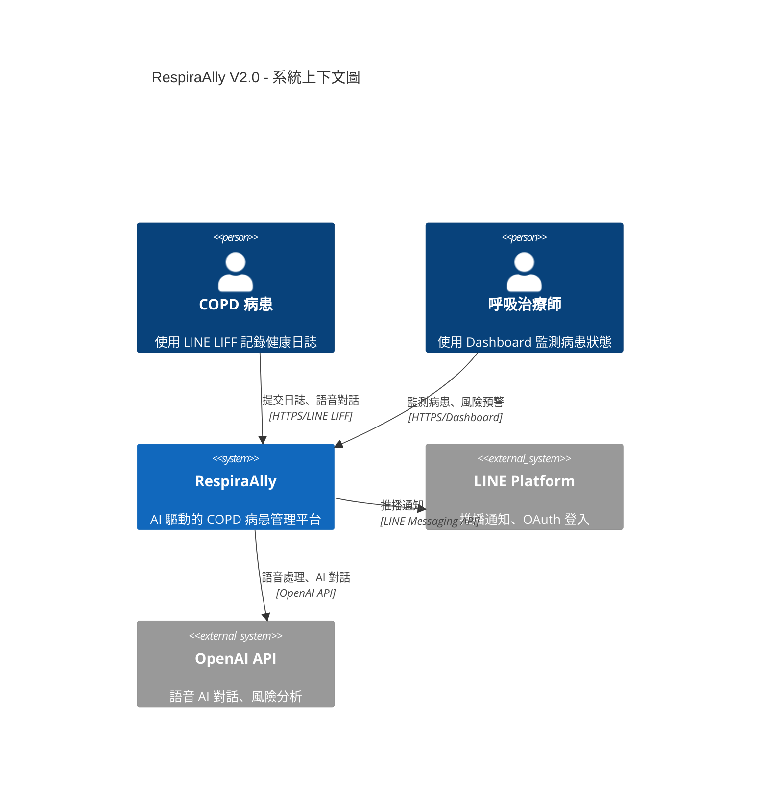
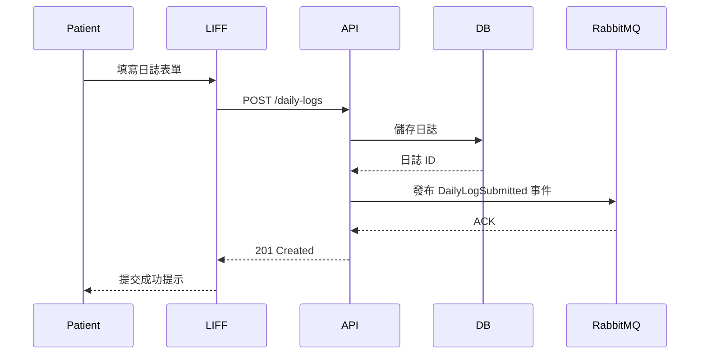

# 📚 Documentation and Maintenance Guide - RespiraAlly V2.0

---

**文件版本 (Document Version):** `v1.0.0`
**最後更新 (Last Updated):** `2025-10-23`
**主要作者 (Lead Author):** `TaskMaster Hub / Claude Code AI - Documentation Lead`
**狀態 (Status):** `使用中 (In Use)`

**相關文檔:**
- **專案架構:** [05_architecture_and_design.md](./05_architecture_and_design.md) - 系統架構總覽
- **API 設計規範:** [06_api_design_specification.md](./06_api_design_specification.md) - API 文檔標準
- **前端架構:** [12_frontend_architecture_specification.md](./12_frontend_architecture_specification.md) - 前端文檔規範

---

## 🎯 Purpose

本指南提供 RespiraAlly V2.0 專案的**文檔創建、維護和管理**的全面指南，確保知識保存與團隊協作效率。

**核心目標**:
- ✅ **知識保存**: 文檔即代碼（Documentation as Code）
- ✅ **團隊協作**: 降低新成員學習曲線
- ✅ **使用者友善**: 清晰的 API 文檔與使用指南
- ✅ **持續更新**: 自動化文檔生成與版本控制

---

## 📖 Documentation Types

### 1. **API Documentation（API 文檔）**

#### 1.1 OpenAPI/Swagger 規範

**檔案位置**: `backend/src/respira_ally/openapi.json` (自動生成)

**訪問方式**:
- **開發環境**: http://localhost:8000/docs (Swagger UI)
- **開發環境**: http://localhost:8000/redoc (ReDoc)
- **生產環境**: 僅允許內部 IP 訪問

**自動生成**:
```python
# backend/src/respira_ally/main.py
from fastapi import FastAPI

app = FastAPI(
    title="RespiraAlly API",
    version="2.0.0",
    description="AI-powered COPD Patient Management Platform",
    openapi_url="/api/v1/openapi.json",  # OpenAPI Schema
    docs_url="/docs",                     # Swagger UI
    redoc_url="/redoc"                    # ReDoc
)
```

**範例 - 端點文檔**:
```python
@router.post(
    "/daily-logs",
    response_model=DailyLogResponse,
    status_code=201,
    summary="提交每日健康日誌",
    description="""
    病患提交當日的健康日誌，包含飲水量、用藥情況、症狀等資訊。

    **權限要求**: 僅病患本人可提交

    **冪等性**: 支援（使用 Idempotency-Key Header）

    **業務規則**:
    - 每日僅可提交一筆日誌
    - 不可提交未來日期
    - 飲水量範圍 0-4000ml
    """,
    responses={
        201: {"description": "日誌創建成功"},
        409: {"description": "當日日誌已存在"},
        422: {"description": "驗證失敗"}
    },
    tags=["Daily Logs"]
)
async def create_daily_log(
    data: DailyLogCreate,
    idempotency_key: str | None = Header(None),
    current_user: TokenData = Depends(get_current_patient)
):
    # ... implementation
    pass
```

#### 1.2 API 文檔維護規範

**必須包含的資訊**:
- [ ] **Summary**: 簡短描述（≤ 80 字元）
- [ ] **Description**: 詳細說明（業務規則、權限要求、冪等性）
- [ ] **Request Body**: Pydantic Schema + 範例
- [ ] **Response**: Pydantic Schema + 範例
- [ ] **Error Codes**: 所有可能的錯誤狀態碼
- [ ] **Tags**: 功能分類（Auth, Patients, Daily Logs, Surveys）

**更新流程**:
1. 修改 API 端點 → Pydantic Schema 自動更新 OpenAPI
2. 提交 PR → CI/CD 自動生成最新 OpenAPI JSON
3. 部署後 → Swagger UI 自動更新

---

### 2. **Technical Architecture Documentation（技術架構文檔）**

#### 2.1 系統總覽文檔

**檔案**: [05_architecture_and_design.md](./05_architecture_and_design.md)

**內容**:
- 🎯 **系統目標**: RespiraAlly 解決什麼問題？
- 🏗️ **架構圖**: C4 Model（Context, Container, Component）
- 🔄 **資料流**: 請求從前端到後端的完整流程
- 🗄️ **資料庫設計**: ER Diagram + Schema 說明
- 🛡️ **安全架構**: 認證授權機制、加密策略

**Mermaid 圖表範例**:


#### 2.2 組件文檔

**檔案**: [10_class_relationships_and_module_design.md](./10_class_relationships_and_module_design.md)

**內容**:
- 📦 **模組職責**: 每個模組的 Single Responsibility
- 🔗 **模組依賴**: 依賴圖（避免循環依賴）
- 🏛️ **Clean Architecture 分層**: Presentation → Application → Domain → Infrastructure
- 📋 **類別圖**: 核心 Domain Entity 與 Aggregate

---

### 3. **User Documentation（使用者文檔）**

#### 3.1 治療師使用手冊

**檔案**: `docs/user-guide/therapist-manual.md`（未來建立）

**目標受眾**: 呼吸治療師

**內容大綱**:
1. **快速入門**
   - 登入 Dashboard
   - 新增病患
   - 查看病患列表

2. **病患管理**
   - 查看病患 360° 檔案
   - 解讀風險分數
   - 設定提醒通知

3. **報表功能**
   - 匯出病患健康趨勢
   - 生成月度統計報告

#### 3.2 病患使用指南

**檔案**: `docs/user-guide/patient-guide.md`（未來建立）

**目標受眾**: COPD 病患

**內容大綱**:
1. **LINE LIFF 註冊**
   - 加入 LINE 官方帳號
   - 完成註冊流程
   - 隱私政策說明

2. **每日健康日誌**
   - 填寫日誌步驟
   - 各項目說明（飲水量、用藥、症狀）

3. **語音 AI 對話**
   - 如何使用語音功能
   - 常見問題解答

---

### 4. **Developer Documentation（開發者文檔）**

#### 4.1 本地開發環境設定

**檔案**: `README.md`

**內容**:
```markdown
# RespiraAlly V2.0 - 本地開發指南

## 前置需求 (Prerequisites)
- **Python**: 3.11+
- **Node.js**: 18+
- **Docker**: 24.0+
- **Git**: 2.40+

## 快速啟動 (Quick Start)

### 1. Clone Repository
```bash
git clone https://github.com/your-org/RespiraAlly.git
cd RespiraAlly
```

### 2. Backend 設定
```bash
cd backend

# 建立虛擬環境
python -m venv .venv
source .venv/bin/activate  # Windows: .venv\Scripts\activate

# 安裝依賴
pip install -r requirements.txt

# 啟動資料庫與服務
docker-compose up -d postgres redis rabbitmq minio

# 資料庫遷移
alembic upgrade head

# 啟動 FastAPI
uvicorn respira_ally.main:app --reload --host 0.0.0.0 --port 8000
```

### 3. Frontend 設定
```bash
cd frontend/dashboard

# 安裝依賴
npm install

# 啟動開發伺服器
npm run dev
```

### 4. 驗證安裝
- **Backend API**: http://localhost:8000/docs
- **Frontend Dashboard**: http://localhost:3000
- **LIFF**: http://localhost:5173
```

#### 4.2 代碼風格指南

**檔案**: `CONTRIBUTING.md`

**內容**:
```markdown
# Contributing to RespiraAlly

## Code Style

### Python (Backend)
- **Formatter**: Black (120 字元/行)
- **Linter**: Ruff
- **Type Checker**: Mypy
- **Docstring**: Google Style

**範例**:
```python
def calculate_risk_score(patient: Patient, log: DailyLog) -> RiskScore:
    """計算病患風險分數

    Args:
        patient: 病患實體，包含基本資料與病程
        log: 當日健康日誌

    Returns:
        RiskScore: 風險分數物件 (0-100)

    Raises:
        ValueError: 若日誌日期為未來日期
    """
    # ... implementation
```

### TypeScript (Frontend)
- **Formatter**: Prettier
- **Linter**: ESLint
- **Style**: Airbnb + Elder-First 規範

**範例**:
```typescript
/**
 * 計算病患依從率
 * @param logs - 病患日誌陣列
 * @param days - 統計天數
 * @returns 依從率百分比 (0-100)
 */
function calculateAdherenceRate(
  logs: DailyLog[],
  days: number = 30
): number {
  // ... implementation
}
```

## Git Commit 規範

使用 Conventional Commits:
- `feat(api): add patient KPI endpoint`
- `fix(liff): resolve daily log form validation`
- `docs(readme): update quick start guide`
```

#### 4.3 排查指南

**檔案**: `docs/troubleshooting.md`

**內容**:
```markdown
# 常見問題排查 (Troubleshooting)

## Backend 問題

### 問題 1: 資料庫連線失敗
**症狀**: `sqlalchemy.exc.OperationalError: connection refused`

**解決方法**:
1. 檢查 Docker 容器是否運行
   ```bash
   docker ps | grep postgres
   ```
2. 檢查 `.env` 文件中的 `DATABASE_URL`
3. 重啟 PostgreSQL 容器
   ```bash
   docker-compose restart postgres
   ```

### 問題 2: Alembic 遷移失敗
**症狀**: `alembic.util.exc.CommandError: Can't locate revision identified by 'xyz'`

**解決方法**:
1. 檢查當前版本
   ```bash
   alembic current
   ```
2. 重置資料庫 (開發環境)
   ```bash
   alembic downgrade base
   alembic upgrade head
   ```

## Frontend 問題

### 問題 3: CORS 錯誤
**症狀**: `Access to XMLHttpRequest blocked by CORS policy`

**解決方法**:
1. 確認 Backend CORS 設定
   ```python
   # backend/src/respira_ally/main.py
   app.add_middleware(
       CORSMiddleware,
       allow_origins=["http://localhost:3000"],
       allow_credentials=True,
       allow_methods=["*"],
       allow_headers=["*"],
   )
   ```
2. 重啟 FastAPI 伺服器
```

---

## 📝 Documentation Standards（文檔標準）

### Writing Guidelines（寫作指南）

#### 1. **Structure and Organization（結構與組織）**

**標題階層**:
```markdown
# 主標題 (H1) - 每個文件僅一個
## 次標題 (H2) - 主要章節
### 小節 (H3) - 子主題
#### 段落標題 (H4) - 詳細說明
```

**內容組織**:
- ✅ 使用編號列表表示步驟
- ✅ 使用項目符號表示要點
- ✅ 使用表格整理比較資訊
- ✅ 使用程式碼區塊並標註語言

#### 2. **Content Guidelines（內容指南）**

**Be Concise（簡潔明瞭）**:
```markdown
❌ 冗長: "在這個部分，我們將要討論關於如何設定開發環境的相關步驟與流程"
✅ 簡潔: "開發環境設定步驟"
```

**Use Active Voice（使用主動語態）**:
```markdown
❌ 被動: "伺服器應該被配置為使用 HTTPS"
✅ 主動: "配置伺服器使用 HTTPS"
```

**Include Examples（包含範例）**:
- 每個概念都應附上可運行的程式碼範例
- 範例應完整且可直接複製使用
- 註解說明關鍵部分

**Update Regularly（定期更新）**:
- 每次 API 變更後更新文檔
- PR 必須包含文檔更新
- Sprint Review 檢查文檔同步

**Version Everything（版本控制）**:
```markdown
**文件版本**: v1.2.0
**最後更新**: 2025-10-23
**變更記錄**:
- v1.2.0 (2025-10-23): 新增語音 AI 功能文檔
- v1.1.0 (2025-10-15): 更新 API 認證機制
- v1.0.0 (2025-10-01): 初版建立
```

#### 3. **Visual Elements（視覺元素）**

**Diagrams（圖表）**:
- 使用 Mermaid 繪製流程圖、序列圖、架構圖
- 複雜圖表使用 Draw.io 或 Excalidraw

**Screenshots（截圖）**:
- UI 文檔必須包含截圖
- 截圖標註關鍵元素
- 使用 PNG 格式（避免 JPEG 壓縮失真）

**Code Blocks（程式碼區塊）**:
```python
# ✅ 標註語言，啟用語法高亮
def example_function():
    pass
```

**Tables（表格）**:
| 功能 | 狀態 | 負責人 | 預計完成 |
|------|------|--------|----------|
| 病患管理 | ✅ 完成 | Backend Lead | 2025-10-15 |
| 風險預警 | 🔄 進行中 | Backend Lead | 2025-10-30 |

---

## 📂 Documentation as Code（文檔即代碼）

### Version Control（版本控制）

**目錄結構**:
```
docs/
├── README.md                          # 文檔目錄
├── api/
│   └── 06_api_design_specification.md # API 設計規範
├── architecture/
│   ├── 05_architecture_and_design.md  # 系統架構
│   └── diagrams/                       # Mermaid/Draw.io 圖表
├── user-guide/
│   ├── therapist-manual.md             # 治療師手冊
│   └── patient-guide.md                # 病患指南
├── developer/
│   ├── setup.md                        # 開發環境設定
│   ├── contributing.md                 # 貢獻指南
│   └── troubleshooting.md              # 排查指南
├── database/
│   └── schema_design_v1.0.md           # 資料庫設計
└── security/
    └── 13_security_and_readiness_checklists.md
```

### Automated Generation（自動化生成）

#### API 文檔自動生成

**GitHub Actions Workflow**:
```yaml
# .github/workflows/docs.yml
name: Generate API Documentation

on:
  push:
    branches: [main, dev]

jobs:
  generate-docs:
    runs-on: ubuntu-latest
    steps:
      - uses: actions/checkout@v3

      - name: Setup Python
        uses: actions/setup-python@v4
        with:
          python-version: '3.11'

      - name: Install dependencies
        run: |
          pip install -r backend/requirements.txt

      - name: Generate OpenAPI JSON
        run: |
          cd backend
          python -c "from respira_ally.main import app; import json; print(json.dumps(app.openapi()))" > ../docs/api/openapi.json

      - name: Commit and Push
        run: |
          git config user.name "GitHub Actions"
          git config user.email "actions@github.com"
          git add docs/api/openapi.json
          git commit -m "docs(api): auto-generate OpenAPI spec" || echo "No changes"
          git push
```

#### 資料庫 Schema 自動生成

**使用 SchemaSpy**:
```bash
# 生成資料庫 ER Diagram
docker run --rm -v "$PWD/docs/database:/output" \
  schemaspy/schemaspy:latest \
  -t pgsql \
  -host localhost \
  -port 5432 \
  -db respira_ally \
  -u postgres \
  -p password \
  -s public
```

---

## 🔄 Documentation Maintenance（文檔維護）

### Regular Maintenance Tasks（定期維護任務）

#### Monthly Reviews（每月審查）
- [ ] 審查所有文檔的準確性
- [ ] 更新截圖與 UI 參考
- [ ] 檢查外部連結有效性
- [ ] 更新版本號與日期
- [ ] 審查並回應使用者回饋

#### Quarterly Updates（每季更新）
- [ ] 進行全面文檔稽核
- [ ] 更新架構圖
- [ ] 刷新快速入門指南
- [ ] 審查並更新 FAQ 章節
- [ ] 分析文檔使用指標

### Documentation Metrics（文檔指標）

#### Track Key Metrics（追蹤關鍵指標）

**Google Analytics / PostHog**:
```javascript
// 追蹤文檔頁面瀏覽
analytics.track('Documentation Viewed', {
  page: '/docs/api/daily-logs',
  user_role: 'developer',
  session_duration: 120  // 秒
})
```

**Key Performance Indicators（關鍵指標）**:
| 指標 | 目標 | 當前 | 狀態 |
|------|------|------|------|
| **Page Views (頁面瀏覽)** | 500/月 | 320/月 | 🟡 |
| **Avg Time on Page (平均停留時間)** | > 2 分鐘 | 3.2 分鐘 | ✅ |
| **Bounce Rate (跳出率)** | < 40% | 35% | ✅ |
| **Search Success Rate (搜尋成功率)** | > 80% | 75% | 🟡 |
| **User Feedback (使用者回饋)** | > 4.0/5.0 | 4.2/5.0 | ✅ |

---

## 🛠️ Tools and Platforms（工具與平台）

### Documentation Platforms（文檔平台）

#### 1. **GitHub Wiki / Pages**

**優勢**:
- ✅ 與程式碼倉庫整合
- ✅ Markdown 支援
- ✅ 版本控制
- ✅ 免費（開源專案）

**使用場景**:
- 專案文檔（README, CONTRIBUTING）
- 開發者指南
- 內部技術文檔

**設定**:
```bash
# 啟用 GitHub Pages
# Repository Settings → Pages → Source: main branch, /docs folder
# 訪問: https://your-org.github.io/RespiraAlly
```

#### 2. **Swagger UI / ReDoc**

**優勢**:
- ✅ 互動式 API 文檔
- ✅ 自動從 OpenAPI 生成
- ✅ 支援線上測試 API

**使用場景**:
- REST API 文檔
- 開發者參考

#### 3. **Notion / Confluence**（未來考慮）

**優勢**:
- ✅ 協作編輯
- ✅ 豐富的區塊類型
- ✅ 整合 Jira

**使用場景**:
- 團隊知識庫
- 專案規範
- 會議記錄

### Diagram Tools（圖表工具）

#### Mermaid (Code-based)

**優勢**: 文字定義，版本控制友善

**範例 - 序列圖**:


#### Draw.io (Visual)

**優勢**: 視覺化編輯，支援匯出 SVG/PNG

**使用場景**:
- 複雜架構圖
- 網路拓撲圖
- UI Mockup

---

## 📋 Documentation Templates（文檔模板）

### README Template

```markdown
# [專案名稱]

## Description（描述）
簡述專案目的與功能

## Installation（安裝）
```bash
# Clone repository
git clone https://github.com/your-org/project.git

# Install dependencies
cd project
npm install  # or pip install -r requirements.txt
```

## Usage（使用方法）
```javascript
const project = require('project-name');
project.doSomething();
```

## API Reference（API 參考）
連結到詳細 API 文檔

## Contributing（貢獻指南）
參見 [CONTRIBUTING.md](CONTRIBUTING.md)

## License（授權）
MIT License
```

### CHANGELOG Template

```markdown
# Changelog

All notable changes to this project will be documented in this file.

The format is based on [Keep a Changelog](https://keepachangelog.com/en/1.0.0/),
and this project adheres to [Semantic Versioning](https://semver.org/spec/v2.0.0.html).

## [Unreleased]

### Added
- 新功能描述

### Changed
- 現有功能變更

### Fixed
- Bug 修復

## [2.0.0] - 2025-10-23

### Added
- 語音 AI 對話功能
- 風險預警系統
- Dashboard 病患管理介面

### Changed
- 重構認證機制（JWT）
- 優化資料庫查詢效能

### Fixed
- 修復日誌提交重複問題
```

---

## 🎯 Best Practices（最佳實踐）

### Documentation Strategy（文檔策略）

1. **Start Early（盡早開始）**
   - 設計階段就撰寫架構文檔
   - API 開發同步撰寫 Swagger 註解
   - 每個 PR 包含文檔更新

2. **Keep It Updated（保持更新）**
   - 每週五下午審查文檔
   - Sprint Review 檢查文檔同步
   - 過時文檔標記 `⚠️ 待更新`

3. **Make It Searchable（可搜尋）**
   - 使用清晰的標題階層
   - 關鍵術語使用粗體標記
   - 提供文檔搜尋功能（Algolia DocSearch）

4. **Get Feedback（獲取回饋）**
   - 每頁底部添加「此文檔有幫助嗎？」按鈕
   - 定期調查使用者滿意度
   - 在 GitHub Issues 收集文檔建議

5. **Measure Success（衡量成功）**
   - 追蹤頁面瀏覽量
   - 分析搜尋查詢
   - 監控跳出率

### Team Practices（團隊實踐）

- **Documentation Reviews（文檔審查）**: PR 必須包含文檔更新審查
- **Shared Responsibility（共同責任）**: 每個開發者都負責文檔
- **Knowledge Sharing（知識分享）**: 每月技術文檔分享會
- **Templates and Standards（模板與標準）**: 統一文檔格式
- **Continuous Improvement（持續改進）**: Sprint Retrospective 討論文檔問題

---

## 📅 Documentation Maintenance Schedule（文檔維護排程）

### Daily（每日）
- [ ] 回應使用者文檔回饋
- [ ] 修正小錯誤（錯字、連結失效）

### Weekly（每週）
- [ ] 審查本週新增/修改的 API 端點
- [ ] 更新 CHANGELOG
- [ ] 檢查外部連結有效性

### Monthly（每月）
- [ ] 全面審查所有文檔
- [ ] 更新截圖與版本號
- [ ] 分析文檔使用指標
- [ ] 收集並整理使用者回饋

### Quarterly（每季）
- [ ] 進行文檔稽核
- [ ] 更新架構圖
- [ ] 刷新快速入門指南
- [ ] 審查並更新 FAQ

---

## 🔗 References（參考資源）

- **Write the Docs**: https://www.writethedocs.org/
- **Google Developer Documentation Style Guide**: https://developers.google.com/style
- **Conventional Commits**: https://www.conventionalcommits.org/
- **Keep a Changelog**: https://keepachangelog.com/
- **Semantic Versioning**: https://semver.org/

---

**Remember（記住）**: 良好的文檔是專案成功的投資，降低維護成本，提升團隊生產力。

**最後審查**: 2025-10-23 by TaskMaster Hub
**下次審查**: Sprint 2 Week 2 (2025-10-27) - 補充使用者手冊初稿
