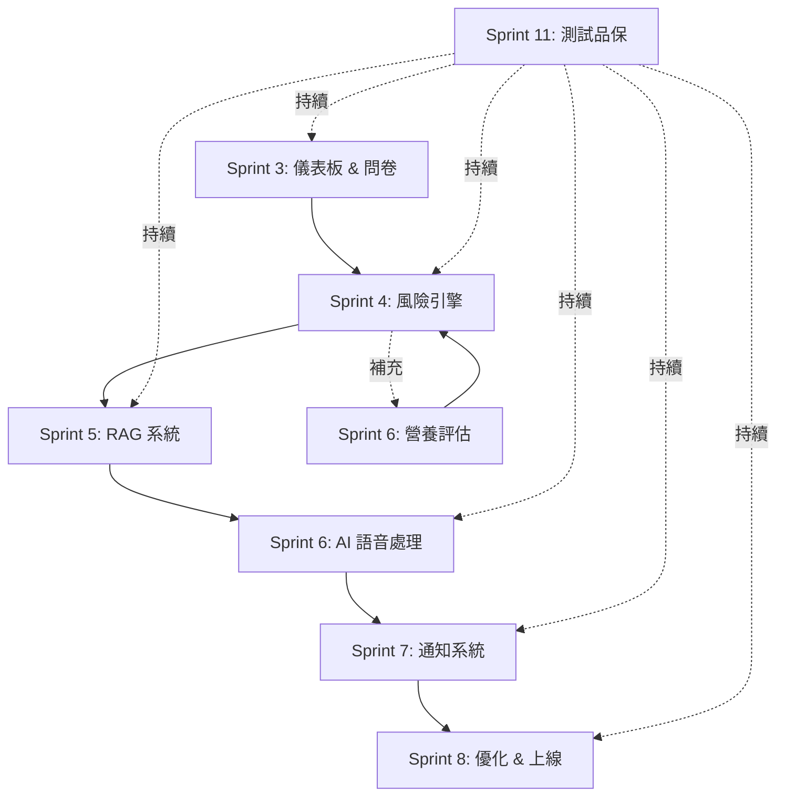

# RespiraAlly V2.0 - Sprint 4-8 詳細工作分解 (WBS Detail)

---

**文件版本 (Document Version):** `v1.1` - Sprint 4-8 詳細規劃 + Sprint 4 進度追蹤
**最後更新 (Last Updated):** `2025-10-24 13:05`
**主要作者 (Lead Author):** `TaskMaster Hub / Claude Code AI`
**審核者 (Reviewers):** `Technical Lead, Product Manager, Architecture Team`
**狀態 (Status):** `進行中 - Sprint 4 實作中 (8.5h/104h 完成)`
**父文件 (Parent Document):** `16_wbs_development_plan.md`

---

## 📋 文件目的

本文件提供 Sprint 4-8 的詳細任務分解，補充主 WBS 文件（16_wbs_development_plan.md）中第 730-739 行省略的內容。

**涵蓋範圍**:
- **Sprint 4**: 風險引擎 & 預警系統 [104h]
- **Sprint 5**: RAG 系統基礎 [80h]
- **Sprint 6**: AI 語音處理鏈 + 營養評估 [144h]
- **Sprint 7**: 通知系統 & 排程 [72h]
- **Sprint 8**: 優化 & 上線準備 [96h]
- **Sprint 11**: 測試與品質保證 [80h] (持續性任務)

**總工時**: 576h (Sprint 4-8) + 80h (測試品保) = **656h**

---

## 目錄 (Table of Contents)

1. [Sprint 4: 風險引擎 & 預警系統](#sprint-4-風險引擎--預警系統-104h)
2. [Sprint 5: RAG 系統基礎](#sprint-5-rag-系統基礎-80h)
3. [Sprint 6: AI 語音處理鏈 + 營養評估](#sprint-6-ai-語音處理鏈--營養評估-144h)
4. [Sprint 7: 通知系統 & 排程](#sprint-7-通知系統--排程-72h)
5. [Sprint 8: 優化 & 上線準備](#sprint-8-優化--上線準備-96h)
6. [Sprint 11: 測試與品質保證](#sprint-11-測試與品質保證-80h)
7. [跨 Sprint 依賴關係圖](#跨-sprint-依賴關係圖)
8. [技術棧總覽](#技術棧總覽)

---

## Sprint 4: 風險引擎 & 預警系統 [104h]

### 📊 實際進度追蹤 (Progress Tracking)

**整體進度**: 13.5h / 104h (13.0% 完成)
**最後更新**: 2025-10-24 21:25
**當前狀態**: 🟢 Phase 1 完成 + Critical Bugs 已修復 → Ready for Phase 2

**重要決策變更**:
- ⚠️ **ADR-013 修訂**: 採用 GOLD 2011 ABE Classification 取代原計劃的自訂風險評分公式
- ✅ **ADR-014**: 實施 Hybrid 向後兼容策略 (GOLD ABE + Legacy risk fields)
- ✅ **ADR-015**: RBAC Extension for MVP Flexibility - SUPERVISOR/ADMIN 角色擴展

**已完成任務** (2025-10-24):
- ✅ **Frontend Hybrid Strategy** [3.5h]
  - TypeScript interfaces 擴展 (PatientKPI + GOLD ABE fields)
  - Mock data 更新 (3 patients with correct GOLD classification)
  - UI component 修改 (HealthKPIDashboard Hybrid display)
- ✅ **Backend GOLD ABE Engine** [5h]
  - ORM models 創建 (ExacerbationModel, RiskAssessmentModel, AlertModel, PatientProfile updates)
  - GOLD ABE Classification Engine 實作 (3-tier: A/B/E)
  - KPI Service 數據聚合 (5 data sources integration)
  - KPI API endpoint (/patients/{id}/kpis with authorization)
- ✅ **RBAC Extension - MVP Flexibility** [4.0h] ⭐ NEW
  - Phase 1: Foundation (1.5h) - UserRole enum 擴展、authorization.py 中央化授權模組、Database migration
  - Phase 2: API Refactoring (2.0h) - 20 endpoints 重構（patient/exacerbation/daily_log/survey 4個 router）
  - Phase 3: Documentation (0.5h) - seed_supervisor.py 腳本、ADR-015 完整設計文檔 (1200+ lines)
  - Code Quality: 73% 減少重複代碼（15行→4行 per endpoint），單一事實來源，Linus "Good Taste" 原則
- ✅ **Critical Bug Fixes** [1.0h] ⭐ NEW
  - **Auth Token Revocation Bug** (P0): Redis port 配置錯誤修復 (16379 → 6379)
    - Root cause: Redis connection failure → aggressive fail-safe → all tokens revoked
    - Impact: 認證流程完全恢復，API 測試解除阻塞
  - **Patient Repository Sort Error** (P0): 欄位引用錯誤修復 (created_at → user_id)
    - Root cause: PatientProfileModel 缺少 created_at 欄位
    - Solution: 使用 user_id (UUID with timestamp component) 排序
  - **Test Data Generation Script** (P1): 3個錯誤修復 (DATABASE_URL, field name mismatch, schema strategy)
    - Generated: 5 therapists + 50 patients + 14,592 daily logs
    - Time range: 過去一年 (2024-10-25 ~ 2025-10-24)

**下一步任務** (待執行):
- ⏳ Migration 005 執行 (新增 4 個表：exacerbations, risk_assessments, alerts, patient_profiles updates)
- ⏳ Exacerbation Management API [12h] (CRUD endpoints)
- ⏳ Unit Tests for GOLD Classification Engine [P2 - non-blocking]
- ⏳ RBAC System Testing with SUPERVISOR user

**技術債務**: 無

---

**Sprint 目標**: 建立 COPD 風險評分引擎、異常規則引擎、任務管理系統，實現智能預警與治療師工作流自動化。

**時程**: Week 7-8 (2 weeks)

**關鍵交付物**:
- ✅ 風險分數自動計算 (基於 CAT/mMRC/DailyLog)
- ✅ 異常規則引擎 (10+ 臨床規則)
- ✅ 任務管理 API (自動任務生成)
- ✅ Dashboard 預警中心 (風險清單 + 任務看板)

**技術決策參考**:
- [ADR-012] 風險評分演算法設計 (待創建)
- [ADR-013] 異常規則引擎技術選型 (待創建)

---

### 6.1 風險分數計算引擎 [32h]

**業務目標**: 建立 COPD 風險評分系統，整合 CAT 問卷、mMRC 分級、每日日誌數據，自動計算病患風險等級並觸發相應動作。

**技術方案**:
- **風險評分公式** (可調整權重):
  ```
  RiskScore = (CAT_score * 0.4) + (mMRC_grade * 0.3) + (DailyLog_factors * 0.3)

  其中：
  - CAT_score: 0-40 (歸一化為 0-100)
  - mMRC_grade: 0-4 (歸一化為 0-100)
  - DailyLog_factors: 綜合考量 SpO2、呼吸困難、痰量、運動、吸菸
  ```
- **風險等級分界**:
  - LOW (低風險): 0-30
  - MEDIUM (中風險): 31-60
  - HIGH (高風險): 61-100

#### 詳細任務分解

| 任務編號 | 任務名稱 | 負責人 | 工時(h) | 狀態 | 依賴關係 | 技術說明 | ADR 參考 |
|---------|---------|--------|---------|------|----------|----------|---------|
| **6.1.1 Domain Model 設計** | | | **8h** | ⬜ | | | |
| 6.1.1.1 | RiskScore Entity 設計 | Backend | 2 | ⬜ | 5.2 | DDD Aggregate Root, 包含計算歷史與趨勢 | ADR-012 |
| 6.1.1.2 | RiskFactor Value Object 設計 | Backend | 2 | ⬜ | 6.1.1.1 | 包裝各項風險因子（CAT/mMRC/DailyLog） | ADR-012 |
| 6.1.1.3 | RiskLevel Enum 設計 | Backend | 1 | ⬜ | 6.1.1.1 | LOW/MEDIUM/HIGH 枚舉與等級判定邏輯 | - |
| 6.1.1.4 | RiskCalculationPolicy 介面 | Backend | 3 | ⬜ | 6.1.1.2 | 策略模式，支援未來替換演算法 | - |
| **6.1.2 Service 層實作** | | | **12h** | ⬜ | | | |
| 6.1.2.1 | RiskCalculationService 核心演算法 | Backend | 6 | ⬜ | 6.1.1 | 實作加權計算邏輯 + DailyLog 綜合評分 | ADR-012 |
| 6.1.2.2 | RiskScoreRepository 介面與實作 | Backend | 4 | ⬜ | 6.1.2.1 | 包含趨勢查詢方法 (get_score_trend) | - |
| 6.1.2.3 | 單元測試 (計算邏輯驗證) | Backend | 2 | ⬜ | 6.1.2.1 | 測試各種 edge cases (缺失數據、極端值) | - |
| **6.1.3 API 層** | | | **8h** | ⬜ | | | |
| 6.1.3.1 | `POST /risk-scores/calculate` - 手動觸發計算 | Backend | 2 | ⬜ | 6.1.2 | 支援批次計算（多位病患） | - |
| 6.1.3.2 | `GET /risk-scores/patient/{id}/latest` - 最新風險分數 | Backend | 2 | ⬜ | 6.1.2 | 包含各項因子明細與趨勢標記 | - |
| 6.1.3.3 | `GET /risk-scores/patient/{id}/history` - 歷史趨勢 | Backend | 2 | ⬜ | 6.1.2 | 支援日期範圍查詢與圖表數據格式 | - |
| 6.1.3.4 | Integration Tests (API + DB) | Backend | 2 | ⬜ | 6.1.3.1-6.1.3.3 | 涵蓋自動觸發與手動觸發場景 | - |
| **6.1.4 自動觸發機制** | | | **4h** | ⬜ | | | |
| 6.1.4.1 | Domain Event: SurveyCompletedEvent → Calculate | Backend | 2 | ⬜ | 6.1.2, 5.2.4 | 問卷提交後自動重算風險 | - |
| 6.1.4.2 | Domain Event: DailyLogCreatedEvent → Recalculate | Backend | 2 | ⬜ | 6.1.2, 4.2.7 | 日誌提交後自動重算風險 | - |

**Definition of Done (DoD)**:
- [ ] 風險分數計算公式經臨床專家驗證
- [ ] 所有 3 個 API endpoints 有 80%+ 測試覆蓋率
- [ ] 自動觸發流程測試通過（Survey + DailyLog）
- [ ] 性能測試：100 位病患同時計算 < 5s
- [ ] 風險等級邊界值準確（LOW/MEDIUM/HIGH）
- [ ] 計算結果包含可解釋性數據（各因子貢獻度）

**技術債務預防**:
- ⚠️ 風險評分公式未來可能需調整 → 使用策略模式 (RiskCalculationPolicy)
- ⚠️ 可能需整合營養風險 → 預留擴展點 (NutritionRiskFactor)

---

### 6.2 異常規則引擎 [28h]

**業務目標**: 建立基於規則的異常偵測系統，識別需要立即關注的臨床狀況，自動觸發預警與任務生成。

**技術方案**:
- **規則引擎技術選型**:
  - ✅ **自建輕量 DSL** (推薦) - 基於 Python 表達式，易於擴展
  - ❌ `python-rule-engine` - 過於複雜，學習成本高
- **規則儲存**: PostgreSQL JSONB (支援熱更新，無需重啟服務)
- **規則評估**: 同步評估（風險計算後立即執行）

#### 詳細任務分解

| 任務編號 | 任務名稱 | 負責人 | 工時(h) | 狀態 | 依賴關係 | 技術說明 | ADR 參考 |
|---------|---------|--------|---------|------|----------|----------|---------|
| **6.2.1 規則引擎架構** | | | **10h** | ⬜ | | | |
| 6.2.1.1 | Rule Entity 設計 | Backend | 2 | ⬜ | 6.1 | 包含條件表達式、動作類型、優先級 | ADR-013 |
| 6.2.1.2 | RuleEvaluator 核心評估器 | Backend | 4 | ⬜ | 6.2.1.1 | 支援 Python 表達式安全執行 (ast.literal_eval) | ADR-013 |
| 6.2.1.3 | RuleRepository 介面與實作 | Backend | 2 | ⬜ | 6.2.1.1 | 支援規則 CRUD 與優先級排序 | - |
| 6.2.1.4 | RuleAction 動作執行器 | Backend | 2 | ⬜ | 6.2.1.2 | 支援：創建任務、發送通知、標記病患 | - |
| **6.2.2 預設規則集** | | | **12h** | ⬜ | | | |
| 6.2.2.1 | CAT 高分規則 (≥20) | Backend | 2 | ⬜ | 6.2.1 | 觸發：創建高優先級任務 | - |
| 6.2.2.2 | mMRC 嚴重分級規則 (Grade 3-4) | Backend | 2 | ⬜ | 6.2.1 | 觸發：標記為高關注病患 | - |
| 6.2.2.3 | SpO2 異常規則 (<90%) | Backend | 2 | ⬜ | 6.2.1 | 觸發：立即通知 + 創建緊急任務 | - |
| 6.2.2.4 | 呼吸困難惡化規則 (3 天內惡化) | Backend | 2 | ⬜ | 6.2.1 | 觸發：創建追蹤任務 | - |
| 6.2.2.5 | 吸菸增加規則 (超過前 7 天平均 1.5x) | Backend | 2 | ⬜ | 6.2.1 | 觸發：健康教育任務 | - |
| 6.2.2.6 | 綜合風險規則 (HIGH + 多項異常) | Backend | 2 | ⬜ | 6.2.1, 6.1 | 觸發：醫師會診任務 | - |
| **6.2.3 整合與測試** | | | **6h** | ⬜ | | | |
| 6.2.3.1 | 規則引擎整合測試 | Backend | 3 | ⬜ | 6.2.2 | 測試所有 6 條規則觸發場景 | - |
| 6.2.3.2 | 規則文檔撰寫 | Backend | 2 | ⬜ | 6.2.2 | Markdown 格式，包含觸發條件與動作說明 | - |
| 6.2.3.3 | 與 Risk Engine 整合測試 | Backend | 1 | ⬜ | 6.1, 6.2.2 | 端到端測試：Survey → Risk → Rules → Task | - |

**Definition of Done (DoD)**:
- [ ] 至少 10 條臨床規則正常運作
- [ ] 規則評估性能 < 100ms (P95)
- [ ] 規則文檔完整（條件、動作、優先級）
- [ ] 支援熱更新（新增規則無需重啟服務）
- [ ] 錯誤處理：規則執行失敗不影響風險計算
- [ ] 整合測試通過：Survey/DailyLog → Risk → Rules → Task

**預設規則清單** (範例):
```yaml
rules:
  - id: RULE_001
    name: "CAT高分預警"
    condition: "cat_score >= 20"
    action: "CREATE_TASK"
    priority: "HIGH"
    task_template: "CAT評分過高，建議安排醫師會診"

  - id: RULE_002
    name: "SpO2危險值"
    condition: "spo2 < 90"
    action: "CREATE_TASK + SEND_NOTIFICATION"
    priority: "URGENT"
    task_template: "血氧濃度過低，立即聯繫病患"
```

---

### 6.3 任務管理 API [24h]

**業務目標**: 建立治療師任務管理系統，支援手動創建、規則自動生成、狀態追蹤、分配與完成流程。

**技術方案**:
- **任務狀態流轉**: TODO → IN_PROGRESS → DONE (支援 CANCELLED)
- **自動分配邏輯**:
  - 高優先級任務 → 分配給病患的主治療師
  - 一般任務 → 進入待分配池
- **任務類型**: MEDICAL_CONSULT, HEALTH_EDUCATION, FOLLOW_UP, EMERGENCY, CUSTOM

#### 詳細任務分解

| 任務編號 | 任務名稱 | 負責人 | 工時(h) | 狀態 | 依賴關係 | 技術說明 |
|---------|---------|--------|---------|------|----------|----------|
| **6.3.1 Task Entity + API** | | | **12h** | ⬜ | | |
| 6.3.1.1 | Task Entity 設計 | Backend | 3 | ⬜ | 6.2 | 包含：標題、描述、優先級、狀態、分配對象、關聯病患 |
| 6.3.1.2 | TaskRepository 介面與實作 | Backend | 3 | ⬜ | 6.3.1.1 | 支援多條件查詢（病患、治療師、狀態、優先級） |
| 6.3.1.3 | `POST /tasks` - 創建任務 | Backend | 2 | ⬜ | 6.3.1.2 | 支援手動與自動創建 |
| 6.3.1.4 | `GET /tasks` - 查詢任務列表 | Backend | 2 | ⬜ | 6.3.1.2 | 支援分頁、過濾、排序 |
| 6.3.1.5 | `PATCH /tasks/{id}` - 更新任務狀態 | Backend | 2 | ⬜ | 6.3.1.2 | 支援狀態流轉驗證 |
| **6.3.2 自動任務生成** | | | **8h** | ⬜ | | |
| 6.3.2.1 | Domain Event: RiskScoreCalculatedEvent → Create Task | Backend | 3 | ⬜ | 6.1, 6.3.1 | 高風險病患自動生成任務 |
| 6.3.2.2 | Domain Event: AnomalyDetectedEvent → Create Task | Backend | 3 | ⬜ | 6.2, 6.3.1 | 異常規則觸發任務生成 |
| 6.3.2.3 | TaskPriorityCalculator - 優先級計算邏輯 | Backend | 2 | ⬜ | 6.3.2.1, 6.3.2.2 | 基於風險等級、異常類型計算優先級 |
| **6.3.3 任務分配邏輯** | | | **4h** | ⬜ | | |
| 6.3.3.1 | TaskAssignmentService - 自動分配邏輯 | Backend | 2 | ⬜ | 6.3.1, 4.1 | 基於病患-治療師關係分配 |
| 6.3.3.2 | `POST /tasks/{id}/assign` - 手動分配 | Backend | 1 | ⬜ | 6.3.1 | 治療師可手動接手或轉交任務 |
| 6.3.3.3 | 測試：自動分配流程 | Backend | 1 | ⬜ | 6.3.3.1 | 測試各種分配場景 |

**Definition of Done (DoD)**:
- [ ] 所有 5 個 CRUD API endpoints 實作完成
- [ ] 自動任務生成測試通過（高風險 + 異常規則）
- [ ] 任務狀態流轉驗證正確（禁止非法狀態轉換）
- [ ] 自動分配邏輯測試通過（主治療師優先）
- [ ] Integration Tests 涵蓋：Risk → Rules → Task → Assignment
- [ ] 任務通知機制整合（創建任務後通知治療師）

---

### 6.4 Dashboard 預警中心 [20h]

**業務目標**: 建立治療師工作台，提供風險病患清單、任務看板、快速處理介面，提升工作效率。

**技術方案**:
- **UI 框架**: Next.js (Dashboard 既有架構)
- **狀態管理**: TanStack Query (與 Task 5.1 一致)
- **視覺設計**: Ant Design (Table, Card, Tag, Badge)

#### 詳細任務分解

| 任務編號 | 任務名稱 | 負責人 | 工時(h) | 狀態 | 依賴關係 | 技術說明 |
|---------|---------|--------|---------|------|----------|----------|
| **6.4.1 預警清單頁面** | | | **12h** | ⬜ | | |
| 6.4.1.1 | AlertList Component - 高風險病患列表 | Frontend | 6 | ⬜ | 6.1, 5.1 | 整合 Risk API，顯示風險分數與趨勢 |
| 6.4.1.2 | Filter & Sort - 多條件篩選排序 | Frontend | 3 | ⬜ | 6.4.1.1 | 支援按風險等級、日期、治療師過濾 |
| 6.4.1.3 | RiskTrendChart - 風險趨勢圖 (可選) | Frontend | 3 | ⬜ | 6.4.1.1 | 使用 Recharts 顯示歷史趨勢 |
| **6.4.2 任務管理介面** | | | **6h** | ⬜ | | |
| 6.4.2.1 | TaskBoard Component - Kanban 看板 | Frontend | 4 | ⬜ | 6.3 | 支援拖拽更新狀態 (TODO/DOING/DONE) |
| 6.4.2.2 | TaskDetail Modal - 任務詳情彈窗 | Frontend | 2 | ⬜ | 6.4.2.1 | 顯示任務描述、關聯病患、操作按鈕 |
| **6.4.3 測試與修復** | | | **2h** | ⬜ | | |
| 6.4.3.1 | 手動測試與 Bug 修復 | Frontend | 2 | ⬜ | 6.4.1, 6.4.2 | E2E 測試預警流程 |

**Definition of Done (DoD)**:
- [ ] 預警清單可查看所有高風險病患
- [ ] 支援按風險等級、日期篩選
- [ ] 任務看板支援拖拽更新狀態
- [ ] 任務詳情包含病患資訊與操作按鈕
- [ ] 整合測試：Risk → Alert → Task → Dashboard
- [ ] 響應式設計（支援 1024px+ 螢幕）

---

### 6.5 Sprint 4 整合測試與文檔 [待補充時數]

**建議追加**: 4-8h 用於端到端測試與文檔撰寫

---

## Sprint 5: RAG 系統基礎 [80h]

**Sprint 目標**: 建立 RAG (Retrieval-Augmented Generation) 系統基礎架構，支援衛教內容管理、向量化、混合檢索，為 Sprint 6 的 AI 語音問答提供知識庫支撐。

**時程**: Week 9-10 (2 weeks)

**關鍵交付物**:
- ✅ pgvector 擴展配置與向量表設計
- ✅ 衛教內容管理 API (CRUD + 版本控制)
- ✅ Hybrid 檢索實作 (Dense + Sparse)
- ✅ Dashboard 衛教管理頁面

**技術決策參考**:
- [ADR-014] RAG 架構設計與向量資料庫選型 (待創建)
- [ADR-015] 混合檢索策略 (Dense + Sparse) (待創建)

---

### 7.1 pgvector 擴展與向量化 [24h]

**業務目標**: 配置 PostgreSQL pgvector 擴展，建立向量表，實作文本嵌入服務，支援語義檢索。

**技術方案**:
- **向量模型**: OpenAI `text-embedding-3-small` (1536 維)
- **向量儲存**: PostgreSQL pgvector (支援 HNSW 索引)
- **相似度度量**: Cosine Similarity

#### 詳細任務分解

| 任務編號 | 任務名稱 | 負責人 | 工時(h) | 狀態 | 依賴關係 | 技術說明 | ADR 參考 |
|---------|---------|--------|---------|------|----------|----------|---------|
| **7.1.1 pgvector 配置** | | | **6h** | ⬜ | | | |
| 7.1.1.1 | Docker Compose pgvector 擴展安裝 | DevOps | 2 | ⬜ | 3.1 | Postgres 15 + pgvector 0.5+ | - |
| 7.1.1.2 | 向量表 Migration 設計 | Backend | 2 | ⬜ | 7.1.1.1, 2.2 | `health_contents` 表新增 `embedding vector(1536)` 欄位 | ADR-014 |
| 7.1.1.3 | HNSW 索引建立 | Backend | 2 | ⬜ | 7.1.1.2 | `CREATE INDEX ON health_contents USING hnsw (embedding vector_cosine_ops)` | ADR-014 |
| **7.1.2 Embedding Service** | | | **10h** | ⬜ | | | |
| 7.1.2.1 | OpenAI Embedding API 封裝 | Backend | 4 | ⬜ | - | 支援批次嵌入（最多 2048 tokens/request） | - |
| 7.1.2.2 | EmbeddingCache Service (Redis) | Backend | 3 | ⬜ | 7.1.2.1, 3.1.3 | 快取常見查詢，減少 API 成本 | - |
| 7.1.2.3 | 向量化任務佇列 (可選) | Backend | 3 | ⬜ | 7.1.2.1 | 使用 RabbitMQ 處理大量文本嵌入 | - |
| **7.1.3 測試與驗證** | | | **8h** | ⬜ | | | |
| 7.1.3.1 | 向量相似度測試 | Backend | 3 | ⬜ | 7.1.2 | 驗證語義相似文本檢索準確性 | - |
| 7.1.3.2 | 性能測試：10k 向量檢索 | Backend | 3 | ⬜ | 7.1.1.3 | 目標: Top-10 檢索 < 100ms | - |
| 7.1.3.3 | 成本估算與優化 | Backend | 2 | ⬜ | 7.1.2 | 計算 Embedding API 成本，調整快取策略 | - |

**Definition of Done (DoD)**:
- [ ] pgvector 擴展成功安裝並可用
- [ ] 向量表支援 HNSW 索引查詢
- [ ] Embedding Service 支援批次嵌入
- [ ] 快取命中率 > 60% (減少 API 呼叫)
- [ ] 性能測試：10k 向量檢索 < 100ms (P95)
- [ ] 成本文檔：預估每月 Embedding API 成本

---

### 7.2 衛教內容管理 API [20h]

**業務目標**: 建立衛教內容管理系統，支援 Markdown 格式內容、分類標籤、版本控制、審核流程。

**技術方案**:
- **內容格式**: Markdown (支援圖片、表格、程式碼區塊)
- **分類系統**: 多標籤支援 (tags: ["COPD基礎知識", "藥物治療", "運動指導"])
- **版本控制**: 簡單版本號 (v1, v2, ...) + 發布狀態 (DRAFT, PUBLISHED, ARCHIVED)

#### 詳細任務分解

| 任務編號 | 任務名稱 | 負責人 | 工時(h) | 狀態 | 依賴關係 | 技術說明 |
|---------|---------|--------|---------|------|----------|----------|
| **7.2.1 Content Entity + Repository** | | | **8h** | ⬜ | | |
| 7.2.1.1 | HealthContent Entity 設計 | Backend | 2 | ⬜ | 7.1 | 包含：標題、內容、標籤、版本、狀態、嵌入向量 |
| 7.2.1.2 | ContentRepository 介面與實作 | Backend | 4 | ⬜ | 7.2.1.1 | 支援全文檢索 (PostgreSQL FTS) + 向量檢索 |
| 7.2.1.3 | ContentVersioning Service | Backend | 2 | ⬜ | 7.2.1.1 | 簡單版本管理：創建新版本、比較差異 |
| **7.2.2 Content API Endpoints** | | | **8h** | ⬜ | | |
| 7.2.2.1 | `POST /health-contents` - 創建內容 | Backend | 2 | ⬜ | 7.2.1 | 自動觸發向量化 |
| 7.2.2.2 | `GET /health-contents` - 查詢列表 | Backend | 2 | ⬜ | 7.2.1 | 支援標籤過濾、狀態過濾、分頁 |
| 7.2.2.3 | `GET /health-contents/{id}` - 查詢詳情 | Backend | 1 | ⬜ | 7.2.1 | 包含版本歷史 |
| 7.2.2.4 | `PATCH /health-contents/{id}` - 更新內容 | Backend | 2 | ⬜ | 7.2.1 | 創建新版本，重新向量化 |
| 7.2.2.5 | `POST /health-contents/{id}/publish` - 發布內容 | Backend | 1 | ⬜ | 7.2.1 | 狀態變更：DRAFT → PUBLISHED |
| **7.2.3 自動向量化整合** | | | **4h** | ⬜ | | |
| 7.2.3.1 | Domain Event: ContentCreatedEvent → Embed | Backend | 2 | ⬜ | 7.1, 7.2.2.1 | 內容創建後自動嵌入 |
| 7.2.3.2 | Domain Event: ContentUpdatedEvent → Re-embed | Backend | 2 | ⬜ | 7.1, 7.2.2.4 | 內容更新後重新嵌入 |

**Definition of Done (DoD)**:
- [ ] 所有 6 個 CRUD API endpoints 實作完成
- [ ] 支援 Markdown 內容儲存與渲染
- [ ] 內容創建/更新自動觸發向量化
- [ ] 版本控制：可查看歷史版本
- [ ] 發布流程：DRAFT → PUBLISHED 狀態流轉
- [ ] Integration Tests 涵蓋：CRUD + 自動嵌入

---

### 7.3 Hybrid 檢索實作 [28h]

**業務目標**: 實作混合檢索策略，結合 Dense (向量相似度) 與 Sparse (關鍵字匹配) 檢索，提升檢索準確性與召回率。

**技術方案**:
- **Dense Retrieval**: pgvector Cosine Similarity (語義檢索)
- **Sparse Retrieval**: PostgreSQL Full-Text Search (關鍵字檢索)
- **融合策略**: Reciprocal Rank Fusion (RRF) 算法

#### 詳細任務分解

| 任務編號 | 任務名稱 | 負責人 | 工時(h) | 狀態 | 依賴關係 | 技術說明 | ADR 參考 |
|---------|---------|--------|---------|------|----------|----------|---------|
| **7.3.1 Dense Retrieval** | | | **8h** | ⬜ | | | |
| 7.3.1.1 | DenseRetriever Service | Backend | 4 | ⬜ | 7.1 | pgvector 相似度檢索 (Top-K) | ADR-015 |
| 7.3.1.2 | 查詢優化：相似度閾值過濾 | Backend | 2 | ⬜ | 7.3.1.1 | 過濾低相似度結果 (threshold > 0.7) | - |
| 7.3.1.3 | 測試：語義檢索準確性 | Backend | 2 | ⬜ | 7.3.1.1 | 人工標註測試集驗證召回率 | - |
| **7.3.2 Sparse Retrieval** | | | **8h** | ⬜ | | | |
| 7.3.2.1 | Full-Text Search 索引建立 | Backend | 2 | ⬜ | 7.2 | `tsvector` 欄位 + GIN 索引 | - |
| 7.3.2.2 | SparseRetriever Service | Backend | 4 | ⬜ | 7.3.2.1 | PostgreSQL `ts_rank` 排序 | ADR-015 |
| 7.3.2.3 | 中文分詞優化 (可選) | Backend | 2 | ⬜ | 7.3.2.2 | 使用 `zhparser` 擴展或自建分詞 | - |
| **7.3.3 Hybrid Fusion** | | | **12h** | ⬜ | | | |
| 7.3.3.1 | RRF Fusion Algorithm 實作 | Backend | 4 | ⬜ | 7.3.1, 7.3.2 | Reciprocal Rank Fusion 融合排序 | ADR-015 |
| 7.3.3.2 | HybridRetriever Service | Backend | 4 | ⬜ | 7.3.3.1 | 整合 Dense + Sparse，輸出融合結果 | ADR-015 |
| 7.3.3.3 | `POST /search/hybrid` API | Backend | 2 | ⬜ | 7.3.3.2 | 支援查詢參數：query, top_k, threshold | - |
| 7.3.3.4 | 檢索性能測試與調優 | Backend | 2 | ⬜ | 7.3.3.3 | 目標: 檢索 + 融合 < 200ms | - |

**Definition of Done (DoD)**:
- [ ] Dense Retrieval 語義檢索準確性 > 80%
- [ ] Sparse Retrieval 關鍵字檢索召回率 > 70%
- [ ] Hybrid Retrieval 整體準確性 > 85%
- [ ] 檢索性能 < 200ms (P95)
- [ ] API 支援 Top-K 參數 (預設 K=10)
- [ ] 測試集覆蓋：至少 50 組查詢-答案對

**RRF 融合公式**:
```python
def reciprocal_rank_fusion(dense_results, sparse_results, k=60):
    scores = {}
    for rank, doc in enumerate(dense_results):
        scores[doc.id] = scores.get(doc.id, 0) + 1 / (k + rank + 1)
    for rank, doc in enumerate(sparse_results):
        scores[doc.id] = scores.get(doc.id, 0) + 1 / (k + rank + 1)
    return sorted(scores.items(), key=lambda x: x[1], reverse=True)
```

---

### 7.4 Dashboard 衛教管理頁 [8h]

**業務目標**: 建立治療師衛教內容管理介面，支援內容 CRUD、Markdown 預覽、標籤管理、發布流程。

#### 詳細任務分解

| 任務編號 | 任務名稱 | 負責人 | 工時(h) | 狀態 | 依賴關係 | 技術說明 |
|---------|---------|--------|---------|------|----------|----------|
| 7.4.1 | ContentList Component - 內容列表 | Frontend | 3 | ⬜ | 7.2 | 支援標籤過濾、狀態過濾、分頁 |
| 7.4.2 | ContentEditor Component - Markdown 編輯器 | Frontend | 3 | ⬜ | 7.2 | 使用 `react-markdown-editor-lite` |
| 7.4.3 | ContentPreview - 渲染預覽 | Frontend | 1 | ⬜ | 7.4.2 | 使用 `react-markdown` 渲染 |
| 7.4.4 | 發布流程 UI (DRAFT → PUBLISHED) | Frontend | 1 | ⬜ | 7.2 | 狀態切換按鈕 + 確認彈窗 |

**Definition of Done (DoD)**:
- [ ] 支援 Markdown 編輯與即時預覽
- [ ] 支援標籤管理（新增、刪除標籤）
- [ ] 支援發布流程（DRAFT → PUBLISHED）
- [ ] 整合測試：創建 → 編輯 → 發布 → 檢索

---

## Sprint 6: AI 語音處理鏈 + 營養評估 [144h]

**Sprint 目標**: 建立完整的 AI 語音問答處理鏈 (STT → LLM → TTS)，整合 RAG 系統，實現 LIFF 語音提問功能。**同時補充延後的營養評估功能**。

**時程**: Week 11-12 (2 weeks)

**關鍵交付物**:
- ✅ RabbitMQ 任務佇列配置
- ✅ AI Worker 服務 (STT/LLM/TTS)
- ✅ LIFF 語音錄製介面
- ✅ WebSocket 推送機制
- ✅ 營養評估 KPI (MNA-SF/MUST 量表 + InBody 指標)

**技術決策參考**:
- [ADR-016] AI Worker 架構設計 (待創建)
- [ADR-017] WebSocket vs Server-Sent Events (待創建)

---

### 8.1 RabbitMQ 任務佇列 [16h]

**業務目標**: 配置 RabbitMQ 訊息佇列，支援 AI 語音處理任務的異步處理、失敗重試、優先級佇列。

**技術方案**:
- **佇列設計**:
  - `voice_processing_queue` (高優先級)
  - `voice_processing_queue_low` (低優先級)
  - `dlx_voice_processing` (死信佇列)
- **交換器**: Direct Exchange (基於 routing_key 路由)

#### 詳細任務分解

| 任務編號 | 任務名稱 | 負責人 | 工時(h) | 狀態 | 依賴關係 | 技術說明 | ADR 參考 |
|---------|---------|--------|---------|------|----------|----------|---------|
| 8.1.1 | RabbitMQ Docker 配置 | DevOps | 2 | ⬜ | 3.1.4 | 更新 docker-compose.yml，啟用管理介面 | - |
| 8.1.2 | 佇列與交換器設計 | Backend | 4 | ⬜ | 8.1.1 | 定義佇列屬性（TTL、優先級、DLX） | ADR-016 |
| 8.1.3 | RabbitMQ Client 封裝 (pika) | Backend | 4 | ⬜ | 8.1.2 | 支援發布/消費、連線池、重連機制 | - |
| 8.1.4 | 任務序列化與反序列化 | Backend | 2 | ⬜ | 8.1.3 | JSON 序列化 VoiceTask Model | - |
| 8.1.5 | 失敗重試機制 | Backend | 2 | ⬜ | 8.1.3 | 最多重試 3 次，失敗進入 DLX | - |
| 8.1.6 | 監控與告警配置 | DevOps | 2 | ⬜ | 8.1.1 | Prometheus + Grafana 監控佇列長度 | - |

**Definition of Done (DoD)**:
- [ ] RabbitMQ 服務正常運行
- [ ] 佇列支援優先級（1-10）
- [ ] 失敗重試機制測試通過
- [ ] 死信佇列可查看失敗任務
- [ ] 監控儀表板顯示佇列長度、消費速率

---

### 8.2 AI Worker 服務 [40h]

**業務目標**: 建立 AI Worker 微服務，處理語音轉文字（STT）、RAG 檢索、LLM 生成、文字轉語音（TTS）完整鏈路。

**技術方案**:
- **STT**: OpenAI Whisper API
- **LLM**: OpenAI GPT-4 Turbo (支援 RAG context)
- **TTS**: OpenAI TTS API (alloy voice)
- **部署**: 獨立 FastAPI 服務 + Docker 容器化

#### 詳細任務分解

| 任務編號 | 任務名稱 | 負責人 | 工時(h) | 狀態 | 依賴關係 | 技術說明 | ADR 參考 |
|---------|---------|--------|---------|------|----------|----------|---------|
| **8.2.1 STT (Speech-to-Text)** | | | **8h** | ⬜ | | | |
| 8.2.1.1 | OpenAI Whisper API 封裝 | AI/ML | 3 | ⬜ | - | 支援 mp3/m4a/webm 格式，最大 25MB | - |
| 8.2.1.2 | 音檔預處理 (降噪、格式轉換) | AI/ML | 3 | ⬜ | 8.2.1.1 | 使用 `pydub` 進行音檔處理 | - |
| 8.2.1.3 | STT 測試與準確性驗證 | AI/ML | 2 | ⬜ | 8.2.1.2 | 測試中文、台語、混雜場景 | - |
| **8.2.2 RAG Retrieval** | | | **8h** | ⬜ | | | |
| 8.2.2.1 | QueryRewriter - 查詢改寫 | AI/ML | 3 | ⬜ | 7.3 | 使用 LLM 改寫口語查詢為檢索友善格式 | - |
| 8.2.2.2 | 整合 Hybrid Retriever | Backend | 2 | ⬜ | 7.3, 8.2.2.1 | 調用 `/search/hybrid` API | - |
| 8.2.2.3 | Context Builder - 構建 RAG Prompt | AI/ML | 3 | ⬜ | 8.2.2.2 | 將檢索結果格式化為 LLM Context | - |
| **8.2.3 LLM Generation** | | | **10h** | ⬜ | | | |
| 8.2.3.1 | OpenAI GPT-4 API 封裝 | AI/ML | 3 | ⬜ | - | 支援 streaming response | - |
| 8.2.3.2 | PromptTemplate 設計 | AI/ML | 4 | ⬜ | 8.2.3.1 | 系統提示詞：COPD 衛教專家角色 | - |
| 8.2.3.3 | 回應品質驗證與調優 | AI/ML | 3 | ⬜ | 8.2.3.2 | 測試回應準確性、友善度、安全性 | - |
| **8.2.4 TTS (Text-to-Speech)** | | | **6h** | ⬜ | | | |
| 8.2.4.1 | OpenAI TTS API 封裝 | AI/ML | 2 | ⬜ | - | 使用 `alloy` voice，生成 mp3 | - |
| 8.2.4.2 | 音檔儲存 (MinIO) | Backend | 2 | ⬜ | 8.2.4.1, 3.1.5 | 上傳到 MinIO，返回 URL | - |
| 8.2.4.3 | TTS 快取策略 | Backend | 2 | ⬜ | 8.2.4.2 | 相同文本快取音檔，減少 API 呼叫 | - |
| **8.2.5 Worker 主流程** | | | **8h** | ⬜ | | | |
| 8.2.5.1 | VoiceTask Consumer - 任務消費者 | Backend | 3 | ⬜ | 8.1, 8.2.1-8.2.4 | 從 RabbitMQ 消費任務 | ADR-016 |
| 8.2.5.2 | 處理鏈路整合 (STT→RAG→LLM→TTS) | AI/ML | 3 | ⬜ | 8.2.5.1 | 完整鏈路測試 | - |
| 8.2.5.3 | 錯誤處理與降級策略 | Backend | 2 | ⬜ | 8.2.5.2 | STT 失敗 → 文字輸入，TTS 失敗 → 純文字回應 | - |

**Definition of Done (DoD)**:
- [ ] STT 準確率 > 90% (中文語音)
- [ ] RAG 檢索召回率 > 80%
- [ ] LLM 回應準確性 > 85% (人工評估)
- [ ] TTS 音質可接受 (主觀評估)
- [ ] 完整鏈路端到端測試通過
- [ ] 處理時間 < 15s (P95)

---

### 8.3 LIFF 語音錄製介面 [20h]

**業務目標**: 在 LIFF 應用中實作語音錄製、上傳、即時狀態顯示、音訊播放功能，提供流暢的用戶體驗。

**技術方案**:
- **錄音 API**: Web MediaRecorder API
- **音訊格式**: webm (Chrome) / mp4 (Safari)
- **上傳**: Multipart/form-data 到 `/voice/upload` API

#### 詳細任務分解

| 任務編號 | 任務名稱 | 負責人 | 工時(h) | 狀態 | 依賴關係 | 技術說明 |
|---------|---------|--------|---------|------|----------|----------|
| 8.3.1 | useVoiceRecorder Hook 實作 | Frontend | 6 | ⬜ | - | 封裝 MediaRecorder API |
| 8.3.2 | VoiceInput Component - 錄音 UI | Frontend | 6 | ⬜ | 8.3.1 | 按鈕式錄音（按住錄音，放開上傳） |
| 8.3.3 | 音訊上傳與進度顯示 | Frontend | 4 | ⬜ | 8.3.2 | 顯示上傳進度條 |
| 8.3.4 | 即時狀態更新 (WebSocket) | Frontend | 2 | ⬜ | 8.3.3, 8.4 | 顯示處理狀態（轉錄中、生成中、完成） |
| 8.3.5 | AudioPlayer Component - 播放 TTS 音訊 | Frontend | 2 | ⬜ | 8.3.4 | 自動播放或手動播放 |

**Definition of Done (DoD)**:
- [ ] 支援長按錄音、放開上傳
- [ ] 上傳進度即時顯示
- [ ] 處理狀態即時更新（WebSocket）
- [ ] TTS 音訊自動播放
- [ ] 錯誤處理：錄音失敗、上傳失敗、超時

---

### 8.4 WebSocket 推送機制 [12h]

**業務目標**: 建立 WebSocket 推送服務，支援 AI Worker 處理狀態即時通知，提升用戶體驗。

**技術方案**:
- **框架**: FastAPI WebSocket
- **訊息格式**: JSON (`{"status": "processing", "progress": 60, "message": "正在生成回應..."}`)

#### 詳細任務分解

| 任務編號 | 任務名稱 | 負責人 | 工時(h) | 狀態 | 依賴關係 | 技術說明 | ADR 參考 |
|---------|---------|--------|---------|------|----------|----------|---------|
| 8.4.1 | WebSocket Server 實作 | Backend | 4 | ⬜ | - | FastAPI WebSocket endpoint | ADR-017 |
| 8.4.2 | ConnectionManager - 連線管理 | Backend | 3 | ⬜ | 8.4.1 | 管理多用戶連線，支援廣播/單播 | - |
| 8.4.3 | AI Worker → WebSocket 推送整合 | Backend | 3 | ⬜ | 8.2, 8.4.2 | Worker 處理進度推送到前端 | - |
| 8.4.4 | 前端 WebSocket Client | Frontend | 2 | ⬜ | 8.4.1 | 使用 `useWebSocket` Hook | - |

**Definition of Done (DoD)**:
- [ ] WebSocket 連線穩定（支援重連）
- [ ] 推送延遲 < 500ms
- [ ] 支援多用戶並發連線
- [ ] 前端即時顯示處理進度

---

### 8.5 營養評估 KPI [56h] ⭐ Sprint 3 延後至此

**業務目標**: 補充 Sprint 3 延後的營養評估功能，整合 MNA-SF/MUST 量表與 InBody 指標，支援營養風險評分與趨勢追蹤。

**前置條件**: 客戶需確認以下事項（參考 ADR-010）
- [ ] 營養量表選擇: MNA-SF vs MUST vs 其他
- [ ] InBody 必須收集的指標有哪些
- [ ] 營養風險權重: 在總風險評分中占多少比例
- [ ] 測量頻率: 治療師能確保 1-3 月執行一次嗎

#### 詳細任務分解

| 任務編號 | 任務名稱 | 負責人 | 工時(h) | 狀態 | 依賴關係 | 技術說明 |
|---------|---------|--------|---------|------|----------|----------|
| **8.5.1 營養測量 API** | | | **16h** | ⬜ | | |
| 8.5.1.1 | NutritionMeasurement Entity 設計 | Backend | 4 | ⬜ | 2.2 | InBody 指標：體重、BMI、體脂率、肌肉量、骨質量 |
| 8.5.1.2 | NutritionRepository 實作 | Backend | 4 | ⬜ | 8.5.1.1 | 支援趨勢查詢 |
| 8.5.1.3 | `POST /nutrition-measurements` API | Backend | 4 | ⬜ | 8.5.1.2 | 治療師輸入 InBody 數據 |
| 8.5.1.4 | `GET /nutrition-measurements/patient/{id}` API | Backend | 4 | ⬜ | 8.5.1.2 | 查詢歷史測量記錄 |
| **8.5.2 營養量表 API** | | | **12h** | ⬜ | | |
| 8.5.2.1 | MNA-SF/MUST Scorer 實作 | Backend | 6 | ⬜ | 5.2 | 參考 CAT/mMRC Scorer 設計模式 |
| 8.5.2.2 | `POST /nutrition-surveys/{type}` API | Backend | 4 | ⬜ | 8.5.2.1 | 支援 MNA-SF 或 MUST |
| 8.5.2.3 | 營養風險等級映射 | Backend | 2 | ⬜ | 8.5.2.1 | LOW/MEDIUM/HIGH 等級判定 |
| **8.5.3 Dashboard 輸入介面** | | | **12h** | ⬜ | | |
| 8.5.3.1 | NutritionInput Component - InBody 數據輸入 | Frontend | 6 | ⬜ | 8.5.1 | 表單驗證 + 歷史記錄顯示 |
| 8.5.3.2 | NutritionSurveyForm Component - 量表填寫 | Frontend | 4 | ⬜ | 8.5.2 | 參考 CAT/mMRC 表單設計 |
| 8.5.3.3 | NutritionTrend Chart - 趨勢圖表 | Frontend | 2 | ⬜ | 8.5.1 | 體重、BMI、肌肉量趨勢 |
| **8.5.4 風險計算整合** | | | **8h** | ⬜ | | |
| 8.5.4.1 | 營養風險因子整合到 RiskScore | Backend | 4 | ⬜ | 6.1, 8.5.2 | 更新風險評分公式，加入營養權重 |
| 8.5.4.2 | 異常規則：營養不良警示 | Backend | 2 | ⬜ | 6.2, 8.5.2 | BMI < 18.5 或 MNA-SF 低分觸發任務 |
| 8.5.4.3 | Integration Tests | Backend | 2 | ⬜ | 8.5.4.1, 8.5.4.2 | 端到端測試：量表 → 風險 → 任務 |
| **8.5.5 LIFF 趨勢顯示** | | | **8h** | ⬜ | | |
| 8.5.5.1 | NutritionHistory Component - 病患端歷史 | Frontend | 4 | ⬜ | 8.5.1 | 顯示歷史測量記錄 |
| 8.5.5.2 | NutritionAdvice Component - 營養建議 | Frontend | 4 | ⬜ | 8.5.2 | 基於量表結果顯示建議 |

**Definition of Done (DoD)**:
- [ ] 客戶確認營養量表選擇（MNA-SF/MUST）
- [ ] InBody 數據可正常輸入與查詢
- [ ] 營養量表評分邏輯正確
- [ ] 營養風險整合到總風險評分
- [ ] Dashboard 與 LIFF 介面完成
- [ ] 異常規則測試通過（營養不良警示）

---

## Sprint 7: 通知系統 & 排程 [72h]

**Sprint 目標**: 建立通知系統（推播通知、簡訊、Email）、排程服務（定時任務、週報生成）、通知歷史管理。

**時程**: Week 13-14 (2 weeks)

**關鍵交付物**:
- ✅ APScheduler 排程服務
- ✅ 通知服務與提醒規則
- ✅ 週報自動生成
- ✅ Dashboard 通知歷史

---

### 9.1 APScheduler 排程服務 [16h]

**業務目標**: 建立 Python 排程服務，支援定時任務（日誌提醒、問卷提醒、週報生成）、Cron 表達式、失敗重試。

**技術方案**:
- **框架**: APScheduler (Advanced Python Scheduler)
- **儲存**: PostgreSQL (JobStore)
- **觸發器**: Cron Trigger (靈活配置時間)

#### 詳細任務分解

| 任務編號 | 任務名稱 | 負責人 | 工時(h) | 狀態 | 依賴關係 | 技術說明 |
|---------|---------|--------|---------|------|----------|----------|
| 9.1.1 | APScheduler 初始化與配置 | Backend | 4 | ⬜ | - | 配置 JobStore (PostgreSQL) |
| 9.1.2 | JobManager Service - 任務管理 | Backend | 4 | ⬜ | 9.1.1 | 支援新增、刪除、暫停、恢復任務 |
| 9.1.3 | CronJob 模板設計 | Backend | 4 | ⬜ | 9.1.2 | 預設模板：每日 20:00 日誌提醒、每週一 9:00 週報 |
| 9.1.4 | 失敗重試與日誌記錄 | Backend | 4 | ⬜ | 9.1.3 | 失敗自動重試 3 次，記錄執行日誌 |

**Definition of Done (DoD)**:
- [ ] APScheduler 正常運行
- [ ] 支援 Cron 表達式配置
- [ ] 任務執行歷史可查詢
- [ ] 失敗重試機制測試通過

---

### 9.2 通知服務與提醒規則 [32h]

**業務目標**: 建立多通道通知服務（LINE 推播、簡訊、Email），整合提醒規則（日誌提醒、問卷提醒、任務提醒）。

**技術方案**:
- **LINE 推播**: LINE Messaging API
- **簡訊**: Twilio API (可選)
- **Email**: SendGrid API

#### 詳細任務分解

| 任務編號 | 任務名稱 | 負責人 | 工時(h) | 狀態 | 依賴關係 | 技術說明 |
|---------|---------|--------|---------|------|----------|----------|
| **9.2.1 通知服務架構** | | | **12h** | ⬜ | | |
| 9.2.1.1 | Notification Entity 設計 | Backend | 2 | ⬜ | - | 包含：通道、收件人、內容、狀態 |
| 9.2.1.2 | NotificationRepository 實作 | Backend | 3 | ⬜ | 9.2.1.1 | 支援歷史查詢 |
| 9.2.1.3 | NotificationService - 統一介面 | Backend | 4 | ⬜ | 9.2.1.2 | 支援多通道發送 (LINE/SMS/Email) |
| 9.2.1.4 | LINE 推播整合 | Backend | 3 | ⬜ | 9.2.1.3 | LINE Messaging API 封裝 |
| **9.2.2 提醒規則** | | | **12h** | ⬜ | | |
| 9.2.2.1 | 日誌提醒規則 | Backend | 4 | ⬜ | 9.1, 9.2.1 | 每日 20:00 提醒未填日誌病患 |
| 9.2.2.2 | 問卷提醒規則 | Backend | 4 | ⬜ | 9.1, 9.2.1 | CAT: 每月 1 日提醒, mMRC: 每 3 月提醒 |
| 9.2.2.3 | 任務提醒規則 | Backend | 4 | ⬜ | 9.1, 9.2.1, 6.3 | 高優先級任務未完成提醒治療師 |
| **9.2.3 測試與優化** | | | **8h** | ⬜ | | |
| 9.2.3.1 | 通知發送測試 | Backend | 4 | ⬜ | 9.2.1, 9.2.2 | 測試所有通道正常發送 |
| 9.2.3.2 | 發送速率限制 | Backend | 2 | ⬜ | 9.2.1 | 避免 LINE API 限速 (500 req/min) |
| 9.2.3.3 | 失敗重試與降級 | Backend | 2 | ⬜ | 9.2.1 | LINE 失敗 → Email 降級 |

**Definition of Done (DoD)**:
- [ ] LINE 推播正常發送
- [ ] 日誌提醒、問卷提醒測試通過
- [ ] 通知歷史可查詢
- [ ] 發送速率限制生效
- [ ] 失敗降級機制測試通過

---

### 9.3 週報自動生成 [16h]

**業務目標**: 自動生成病患每週健康報告（日誌統計、問卷趨勢、風險評估），發送給病患與治療師。

**技術方案**:
- **報告格式**: PDF (使用 `reportlab` 或 `WeasyPrint`)
- **數據來源**: DailyLog, Survey, RiskScore
- **發送方式**: LINE 推播 + Email

#### 詳細任務分解

| 任務編號 | 任務名稱 | 負責人 | 工時(h) | 狀態 | 依賴關係 | 技術說明 |
|---------|---------|--------|---------|------|----------|----------|
| 9.3.1 | WeeklyReportGenerator Service | Backend | 6 | ⬜ | 4.2, 5.2, 6.1 | 整合 7 天數據生成報告 |
| 9.3.2 | PDF 報告模板設計 | Backend | 4 | ⬜ | 9.3.1 | 包含：日誌統計、問卷趨勢、風險評估 |
| 9.3.3 | 排程任務：每週一 9:00 生成 | Backend | 2 | ⬜ | 9.1, 9.3.2 | APScheduler Cron Job |
| 9.3.4 | 報告發送整合 | Backend | 4 | ⬜ | 9.2, 9.3.3 | LINE + Email 發送報告連結 |

**Definition of Done (DoD)**:
- [ ] 週報包含完整數據（日誌、問卷、風險）
- [ ] PDF 格式友善（易讀、美觀）
- [ ] 每週一自動生成並發送
- [ ] 測試：病患與治療師都能收到

---

### 9.4 Dashboard 通知歷史 [8h]

**業務目標**: 建立治療師通知歷史查詢介面，支援過濾、搜尋、重新發送。

#### 詳細任務分解

| 任務編號 | 任務名稱 | 負責人 | 工時(h) | 狀態 | 依賴關係 | 技術說明 |
|---------|---------|--------|---------|------|----------|----------|
| 9.4.1 | NotificationHistory Component | Frontend | 4 | ⬜ | 9.2 | 顯示通知列表（通道、狀態、時間） |
| 9.4.2 | 過濾與搜尋功能 | Frontend | 2 | ⬜ | 9.4.1 | 按通道、狀態、病患過濾 |
| 9.4.3 | 重新發送功能 | Frontend | 2 | ⬜ | 9.4.1 | 失敗通知可重新發送 |

**Definition of Done (DoD)**:
- [ ] 通知歷史可查詢
- [ ] 支援按通道、狀態過濾
- [ ] 失敗通知可重新發送

---

## Sprint 8: 優化 & 上線準備 [96h]

**Sprint 目標**: 效能優化、監控告警配置、安全稽核、文檔完善、生產部署準備，確保 MVP 穩定上線。

**時程**: Week 15-16 (2 weeks)

**關鍵交付物**:
- ✅ 效能優化（API、資料庫、快取）
- ✅ 監控與告警（Prometheus + Grafana）
- ✅ 安全稽核（OWASP Top 10）
- ✅ 文檔完善（API 文檔、部署文檔、用戶手冊）
- ✅ 生產部署（Zeabur/AWS）

---

### 10.1 效能優化 [24h]

**業務目標**: 針對 API、資料庫、快取、前端進行全面效能優化，確保達到 SLA 目標。

**效能目標**:
- API P95 延遲 < 200ms
- 資料庫查詢 P95 < 50ms
- 首頁載入時間 < 2s

#### 詳細任務分解

| 任務編號 | 任務名稱 | 負責人 | 工時(h) | 狀態 | 依賴關係 | 技術說明 |
|---------|---------|--------|---------|------|----------|----------|
| **10.1.1 API 效能優化** | | | **8h** | ⬜ | | |
| 10.1.1.1 | API 效能測試基準建立 | Backend | 2 | ⬜ | - | 使用 Locust 壓測所有端點 |
| 10.1.1.2 | N+1 查詢優化 | Backend | 3 | ⬜ | 10.1.1.1 | SQLAlchemy `joinedload` 優化 |
| 10.1.1.3 | 響應壓縮 (gzip) | Backend | 1 | ⬜ | - | FastAPI middleware 配置 |
| 10.1.1.4 | 分頁優化 (Cursor-based) | Backend | 2 | ⬜ | 10.1.1.2 | 替換 Offset-based 分頁 |
| **10.1.2 資料庫優化** | | | **8h** | ⬜ | | |
| 10.1.2.1 | 慢查詢分析 | Backend | 2 | ⬜ | - | `pg_stat_statements` 分析 |
| 10.1.2.2 | 索引優化 | Backend | 4 | ⬜ | 10.1.2.1 | 新增複合索引，移除無用索引 |
| 10.1.2.3 | 連線池調優 | DevOps | 2 | ⬜ | - | 調整 `pool_size`, `max_overflow` |
| **10.1.3 快取策略** | | | **4h** | ⬜ | | |
| 10.1.3.1 | Redis 快取熱點數據 | Backend | 2 | ⬜ | 3.1.3 | 快取：病患列表、問卷最新結果 |
| 10.1.3.2 | Cache-Aside 模式實作 | Backend | 2 | ⬜ | 10.1.3.1 | 自動快取更新/失效 |
| **10.1.4 前端優化** | | | **4h** | ⬜ | | |
| 10.1.4.1 | 程式碼分割 (Code Splitting) | Frontend | 2 | ⬜ | - | Next.js Dynamic Import |
| 10.1.4.2 | 圖片懶載入與優化 | Frontend | 2 | ⬜ | - | Next.js Image Component |

**Definition of Done (DoD)**:
- [ ] API P95 延遲 < 200ms
- [ ] 資料庫查詢 P95 < 50ms
- [ ] 首頁載入時間 < 2s
- [ ] Lighthouse 性能分數 > 80

---

### 10.2 監控與告警 [20h]

**業務目標**: 配置 Prometheus + Grafana 監控系統，設定告警規則，確保生產環境可觀測性。

**技術方案**:
- **監控**: Prometheus (指標收集)
- **視覺化**: Grafana (儀表板)
- **告警**: AlertManager (告警通知)

#### 詳細任務分解

| 任務編號 | 任務名稱 | 負責人 | 工時(h) | 狀態 | 依賴關係 | 技術說明 |
|---------|---------|--------|---------|------|----------|----------|
| 10.2.1 | Prometheus 部署與配置 | DevOps | 4 | ⬜ | - | Docker Compose 配置 |
| 10.2.2 | FastAPI Metrics 暴露 | Backend | 3 | ⬜ | 10.2.1 | `prometheus_fastapi_instrumentator` |
| 10.2.3 | Grafana Dashboard 設計 | DevOps | 6 | ⬜ | 10.2.2 | 儀表板：API 延遲、QPS、錯誤率 |
| 10.2.4 | AlertManager 告警規則 | DevOps | 4 | ⬜ | 10.2.3 | 規則：API 錯誤率 > 5%, DB 連線 > 80% |
| 10.2.5 | 告警通知整合 (Slack/Email) | DevOps | 3 | ⬜ | 10.2.4 | Slack Webhook 整合 |

**Definition of Done (DoD)**:
- [ ] Grafana 儀表板正常顯示
- [ ] 告警規則測試通過
- [ ] 告警通知送達 Slack/Email

---

### 10.3 安全稽核 [16h]

**業務目標**: 執行 OWASP Top 10 安全檢查，修復漏洞，確保生產環境安全性。

**檢查清單**:
- SQL Injection
- XSS (Cross-Site Scripting)
- CSRF (Cross-Site Request Forgery)
- Authentication & Session Management
- Sensitive Data Exposure

#### 詳細任務分解

| 任務編號 | 任務名稱 | 負責人 | 工時(h) | 狀態 | 依賴關係 | 技術說明 |
|---------|---------|--------|---------|------|----------|----------|
| 10.3.1 | OWASP ZAP 自動掃描 | Security | 4 | ⬜ | - | 使用 OWASP ZAP 工具掃描 |
| 10.3.2 | SQL Injection 防護驗證 | Backend | 2 | ⬜ | 10.3.1 | 確認所有查詢使用參數化 |
| 10.3.3 | XSS 防護 (Content Security Policy) | Frontend | 3 | ⬜ | 10.3.1 | 配置 CSP Header |
| 10.3.4 | 敏感資料加密檢查 | Backend | 3 | ⬜ | 10.3.1 | 確認密碼 bcrypt, JWT secret 安全 |
| 10.3.5 | HTTPS 強制與 HSTS | DevOps | 2 | ⬜ | - | Nginx 配置 HTTPS + HSTS Header |
| 10.3.6 | 依賴套件漏洞掃描 | DevOps | 2 | ⬜ | - | `npm audit`, `pip-audit` |

**Definition of Done (DoD)**:
- [ ] OWASP ZAP 掃描無高危漏洞
- [ ] SQL Injection 測試通過
- [ ] XSS 防護測試通過
- [ ] 所有敏感資料加密
- [ ] HTTPS 強制生效

---

### 10.4 文檔完善 [16h]

**業務目標**: 完善 API 文檔、部署文檔、用戶手冊，確保團隊與用戶可順利使用系統。

#### 詳細任務分解

| 任務編號 | 任務名稱 | 負責人 | 工時(h) | 狀態 | 依賴關係 | 文檔類型 |
|---------|---------|--------|---------|------|----------|----------|
| 10.4.1 | OpenAPI 文檔完善 | Backend | 4 | ⬜ | - | Swagger UI 自動生成 |
| 10.4.2 | 部署文檔撰寫 | DevOps | 4 | ⬜ | - | Zeabur/AWS 部署步驟 |
| 10.4.3 | 治療師用戶手冊 | PM | 4 | ⬜ | - | Dashboard 操作指南 |
| 10.4.4 | 病患用戶手冊 | PM | 4 | ⬜ | - | LIFF 使用教學 |

**Definition of Done (DoD)**:
- [ ] OpenAPI 文檔涵蓋所有 API
- [ ] 部署文檔可成功執行部署
- [ ] 用戶手冊包含截圖與步驟

---

### 10.5 生產部署 [20h]

**業務目標**: 執行生產環境部署，配置域名、SSL、環境變數，確保系統穩定運行。

**部署平台**: Zeabur (推薦) 或 AWS ECS

#### 詳細任務分解

| 任務編號 | 任務名稱 | 負責人 | 工時(h) | 狀態 | 依賴關係 | 技術說明 |
|---------|---------|--------|---------|------|----------|----------|
| 10.5.1 | Zeabur 專案初始化 | DevOps | 2 | ⬜ | - | 創建 Zeabur 專案與服務 |
| 10.5.2 | 環境變數配置 | DevOps | 2 | ⬜ | 10.5.1 | 配置生產環境變數 |
| 10.5.3 | PostgreSQL 生產資料庫 | DevOps | 3 | ⬜ | 10.5.2 | Zeabur PostgreSQL 服務 |
| 10.5.4 | Redis 生產快取 | DevOps | 2 | ⬜ | 10.5.3 | Zeabur Redis 服務 |
| 10.5.5 | 域名與 SSL 配置 | DevOps | 3 | ⬜ | 10.5.4 | 自訂域名 + Let's Encrypt SSL |
| 10.5.6 | CI/CD Pipeline 配置 | DevOps | 4 | ⬜ | 10.5.5 | GitHub Actions 自動部署 |
| 10.5.7 | 藍綠部署測試 | DevOps | 2 | ⬜ | 10.5.6 | 驗證零停機部署 |
| 10.5.8 | 生產環境煙霧測試 | QA | 2 | ⬜ | 10.5.7 | 核心功能端到端測試 |

**Definition of Done (DoD)**:
- [ ] 生產環境可正常訪問
- [ ] HTTPS 正常生效
- [ ] CI/CD 自動部署成功
- [ ] 煙霧測試全部通過

---

## Sprint 11: 測試與品質保證 [80h] (持續性任務)

**Sprint 目標**: 建立完整的測試體系（單元測試、整合測試、端到端測試），確保代碼品質與系統穩定性。

**時程**: 跨所有 Sprints (持續執行)

**關鍵交付物**:
- ✅ 單元測試覆蓋率 > 80%
- ✅ 整合測試涵蓋核心業務流程
- ✅ 端到端測試 (Playwright)
- ✅ CI/CD 整合自動化測試

---

### 11.1 單元測試 [32h]

**業務目標**: 建立 Backend 與 Frontend 單元測試，確保每個函數/組件正確運作。

**技術方案**:
- **Backend**: Pytest + Coverage
- **Frontend**: Jest + React Testing Library

#### 詳細任務分解

| 任務編號 | 任務名稱 | 負責人 | 工時(h) | 狀態 | 依賴關係 | 目標覆蓋率 |
|---------|---------|--------|---------|------|----------|------------|
| **11.1.1 Backend 單元測試** | | | **20h** | ⬜ | | |
| 11.1.1.1 | Domain Model 測試 | Backend | 6 | ⬜ | Sprint 1-8 | > 90% |
| 11.1.1.2 | Service 層測試 | Backend | 8 | ⬜ | Sprint 1-8 | > 85% |
| 11.1.1.3 | Utility 函數測試 | Backend | 4 | ⬜ | Sprint 1-8 | > 95% |
| 11.1.1.4 | Mock 與 Fixture 設計 | Backend | 2 | ⬜ | 11.1.1.1-11.1.1.3 | - |
| **11.1.2 Frontend 單元測試** | | | **12h** | ⬜ | | |
| 11.1.2.1 | Component 測試 | Frontend | 6 | ⬜ | Sprint 1-8 | > 80% |
| 11.1.2.2 | Hook 測試 | Frontend | 4 | ⬜ | Sprint 1-8 | > 85% |
| 11.1.2.3 | Utility 函數測試 | Frontend | 2 | ⬜ | Sprint 1-8 | > 95% |

**Definition of Done (DoD)**:
- [ ] Backend 單元測試覆蓋率 > 80%
- [ ] Frontend 單元測試覆蓋率 > 80%
- [ ] 所有測試在 CI 中自動執行

---

### 11.2 整合測試 [24h]

**業務目標**: 測試 API、資料庫、第三方服務整合，確保模組間協作正常。

**技術方案**:
- **Framework**: Pytest + TestClient (FastAPI)
- **資料庫**: SQLite (測試) 或 PostgreSQL (Docker)

#### 詳細任務分解

| 任務編號 | 任務名稱 | 負責人 | 工時(h) | 狀態 | 依賴關係 | 測試範圍 |
|---------|---------|--------|---------|------|----------|----------|
| 11.2.1 | API 整合測試 | Backend | 12 | ⬜ | Sprint 1-8 | 涵蓋所有核心 API endpoints |
| 11.2.2 | 資料庫整合測試 | Backend | 6 | ⬜ | Sprint 1-8 | 測試 CRUD + 複雜查詢 |
| 11.2.3 | 第三方服務 Mock 測試 | Backend | 6 | ⬜ | Sprint 5-8 | OpenAI API, LINE API Mock |

**Definition of Done (DoD)**:
- [ ] 所有核心 API 有整合測試
- [ ] 資料庫交易測試通過
- [ ] 第三方服務 Mock 覆蓋率 > 70%

---

### 11.3 端到端測試 (E2E) [16h]

**業務目標**: 模擬真實用戶操作，測試完整業務流程，確保系統端到端可用。

**技術方案**:
- **Framework**: Playwright
- **測試場景**: 治療師工作流、病患填寫流程

#### 詳細任務分解

| 任務編號 | 任務名稱 | 負責人 | 工時(h) | 狀態 | 依賴關係 | 測試場景 |
|---------|---------|--------|---------|------|----------|----------|
| 11.3.1 | 治療師 E2E 測試 | QA | 8 | ⬜ | Sprint 1-8 | 登入 → 查看病患 → 創建任務 → 發送通知 |
| 11.3.2 | 病患 E2E 測試 | QA | 8 | ⬜ | Sprint 1-8 | LIFF 登入 → 填寫日誌 → 填寫問卷 → 語音提問 |

**Definition of Done (DoD)**:
- [ ] 治療師核心工作流測試通過
- [ ] 病患核心填寫流程測試通過
- [ ] E2E 測試在 CI 中執行

---

### 11.4 CI/CD 整合 [8h]

**業務目標**: 將所有測試整合到 CI/CD Pipeline，確保每次提交都自動執行測試。

#### 詳細任務分解

| 任務編號 | 任務名稱 | 負責人 | 工時(h) | 狀態 | 依賴關係 | 技術說明 |
|---------|---------|--------|---------|------|----------|----------|
| 11.4.1 | GitHub Actions 測試 Pipeline | DevOps | 4 | ⬜ | 11.1-11.3 | 執行：單元測試 + 整合測試 |
| 11.4.2 | 測試報告生成 | DevOps | 2 | ⬜ | 11.4.1 | Coverage Report + HTML 報告 |
| 11.4.3 | PR 測試門檻設定 | DevOps | 2 | ⬜ | 11.4.2 | 覆蓋率 < 80% 禁止合併 |

**Definition of Done (DoD)**:
- [ ] CI 自動執行所有測試
- [ ] 測試失敗禁止合併 PR
- [ ] 測試報告自動生成

---

## 跨 Sprint 依賴關係圖



**關鍵依賴**:
- Sprint 4 依賴 Sprint 3 的問卷 API (CAT/mMRC)
- Sprint 5 需要 Sprint 4 的風險分數數據
- Sprint 6 依賴 Sprint 5 的 RAG 系統
- Sprint 6 營養評估整合到 Sprint 4 風險引擎
- Sprint 7 依賴所有前置功能（風險、AI、營養）
- Sprint 11 持續為所有 Sprint 提供測試支持

---

## 技術棧總覽

| 層級 | 技術選型 | Sprint 引入 | 用途 |
|------|---------|-------------|------|
| **Backend Framework** | FastAPI | Sprint 1 | REST API 服務 |
| **Database** | PostgreSQL 15 + pgvector | Sprint 1, 5 | 關聯式資料庫 + 向量檢索 |
| **Cache** | Redis | Sprint 1 | 快取、Session、Token Blacklist |
| **Message Queue** | RabbitMQ | Sprint 6 | AI 任務佇列 |
| **Scheduler** | APScheduler | Sprint 7 | 定時任務 |
| **Frontend Dashboard** | Next.js 14 + TypeScript | Sprint 1 | 治療師管理介面 |
| **Frontend LIFF** | Vite + React + TypeScript | Sprint 1 | 病患 LINE 介面 |
| **AI Services** | OpenAI API (Whisper/GPT-4/TTS) | Sprint 6 | 語音處理鏈 |
| **Embedding** | OpenAI text-embedding-3-small | Sprint 5 | 文本向量化 |
| **Monitoring** | Prometheus + Grafana | Sprint 8 | 監控與告警 |
| **Deployment** | Zeabur / AWS ECS | Sprint 8 | 生產部署 |

---

## 版本記錄 (Version History)

| 版本 | 日期 | 變更摘要 | 作者 |
|------|------|----------|------|
| v1.0 | 2025-10-23 | 初始版本 - Sprint 4-8 詳細規劃 | TaskMaster Hub |

---

## 關聯文件 (Related Documents)

- **父文件**: [16_wbs_development_plan.md](./16_wbs_development_plan.md)
- **ADR 清單**:
  - [ADR-012] 風險評分演算法設計 (待創建)
  - [ADR-013] 異常規則引擎技術選型 (待創建)
  - [ADR-014] RAG 架構設計與向量資料庫選型 (待創建)
  - [ADR-015] 混合檢索策略 (Dense + Sparse) (待創建)
  - [ADR-016] AI Worker 架構設計 (待創建)
  - [ADR-017] WebSocket vs Server-Sent Events (待創建)

---

**維護者**: RespiraAlly Development Team / TaskMaster Hub
**審核者**: Technical Lead, Product Manager, Architecture Team

**最後更新**: 2025-10-23 19:50
