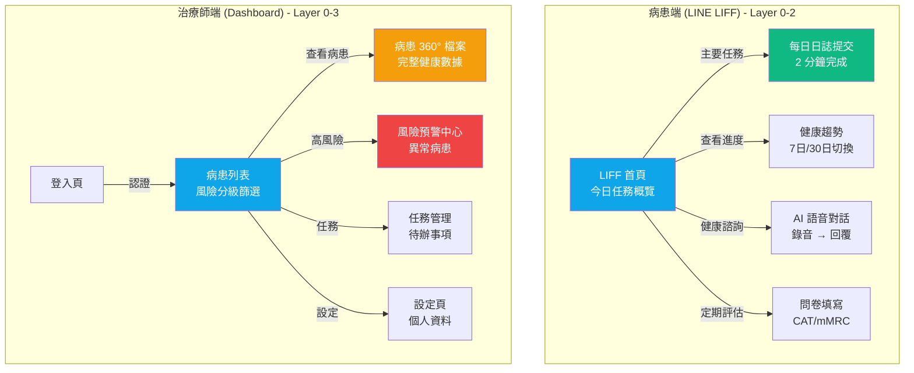
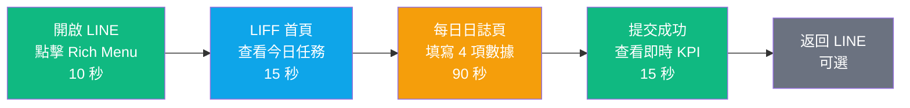
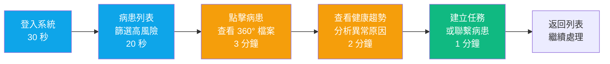
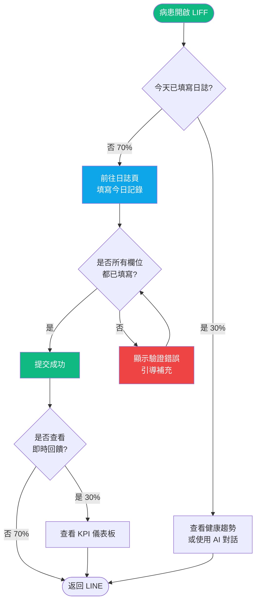
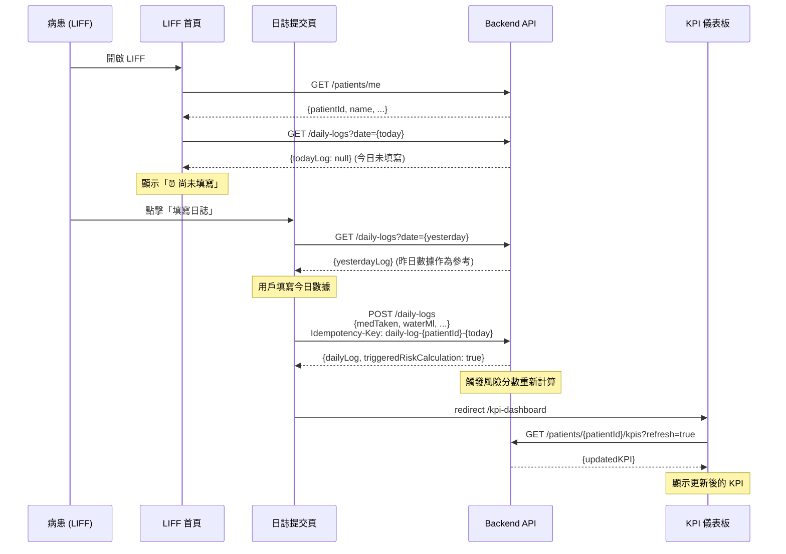
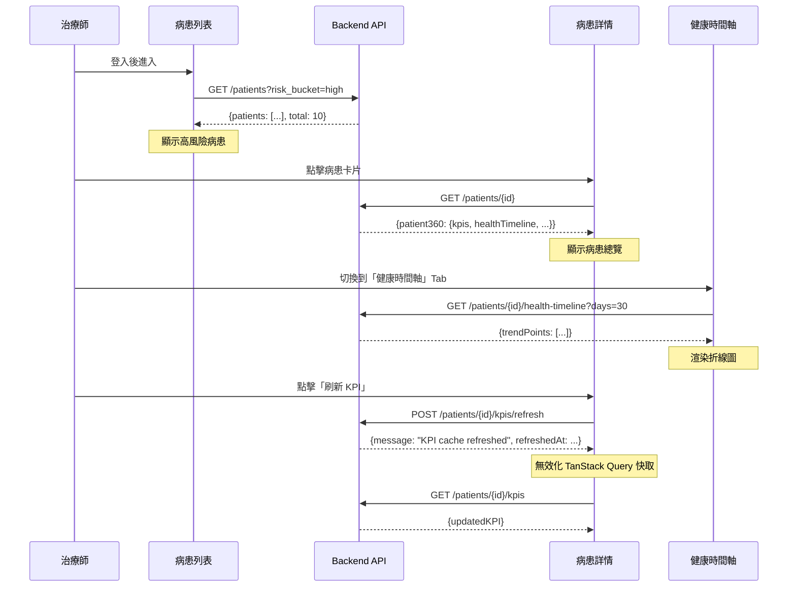

# RespiraAlly 前端信息架構規範

---

**文件版本 (Document Version):** `v1.0.0`
**最後更新 (Last Updated):** `2025-10-18`
**主要作者 (Lead Author):** `Claude Code AI`
**審核者 (Reviewers):** `PM, Technical Lead, UX Designer`
**狀態 (Status):** `草稿 (Draft)`
**相關文檔:**
- [PRD](./02_product_requirements_document.md)
- [Frontend Architecture](./12_frontend_architecture_specification.md)
- [API Design](./06_api_design_specification.md)
- [Architecture Design](./05_architecture_and_design.md)

---

## 目錄 (Table of Contents)

- [1. 文檔目的與範圍](#1-文檔目的與範圍)
- [2. 核心設計原則](#2-核心設計原則)
- [3. 資訊架構總覽](#3-資訊架構總覽)
- [4. 核心用戶旅程](#4-核心用戶旅程)
- [5. 網站地圖與導航結構](#5-網站地圖與導航結構)
- [6. 頁面詳細規格](#6-頁面詳細規格)
- [7. 組件連結與導航系統](#7-組件連結與導航系統)
- [8. 數據流與狀態管理](#8-數據流與狀態管理)
- [9. URL 結構與路由規範](#9-url-結構與路由規範)
- [10. 實施檢查清單與驗收標準](#10-實施檢查清單與驗收標準)
- [11. 附錄](#11-附錄)

---

## 1. 文檔目的與範圍

### 1.1 目的 (Purpose)

本文檔旨在提供 `RespiraAlly V2.0` 前端的完整信息架構規範，作為前端開發、設計與測試的**單一事實來源 (SSOT)**。

**核心目標：**
- ✅ 定義清晰的用戶旅程與頁面職責，確保病患 (60+ 長者) 和治療師的核心任務流暢完成
- ✅ 規範導航結構與 URL 設計，支持 LINE LIFF 和 Next.js Dashboard 雙平台
- ✅ 統一前端數據流與狀態管理策略，確保 Server State (TanStack Query) 與 Global State (Zustand) 正確協作
- ✅ 提供可執行的實施檢查清單，支持分階段 MVP 交付 (Phase 0-3)

### 1.2 適用範圍 (Scope)

| 適用範圍 | 說明 |
|:---|:---|
| **包含 (In Scope)** | - 所有前端頁面的信息架構 (病患端 LIFF + 治療師端 Dashboard)<br/>- 用戶旅程與導航設計<br/>- URL 結構與 Next.js 路由規範<br/>- 頁面間數據傳遞 (URL Params, LocalStorage, TanStack Query Cache)<br/>- Elder-first 設計的具體實踐 (大字體、高對比、簡化流程) |
| **不包含 (Out of Scope)** | - 視覺設計細節 (色彩、間距、動畫) - 參考 Design System<br/>- 組件級別實現 (shadcn/ui 組件使用) - 參考 Component Library<br/>- 後端 API 設計 (參考 [API Design Spec](./06_api_design_specification.md))<br/>- AI 語音處理細節 (STT/LLM/TTS) - 參考後端架構 |

### 1.3 角色與職責 (RACI)

| 角色 | 職責 | 責任類型 |
|:---|:---|:---|
| **PM** | 定義用戶需求與核心旅程，確保符合商業目標 (依從率 ≥75%) | R/A |
| **UX Designer** | 設計信息架構與導航流程，確保 Elder-first 原則落地 | R/A |
| **Frontend Lead** | 審核技術可行性與實現方案，確保與 Next.js 14 App Router 契合 | A |
| **Frontend DEV** | 實現頁面與導航邏輯，遵循本文檔規範 | R |
| **QA** | 驗證用戶流程與導航正確性，執行 E2E 測試 (Playwright) | C |
| **Backend DEV** | 提供 API 支持，確保數據契約一致 | C |

---

## 2. 核心設計原則

### 2.1 設計哲學

**核心價值主張：**
> 「讓 60+ 長者能在 2 分鐘內完成每日健康日誌，並透過 AI 語音獲得即時健康建議」

**第一性原理推演：**
```
商業目標：提升 COPD 病患健康行為依從率至 75%
    ↓
用戶需求：簡化記錄流程、減少認知負荷、提供即時回饋
    ↓
設計策略：Elder-first UI (大字體/高對比/簡化選項) + 語音優先交互
    ↓
架構決策：LINE LIFF (降低門檻) + 最多 3 步完成核心任務
```

### 2.2 資訊架構原則

#### 2.2.1 簡化原則 (Simplification)

- ✅ **保留**：每日日誌提交 (核心任務)、健康趨勢查看、AI 語音對話、CAT/mMRC 問卷
- ❌ **移除**：社交分享、複雜圖表配置、多步驟嚮導 (Phase 2 後再評估)
- 🎯 **專注**：用最少步驟完成記錄，用最直觀方式呈現健康狀態

#### 2.2.2 認知負荷優化

基於 **Hick's Law** 和 **認知負荷理論**：
- **決策點數量**：每個頁面最多 3 個主要選項 (例如：日誌提交頁只有「用藥」「飲水」「運動」「抽菸」四個輸入項)
- **每頁專注度**：每個頁面只有 1 個主要目標 (例如：日誌頁 = 提交今日記錄)
- **資訊分層**：病患端優先顯示今日任務，治療師端優先顯示高風險病患

#### 2.2.3 架構模式

- [x] **混合架構**：
  - **病患端 (LIFF)**：扁平化架構 (2層導航深度)，支持快速完成核心任務
  - **治療師端 (Dashboard)**：中心輻射架構 (以病患列表為中心，輻射到各個功能模組)

**選擇理由：**
- 病患端用戶年齡偏高 (60+)，扁平化架構減少迷失感
- 治療師端需要在多個病患間快速切換，中心輻射架構提供清晰的返回路徑

---

## 3. 資訊架構總覽

### 3.1 系統層次結構



**層級說明：**
- **Layer 0 (入口層)**：LIFF 首頁 (病患)、登入頁 (治療師)
- **Layer 1 (核心功能層)**：每日日誌、病患列表
- **Layer 2 (輔助功能層)**：健康趨勢、AI 對話、問卷填寫、病患詳情
- **Layer 3 (深度功能層)**：風險預警、任務管理、設定

### 3.2 頁面總覽矩陣

#### 病患端 (LIFF)

| # | 頁面路由 | 頁面名稱 | 主要職責 | 用戶目標 | 預期停留時間 | 導航深度 |
|:--|:---------|:---------|:---------|:---------|:-------------|:---------|
| 0 | `/` | LIFF 首頁 | 顯示今日任務與健康概覽 | 快速了解今日狀態 | 30 秒 | Level 0 |
| 1 | `/daily-log` | 每日日誌提交 | 記錄今日健康數據 | 完成每日記錄 | 2 分鐘 | Level 1 |
| 2 | `/health-trends` | 健康趨勢 | 查看 7日/30日 健康數據 | 了解健康變化 | 1-2 分鐘 | Level 2 |
| 3 | `/kpi-dashboard` | KPI 儀表板 | 顯示核心健康指標 | 快速了解整體狀態 | 1 分鐘 | Level 2 |
| 4 | `/ai-chat` | AI 語音對話 | 語音諮詢健康問題 | 獲得健康建議 | 3-5 分鐘 | Level 2 |
| 5 | `/survey/cat` | CAT 問卷 | 填寫 COPD 評估問卷 | 完成定期評估 | 5 分鐘 | Level 2 |
| 6 | `/survey/mmrc` | mMRC 問卷 | 填寫呼吸困難評估 | 完成定期評估 | 2 分鐘 | Level 2 |
| 7 | `/profile` | 個人資料 | 查看/編輯基本資料 | 更新個人資訊 | 2-3 分鐘 | Level 2 |

**總計：** 8 頁

#### 治療師端 (Dashboard)

| # | 頁面路由 | 頁面名稱 | 主要職責 | 用戶目標 | 預期停留時間 | 導航深度 |
|:--|:---------|:---------|:---------|:---------|:-------------|:---------|
| 0 | `/login` | 登入頁 | 治療師認證 | 登入系統 | 30 秒 | Level 0 |
| 1 | `/patients` | 病患列表 | 查看所有病患與風險分級 | 篩選需關注病患 | 持續使用 | Level 1 |
| 2 | `/patients/[id]` | 病患 360° 檔案 | 查看單一病患完整資料 | 深入了解病患狀態 | 5-10 分鐘 | Level 2 |
| 3 | `/alerts` | 風險預警中心 | 顯示異常病患警報 | 快速處理高風險病患 | 3-5 分鐘 | Level 2 |
| 4 | `/tasks` | 任務管理 | 管理待辦事項 | 追蹤任務進度 | 2-3 分鐘 | Level 2 |
| 5 | `/settings` | 設定頁 | 個人資料與系統設定 | 修改設定 | 1-2 分鐘 | Level 2 |

**總計：** 6 頁

---

## 4. 核心用戶旅程

### 4.1 病患核心旅程：每日健康記錄



**總時長目標：** ≤ 2 分鐘

### 4.2 治療師核心旅程：高風險病患處理



**總時長目標：** ≤ 7 分鐘/病患

### 4.3 用戶旅程映射表

#### 旅程 1：病患每日記錄

| 階段 | 頁面 | 用戶心理狀態 | 設計目標 | 主要CTA | 預期停留時間 | 轉換率目標 |
|:-----|:-----|:-------------|:---------|:--------|:-------------|:-----------|
| **發現** | LIFF 首頁 | 習慣性打開 | 快速顯示今日任務 | 「填寫今日日誌」 | 15 秒 | 90% |
| **行動** | 每日日誌頁 | 專注填寫 | 簡化輸入、大按鈕 | 「提交記錄」 | 90 秒 | 95% |
| **回饋** | 提交成功頁 | 成就感 | 顯示即時 KPI、鼓勵文字 | 「查看健康趨勢」 | 15 秒 | 30% (可選) |

**關鍵洞察：**
- 從開啟 LINE 到提交成功應 ≤ 2 分鐘
- 每日日誌頁必須支持**冪等性** (當日重複提交應更新而非報錯)

#### 旅程 2：治療師風險處理

| 階段 | 頁面 | 用戶心理狀態 | 設計目標 | 主要CTA | 預期停留時間 | 轉換率目標 |
|:-----|:-----|:-------------|:---------|:--------|:-------------|:-----------|
| **篩選** | 病患列表 | 緊迫、專注 | 清晰風險標籤、快速篩選 | 「查看高風險病患」 | 20 秒 | 100% |
| **分析** | 病患 360° 檔案 | 深度思考 | 完整數據、趨勢圖表 | 「查看健康時間軸」 | 3-5 分鐘 | 80% |
| **行動** | 任務管理頁 | 決策執行 | 快速建立任務、設定提醒 | 「建立追蹤任務」 | 1 分鐘 | 60% |

### 4.4 決策點分析



**總決策點：** 3 個 (是否填寫、是否完整、是否查看回饋)

---

## 5. 網站地圖與導航結構

### 5.1 完整網站地圖

#### 病患端 (LIFF) - 扁平化結構

```
RespiraAlly LIFF (liff.line.me/{liffId})
│
├─ 0. / [LIFF 首頁]
│  ├─ → /daily-log (主要任務)
│  ├─ → /health-trends (查看趨勢)
│  └─ → /ai-chat (語音對話)
│
├─ 1. /daily-log [每日日誌提交]
│  ├─ → / (返回首頁)
│  └─ → /kpi-dashboard (提交後查看 KPI)
│
├─ 2. /health-trends [健康趨勢]
│  ├─ ?period=7d (預設)
│  ├─ ?period=30d (切換)
│  └─ → / (返回首頁)
│
├─ 3. /kpi-dashboard [KPI 儀表板]
│  └─ → / (返回首頁)
│
├─ 4. /ai-chat [AI 語音對話]
│  ├─ → / (返回首頁)
│  └─ WebSocket: wss://api.respira.ally/v1/ws/voice/{task_id}
│
├─ 5. /survey/cat [CAT 問卷]
│  ├─ → /survey/result?type=cat (提交後)
│  └─ → / (返回首頁)
│
├─ 6. /survey/mmrc [mMRC 問卷]
│  ├─ → /survey/result?type=mmrc (提交後)
│  └─ → / (返回首頁)
│
└─ 7. /profile [個人資料]
   └─ → / (返回首頁)
```

#### 治療師端 (Dashboard) - 中心輻射結構

```
RespiraAlly Dashboard (dashboard.respira.ally)
│
├─ 0. /login [登入頁]
│  └─ → /patients (登入成功)
│
├─ 1. /patients [病患列表] ⭐ 中心頁
│  ├─ ?risk_bucket=high (高風險篩選)
│  ├─ ?risk_bucket=medium (中風險篩選)
│  ├─ ?risk_bucket=low (低風險篩選)
│  ├─ ?sort_by=-latest_risk_score (排序)
│  ├─ → /patients/{id} (查看病患)
│  ├─ → /alerts (風險預警)
│  ├─ → /tasks (任務管理)
│  └─ → /settings (設定)
│
├─ 2. /patients/[id] [病患 360° 檔案]
│  ├─ #overview (總覽)
│  ├─ #health-timeline (健康時間軸)
│  ├─ #survey-trends (問卷趨勢)
│  ├─ #events (事件記錄)
│  ├─ → /patients/{id}/kpis/refresh (手動刷新 KPI)
│  └─ ← /patients (返回列表)
│
├─ 3. /alerts [風險預警中心]
│  ├─ → /patients/{id} (查看異常病患)
│  └─ ← /patients (返回列表)
│
├─ 4. /tasks [任務管理]
│  ├─ → /patients/{id} (關聯病患)
│  └─ ← /patients (返回列表)
│
└─ 5. /settings [設定頁]
   ├─ #profile (個人資料)
   ├─ #security (安全設定)
   └─ ← /patients (返回列表)
```

### 5.2 導航連結矩陣

#### 病患端 (LIFF)

| 來源 \ 目標 | 首頁 | 日誌 | 趨勢 | KPI | AI 對話 | 問卷 | 個人資料 |
|:----------|:-----|:-----|:-----|:-----|:--------|:-----|:---------|
| **首頁** | - | ✅ 主要 | ✅ 主要 | ✅ 次要 | ✅ 主要 | ⚠️ 定期提醒 | ✅ 次要 |
| **日誌** | ✅ 返回 | - | ❌ | ✅ 提交後 | ❌ | ❌ | ❌ |
| **趨勢** | ✅ 返回 | ❌ | - | ✅ 查看詳情 | ❌ | ❌ | ❌ |
| **KPI** | ✅ 返回 | ✅ 填寫日誌 | ✅ 查看趨勢 | - | ❌ | ❌ | ❌ |
| **AI 對話** | ✅ 返回 | ❌ | ❌ | ❌ | - | ❌ | ❌ |
| **問卷** | ✅ 返回 | ❌ | ❌ | ❌ | ❌ | - | ❌ |
| **個人資料** | ✅ 返回 | ❌ | ❌ | ❌ | ❌ | ❌ | - |

#### 治療師端 (Dashboard)

| 來源 \ 目標 | 病患列表 | 病患詳情 | 風險預警 | 任務管理 | 設定 |
|:----------|:--------|:---------|:---------|:---------|:-----|
| **病患列表** | - | ✅ 查看 | ✅ 預警 | ✅ 任務 | ✅ 設定 |
| **病患詳情** | ✅ 返回 | - | ⚠️ 若有警報 | ✅ 建立任務 | ❌ |
| **風險預警** | ✅ 返回 | ✅ 查看病患 | - | ✅ 建立任務 | ❌ |
| **任務管理** | ✅ 返回 | ✅ 關聯病患 | ❌ | - | ❌ |
| **設定** | ✅ 返回 | ❌ | ❌ | ❌ | - |

**圖例：**
- ✅ 推薦路徑 (直接可達)
- ⚠️ 條件路徑 (需滿足特定條件)
- ❌ 不存在路徑 (不應該連結)

---

## 6. 頁面詳細規格

### 6.1 [病患端] LIFF 首頁

#### 基本信息

| 屬性 | 值 |
|:-----|:---|
| **檔名** | `app/(patient)/page.tsx` |
| **URL** | `/` |
| **URL參數** | 無 |
| **頁面類型** | 儀表板頁 |
| **導航深度** | Level 0 |
| **SEO優先級** | N/A (LIFF 內嵌) |

#### 職責與目標

| 項目 | 內容 |
|:-----|:-----|
| **主要任務** | 顯示今日健康任務概覽、快速導航至核心功能 |
| **次要任務** | 顯示最新 KPI、最近一次問卷結果 |
| **用戶目標** | 快速了解今日是否已完成日誌、當前健康狀態 |
| **轉換目標** | 90% 用戶點擊「填寫今日日誌」 |

#### 設計模型應用

| 模型/原理 | 應用方式 | 預期效果 |
|:---------|:---------|:---------|
| **Elder-First 設計** | 18px 基礎字體、44px 最小觸控區、高對比色 | 降低操作難度、減少誤觸 |
| **F 型視覺模式** | 重要任務放置左上、次要功能放置下方 | 符合視覺掃描習慣 |

#### 關鍵組件結構

```html
<page-structure>
  <!-- 1. 頁面標題 -->
  <header class="page-header">
    <greeting>早安，{patientName}</greeting>
    <date>今天是 {date}</date>
  </header>

  <!-- 2. 今日任務卡片 -->
  <section class="today-tasks">
    <task-card priority="high">
      <icon>📝</icon>
      <title>今日健康日誌</title>
      <status v-if="todayLogExists">✅ 已完成</status>
      <status v-else>⏰ 尚未填寫</status>
      <button href="/daily-log" size="large">
        {{ todayLogExists ? '修改記錄' : '填寫日誌' }}
      </button>
    </task-card>
  </section>

  <!-- 3. 快速導航 -->
  <section class="quick-nav">
    <nav-button href="/health-trends">
      <icon>📊</icon>
      <label>健康趨勢</label>
    </nav-button>
    <nav-button href="/ai-chat">
      <icon>🤖</icon>
      <label>AI 助手</label>
    </nav-button>
    <nav-button href="/kpi-dashboard">
      <icon>💯</icon>
      <label>健康評分</label>
    </nav-button>
  </section>

  <!-- 4. 健康概覽 -->
  <section class="health-summary">
    <kpi-badge>
      <label>7 日依從率</label>
      <value color="{{adherenceRate >= 80 ? 'success' : 'warning'}}">
        {{adherenceRate}}%
      </value>
    </kpi-badge>
    <kpi-badge>
      <label>最新 CAT 分數</label>
      <value>{{latestCatScore}} / 40</value>
      <date>{{latestCatDate}}</date>
    </kpi-badge>
  </section>

  <!-- 5. 底部導航 (LINE Rich Menu 替代) -->
  <footer class="bottom-nav">
    <nav-item href="/" active>
      <icon>🏠</icon>
      <label>首頁</label>
    </nav-item>
    <nav-item href="/profile">
      <icon>👤</icon>
      <label>個人</label>
    </nav-item>
  </footer>
</page-structure>
```

#### 導航出口

```javascript
{
  primary: '/daily-log',           // 主要任務
  secondary: '/health-trends',     // 查看趨勢
  tertiary: '/ai-chat',            // AI 對話
  profile: '/profile'              // 個人資料
}
```

#### 關鍵指標 (KPIs)

| 指標 | 目標值 | 衡量方式 |
|:-----|:-------|:---------|
| **日誌提交率** | ≥ 90% | (點擊「填寫日誌」次數 / 訪問次數) × 100% |
| **平均停留時間** | 15-30 秒 | 進入頁面到離開的時間 |
| **健康趨勢點擊率** | ≥ 30% | (點擊「健康趨勢」次數 / 訪問次數) × 100% |

#### 驗收標準 (Definition of Done)

- [ ] 顯示病患姓名與當日日期
- [ ] 正確判斷今日日誌是否已提交 (查詢 `GET /daily-logs?date={today}`)
- [ ] 已提交時顯示「✅ 已完成」,未提交時顯示「⏰ 尚未填寫」
- [ ] 所有按鈕尺寸 ≥ 44px × 44px
- [ ] 字體大小 ≥ 18px
- [ ] 頁面載入時間 < 2 秒 (LCP)
- [ ] 支援深色模式 (LIFF SDK 自動偵測)
- [ ] 通過 WCAG AA 色彩對比度測試

---

### 6.2 [病患端] 每日日誌提交頁

#### 基本信息

| 屬性 | 值 |
|:-----|:---|
| **檔名** | `app/(patient)/daily-log/page.tsx` |
| **URL** | `/daily-log` |
| **URL參數** | 無 |
| **頁面類型** | 表單頁 |
| **導航深度** | Level 1 |
| **SEO優先級** | N/A (LIFF 內嵌) |

#### 職責與目標

| 項目 | 內容 |
|:-----|:-----|
| **主要任務** | 記錄今日用藥、飲水、運動、抽菸數據 |
| **次要任務** | 顯示歷史提示 (例如：昨日飲水量 1500ml) |
| **用戶目標** | 2 分鐘內完成記錄提交 |
| **轉換目標** | 95% 提交成功率 |

#### 關鍵組件結構

```html
<page-structure>
  <!-- 1. 頁面標題 -->
  <header class="page-header">
    <back-button href="/" />
    <title>今日健康記錄</title>
    <subtitle>{{date}}</subtitle>
  </header>

  <!-- 2. 表單區域 -->
  <form class="daily-log-form">
    <!-- 用藥記錄 - 大型切換按鈕 -->
    <form-group>
      <label size="large">今天有吃藥嗎？</label>
      <button-group>
        <button type="button" size="xl" :variant="medTaken ? 'primary' : 'outline'">
          ✅ 有吃藥
        </button>
        <button type="button" size="xl" :variant="!medTaken ? 'primary' : 'outline'">
          ❌ 忘記吃
        </button>
      </button-group>
    </form-group>

    <!-- 飲水量 - 數字輸入 + 快捷按鈕 -->
    <form-group>
      <label size="large">今天喝了多少水？(毫升)</label>
      <input type="number" v-model="waterMl" placeholder="例如：1500" />
      <quick-buttons>
        <button @click="waterMl = 1000">1000ml</button>
        <button @click="waterMl = 1500">1500ml</button>
        <button @click="waterMl = 2000">2000ml</button>
      </quick-buttons>
      <hint>昨日飲水：{{yesterdayWater}}ml</hint>
    </form-group>

    <!-- 運動時長 - 數字輸入 -->
    <form-group>
      <label size="large">今天運動了多久？(分鐘)</label>
      <input type="number" v-model="exerciseMin" placeholder="例如：30" />
      <hint>建議每日 30 分鐘</hint>
    </form-group>

    <!-- 抽菸量 - 數字輸入 (若為吸菸者) -->
    <form-group v-if="isSmok人">
      <label size="large">今天抽了幾支菸？</label>
      <input type="number" v-model="cigaretteCount" placeholder="例如：5" />
      <hint>昨日抽菸：{{yesterdayCigarettes}}支</hint>
    </form-group>

    <!-- 提交按鈕 -->
    <submit-button size="xl" :loading="isSubmitting">
      {{ todayLogExists ? '更新記錄' : '提交記錄' }}
    </submit-button>
  </form>
</page-structure>
```

#### 互動邏輯

```typescript
class DailyLogPageLogic {
  todayLogExists = false;
  isSubmitting = false;
  formData = {
    medTaken: false,
    waterMl: 0,
    exerciseMin: 0,
    cigaretteCount: 0
  };

  async onMount() {
    // 1. 檢查今日是否已有記錄
    const todayLog = await this.fetchTodayLog();
    if (todayLog) {
      this.todayLogExists = true;
      this.formData = todayLog; // 預填今日數據
    }

    // 2. 獲取昨日數據作為參考
    const yesterdayLog = await this.fetchYesterdayLog();
    this.displayYesterdayHints(yesterdayLog);
  }

  async onSubmit() {
    // 1. 客戶端驗證
    if (!this.validateForm()) {
      return;
    }

    this.isSubmitting = true;

    try {
      // 2. 提交 API (支持冪等性)
      const response = await apiClient.post('/daily-logs', {
        ...this.formData,
        idempotency_key: `daily-log-${patientId}-${today}`
      });

      // 3. 無效化相關 TanStack Query 快取
      queryClient.invalidateQueries(['patient', patientId, 'kpi']);
      queryClient.invalidateQueries(['patient', patientId, 'health-timeline']);

      // 4. 顯示成功提示
      toast.success('今日健康記錄已提交！');

      // 5. 導航到 KPI 儀表板
      router.push('/kpi-dashboard');
    } catch (error) {
      toast.error(error.message);
    } finally {
      this.isSubmitting = false;
    }
  }
}
```

#### 導航出口

```javascript
{
  primary: '/kpi-dashboard',  // 提交成功後
  back: '/',                  // 返回首頁
  cancel: '/'                 // 取消操作
}
```

#### 關鍵指標 (KPIs)

| 指標 | 目標值 | 衡量方式 |
|:-----|:-------|:---------|
| **提交成功率** | ≥ 95% | (成功提交次數 / 嘗試提交次數) × 100% |
| **平均填寫時間** | ≤ 2 分鐘 | 從進入頁面到成功提交的時間 |
| **錯誤率** | ≤ 5% | 顯示驗證錯誤的次數比例 |

#### 驗收標準 (Definition of Done)

- [ ] 支持冪等性 (當日重複提交應更新而非報錯)
- [ ] 所有輸入欄位有驗證 (飲水 ≥ 0、運動 ≥ 0、抽菸 ≥ 0)
- [ ] 提交時顯示 Loading 狀態
- [ ] 提交失敗顯示友好錯誤訊息
- [ ] 提交成功後導航到 KPI 儀表板
- [ ] 快捷按鈕正確預填數值
- [ ] 昨日提示正確顯示
- [ ] 通過 E2E 測試 (Playwright)

---

### 6.3 [治療師端] 病患列表頁

#### 基本信息

| 屬性 | 值 |
|:-----|:---|
| **檔名** | `app/(therapist)/patients/page.tsx` |
| **URL** | `/patients` |
| **URL參數** | `risk_bucket` (可選): `high` \| `medium` \| `low`<br/>`sort_by` (可選): `-latest_risk_score` \| `-adherence_rate_7d`<br/>`skip` (可選): 預設 0<br/>`limit` (可選): 預設 20 |
| **頁面類型** | 列表頁 + 篩選器 |
| **導航深度** | Level 1 (中心頁) |
| **SEO優先級** | ⭐⭐⭐⭐⭐ (高) |

#### 職責與目標

| 項目 | 內容 |
|:-----|:-----|
| **主要任務** | 顯示所有病患列表、支持風險分級篩選與排序 |
| **次要任務** | 顯示每位病患的核心 KPI、最新活動時間 |
| **用戶目標** | 快速定位需要關注的高風險病患 |
| **轉換目標** | 80% 點擊率 (點擊進入病患詳情) |

#### 關鍵組件結構

```html
<page-structure>
  <!-- 1. 頁面標題 + 篩選器 -->
  <header class="page-header">
    <title>我的病患</title>
    <subtitle>共 {{totalPatients}} 位</subtitle>
    <filter-bar>
      <tab-group>
        <tab :active="riskBucket === 'all'" @click="filterByRisk('all')">
          全部 ({{totalCount}})
        </tab>
        <tab :active="riskBucket === 'high'" @click="filterByRisk('high')" color="error">
          高風險 ({{highRiskCount}})
        </tab>
        <tab :active="riskBucket === 'medium'" @click="filterByRisk('medium')" color="warning">
          中風險 ({{mediumRiskCount}})
        </tab>
        <tab :active="riskBucket === 'low'" @click="filterByRisk('low')" color="success">
          低風險 ({{lowRiskCount}})
        </tab>
      </tab-group>
      <sort-select v-model="sortBy">
        <option value="-latest_risk_score">風險分數 (高→低)</option>
        <option value="-adherence_rate_7d">依從率 (低→高)</option>
        <option value="-last_active_at">最後活動</option>
      </sort-select>
    </filter-bar>
  </header>

  <!-- 2. 病患卡片列表 -->
  <section class="patient-list">
    <patient-card
      v-for="patient in patients"
      :key="patient.id"
      @click="goToPatientDetail(patient.id)"
    >
      <!-- 左側：基本資訊 -->
      <patient-info>
        <avatar :src="patient.lineAvatarUrl" />
        <name>{{patient.name}}</name>
        <meta>
          <age>{{patient.age}}歲</age>
          <gender>{{patient.gender}}</gender>
        </meta>
      </patient-info>

      <!-- 中間：核心 KPI -->
      <kpi-badges>
        <badge color="{{getRiskColor(patient.riskLevel)}}">
          <label>風險等級</label>
          <value>{{patient.riskLevel}}</value>
        </badge>
        <badge>
          <label>7日依從率</label>
          <value :color="{{patient.adherenceRate7d >= 80 ? 'success' : 'warning'}}">
            {{patient.adherenceRate7d}}%
          </value>
        </badge>
        <badge>
          <label>最新 CAT</label>
          <value>{{patient.latestCatScore}}</value>
        </badge>
      </kpi-badges>

      <!-- 右側：最後活動 -->
      <last-active>
        <time>{{formatLastActive(patient.lastActiveAt)}}</time>
      </last-active>
    </patient-card>
  </section>

  <!-- 3. 分頁 -->
  <pagination
    :current="currentPage"
    :total="totalPages"
    @change="onPageChange"
  />
</page-structure>
```

#### 互動邏輯

```typescript
class PatientsListPageLogic {
  riskBucket = 'all';
  sortBy = '-latest_risk_score';
  currentPage = 1;
  pageSize = 20;

  // 使用 TanStack Query
  { data: patients, isLoading } = usePatientList({
    risk_bucket: this.riskBucket,
    sort_by: this.sortBy,
    skip: (this.currentPage - 1) * this.pageSize,
    limit: this.pageSize
  });

  filterByRisk(bucket: string) {
    this.riskBucket = bucket;
    this.currentPage = 1; // 重置分頁
    // TanStack Query 自動重新查詢
  }

  goToPatientDetail(patientId: string) {
    router.push(`/patients/${patientId}`);
  }

  getRiskColor(level: string) {
    return {
      'HIGH': 'error',
      'MEDIUM': 'warning',
      'LOW': 'success'
    }[level];
  }
}
```

#### 導航出口

```javascript
{
  primary: '/patients/{id}',   // 查看病患詳情
  alerts: '/alerts',            // 風險預警中心
  tasks: '/tasks',              // 任務管理
  settings: '/settings'         // 設定
}
```

#### 關鍵指標 (KPIs)

| 指標 | 目標值 | 衡量方式 |
|:-----|:-------|:---------|
| **病患詳情點擊率** | ≥ 80% | (點擊病患次數 / 訪問次數) × 100% |
| **篩選器使用率** | ≥ 60% | (使用篩選器的會話數 / 總會話數) × 100% |
| **頁面載入時間** | < 2 秒 | LCP (Largest Contentful Paint) |

#### 驗收標準 (Definition of Done)

- [ ] 支持風險分級篩選 (全部/高/中/低)
- [ ] 支持排序 (風險分數、依從率、最後活動)
- [ ] 支持分頁 (每頁 20 筆)
- [ ] 正確顯示每位病患的核心 KPI
- [ ] 點擊病患卡片導航到詳情頁
- [ ] 空狀態顯示友好提示 (例如：「暫無高風險病患」)
- [ ] Loading 狀態顯示骨架屏
- [ ] 通過 E2E 測試

---

### 6.4 [治療師端] 病患 360° 檔案頁

#### 基本信息

| 屬性 | 值 |
|:-----|:---|
| **檔名** | `app/(therapist)/patients/[id]/page.tsx` |
| **URL** | `/patients/[id]` |
| **URL參數** | `id` (必須): 病患 UUID |
| **頁面類型** | 詳情頁 + 多 Tab |
| **導航深度** | Level 2 |
| **SEO優先級** | ⭐⭐⭐ (中) |

#### 職責與目標

| 項目 | 內容 |
|:-----|:-----|
| **主要任務** | 顯示病患完整健康檔案 (KPI、健康時間軸、問卷趨勢、事件記錄) |
| **次要任務** | 支持手動刷新 KPI、建立任務、查看警報 |
| **用戶目標** | 深入了解病患健康狀態、找出異常原因 |
| **轉換目標** | 60% 建立任務率 |

#### 關鍵組件結構

```html
<page-structure>
  <!-- 1. 頁面標題 + 返回 -->
  <header class="page-header">
    <back-button href="/patients" />
    <patient-info>
      <avatar :src="patient.lineAvatarUrl" />
      <name>{{patient.name}}</name>
      <meta>{{patient.age}}歲 | {{patient.gender}}</meta>
    </patient-info>
    <actions>
      <button @click="refreshKPI" :loading="isRefreshing">
        刷新 KPI
      </button>
      <button @click="createTask">
        建立任務
      </button>
    </actions>
  </header>

  <!-- 2. Tab 導航 -->
  <tab-navigation>
    <tab href="#overview" :active="activeTab === 'overview'">總覽</tab>
    <tab href="#health-timeline" :active="activeTab === 'health-timeline'">健康時間軸</tab>
    <tab href="#survey-trends" :active="activeTab === 'survey-trends'">問卷趨勢</tab>
    <tab href="#events" :active="activeTab === 'events'">事件記錄</tab>
  </tab-navigation>

  <!-- 3. Tab 內容 -->
  <section v-if="activeTab === 'overview'" id="overview">
    <!-- KPI 卡片 -->
    <kpi-grid>
      <kpi-card>
        <label>7 日依從率</label>
        <value :color="getAdherenceColor(kpi.adherenceRate7d)">
          {{kpi.adherenceRate7d}}%
        </value>
      </kpi-card>
      <kpi-card>
        <label>30 日依從率</label>
        <value>{{kpi.adherenceRate30d}}%</value>
      </kpi-card>
      <kpi-card>
        <label>7 日平均飲水</label>
        <value>{{kpi.avgWaterIntake7d}} ml</value>
      </kpi-card>
      <kpi-card>
        <label>7 日平均運動</label>
        <value>{{kpi.avgSteps7d}} 步</value>
      </kpi-card>
      <kpi-card>
        <label>最新 CAT 分數</label>
        <value>{{kpi.latestCatScore}} / 40</value>
        <date>{{kpi.latestCatDate}}</date>
      </kpi-card>
      <kpi-card>
        <label>風險等級</label>
        <value :color="getRiskColor(kpi.latestRiskLevel)">
          {{kpi.latestRiskLevel}}
        </value>
      </kpi-card>
    </kpi-grid>
  </section>

  <section v-if="activeTab === 'health-timeline'" id="health-timeline">
    <!-- 健康趨勢圖表 -->
    <chart-container>
      <time-range-selector v-model="timeRange">
        <option value="7">近 7 日</option>
        <option value="30">近 30 日</option>
        <option value="90">近 90 日</option>
      </time-range-selector>

      <line-chart
        :data="healthTimeline"
        :series="['用藥', '飲水', '運動']"
        :moving-average="true"
      />
    </chart-container>
  </section>

  <section v-if="activeTab === 'survey-trends'" id="survey-trends">
    <!-- 問卷趨勢圖表 -->
    <chart-container>
      <survey-type-selector v-model="surveyType">
        <option value="all">所有問卷</option>
        <option value="CAT">CAT 問卷</option>
        <option value="mMRC">mMRC 問卷</option>
      </survey-type-selector>

      <bar-chart
        :data="surveyTrends"
        x-axis="提交日期"
        y-axis="分數"
      />
    </chart-container>
  </section>

  <section v-if="activeTab === 'events'" id="events">
    <!-- 事件時間軸 -->
    <timeline>
      <event v-for="event in eventTimeline" :key="event.id">
        <time>{{event.createdAt}}</time>
        <type :color="getEventColor(event.type)">{{event.type}}</type>
        <message>{{event.message}}</message>
      </event>
    </timeline>
  </section>
</page-structure>
```

#### 互動邏輯

```typescript
class PatientDetailPageLogic {
  patientId = useRoute().params.id;
  activeTab = 'overview';
  timeRange = 7;
  surveyType = 'all';

  // 使用 TanStack Query
  { data: patient360 } = usePatient360(patientId);
  { data: kpi } = usePatientKPI(patientId);
  { data: healthTimeline } = usePatientHealthTimeline(patientId, timeRange);
  { data: surveyTrends } = usePatientSurveyTrends(patientId, surveyType);

  async refreshKPI() {
    try {
      this.isRefreshing = true;
      await apiClient.post(`/patients/${this.patientId}/kpis/refresh`);
      queryClient.invalidateQueries(['patient', this.patientId, 'kpi']);
      toast.success('KPI 已刷新');
    } catch (error) {
      toast.error(error.message);
    } finally {
      this.isRefreshing = false;
    }
  }

  createTask() {
    router.push(`/tasks/new?patient_id=${this.patientId}`);
  }
}
```

#### 導航出口

```javascript
{
  back: '/patients',             // 返回病患列表
  createTask: '/tasks/new',      // 建立任務
  viewAlerts: '/alerts'          // 查看警報 (若有)
}
```

#### 關鍵指標 (KPIs)

| 指標 | 目標值 | 衡量方式 |
|:-----|:-------|:---------|
| **Tab 切換率** | ≥ 50% | (切換 Tab 的會話數 / 總會話數) × 100% |
| **KPI 刷新率** | ≤ 10% | (手動刷新次數 / 訪問次數) × 100% (過高表示快取策略有問題) |
| **任務建立率** | ≥ 60% | (建立任務的會話數 / 總會話數) × 100% |

#### 驗收標準 (Definition of Done)

- [ ] 正確顯示病患 360° 檔案 (API: `GET /patients/{id}`)
- [ ] 支持 Tab 切換 (總覽、健康時間軸、問卷趨勢、事件記錄)
- [ ] 健康時間軸支持時間範圍切換 (7日/30日/90日)
- [ ] 問卷趨勢支持類型篩選 (全部/CAT/mMRC)
- [ ] 手動刷新 KPI 功能正常 (API: `POST /patients/{id}/kpis/refresh`)
- [ ] 圖表正確渲染 (使用 Recharts)
- [ ] 圖表支持移動平均線 (7 日 MA)
- [ ] Loading 狀態正確顯示
- [ ] 通過 E2E 測試

---

## 7. 組件連結與導航系統

### 7.1 數據傳遞鏈

#### 病患端：日誌提交流程



#### 治療師端：病患詳情查看流程



### 7.2 導航系統實現

#### 7.2.1 全局導航管理器 (Next.js App Router)

```typescript
// lib/navigation/NavigationManager.ts
import { useRouter, usePathname } from 'next/navigation';

class NavigationManager {
  router = useRouter();
  pathname = usePathname();
  history: Array<{ from: string; to: string; timestamp: number }> = [];

  getCurrentPage(): string {
    return this.pathname;
  }

  recordNavigation(from: string, to: string) {
    this.history.push({
      from,
      to,
      timestamp: Date.now()
    });

    // 持久化到 localStorage (僅前 20 筆)
    const recentHistory = this.history.slice(-20);
    localStorage.setItem('nav_history', JSON.stringify(recentHistory));
  }

  safeNavigate(targetPage: string, requiredAuth = true) {
    // 檢查認證狀態
    if (requiredAuth && !this.isAuthenticated()) {
      this.router.push('/login');
      return;
    }

    // 記錄導航
    this.recordNavigation(this.pathname, targetPage);

    // 執行導航
    this.router.push(targetPage);
  }

  goBack() {
    const lastNav = this.history[this.history.length - 1];
    if (lastNav) {
      this.router.push(lastNav.from);
    } else {
      this.router.back();
    }
  }

  private isAuthenticated(): boolean {
    const token = localStorage.getItem('authToken');
    return !!token;
  }
}

export const navManager = new NavigationManager();
```

#### 7.2.2 錨點平滑滾動 (病患詳情頁)

```typescript
// hooks/useAnchorScroll.ts
import { useEffect } from 'react';
import { useRouter } from 'next/navigation';

export function useAnchorScroll() {
  const router = useRouter();

  useEffect(() => {
    const handleAnchorClick = (e: MouseEvent) => {
      const target = e.target as HTMLElement;
      const anchor = target.closest('a[href^="#"]');

      if (anchor) {
        e.preventDefault();
        const targetId = anchor.getAttribute('href')!.substring(1);
        const targetElement = document.getElementById(targetId);

        if (targetElement) {
          targetElement.scrollIntoView({
            behavior: 'smooth',
            block: 'start'
          });

          // 更新 URL hash (不觸發頁面刷新)
          history.pushState(null, '', `#${targetId}`);
        }
      }
    };

    document.addEventListener('click', handleAnchorClick);
    return () => document.removeEventListener('click', handleAnchorClick);
  }, []);
}
```

#### 7.2.3 麵包屑導航 (治療師端)

```tsx
// components/BreadcrumbNavigation.tsx
import Link from 'next/link';
import { usePathname } from 'next/navigation';

export function BreadcrumbNavigation() {
  const pathname = usePathname();

  const getBreadcrumbs = () => {
    const paths = pathname.split('/').filter(Boolean);

    // 範例：/patients/123 → ['病患列表', '王大明']
    if (paths[0] === 'patients' && paths[1]) {
      return [
        { label: '病患列表', href: '/patients' },
        { label: '病患詳情', href: `/patients/${paths[1]}` }
      ];
    }

    // 範例：/alerts → ['病患列表', '風險預警']
    if (paths[0] === 'alerts') {
      return [
        { label: '病患列表', href: '/patients' },
        { label: '風險預警', href: '/alerts' }
      ];
    }

    return [];
  };

  const breadcrumbs = getBreadcrumbs();

  return (
    <nav className="breadcrumb">
      {breadcrumbs.map((crumb, index) => (
        <span key={crumb.href}>
          {index < breadcrumbs.length - 1 ? (
            <>
              <Link href={crumb.href}>{crumb.label}</Link>
              <span className="separator"> &gt; </span>
            </>
          ) : (
            <span className="current">{crumb.label}</span>
          )}
        </span>
      ))}
    </nav>
  );
}
```

---

## 8. 數據流與狀態管理

### 8.1 數據流向圖

```mermaid
graph TB
    subgraph "Frontend (Next.js + LIFF)"
        A[病患端 LIFF 頁面]
        B[治療師端 Dashboard 頁面]
        C[TanStack Query Cache]
        D[Zustand Global State]
        E[LocalStorage]
    end

    subgraph "Backend API (FastAPI)"
        F[/api/auth/*]
        G[/api/daily-logs/*]
        H[/api/patients/*]
        I[/api/voice/*]
    end

    subgraph "Data Storage"
        J[(PostgreSQL)]
        K[(Redis Cache)]
        L[(MinIO - Phase 2)]
    end

    A -->|POST /daily-logs| G
    G -->|寫入| J
    G -->|觸發風險計算| J
    G -->|返回 dailyLog| A
    A -->|暫存 lastSubmission| E

    B -->|GET /patients?risk_bucket=high| H
    H -->|讀取 patient_kpi_cache| J
    H -->|快取 5 分鐘| K
    H -->|返回 patientList| B
    B -->|快取到 TanStack Query| C

    A -->|POST /voice/upload| I
    I -->|上傳音訊| L
    I -->|返回 task_id| A
    A -->|WebSocket 連接| I

    D -->|持久化 user/session| E

    style A fill:#0ea5e9,color:#fff
    style B fill:#0ea5e9,color:#fff
    style C fill:#10b981,color:#fff
    style J fill:#f59e0b,color:#fff
    style K fill:#ef4444,color:#fff
```

### 8.2 狀態持久化策略

#### 病患端 (LIFF) - 使用 LocalStorage

```typescript
// lib/state/PatientStateManager.ts
class PatientStateManager {
  private storageKey = 'respira-patient-state';
  private maxAge = 7 * 24 * 60 * 60 * 1000; // 7 天

  saveLastSubmission(dailyLog: DailyLog) {
    const state = {
      lastSubmission: dailyLog,
      savedAt: Date.now()
    };
    localStorage.setItem(this.storageKey, JSON.stringify(state));
  }

  loadLastSubmission(): DailyLog | null {
    const savedData = localStorage.getItem(this.storageKey);
    if (!savedData) return null;

    const state = JSON.parse(savedData);

    // 檢查是否過期
    if (Date.now() - state.savedAt > this.maxAge) {
      this.clearState();
      return null;
    }

    return state.lastSubmission;
  }

  clearState() {
    localStorage.removeItem(this.storageKey);
  }
}

export const patientStateManager = new PatientStateManager();
```

#### 治療師端 - 使用 Zustand + Persist

```typescript
// store/therapistStore.ts
import { create } from 'zustand';
import { persist } from 'zustand/middleware';

interface TherapistState {
  user: TherapistUser | null;
  setUser: (user: TherapistUser | null) => void;

  selectedPatientFilters: {
    riskBucket: string;
    sortBy: string;
  };
  setFilters: (filters: Partial<TherapistState['selectedPatientFilters']>) => void;

  sidebarOpen: boolean;
  toggleSidebar: () => void;
}

export const useTherapistStore = create<TherapistState>()(
  persist(
    (set) => ({
      user: null,
      setUser: (user) => set({ user }),

      selectedPatientFilters: {
        riskBucket: 'all',
        sortBy: '-latest_risk_score'
      },
      setFilters: (filters) => set((state) => ({
        selectedPatientFilters: { ...state.selectedPatientFilters, ...filters }
      })),

      sidebarOpen: true,
      toggleSidebar: () => set((state) => ({ sidebarOpen: !state.sidebarOpen }))
    }),
    {
      name: 'respira-therapist-storage',
      partialize: (state) => ({
        user: state.user,
        selectedPatientFilters: state.selectedPatientFilters
      })
    }
  )
);
```

#### TanStack Query 快取策略

```typescript
// lib/api/queryClient.ts
import { QueryClient } from '@tanstack/react-query';

export const queryClient = new QueryClient({
  defaultOptions: {
    queries: {
      staleTime: 5 * 60 * 1000,        // 5 分鐘內視為新鮮
      cacheTime: 10 * 60 * 1000,       // 快取保留 10 分鐘
      refetchOnWindowFocus: true,      // 視窗聚焦時重新查詢
      refetchOnReconnect: true,        // 網路重連時重新查詢
      retry: 1,                         // 失敗重試 1 次
    },
    mutations: {
      retry: 0,                         // Mutation 不重試
    }
  }
});

// 針對不同資源的快取策略
export const cacheStrategies = {
  // 病患 KPI - 快取 5 分鐘
  patientKPI: {
    staleTime: 5 * 60 * 1000,
    cacheTime: 10 * 60 * 1000
  },

  // 健康時間軸 - 快取 10 分鐘
  healthTimeline: {
    staleTime: 10 * 60 * 1000,
    cacheTime: 30 * 60 * 1000
  },

  // 病患列表 - 快取 3 分鐘
  patientList: {
    staleTime: 3 * 60 * 1000,
    cacheTime: 10 * 60 * 1000
  }
};
```

---

## 9. URL 結構與路由規範

### 9.1 完整 URL 清單

#### 病患端 (LIFF)

```
LIFF 根目錄: liff.line.me/{liffId}/

核心頁面 URL:
├── /                                   [LIFF 首頁]
├── /daily-log                          [每日日誌提交]
├── /health-trends?period={7d|30d}      [健康趨勢] *period 可選,預設 7d
├── /kpi-dashboard                      [KPI 儀表板]
├── /ai-chat                            [AI 語音對話]
├── /survey/cat                         [CAT 問卷]
├── /survey/mmrc                        [mMRC 問卷]
└── /profile                            [個人資料]

WebSocket:
└── wss://api.respira.ally/v1/ws/voice/{task_id}  [語音任務結果]
```

#### 治療師端 (Dashboard)

```
Dashboard 根目錄: https://dashboard.respira.ally/

核心頁面 URL:
├── /login                              [登入頁]
├── /patients                           [病患列表]
│   ├── ?risk_bucket={high|medium|low}  [風險篩選] *可選
│   ├── ?sort_by={-latest_risk_score|-adherence_rate_7d}  [排序] *可選
│   ├── ?skip={0}                       [分頁偏移] *可選
│   └── ?limit={20}                     [每頁筆數] *可選
├── /patients/[id]                      [病患 360° 檔案] *id 必須
│   ├── #overview                       [總覽]
│   ├── #health-timeline                [健康時間軸]
│   ├── #survey-trends                  [問卷趨勢]
│   └── #events                         [事件記錄]
├── /alerts                             [風險預警中心]
├── /tasks                              [任務管理]
└── /settings                           [設定頁]
    ├── #profile                        [個人資料]
    └── #security                       [安全設定]

API 端點 (參考 06_api_design_specification.md):
├── POST /api/auth/token                [治療師登入]
├── POST /api/daily-logs                [提交日誌]
├── GET  /api/patients                  [病患列表]
├── GET  /api/patients/{id}             [病患 360°]
├── GET  /api/patients/{id}/kpis        [病患 KPI]
├── POST /api/patients/{id}/kpis/refresh [刷新 KPI]
└── POST /api/voice/upload              [上傳語音]
```

### 9.2 URL 驗證與錯誤處理

```typescript
// lib/validation/URLValidator.ts
class URLValidator {
  // 驗證病患 ID (UUID 格式)
  static validatePatientId(id: string): boolean {
    const uuidRegex = /^[0-9a-f]{8}-[0-9a-f]{4}-[0-9a-f]{4}-[0-9a-f]{4}-[0-9a-f]{12}$/i;
    return uuidRegex.test(id);
  }

  // 驗證風險分級參數
  static validateRiskBucket(bucket: string): boolean {
    return ['high', 'medium', 'low', 'all'].includes(bucket);
  }

  // 驗證時間範圍參數
  static validatePeriod(period: string): boolean {
    return ['7d', '30d', '90d'].includes(period);
  }

  // 處理無效病患 ID
  static handleInvalidPatientId(router: NextRouter) {
    toast.error('無效的病患 ID');
    setTimeout(() => {
      router.push('/patients');
    }, 2000);
  }

  // 處理無效參數
  static handleInvalidParams(router: NextRouter, message: string) {
    toast.warning(message);
    // 不重定向,僅提示並使用預設值
  }
}

// 使用範例：病患詳情頁
export default function PatientDetailPage({ params }: { params: { id: string } }) {
  const router = useRouter();

  useEffect(() => {
    if (!URLValidator.validatePatientId(params.id)) {
      URLValidator.handleInvalidPatientId(router);
    }
  }, [params.id]);

  // ...
}
```

### 9.3 URL 參數規範

#### 分頁參數

```typescript
// 標準分頁參數
interface PaginationParams {
  skip: number;   // 偏移量 (預設 0)
  limit: number;  // 每頁筆數 (預設 20, 最大 100)
}

// 使用範例
const { data } = usePatientList({
  skip: (currentPage - 1) * pageSize,
  limit: pageSize
});
```

#### 篩選參數

```typescript
// 病患列表篩選參數
interface PatientListFilters {
  risk_bucket?: 'high' | 'medium' | 'low';
  adherence_rate_lte?: number;      // 依從率 ≤ N%
  last_active_gte?: string;          // 最後活動 ≥ ISO date
}

// 使用範例
const filters = {
  risk_bucket: 'high',
  adherence_rate_lte: 60
};
```

#### 排序參數

```typescript
// 排序參數 (前綴 - 表示降序)
type SortBy = '-latest_risk_score' | '-adherence_rate_7d' | '-last_active_at';

// 使用範例
const sortBy = '-latest_risk_score'; // 風險分數降序
```

---

## 10. 實施檢查清單與驗收標準

### 10.1 開發階段檢查清單

#### Phase 0: 核心驗證 (Week 1-4)

| 任務 | 負責人 | 狀態 | 驗收標準 |
|:-----|:-------|:-----|:---------|
| **病患端 - LIFF 首頁** | Frontend DEV | ⬜ | - [ ] 正確顯示今日任務狀態<br/>- [ ] 快速導航按鈕功能正常<br/>- [ ] 頁面載入 < 2 秒 |
| **病患端 - 每日日誌頁** | Frontend DEV | ⬜ | - [ ] 支持冪等性提交<br/>- [ ] 所有輸入驗證正確<br/>- [ ] 提交成功後導航到 KPI 儀表板 |
| **病患端 - KPI 儀表板** | Frontend DEV | ⬜ | - [ ] 正確顯示 7日/30日 依從率<br/>- [ ] 查詢時間 < 50ms |
| **治療師端 - 登入頁** | Frontend DEV | ⬜ | - [ ] Email/密碼登入功能正常<br/>- [ ] JWT 存儲到 localStorage<br/>- [ ] 登入失敗顯示友好錯誤 |
| **治療師端 - 病患列表** | Frontend DEV | ⬜ | - [ ] 支持風險分級篩選<br/>- [ ] 支持排序功能<br/>- [ ] 支持分頁 (每頁 20 筆) |
| **治療師端 - 病患詳情** | Frontend DEV | ⬜ | - [ ] 正確顯示病患 360° 檔案<br/>- [ ] Tab 切換功能正常<br/>- [ ] 圖表正確渲染 |

#### Phase 1: 增值功能 (Week 5-8)

| 任務 | 負責人 | 狀態 | 驗收標準 |
|:-----|:-------|:-----|:---------|
| **病患端 - CAT 問卷** | Frontend DEV | ⬜ | - [ ] 8 個問題正確顯示<br/>- [ ] 總分計算正確 (0-40)<br/>- [ ] 提交後顯示嚴重度分級 |
| **病患端 - mMRC 問卷** | Frontend DEV | ⬜ | - [ ] 5 個選項正確顯示<br/>- [ ] 單選驗證正常<br/>- [ ] 提交後顯示結果 |
| **病患端 - 健康趨勢** | Frontend DEV | ⬜ | - [ ] 支持 7日/30日 切換<br/>- [ ] 折線圖正確渲染<br/>- [ ] 支持移動平均線 |
| **治療師端 - 風險預警** | Frontend DEV | ⬜ | - [ ] 正確顯示異常病患列表<br/>- [ ] 警報類型標籤清晰<br/>- [ ] 點擊導航到病患詳情 |

#### Phase 2: AI 能力 (Week 9-12)

| 任務 | 負責人 | 狀態 | 驗收標準 |
|:-----|:-------|:-----|:---------|
| **病患端 - AI 語音對話** | Frontend DEV | ⬜ | - [ ] 錄音功能正常<br/>- [ ] WebSocket 連接穩定<br/>- [ ] 15 秒內收到回覆<br/>- [ ] 顯示引用來源 |
| **治療師端 - 任務管理** | Frontend DEV | ⬜ | - [ ] 建立任務功能正常<br/>- [ ] 關聯病患功能正常<br/>- [ ] 任務狀態更新正確 |

#### Phase 3: 優化上線 (Week 13-16)

| 任務 | 負責人 | 狀態 | 驗收標準 |
|:-----|:-------|:-----|:---------|
| **性能優化** | Frontend DEV | ⬜ | - [ ] Lighthouse 分數 > 90<br/>- [ ] LCP < 2.5s<br/>- [ ] CLS < 0.1 |
| **E2E 測試** | QA | ⬜ | - [ ] 核心流程 Playwright 測試通過<br/>- [ ] 覆蓋率 > 80% |
| **跨瀏覽器測試** | QA | ⬜ | - [ ] Chrome/Safari/Firefox 功能一致 |

### 10.2 質量檢查清單

#### 用戶體驗 (UX)

- [ ] 病患完成每日日誌可在 2 分鐘內完成
- [ ] 所有導航路徑清晰無歧義
- [ ] 無死鏈或 404 錯誤
- [ ] 錯誤提示友好且可操作
- [ ] Loading 狀態明確可見
- [ ] 移動端體驗流暢 (病患端)
- [ ] Elder-First 設計原則落地 (字體 ≥ 18px、觸控區 ≥ 44px)

#### 技術規範 (Technical)

- [ ] 所有 URL 符合 Next.js 路由規範
- [ ] URL 參數驗證邏輯正確
- [ ] TanStack Query 快取策略正確配置
- [ ] Zustand 全域狀態持久化正常
- [ ] API 調用錯誤處理完善
- [ ] 無 Console 錯誤或警告
- [ ] 代碼符合 ESLint 規範

#### 內容完整性 (Content)

- [ ] 所有頁面內容完整 (無 Lorem Ipsum)
- [ ] 文案無錯別字
- [ ] 圖標和圖片正常顯示
- [ ] 圖表渲染正確 (Recharts)
- [ ] KPI 數值計算準確

#### 性能指標 (Performance)

- [ ] LCP < 2.5s (Dashboard) / < 2.0s (LIFF)
- [ ] FID < 100ms
- [ ] CLS < 0.1
- [ ] INP < 200ms
- [ ] TTFB < 800ms
- [ ] API 響應時間 P95 < 500ms

#### SEO 與無障礙性 (SEO & A11y)

- [ ] 治療師端頁面有完整 meta tags
- [ ] 圖片有 alt 屬性
- [ ] 語義化 HTML
- [ ] 鍵盤導航支持
- [ ] 螢幕閱讀器兼容
- [ ] 色彩對比度符合 WCAG AA

### 10.3 測試矩陣

| 測試類型 | 測試範圍 | 工具/方法 | 負責人 | 完成標準 |
|:---------|:---------|:----------|:-------|:---------|
| **單元測試** | 核心 Hooks、Utils 函數 | Vitest | DEV | 覆蓋率 > 80% |
| **組件測試** | shadcn/ui 自定義組件 | Testing Library | DEV | 核心組件通過 |
| **E2E 測試** | 核心用戶流程 | Playwright | QA | 病患日誌提交、治療師查看病患通過 |
| **性能測試** | 頁面載入與交互 | Lighthouse CI | DEV | 所有核心頁面 > 90 分 |
| **無障礙測試** | WCAG 2.1 AA | axe DevTools | QA | 無嚴重問題 |
| **跨瀏覽器** | Chrome, Safari, Firefox | Manual + Playwright | QA | 功能一致性 > 95% |
| **響應式測試** | Mobile (LIFF), Desktop (Dashboard) | Chrome DevTools | QA | 兩種尺寸正常 |

### 10.4 上線前最終檢查 (Go/No-Go Checklist)

#### Gate 準入條件

- [ ] Phase 0 所有功能已完成並測試通過
- [ ] 無 P0 阻斷性 Bug
- [ ] 性能指標達標 (Lighthouse > 90)
- [ ] 安全掃描通過 (無高危漏洞)
- [ ] E2E 測試覆蓋率 > 80%

#### Gate 準出條件

- [ ] PM 確認功能完整性 (符合 PRD)
- [ ] Frontend Lead 確認代碼品質 (Code Review 通過)
- [ ] QA 確認測試覆蓋 (無未修復 Bug)
- [ ] DevOps 確認部署就緒 (Zeabur 部署成功)
- [ ] UX Designer 確認設計還原度 > 95%

#### 角色簽核 (RACI)

| 角色 | 責任 | 簽核狀態 | 日期 |
|:-----|:-----|:---------|:-----|
| **PM** | 確認產品需求滿足 (依從率目標可驗證) | ⬜ | |
| **Frontend Lead** | 確認技術實現品質 (性能、安全、可維護性) | ⬜ | |
| **QA Lead** | 確認測試覆蓋與結果 (E2E、性能、無障礙) | ⬜ | |
| **UX Designer** | 確認 Elder-First 設計還原 | ⬜ | |
| **Backend DEV** | 確認 API 契約一致性 | ⬜ | |

---

## 11. 附錄

### 11.1 術語表

| 術語 | 英文 | 定義 |
|:-----|:-----|:-----|
| **信息架構** | Information Architecture (IA) | 組織、結構化和標記內容的藝術與科學 |
| **用戶旅程** | User Journey | 用戶與系統互動的完整路徑 |
| **認知負荷** | Cognitive Load | 用戶在執行任務時所需的心智努力 |
| **Elder-First 設計** | Elder-First Design | 優先考慮 60+ 高齡用戶的設計原則 (大字體、高對比、簡化流程) |
| **依從率** | Adherence Rate | 病患遵守醫療建議的比例 (用藥 + 日誌完整度) |
| **CAT 問卷** | COPD Assessment Test | COPD 評估測試問卷 (0-40 分) |
| **mMRC 問卷** | Modified Medical Research Council | 改良版醫學研究委員會呼吸困難量表 (0-4 級) |
| **LIFF** | LINE Front-end Framework | LINE 官方前端框架,用於在 LINE 內嵌 Web 應用 |
| **TanStack Query** | TanStack Query (React Query) | React 伺服器狀態管理庫 |
| **Zustand** | Zustand | 輕量級 React 全域狀態管理庫 |

### 11.2 相關文檔連結

| 文檔類型 | 檔名 | 路徑 |
|:---------|:-----|:-----|
| **PRD** | 02_product_requirements_document.md | [./02_product_requirements_document.md](./02_product_requirements_document.md) |
| **前端架構** | 12_frontend_architecture_specification.md | [./12_frontend_architecture_specification.md](./12_frontend_architecture_specification.md) |
| **API 設計** | 06_api_design_specification.md | [./06_api_design_specification.md](./06_api_design_specification.md) |
| **系統架構** | 05_architecture_and_design.md | [./05_architecture_and_design.md](./05_architecture_and_design.md) |
| **資料庫設計** | database/schema_design_v1.0.md | [./database/schema_design_v1.0.md](./database/schema_design_v1.0.md) |
| **模組規格** | 07_module_specification_and_tests.md | [./07_module_specification_and_tests.md](./07_module_specification_and_tests.md) |

### 11.3 變更記錄

| 日期 | 版本 | 作者 | 變更摘要 |
|:-----|:-----|:-----|:---------|
| 2025-10-18 | v1.0.0 | Claude Code AI | 初版發布 - 完整信息架構規範 |

### 11.4 審核記錄

| 角色 | 姓名 | 日期 | 簽名/狀態 |
|:-----|:-----|:-----|:---------|
| **PM** | | | ⬜ |
| **Frontend Lead** | | | ⬜ |
| **UX Designer** | | | ⬜ |
| **Backend DEV** | | | ⬜ |

---

## 📌 文檔完成度檢查清單

- [x] 所有必填項已填寫
- [x] 所有佔位符已替換為實際內容
- [x] Mermaid 圖表已更新為專案實際內容
- [x] 代碼範例已根據專案技術棧調整 (Next.js 14, TanStack Query, Zustand)
- [x] 所有核心頁面都有詳細規格 (病患端 8 頁、治療師端 6 頁)
- [x] 驗收標準明確且可執行
- [x] KPIs 可衡量 (提交率、停留時間、點擊率等)
- [x] 相關文檔連結正確
- [x] 已對齊 Elder-First 設計原則
- [x] 已對齊分階段 MVP 交付策略 (Phase 0-3)

---

**END OF DOCUMENT**

---

**文件摘要：**

本文檔定義了 RespiraAlly V2.0 的完整前端信息架構,包含：

1. **雙平台設計**：病患端 (LINE LIFF) + 治療師端 (Next.js Dashboard)
2. **Elder-First 原則**：大字體 (≥18px)、高對比、大觸控區 (≥44px)、簡化流程 (≤3 選項)
3. **核心用戶旅程**：病患 2 分鐘完成日誌、治療師 7 分鐘處理高風險病患
4. **14 個核心頁面規格**：詳細定義職責、組件結構、導航出口、驗收標準
5. **清晰導航系統**：扁平化 (LIFF) + 中心輻射 (Dashboard) 架構
6. **完整數據流**：TanStack Query (Server State) + Zustand (Global State) + LocalStorage (持久化)
7. **分階段交付**：Phase 0-3 對應的開發檢查清單與驗收標準

**適用對象：** Frontend DEV, UX Designer, QA, PM
