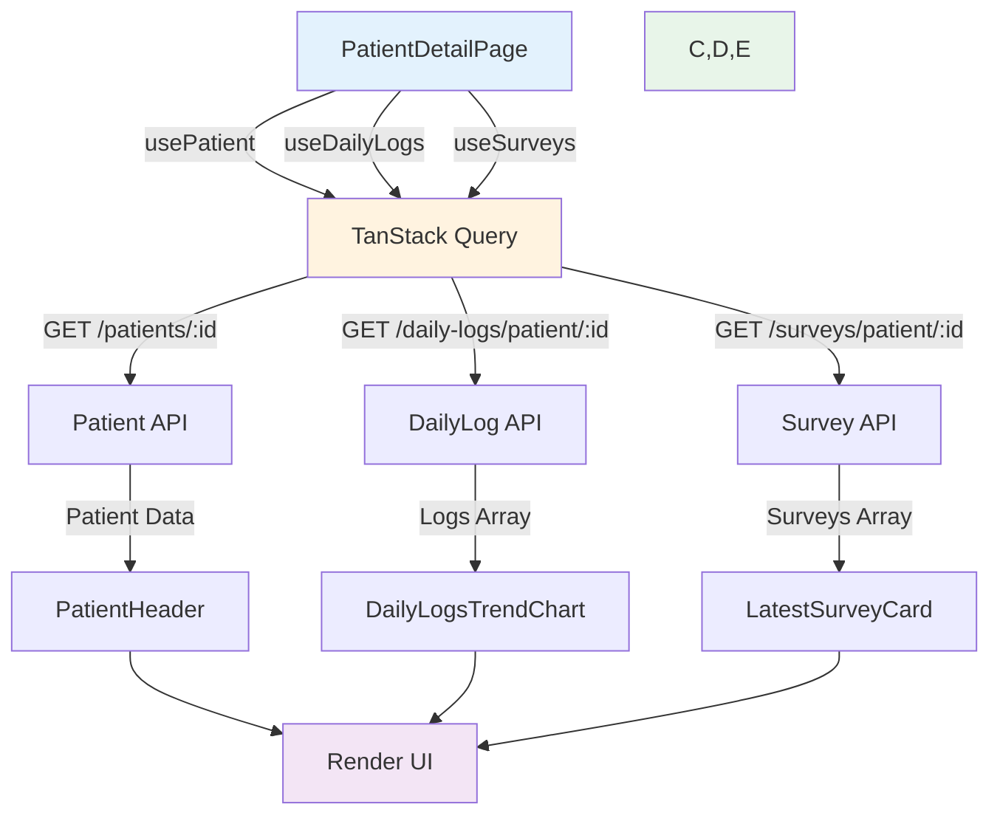
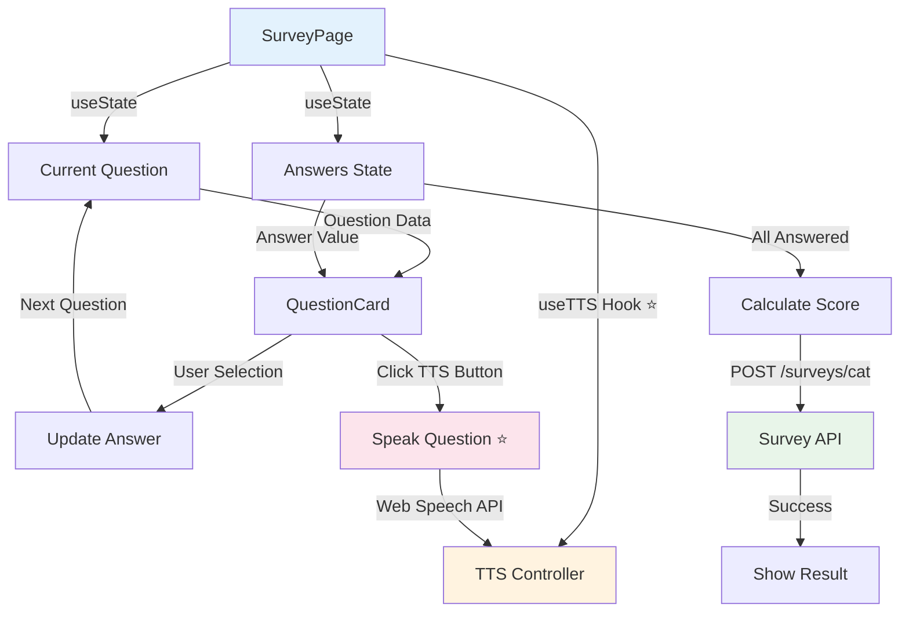

# ADR-012: Sprint 3 前端架構設計 (Task 5.1 & 5.3)

**狀態**: ✅ 已批准 (Accepted)
**日期**: 2025-10-22
**決策者**: Frontend Lead, Technical Lead, TaskMaster Hub
**影響範圍**: Sprint 3 前端開發 (Task 5.1 個案 360° 頁面, Task 5.3 LIFF 問卷頁)

---

## 📋 背景 (Context)

### 問題描述

Sprint 3 需要實現兩個核心前端功能:
1. **Task 5.1 - 個案 360° 頁面** (Dashboard): 治療師查看病患完整健康資料
2. **Task 5.3 - LIFF 問卷頁**: 病患填寫 CAT/mMRC 問卷

### 技術背景

- **後端 API 完成狀態**:
  - ✅ Patient API (GET /patients, GET /patients/{id})
  - ✅ DailyLog API (GET /daily-logs/patient/{id})
  - ✅ Survey API (POST /surveys/cat, POST /surveys/mmrc, GET /surveys/patient/{id})
- **前端技術棧**: React 18, Next.js (Dashboard), Vite + React (LIFF), TanStack Query, React Hook Form + Zod
- **設計參考**: [cat_form.html](../frontend/cat_form.html) - 無障礙設計與問卷結構

### 關鍵需求

1. **Task 5.1 需求**:
   - 顯示病患基本資料 (Patient Profile)
   - 顯示最新 7 天日誌 (Daily Logs Trend)
   - 顯示最新問卷結果 (Latest CAT/mMRC Surveys)
   - 響應式設計 (Desktop + Tablet)

2. **Task 5.3 需求**:
   - CAT 8 題問卷表單 (每題 6 選項, 0-5 分)
   - mMRC 1 題問卷 (5 選項, Grade 0-4)
   - TTS 語音朗讀 (Web Speech API)
   - 無障礙設計 (WCAG 2.1 AA, 大字體, 高對比)
   - 結果顯示與提交

---

## 🎯 決策 (Decision)

### 採用組件化架構 + 數據驅動設計

#### 核心原則
1. **單一職責原則 (SRP)**: 每個組件只負責一個功能
2. **數據驅動 (Data-Driven)**: 組件通過 props 接收數據,不直接調用 API
3. **可測試性 (Testability)**: 組件邏輯與 API 調用分離
4. **無障礙優先 (A11y First)**: 所有組件遵循 WCAG 2.1 AA 標準

---

## 🏗️ Task 5.1 - 個案 360° 頁面架構設計

### 5.1.1 組件樹結構

```
PatientDetailPage (Page Level)
├── PatientHeader (Organism)
│   ├── PatientAvatar (Atom)
│   ├── PatientInfo (Molecule)
│   │   ├── InfoItem (Atom)
│   │   └── Badge (Atom)
│   └── ActionButtons (Molecule)
│       └── Button (Atom)
├── PatientTabs (Organism)
│   ├── Tab (Atom)
│   └── TabPanel (Molecule)
│       ├── OverviewTab (Template)
│       │   ├── HealthSummaryCard (Organism)
│       │   │   ├── MetricCard (Molecule)
│       │   │   │   ├── Icon (Atom)
│       │   │   │   └── Stat (Atom)
│       │   ├── DailyLogsTrendChart (Organism)
│       │   │   └── LineChart (Molecule)
│       │   └── LatestSurveyCard (Organism)
│       │       ├── SurveyScoreBadge (Molecule)
│       │       └── SurveyDetails (Molecule)
│       ├── DailyLogsTab (Template)
│       │   └── DailyLogsTable (Organism)
│       └── SurveysTab (Template)
│           └── SurveysHistory (Organism)
└── LoadingState / ErrorState (Molecule)
```

### 5.1.2 數據流設計



### 5.1.3 關鍵組件設計

#### A. PatientDetailPage (容器組件)

**檔案位置**: `frontend/dashboard/src/app/patients/[id]/page.tsx`

**職責**:
- 根據路由參數 `id` 獲取病患資料
- 使用 TanStack Query 管理 API 請求狀態
- 協調子組件渲染
- 處理 Loading / Error 狀態

**實現範例**:

```typescript
// frontend/dashboard/src/app/patients/[id]/page.tsx
'use client';

import { useParams } from 'next/navigation';
import { usePatient, useDailyLogs, useSurveys } from '@/hooks/api';
import { PatientHeader } from '@/components/patient/PatientHeader';
import { PatientTabs } from '@/components/patient/PatientTabs';
import { LoadingSpinner } from '@/components/ui/LoadingSpinner';
import { ErrorAlert } from '@/components/ui/ErrorAlert';

export default function PatientDetailPage() {
  const params = useParams();
  const patientId = params.id as string;

  // TanStack Query Hooks
  const { data: patient, isLoading: patientLoading, error: patientError } = usePatient(patientId);
  const { data: dailyLogs, isLoading: logsLoading } = useDailyLogs(patientId, { limit: 7 });
  const { data: surveys, isLoading: surveysLoading } = useSurveys(patientId);

  // Loading State
  if (patientLoading || logsLoading || surveysLoading) {
    return (
      <div className="flex items-center justify-center min-h-screen">
        <LoadingSpinner size="lg" />
      </div>
    );
  }

  // Error State
  if (patientError) {
    return (
      <div className="container mx-auto py-8">
        <ErrorAlert
          title="無法載入病患資料"
          message={patientError.message}
          action={{ label: '重試', onClick: () => window.location.reload() }}
        />
      </div>
    );
  }

  // Success State
  return (
    <div className="container mx-auto py-8 space-y-6">
      <PatientHeader patient={patient} />
      <PatientTabs
        patient={patient}
        dailyLogs={dailyLogs}
        surveys={surveys}
      />
    </div>
  );
}
```

#### B. PatientHeader (展示組件)

**檔案位置**: `frontend/dashboard/src/components/patient/PatientHeader.tsx`

**職責**:
- 顯示病患基本資料 (姓名、年齡、BMI)
- 顯示風險等級 Badge
- 提供快捷操作按鈕 (發送訊息、編輯資料)

**實現範例**:

```typescript
// frontend/dashboard/src/components/patient/PatientHeader.tsx
import { Patient } from '@/types/api';
import { Avatar, AvatarFallback } from '@/components/ui/avatar';
import { Badge } from '@/components/ui/badge';
import { Button } from '@/components/ui/button';
import { MessageCircle, Edit } from 'lucide-react';

interface PatientHeaderProps {
  patient: Patient;
}

export function PatientHeader({ patient }: PatientHeaderProps) {
  const initials = patient.full_name
    .split(' ')
    .map(n => n[0])
    .join('')
    .toUpperCase();

  const riskBadgeVariant = {
    LOW: 'success',
    MODERATE: 'warning',
    HIGH: 'destructive',
  }[patient.risk_level || 'LOW'];

  return (
    <div className="bg-white rounded-xl shadow-sm p-6">
      <div className="flex items-start justify-between">
        {/* Left: Avatar + Info */}
        <div className="flex items-center gap-4">
          <Avatar className="h-16 w-16">
            <AvatarFallback className="text-xl">{initials}</AvatarFallback>
          </Avatar>
          <div>
            <h1 className="text-2xl font-bold">{patient.full_name}</h1>
            <div className="flex items-center gap-3 mt-1 text-sm text-gray-600">
              <span>{patient.age} 歲</span>
              <span>•</span>
              <span>{patient.gender === 'male' ? '男' : '女'}</span>
              <span>•</span>
              <span>BMI: {patient.bmi?.toFixed(1) || 'N/A'}</span>
            </div>
            <Badge variant={riskBadgeVariant} className="mt-2">
              {patient.risk_level === 'HIGH' && '高風險'}
              {patient.risk_level === 'MODERATE' && '中風險'}
              {patient.risk_level === 'LOW' && '低風險'}
            </Badge>
          </div>
        </div>

        {/* Right: Actions */}
        <div className="flex gap-2">
          <Button variant="outline" size="sm">
            <MessageCircle className="h-4 w-4 mr-2" />
            發送訊息
          </Button>
          <Button variant="outline" size="sm">
            <Edit className="h-4 w-4 mr-2" />
            編輯資料
          </Button>
        </div>
      </div>
    </div>
  );
}
```

#### C. DailyLogsTrendChart (資料視覺化組件)

**檔案位置**: `frontend/dashboard/src/components/patient/DailyLogsTrendChart.tsx`

**職責**:
- 將最近 7 天日誌資料轉換為圖表數據
- 使用 Recharts 繪製趨勢圖
- 支持多指標切換 (飲水量、運動時間、用藥依從)

**實現範例**:

```typescript
// frontend/dashboard/src/components/patient/DailyLogsTrendChart.tsx
import { DailyLog } from '@/types/api';
import { LineChart, Line, XAxis, YAxis, CartesianGrid, Tooltip, ResponsiveContainer } from 'recharts';
import { format } from 'date-fns';
import { zhTW } from 'date-fns/locale';

interface DailyLogsTrendChartProps {
  dailyLogs: DailyLog[];
  metric: 'water' | 'exercise' | 'medication';
}

export function DailyLogsTrendChart({ dailyLogs, metric }: DailyLogsTrendChartProps) {
  const chartData = dailyLogs.map(log => ({
    date: format(new Date(log.log_date), 'MM/dd', { locale: zhTW }),
    value: metric === 'water' ? log.water_ml :
           metric === 'exercise' ? log.exercise_minutes :
           log.medication_taken ? 1 : 0,
  }));

  const metricConfig = {
    water: { label: '飲水量', unit: 'ml', color: '#3b82f6' },
    exercise: { label: '運動時間', unit: '分鐘', color: '#10b981' },
    medication: { label: '用藥依從', unit: '', color: '#8b5cf6' },
  };

  const config = metricConfig[metric];

  return (
    <div className="bg-white rounded-xl shadow-sm p-6">
      <h3 className="text-lg font-semibold mb-4">{config.label}趨勢</h3>
      <ResponsiveContainer width="100%" height={300}>
        <LineChart data={chartData}>
          <CartesianGrid strokeDasharray="3 3" />
          <XAxis dataKey="date" />
          <YAxis />
          <Tooltip />
          <Line
            type="monotone"
            dataKey="value"
            stroke={config.color}
            strokeWidth={2}
            dot={{ r: 4 }}
          />
        </LineChart>
      </ResponsiveContainer>
    </div>
  );
}
```

### 5.1.4 TanStack Query Hooks

**檔案位置**: `frontend/dashboard/src/hooks/api/usePatient.ts`

```typescript
// frontend/dashboard/src/hooks/api/usePatient.ts
import { useQuery } from '@tanstack/react-query';
import { apiClient } from '@/lib/api-client';
import { Patient } from '@/types/api';

export function usePatient(patientId: string) {
  return useQuery({
    queryKey: ['patient', patientId],
    queryFn: async () => {
      const response = await apiClient.get<Patient>(`/patients/${patientId}`);
      return response.data;
    },
    staleTime: 5 * 60 * 1000, // 5 minutes
  });
}

export function useDailyLogs(patientId: string, options?: { limit?: number }) {
  return useQuery({
    queryKey: ['dailyLogs', patientId, options],
    queryFn: async () => {
      const params = new URLSearchParams();
      if (options?.limit) params.append('limit', options.limit.toString());

      const response = await apiClient.get(`/daily-logs/patient/${patientId}?${params}`);
      return response.data.logs;
    },
    staleTime: 2 * 60 * 1000, // 2 minutes
  });
}

export function useSurveys(patientId: string) {
  return useQuery({
    queryKey: ['surveys', patientId],
    queryFn: async () => {
      const response = await apiClient.get(`/surveys/patient/${patientId}`);
      return response.data.surveys;
    },
    staleTime: 5 * 60 * 1000, // 5 minutes
  });
}
```

---

## 🎨 Task 5.3 - LIFF 問卷頁架構設計

### 5.3.1 組件樹結構

```
SurveyPage (Page Level)
├── SurveyHeader (Organism)
│   ├── Title (Atom)
│   ├── ProgressBar (Molecule)
│   └── TTSButton (Molecule) ⭐ ADR-011
├── SurveyForm (Organism)
│   ├── QuestionCard (Organism)
│   │   ├── QuestionText (Molecule)
│   │   │   ├── QuestionNumber (Atom)
│   │   │   ├── QuestionContent (Atom)
│   │   │   └── TTSIconButton (Atom) ⭐ TTS 整合
│   │   └── AnswerOptions (Molecule)
│   │       └── AnswerButton (Atom)
│   └── NavigationButtons (Molecule)
│       ├── PrevButton (Atom)
│       └── NextButton (Atom)
├── SurveyResult (Organism)
│   ├── ScoreDisplay (Molecule)
│   ├── SeverityBadge (Molecule)
│   └── InterpretationText (Molecule)
└── AccessibilityControls (Organism) ⭐ 無障礙功能
    ├── FontSizeToggle (Molecule)
    ├── HighContrastToggle (Molecule)
    └── TTSSettings (Molecule)
```

### 5.3.2 數據流設計



### 5.3.3 關鍵組件設計

#### A. SurveyPage (容器組件)

**檔案位置**: `frontend/liff/src/pages/SurveyPage.tsx`

**職責**:
- 管理問卷填答流程 (當前題號、答案狀態)
- 整合 useTTS Hook (ADR-011)
- 表單驗證與提交
- 無障礙設定管理

**實現範例**:

```typescript
// frontend/liff/src/pages/SurveyPage.tsx
import { useState } from 'react';
import { useTTS } from '@/hooks/useTTS'; // ⭐ ADR-011 TTS Hook
import { useSubmitSurvey } from '@/hooks/api';
import { SurveyHeader } from '@/components/survey/SurveyHeader';
import { QuestionCard } from '@/components/survey/QuestionCard';
import { SurveyResult } from '@/components/survey/SurveyResult';
import { catQuestions } from '@/data/cat-questions';

export function SurveyPage() {
  const [currentQuestion, setCurrentQuestion] = useState(0);
  const [answers, setAnswers] = useState<Record<number, number>>({});
  const [isComplete, setIsComplete] = useState(false);

  // TTS Hook (ADR-011)
  const { speak, stop, isSpeaking, isSupported } = useTTS();

  // Submit Survey Hook
  const { mutate: submitSurvey, isPending } = useSubmitSurvey();

  const totalQuestions = catQuestions.length;
  const progress = ((currentQuestion + 1) / totalQuestions) * 100;

  const handleAnswer = (questionIndex: number, answer: number) => {
    setAnswers(prev => ({ ...prev, [questionIndex]: answer }));

    // Auto-advance to next question
    if (currentQuestion < totalQuestions - 1) {
      setTimeout(() => {
        setCurrentQuestion(prev => prev + 1);
        // Auto-read next question
        if (isSupported) {
          speak(catQuestions[currentQuestion + 1].text);
        }
      }, 300);
    } else {
      // Last question answered, calculate score
      handleSubmit();
    }
  };

  const handleSubmit = () => {
    const totalScore = Object.values(answers).reduce((sum, score) => sum + score, 0);

    submitSurvey(
      {
        surveyType: 'CAT',
        answers: catQuestions.map((q, idx) => ({
          question_id: idx + 1,
          answer: answers[idx],
        })),
        total_score: totalScore,
      },
      {
        onSuccess: () => setIsComplete(true),
      }
    );
  };

  if (isComplete) {
    const totalScore = Object.values(answers).reduce((sum, score) => sum + score, 0);
    return <SurveyResult score={totalScore} />;
  }

  return (
    <div className="min-h-screen bg-gray-50 p-4">
      <SurveyHeader
        title="CAT 健康問卷"
        progress={progress}
        onTTSToggle={() => speak(catQuestions[currentQuestion].text)}
        isSpeaking={isSpeaking}
      />

      <QuestionCard
        question={catQuestions[currentQuestion]}
        questionNumber={currentQuestion + 1}
        totalQuestions={totalQuestions}
        currentAnswer={answers[currentQuestion]}
        onAnswer={(answer) => handleAnswer(currentQuestion, answer)}
        onReadQuestion={() => speak(catQuestions[currentQuestion].text)}
        isSpeaking={isSpeaking}
      />
    </div>
  );
}
```

#### B. useTTS Hook (ADR-011 實現)

**檔案位置**: `frontend/liff/src/hooks/useTTS.ts`

**職責**:
- 封裝 Web Speech API
- 管理 TTS 狀態 (isSpeaking, isSupported)
- 提供 speak / stop 方法
- 老年人友善語速 (0.9x)

**實現範例**:

```typescript
// frontend/liff/src/hooks/useTTS.ts
import { useState, useEffect } from 'react';

export interface TTSOptions {
  lang?: string;
  rate?: number;
  pitch?: number;
}

export function useTTS(options: TTSOptions = {}) {
  const [isSpeaking, setIsSpeaking] = useState(false);
  const [isSupported, setIsSupported] = useState(false);

  useEffect(() => {
    // Check browser support
    setIsSupported('speechSynthesis' in window);
  }, []);

  const speak = (text: string) => {
    if (!isSupported) {
      console.warn('Web Speech API not supported');
      return;
    }

    // Cancel any ongoing speech
    window.speechSynthesis.cancel();

    const utterance = new SpeechSynthesisUtterance(text);
    utterance.lang = options.lang || 'zh-TW'; // 繁體中文
    utterance.rate = options.rate || 0.9; // 老年人友善語速
    utterance.pitch = options.pitch || 1.0;

    utterance.onstart = () => setIsSpeaking(true);
    utterance.onend = () => setIsSpeaking(false);
    utterance.onerror = () => setIsSpeaking(false);

    window.speechSynthesis.speak(utterance);
  };

  const stop = () => {
    if (isSupported) {
      window.speechSynthesis.cancel();
      setIsSpeaking(false);
    }
  };

  return {
    speak,
    stop,
    isSpeaking,
    isSupported,
  };
}
```

#### C. QuestionCard (問題展示組件)

**檔案位置**: `frontend/liff/src/components/survey/QuestionCard.tsx`

**職責**:
- 顯示問題文字與選項
- 提供 TTS 朗讀按鈕
- 無障礙設計 (大字體、高對比、ARIA 標籤)

**實現範例**:

```typescript
// frontend/liff/src/components/survey/QuestionCard.tsx
import { Volume2, VolumeX } from 'lucide-react';
import { Button } from '@/components/ui/button';
import { cn } from '@/lib/utils';

interface QuestionCardProps {
  question: {
    id: number;
    text: string;
    options: Array<{
      value: number;
      label: string;
      emoji: string;
    }>;
  };
  questionNumber: number;
  totalQuestions: number;
  currentAnswer?: number;
  onAnswer: (answer: number) => void;
  onReadQuestion: () => void;
  isSpeaking: boolean;
}

export function QuestionCard({
  question,
  questionNumber,
  totalQuestions,
  currentAnswer,
  onAnswer,
  onReadQuestion,
  isSpeaking,
}: QuestionCardProps) {
  return (
    <div className="bg-white rounded-xl shadow-lg p-6 mt-6">
      {/* Question Header */}
      <div className="flex items-start justify-between mb-6">
        <div className="flex-1">
          <div className="text-sm text-gray-500 mb-2">
            第 {questionNumber} 題 / 共 {totalQuestions} 題
          </div>
          <h2 className="text-xl font-bold leading-relaxed">
            {question.text}
          </h2>
        </div>

        {/* TTS Button ⭐ */}
        <Button
          variant="ghost"
          size="icon"
          onClick={onReadQuestion}
          className="ml-4 flex-shrink-0"
          aria-label={isSpeaking ? '停止朗讀' : '朗讀題目'}
        >
          {isSpeaking ? (
            <VolumeX className="h-6 w-6 text-blue-600" />
          ) : (
            <Volume2 className="h-6 w-6" />
          )}
        </Button>
      </div>

      {/* Answer Options */}
      <div className="space-y-3">
        {question.options.map((option) => (
          <button
            key={option.value}
            onClick={() => onAnswer(option.value)}
            className={cn(
              'w-full p-4 rounded-lg border-2 transition-all text-left',
              'hover:border-blue-500 hover:bg-blue-50',
              'focus:outline-none focus:ring-2 focus:ring-blue-500',
              currentAnswer === option.value
                ? 'border-blue-600 bg-blue-50'
                : 'border-gray-200'
            )}
            aria-label={`分數 ${option.value}：${option.label}`}
          >
            <div className="flex items-center gap-3">
              <span className="text-3xl">{option.emoji}</span>
              <div className="flex-1">
                <div className="font-medium text-lg">{option.label}</div>
                <div className="text-sm text-gray-500">分數: {option.value}</div>
              </div>
              {currentAnswer === option.value && (
                <svg className="h-6 w-6 text-blue-600" fill="currentColor" viewBox="0 0 20 20">
                  <path fillRule="evenodd" d="M16.707 5.293a1 1 0 010 1.414l-8 8a1 1 0 01-1.414 0l-4-4a1 1 0 011.414-1.414L8 12.586l7.293-7.293a1 1 0 011.414 0z" clipRule="evenodd" />
                </svg>
              )}
            </div>
          </button>
        ))}
      </div>
    </div>
  );
}
```

### 5.3.4 CAT 問卷資料結構

**檔案位置**: `frontend/liff/src/data/cat-questions.ts`

**參考來源**: [cat_form.html](../frontend/cat_form.html)

```typescript
// frontend/liff/src/data/cat-questions.ts
export const catQuestions = [
  {
    id: 1,
    text: "請問您最近咳嗽的情形？",
    options: [
      { value: 0, label: "完全沒有咳嗽", emoji: "😊" },
      { value: 1, label: "偶爾咳嗽", emoji: "🙂" },
      { value: 2, label: "有時咳嗽", emoji: "😐" },
      { value: 3, label: "經常咳嗽", emoji: "🙁" },
      { value: 4, label: "咳嗽很嚴重", emoji: "😰" },
      { value: 5, label: "一直在咳嗽", emoji: "🤧" },
    ],
  },
  {
    id: 2,
    text: "您覺得肺裡面有痰卡住嗎？",
    options: [
      { value: 0, label: "完全沒有痰", emoji: "😊" },
      { value: 1, label: "偶爾有痰", emoji: "🙂" },
      { value: 2, label: "有時有痰", emoji: "😐" },
      { value: 3, label: "常常有痰", emoji: "🙁" },
      { value: 4, label: "痰很多", emoji: "😰" },
      { value: 5, label: "痰一直卡著", emoji: "🤢" },
    ],
  },
  {
    id: 3,
    text: "您有覺得胸口會悶、會緊嗎？",
    options: [
      { value: 0, label: "完全不會", emoji: "😊" },
      { value: 1, label: "偶爾會", emoji: "🙂" },
      { value: 2, label: "有時會", emoji: "😐" },
      { value: 3, label: "常常會", emoji: "🙁" },
      { value: 4, label: "經常很悶", emoji: "😰" },
      { value: 5, label: "一直很悶", emoji: "😵" },
    ],
  },
  {
    id: 4,
    text: "您走樓梯或上坡會喘嗎？",
    options: [
      { value: 0, label: "完全不會喘", emoji: "😊" },
      { value: 1, label: "偶爾會喘", emoji: "🙂" },
      { value: 2, label: "有點會喘", emoji: "😐" },
      { value: 3, label: "常常會喘", emoji: "🙁" },
      { value: 4, label: "很容易喘", emoji: "😰" },
      { value: 5, label: "一動就喘", emoji: "🥵" },
    ],
  },
  {
    id: 5,
    text: "在家裡活動有沒有受到影響？",
    options: [
      { value: 0, label: "完全沒影響", emoji: "😊" },
      { value: 1, label: "偶爾有影響", emoji: "🙂" },
      { value: 2, label: "有點影響", emoji: "😐" },
      { value: 3, label: "常有影響", emoji: "🙁" },
      { value: 4, label: "影響很大", emoji: "😰" },
      { value: 5, label: "幾乎無法活動", emoji: "😞" },
    ],
  },
  {
    id: 6,
    text: "您有信心自己出門走走嗎？",
    options: [
      { value: 0, label: "非常有信心", emoji: "😊" },
      { value: 1, label: "大部分有信心", emoji: "🙂" },
      { value: 2, label: "有點信心", emoji: "😐" },
      { value: 3, label: "信心不足", emoji: "🙁" },
      { value: 4, label: "沒什麼信心", emoji: "😰" },
      { value: 5, label: "完全沒信心", emoji: "😔" },
    ],
  },
  {
    id: 7,
    text: "最近睡眠情況怎麼樣？",
    options: [
      { value: 0, label: "睡得很好", emoji: "😊" },
      { value: 1, label: "大部分睡得好", emoji: "🙂" },
      { value: 2, label: "偶爾睡不好", emoji: "😐" },
      { value: 3, label: "常常睡不好", emoji: "🙁" },
      { value: 4, label: "睡眠很差", emoji: "😰" },
      { value: 5, label: "幾乎睡不著", emoji: "😫" },
    ],
  },
  {
    id: 8,
    text: "最近精神狀況如何？",
    options: [
      { value: 0, label: "精神很好", emoji: "😊" },
      { value: 1, label: "大部分還好", emoji: "🙂" },
      { value: 2, label: "有點疲倦", emoji: "😐" },
      { value: 3, label: "常常疲倦", emoji: "🙁" },
      { value: 4, label: "非常疲倦", emoji: "😰" },
      { value: 5, label: "完全沒精神", emoji: "😵" },
    ],
  },
];
```

---

## 📊 影響分析 (Consequences)

### ✅ 正面影響

1. **清晰的組件邊界**: 每個組件職責單一,易於測試與維護
2. **數據流可追蹤**: TanStack Query 提供統一的數據管理,減少 prop drilling
3. **可重用性高**: 原子化設計使組件可在不同頁面重用
4. **無障礙完整**: 參考 cat_form.html 的無障礙設計,符合 WCAG 2.1 AA
5. **TTS 整合簡潔**: useTTS Hook 封裝複雜邏輯,組件使用簡單

### ⚠️ 潛在挑戰

1. **狀態同步複雜**: 多組件間的狀態協調需要 careful design
2. **TTS 瀏覽器兼容**: iOS Safari 需用戶手勢觸發,可能影響 UX
3. **性能優化**: 圖表組件需 lazy loading 避免初始載入過慢

---

## 🔧 技術方案 (Technical Approach)

### 技術棧總覽

| 類別 | 技術 | 版本 | 用途 |
|------|------|------|------|
| **框架** | React | 18+ | UI 框架 |
| **建構工具** | Next.js | 14+ | Dashboard (SSR) |
| **建構工具** | Vite | 5+ | LIFF (SPA) |
| **狀態管理** | TanStack Query | 5+ | Server State |
| **表單管理** | React Hook Form | 7+ | Form State |
| **驗證** | Zod | 3+ | Schema Validation |
| **樣式** | Tailwind CSS | 3+ | Utility-first CSS |
| **組件庫** | shadcn/ui | - | Radix UI + Tailwind |
| **圖表** | Recharts | 2+ | 數據視覺化 |
| **TTS** | Web Speech API | Native | 語音合成 ⭐ ADR-011 |

### 資料夾結構

```
frontend/
├── dashboard/                # Next.js Dashboard
│   ├── src/
│   │   ├── app/
│   │   │   ├── patients/
│   │   │   │   ├── [id]/
│   │   │   │   │   └── page.tsx       # Task 5.1 頁面
│   │   │   │   └── page.tsx
│   │   │   └── layout.tsx
│   │   ├── components/
│   │   │   ├── patient/
│   │   │   │   ├── PatientHeader.tsx
│   │   │   │   ├── PatientTabs.tsx
│   │   │   │   ├── DailyLogsTrendChart.tsx
│   │   │   │   └── LatestSurveyCard.tsx
│   │   │   └── ui/                     # shadcn/ui components
│   │   ├── hooks/
│   │   │   └── api/
│   │   │       ├── usePatient.ts
│   │   │       ├── useDailyLogs.ts
│   │   │       └── useSurveys.ts
│   │   ├── lib/
│   │   │   ├── api-client.ts
│   │   │   └── utils.ts
│   │   └── types/
│   │       └── api.ts
│   └── package.json
│
└── liff/                     # Vite + React LIFF
    ├── src/
    │   ├── pages/
    │   │   └── SurveyPage.tsx          # Task 5.3 頁面
    │   ├── components/
    │   │   ├── survey/
    │   │   │   ├── SurveyHeader.tsx
    │   │   │   ├── QuestionCard.tsx
    │   │   │   └── SurveyResult.tsx
    │   │   └── ui/
    │   ├── hooks/
    │   │   ├── useTTS.ts               # ⭐ ADR-011 TTS Hook
    │   │   └── api/
    │   │       └── useSubmitSurvey.ts
    │   ├── data/
    │   │   └── cat-questions.ts        # CAT 問卷資料
    │   └── lib/
    └── package.json
```

---

## 📋 驗收標準 (Acceptance Criteria)

### Task 5.1 - 個案 360° 頁面

**功能驗收**:
- [ ] 正確顯示病患基本資料 (姓名、年齡、BMI、風險等級)
- [ ] 顯示最近 7 天日誌趨勢圖 (飲水、運動、用藥)
- [ ] 顯示最新 CAT/mMRC 問卷結果
- [ ] 支持 Tab 切換 (概覽、日誌、問卷)
- [ ] 響應式設計 (Desktop + Tablet)

**技術驗收**:
- [ ] TanStack Query 正確管理 API 狀態
- [ ] Loading / Error 狀態正確顯示
- [ ] 組件測試覆蓋率 ≥ 80%
- [ ] 無 TypeScript 錯誤
- [ ] LCP < 2.5s (Lighthouse)

### Task 5.3 - LIFF 問卷頁

**功能驗收**:
- [ ] 正確顯示 CAT 8 題問卷
- [ ] 每題 6 選項正確渲染 (emoji + label + score)
- [ ] TTS 朗讀功能正常 (播放/停止)
- [ ] 自動進入下一題
- [ ] 提交後顯示結果 (總分 + 嚴重度)
- [ ] 無障礙設計 (大字體、高對比、ARIA 標籤)

**技術驗收**:
- [ ] useTTS Hook 正確封裝 Web Speech API
- [ ] 表單驗證正確 (React Hook Form + Zod)
- [ ] 提交成功後調用 POST /surveys/cat
- [ ] iOS Safari + Android Chrome 測試通過
- [ ] 無 TypeScript 錯誤
- [ ] LCP < 2.0s (LIFF 環境)

---

## 🔗 參考資料 (References)

### 內部文檔
- [ADR-010: Sprint 3 MVP 範圍縮減決策](./ADR-010-sprint3-mvp-scope-reduction.md)
- [ADR-011: CAT 無障礙 TTS 技術方案](./ADR-011-cat-accessibility-tts-solution.md)
- [前端架構規範](../12_frontend_architecture_specification.md)
- [API 設計規範](../06_api_design_specification.md)
- [cat_form.html 參考實現](../frontend/cat_form.html)

### 技術文檔
- [TanStack Query v5 Docs](https://tanstack.com/query/latest)
- [React Hook Form Docs](https://react-hook-form.com/)
- [Web Speech API - MDN](https://developer.mozilla.org/en-US/docs/Web/API/Web_Speech_API)
- [WCAG 2.1 Guidelines](https://www.w3.org/WAI/WCAG21/quickref/)

---

**批准**: Frontend Lead, Technical Lead
**生效日期**: 2025-10-22
**下次審查**: Sprint 3 結束 (2025-11-05)

---

**維護者**: RespiraAlly Development Team
**最後更新**: 2025-10-22 23:30
