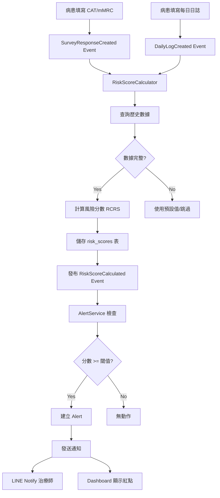

# ADR-013: COPD 風險引擎架構設計 (GOLD 2011 ABE 分級系統)

**狀態**: ✅ 已批准 (Accepted) - 重大決策變更：改採 GOLD 標準
**日期**: 2025-10-24 (v2.0 更新)
**決策者**: Technical Lead, Clinical Advisor, Product Manager, TaskMaster Hub
**影響範圍**: Sprint 4, Risk Assessment Module, Alert System, Dashboard Analytics, Patient 360° Page
**相關 ADR**:
- ADR-009 (Daily Log Schema)
- ADR-001 (Modular Monolith)
- ADR-014 (GOLD 分級系統變更記錄) - 待建立

---

## 📋 背景 (Context)

### 問題描述

RespiraAlly V2.0 目前已收集以下 COPD 相關健康數據:
- **CAT 問卷** (0-40 分): 慢性阻塞性肺病評估測試
- **mMRC 問卷** (0-4 級): 呼吸困難程度分級
- **每日日誌**: 用藥遵從、運動、飲水、吸菸、症狀、心情

然而,這些數據目前是**分散展示**,缺乏**整合性風險評估**,導致:
1. 治療師需手動綜合判斷病患風險等級
2. 高風險病患可能未被及時識別
3. 無法觸發自動化預警通知
4. 缺乏長期健康趨勢分析

### COPD 風險評估臨床基礎

根據 GOLD (Global Initiative for Chronic Obstructive Lung Disease) 指南:

**GOLD ABCD 評估工具** (2023版):
- **症狀評估**: CAT ≥10 or mMRC ≥2 → 高症狀
- **急性惡化史**: 過去一年 ≥2 次 or ≥1 次住院 → 高風險
- **肺功能**: FEV1 % predicted (需 spirometry,本專案不適用)

**COPD 惡化風險因子**:
- 吸菸 (持續吸菸 or 高菸量)
- 用藥不遵從
- 低運動量
- 營養不良 (BMI, 肌肉質量)
- 共病 (心血管、糖尿病、焦慮/憂鬱)

**本專案可用數據**:
- ✅ CAT 分數 (症狀嚴重度)
- ✅ mMRC 等級 (呼吸困難)
- ✅ 用藥遵從率
- ✅ 吸菸行為
- ✅ 運動量
- ✅ 心情狀態 (間接反映心理健康)
- ⏸ BMI (patient 表有,但未持續追蹤)
- ❌ 急性惡化史 (未記錄)
- ❌ FEV1 (無 spirometry 設備)

### 業務需求

1. **自動風險分級**: 根據多維度數據自動計算風險等級 (綠/黃/紅)
2. **預警通知**: 高風險病患自動觸發治療師通知
3. **趨勢分析**: 追蹤風險分數變化,識別惡化趨勢
4. **干預建議**: 根據風險因子提供具體改善建議

---

## 🎯 決策 (Decision)

### 採用 GOLD 2011 ABE 分級系統 (GOLD 2011 ABE Classification System)

**重大決策變更**: 放棄自創的加權評分模型，改採 **GOLD (Global Initiative for Chronic Obstructive Lung Disease) 2011 年修訂的標準分級系統**，確保臨床有效性與國際一致性。

#### 風險分級邏輯 (基於 GOLD 2011)

```python
def calculate_gold_abe_group(cat_score: int, mmrc_grade: int) -> str:
    """
    GOLD 2011 ABE 分級系統

    參數:
    - cat_score: CAT 評估量表分數 (0-40)
    - mmrc_grade: mMRC 呼吸困難量表等級 (0-4)

    返回: 'A', 'B', 或 'E'
    """
    # A級 (低風險): CAT<10 且 mMRC<2
    if cat_score < 10 and mmrc_grade < 2:
        return 'A'

    # E級 (高風險): CAT≥10 且 mMRC≥2
    elif cat_score >= 10 and mmrc_grade >= 2:
        return 'E'

    # B級 (中風險): CAT≥10 或 mMRC≥2 (但不同時滿足)
    else:
        return 'B'
```

#### 風險等級分類

| GOLD 群組 | 判斷條件 | 顏色標示 | 臨床意義 | 建議動作 |
|----------|---------|---------|---------|---------|
| **🟢 A級 (低風險)** | CAT<10 且 mMRC<2 | 綠色 | 症狀較少，穩定期 | 持續監測，每月追蹤 |
| **🟡 B級 (中風險)** | CAT≥10 或 mMRC≥2 | 黃色 | 症狀較多或呼吸困難 | 加強監測，每2週追蹤，考慮調整用藥 |
| **🔴 E級 (高風險)** | CAT≥10 且 mMRC≥2 | 紅色 | 症狀嚴重且高度呼吸困難 | 立即通知治療師，安排門診，強化治療 |

#### 臨床依據

**CAT 評估量表 (COPD Assessment Test)**:
- CAT 分數 ≥10 分為症狀較多的高風險群
- 總分 0-40 分，包含 8 個項目（咳嗽、痰液、胸悶、呼吸困難、活動受限、信心、睡眠、活力）
- 分數越高代表健康狀態越不穩定

**mMRC 呼吸困難量表 (Modified Medical Research Council Dyspnea Scale)**:
- mMRC 分數 ≥2 分表示症狀較嚴重
- 等級 0-1: 症狀較少（劇烈運動或快走時才喘）
- 等級 2-4: 症狀較多（平地行走即喘，甚至無法離家）

**急性發作風險 (Exacerbation Risk)** ⭐ 新增:
- 過去一年 ≥2 次急性發作 或 曾因 COPD 住院 ≥1 次
- 此指標用於判斷 GOLD C/D 群組（未來擴展）
- **本版本先追蹤此數據，為未來 GOLD ABCD 完整分級準備**

#### 輔助風險因子追蹤 (非分級依據，供臨床參考)

雖然 GOLD ABE 分級僅使用 CAT 和 mMRC，但系統仍追蹤以下因子，供治療師參考和干預決策：

**1. 急性發作次數 (Exacerbation Count)** ⭐ **必追蹤**
```python
def track_exacerbation_history(patient_id: UUID, period_months: int = 12) -> dict:
    """
    追蹤急性發作歷史（過去 12 個月）

    返回:
    - exacerbation_count: 急性發作次數
    - hospitalization_count: 住院次數
    - is_high_risk: 是否高風險 (≥2次 or ≥1次住院)
    """
    exacerbations = get_exacerbation_records(patient_id, period_months)

    return {
        'exacerbation_count': len(exacerbations),
        'hospitalization_count': sum(1 for e in exacerbations if e.required_hospitalization),
        'is_high_risk': len(exacerbations) >= 2 or any(e.required_hospitalization for e in exacerbations),
        'last_exacerbation_date': max(e.date for e in exacerbations) if exacerbations else None
    }
```

**2. 用藥遵從率 (Medication Adherence)**
```python
def calculate_adherence_rate(patient_id: UUID, days: int = 7) -> float:
    """
    計算過去 N 天用藥遵從率

    返回: 0-100% (100% = 完全遵從)
    """
    logs = get_daily_logs_last_n_days(patient_id, days)
    if not logs:
        return None  # 無數據

    adherence_days = sum(1 for log in logs if log.medication_taken)
    return (adherence_days / len(logs)) * 100
```

**3. 行為風險因子 (Behavioral Risk Factors)**
```python
def get_behavioral_risk_summary(patient_id: UUID, days: int = 7) -> dict:
    """
    彙整行為風險因子（過去 7 天平均）

    返回:
    - smoking_avg: 平均吸菸支數/天
    - exercise_avg: 平均運動分鐘數/天
    - bad_mood_percentage: 心情不佳比例
    """
    logs = get_daily_logs_last_n_days(patient_id, days)
    if not logs:
        return None

    return {
        'smoking_avg': sum(log.smoking_count for log in logs) / len(logs),
        'exercise_avg': sum(log.exercise_minutes for log in logs) / len(logs),
        'bad_mood_percentage': (sum(1 for log in logs if log.mood == 'BAD') / len(logs)) * 100
    }
```

**這些因子不影響 GOLD 分級，但用於**:
- 治療師臨床判斷參考
- 個人化衛教建議生成
- 未來機器學習模型特徵

---

## 🔧 技術架構 (Technical Architecture)

### 系統組件設計

```
┌─────────────────────────────────────────────────────┐
│  Dashboard (React)                                  │
│  - Risk Score Display                               │
│  - Risk Trend Chart                                 │
│  - Risk Factor Breakdown                            │
│  - Alert Management UI                              │
└───────────────────┬─────────────────────────────────┘
                    │
                    │ REST API
                    ▼
┌─────────────────────────────────────────────────────┐
│  API Layer (FastAPI)                                │
│  - GET /patients/{id}/risk-score (latest)          │
│  - GET /patients/{id}/risk-history (trend)         │
│  - POST /risk-scores/calculate (manual trigger)    │
│  - GET /alerts (list active alerts)                │
│  - PUT /alerts/{id}/acknowledge                     │
└───────────────────┬─────────────────────────────────┘
                    │
                    ▼
┌─────────────────────────────────────────────────────┐
│  Application Layer                                  │
│  - RiskScoreService                                 │
│  - AlertService                                     │
│  - RiskTrendAnalyzer                                │
└───────────────────┬─────────────────────────────────┘
                    │
                    ▼
┌─────────────────────────────────────────────────────┐
│  Domain Layer                                       │
│  - RiskScore (Entity)                               │
│  - RiskCalculator (Domain Service)                  │
│  - AlertRule (Value Object)                         │
│  - RiskThreshold (Value Object)                     │
└───────────────────┬─────────────────────────────────┘
                    │
                    ▼
┌─────────────────────────────────────────────────────┐
│  Infrastructure Layer                               │
│  - RiskScoreRepository                              │
│  - AlertRepository                                  │
│  - EventPublisher (RiskScoreCalculated)             │
│  - NotificationAdapter (LINE Notify)                │
└───────────────────┬─────────────────────────────────┘
                    │
                    ▼
┌─────────────────────────────────────────────────────┐
│  Database (PostgreSQL)                              │
│  - risk_scores (風險分數記錄)                       │
│  - risk_thresholds (風險閾值配置)                   │
│  - alerts (預警記錄)                                │
│  - alert_rules (預警規則)                           │
└─────────────────────────────────────────────────────┘
```

### 風險計算觸發機制

**1. 自動觸發 (Event-Driven)**
```
Event: SurveyResponseCreated (CAT/mMRC 完成)
  ↓
Subscriber: RiskScoreCalculator
  ↓
Action: 計算最新風險分數
  ↓
Event: RiskScoreCalculated
  ↓
Subscriber: AlertService
  ↓
Action: 檢查是否需要觸發預警
```

**2. 定時觸發 (Scheduled)**
```
Cron Job: 每日 00:00 執行
  ↓
Action: 為所有活躍病患計算風險分數
  ↓
Reason: 日誌數據累積可能改變風險等級
```

**3. 手動觸發 (Manual)**
```
治療師在 Dashboard 點擊「重新計算風險」
  ↓
API: POST /patients/{id}/risk-scores/recalculate
  ↓
Action: 立即計算最新風險分數
```

### 數據流圖



---

## 📊 數據庫 Schema 設計 (概要)

### 1. risk_assessments 表 (GOLD 分級記錄)

```sql
CREATE TABLE risk_assessments (
    assessment_id UUID PRIMARY KEY DEFAULT gen_random_uuid(),
    patient_id UUID NOT NULL REFERENCES patients(patient_id),

    -- GOLD 分級結果
    gold_group VARCHAR(1) NOT NULL CHECK (gold_group IN ('A', 'B', 'E')),

    -- 計算依據
    cat_score INTEGER NOT NULL CHECK (cat_score >= 0 AND cat_score <= 40),
    mmrc_grade INTEGER NOT NULL CHECK (mmrc_grade >= 0 AND mmrc_grade <= 4),

    -- 輔助資訊（非分級依據，供參考）
    adherence_rate DECIMAL(5,2),          -- 用藥遵從率 (%)
    smoking_avg DECIMAL(5,2),             -- 平均吸菸支數/天
    exercise_avg DECIMAL(5,2),            -- 平均運動分鐘數/天
    bad_mood_percentage DECIMAL(5,2),     -- 心情不佳比例 (%)

    -- 元數據
    assessment_date DATE NOT NULL DEFAULT CURRENT_DATE,
    created_at TIMESTAMP WITH TIME ZONE DEFAULT CURRENT_TIMESTAMP,
    created_by VARCHAR(100),

    -- 索引
    INDEX idx_patient_assessment_date (patient_id, assessment_date DESC),
    INDEX idx_gold_group_created (gold_group, created_at DESC)
);
```

### 2. exacerbations 表 (急性發作記錄) ⭐ 新增

```sql
CREATE TABLE exacerbations (
    exacerbation_id UUID PRIMARY KEY DEFAULT gen_random_uuid(),
    patient_id UUID NOT NULL REFERENCES patients(patient_id),

    -- 發作資訊
    onset_date DATE NOT NULL,                           -- 發作日期
    severity VARCHAR(20) NOT NULL CHECK (severity IN ('MILD', 'MODERATE', 'SEVERE')),

    -- 治療情況
    required_hospitalization BOOLEAN DEFAULT FALSE,     -- 是否住院
    hospitalization_days INTEGER,                       -- 住院天數
    required_antibiotics BOOLEAN DEFAULT FALSE,         -- 是否使用抗生素
    required_steroids BOOLEAN DEFAULT FALSE,            -- 是否使用類固醇

    -- 症狀描述
    symptoms TEXT,                                      -- 症狀描述（自由文字）
    notes TEXT,                                         -- 治療師備註

    -- 元數據
    recorded_date DATE NOT NULL DEFAULT CURRENT_DATE,   -- 記錄日期
    recorded_by UUID REFERENCES users(user_id),         -- 記錄者（治療師）
    created_at TIMESTAMP WITH TIME ZONE DEFAULT CURRENT_TIMESTAMP,
    updated_at TIMESTAMP WITH TIME ZONE DEFAULT CURRENT_TIMESTAMP,

    -- 索引
    INDEX idx_patient_onset_date (patient_id, onset_date DESC),
    INDEX idx_severity_hospitalization (severity, required_hospitalization)
);

COMMENT ON TABLE exacerbations IS 'COPD 急性發作記錄，用於 GOLD C/D 群組判斷';
COMMENT ON COLUMN exacerbations.required_hospitalization IS '住院 ≥1 次視為高風險';
```

### 3. patients 表擴展 (新增急性發作彙總欄位)

```sql
-- 在現有 patients 表新增欄位
ALTER TABLE patients ADD COLUMN IF NOT EXISTS exacerbation_count_last_12m INTEGER DEFAULT 0;
ALTER TABLE patients ADD COLUMN IF NOT EXISTS hospitalization_count_last_12m INTEGER DEFAULT 0;
ALTER TABLE patients ADD COLUMN IF NOT EXISTS last_exacerbation_date DATE;

COMMENT ON COLUMN patients.exacerbation_count_last_12m IS '過去 12 個月急性發作次數（快取，由 trigger 自動更新）';
COMMENT ON COLUMN patients.hospitalization_count_last_12m IS '過去 12 個月住院次數（快取）';
COMMENT ON COLUMN patients.last_exacerbation_date IS '最近一次急性發作日期';

-- Trigger: 新增/更新 exacerbation 時自動更新 patient 彙總
CREATE OR REPLACE FUNCTION update_patient_exacerbation_summary()
RETURNS TRIGGER AS $$
BEGIN
    UPDATE patients
    SET
        exacerbation_count_last_12m = (
            SELECT COUNT(*) FROM exacerbations
            WHERE patient_id = NEW.patient_id
            AND onset_date >= CURRENT_DATE - INTERVAL '12 months'
        ),
        hospitalization_count_last_12m = (
            SELECT COUNT(*) FROM exacerbations
            WHERE patient_id = NEW.patient_id
            AND onset_date >= CURRENT_DATE - INTERVAL '12 months'
            AND required_hospitalization = TRUE
        ),
        last_exacerbation_date = (
            SELECT MAX(onset_date) FROM exacerbations
            WHERE patient_id = NEW.patient_id
        )
    WHERE patient_id = NEW.patient_id;

    RETURN NEW;
END;
$$ LANGUAGE plpgsql;

CREATE TRIGGER trigger_update_exacerbation_summary
AFTER INSERT OR UPDATE ON exacerbations
FOR EACH ROW
EXECUTE FUNCTION update_patient_exacerbation_summary();
```

### 4. alerts 表 (簡化版)

```sql
CREATE TABLE alerts (
    alert_id UUID PRIMARY KEY DEFAULT gen_random_uuid(),
    patient_id UUID NOT NULL REFERENCES patients(patient_id),

    -- 預警類型
    alert_type VARCHAR(50) NOT NULL CHECK (alert_type IN (
        'GOLD_GROUP_E',           -- E級高風險
        'GOLD_GROUP_CHANGED',     -- 分級改變（惡化）
        'HIGH_EXACERBATION_RISK', -- 急性發作高風險 (≥2次)
        'MISSING_DATA'            -- 數據缺漏
    )),

    -- 嚴重程度
    severity VARCHAR(20) NOT NULL CHECK (severity IN ('INFO', 'WARNING', 'CRITICAL')),

    -- 內容
    title VARCHAR(200) NOT NULL,
    message TEXT NOT NULL,

    -- 觸發依據
    triggered_by_assessment_id UUID REFERENCES risk_assessments(assessment_id),
    gold_group VARCHAR(1),
    previous_gold_group VARCHAR(1),

    -- 狀態管理
    status VARCHAR(20) DEFAULT 'ACTIVE' CHECK (status IN ('ACTIVE', 'ACKNOWLEDGED', 'RESOLVED')),
    acknowledged_at TIMESTAMP WITH TIME ZONE,
    acknowledged_by UUID REFERENCES users(user_id),
    resolved_at TIMESTAMP WITH TIME ZONE,
    resolution_notes TEXT,

    -- 元數據
    created_at TIMESTAMP WITH TIME ZONE DEFAULT CURRENT_TIMESTAMP,

    -- 索引
    INDEX idx_patient_status (patient_id, status, created_at DESC),
    INDEX idx_severity_type (severity, alert_type, created_at DESC)
);

COMMENT ON TABLE alerts IS '基於 GOLD 分級的預警系統（簡化版，固定規則）';
COMMENT ON COLUMN alerts.alert_type IS 'GOLD_GROUP_E: E級警示, GOLD_GROUP_CHANGED: 分級惡化, HIGH_EXACERBATION_RISK: 急性發作高風險';
```

**預警觸發規則（程式碼硬編碼，非資料庫配置）**:

```python
# domain/risk/alert_rules.py
from enum import Enum

class AlertRule(Enum):
    """預警規則（固定，不可配置）"""

    # Rule 1: GOLD E級立即預警
    GOLD_E_IMMEDIATE = {
        'condition': lambda gold_group: gold_group == 'E',
        'alert_type': 'GOLD_GROUP_E',
        'severity': 'CRITICAL',
        'title': 'GOLD E級高風險警示',
        'message': '病患 CAT≥10 且 mMRC≥2，屬於高風險群組，建議立即安排門診。'
    }

    # Rule 2: 分級惡化 (A→B, B→E, A→E)
    GOLD_GROUP_WORSENED = {
        'condition': lambda curr, prev: _is_worsening(curr, prev),
        'alert_type': 'GOLD_GROUP_CHANGED',
        'severity': 'WARNING',
        'title': 'GOLD 分級惡化',
        'message': 'GOLD 分級從 {prev} 惡化至 {curr}，需加強監測。'
    }

    # Rule 3: 急性發作高風險
    HIGH_EXACERBATION_RISK = {
        'condition': lambda exac_count: exac_count >= 2,
        'alert_type': 'HIGH_EXACERBATION_RISK',
        'severity': 'CRITICAL',
        'title': '急性發作高風險',
        'message': '過去 12 個月內急性發作 ≥2 次，建議評估治療方案。'
    }

def _is_worsening(current_group: str, previous_group: str) -> bool:
    """判斷是否惡化"""
    severity_order = {'A': 0, 'B': 1, 'E': 2}
    return severity_order.get(current_group, 0) > severity_order.get(previous_group, 0)
```

---

## 🎨 Dashboard UI 設計概要

### 風險儀表板組件

**1. 風險分數卡片 (Risk Score Card)**
```
┌─────────────────────────────────────┐
│  📊 COPD 風險評分                   │
├─────────────────────────────────────┤
│                                     │
│        🔴 67 分                     │
│         高風險                      │
│                                     │
│  上次計算: 2025-10-24 08:00         │
│  [重新計算]                         │
└─────────────────────────────────────┘
```

**2. 風險因子雷達圖 (Risk Factor Radar)**
```
        CAT (67)
           /|\
          / | \
  Mood(30)/  |  \mMRC(75)
         /   |   \
        /    |    \
Adherence   Smoking
  (20)       (50)
```

**3. 風險趨勢圖 (Risk Trend Chart)**
```
100 ┤                            🔴
    │                        🔴
 67 ┤                    🔴       ← 高風險線
    │                🟡
 34 ┤            🟡               ← 中風險線
    │        🟢
  0 ┤    🟢
    └────────────────────────────
     10/17  10/20  10/23  10/24
```

**4. 預警通知列表 (Alert List)**
```
🔴 高風險警示 - 王小明
   風險分數達 67 分,建議立即安排門診
   2025-10-24 08:00 | [確認] [查看詳情]

🟡 趨勢惡化 - 李大華
   風險分數連續 3 天上升 (+12 分)
   2025-10-24 07:30 | [確認]
```

---

## ⚖️ 後果分析 (Consequences)

### 正面影響 ✅

1. **治療師工作效率提升**
   - 自動識別高風險病患,無需手動篩選
   - Dashboard 一目了然風險等級
   - 預警通知減少疏漏

2. **病患照護品質提升**
   - 及早識別健康惡化跡象
   - 個人化干預建議
   - 數據驅動的決策支持

3. **系統智能化**
   - 從被動記錄 → 主動預警
   - 整合多維度數據,提供全面評估
   - 長期趨勢分析,支持預測性照護

4. **架構擴展性**
   - 模組化設計,權重可調整
   - 未來可加入更多風險因子 (BMI, 共病, FEV1 等)
   - 支持機器學習模型升級

### 挑戰與限制 ⚠️

1. **臨床驗證需求**
   - 風險分數公式需臨床專家審核
   - 權重設計需實際病患數據校正
   - 閾值需根據台灣 COPD 族群調整

2. **數據完整性依賴**
   - 需要病患持續填寫日誌
   - 缺漏數據可能影響計算準確性
   - 需設計合理的預設值策略

3. **效能考量**
   - 每日為所有病患計算風險分數,需優化查詢
   - 歷史數據聚合需高效 SQL/快取策略

4. **使用者體驗**
   - 風險分數解釋需清楚易懂
   - 避免過度警示造成警示疲勞
   - 需平衡敏感度與特異度

5. **法律與倫理**
   - 風險評估不可取代醫師專業判斷
   - 需明確告知此為輔助工具,非診斷
   - 資料隱私與安全合規

---

## 🔀 替代方案分析 (Alternatives Considered)

### 方案 A: 僅使用 GOLD ABCD 分類 (❌ 未採用)

**優點**:
- 標準化臨床指南,可信度高
- 實作簡單 (僅需 CAT + mMRC)

**缺點**:
- 缺少行為因子 (吸菸、運動、遵從度)
- 需要急性惡化史與 FEV1 (本專案無此數據)
- 無法反映日常行為變化

**結論**: 不適合本專案,因缺乏關鍵臨床數據。

---

### 方案 B: 使用機器學習模型 (⏸ 暫不採用,Phase 3 考慮)

**優點**:
- 自動學習最佳權重
- 可處理複雜非線性關係
- 隨數據累積,準確性提升

**缺點**:
- 需大量標記數據 (本專案初期無足夠數據)
- 黑箱模型,可解釋性差
- 開發與維護成本高

**結論**: MVP 階段採用規則式模型,Phase 3 累積足夠數據後考慮 ML 升級。

---

### 方案 C: 僅使用單一風險因子 (❌ 未採用)

**範例**: 僅使用 CAT 分數

**優點**:
- 實作最簡單
- 易於理解

**缺點**:
- 忽略其他重要風險因子
- 無法反映行為改變
- 評估片面,準確性低

**結論**: 不符合全面照護理念。

---

## 📚 參考文獻 (References)

1. **GOLD 2023 Report**: Global Strategy for Prevention, Diagnosis and Management of COPD
   - https://goldcopd.org/2023-gold-report-2/

2. **CAT Questionnaire**: Jones PW, et al. (2009). Development and validation of COPD Assessment Test
   - Chest. 2009;135(6):1579-1586

3. **mMRC Dyspnea Scale**: Fletcher CM (1960). Standardised questionnaire on respiratory symptoms
   - British Medical Journal, 1960;2:1665

4. **COPD Exacerbation Risk**: Hurst JR, et al. (2010). Susceptibility to exacerbation in COPD
   - New England Journal of Medicine. 2010;363(12):1128-1138

5. **Medication Adherence in COPD**: Bourbeau J, Bartlett SJ (2008). Patient adherence in COPD
   - Thorax. 2008;63(9):831-838

6. **Smoking and COPD**: Anthonisen NR, et al. (2005). The effects of smoking cessation
   - Annals of Internal Medicine. 2005;142(4):233-239

7. **Exercise and COPD**: Spruit MA, et al. (2013). An official ATS/ERS statement on pulmonary rehabilitation
   - American Journal of Respiratory and Critical Care Medicine. 2013;188(8):e13-e64

8. **Mental Health and COPD**: Yohannes AM, Alexopoulos GS (2014). Depression and anxiety in COPD
   - European Respiratory Review. 2014;23(133):345-349

---

## 🔄 下一步行動 (Next Steps)

### Sprint 4 Week 1-2: GOLD ABE 分級系統實作

**Phase 1: 數據庫 Schema 實作** [8h]
- [ ] 建立 `risk_assessments` 表（GOLD 分級記錄）
- [ ] 建立 `exacerbations` 表（急性發作記錄）⭐
- [ ] 擴展 `patients` 表（新增急性發作彙總欄位）⭐
- [ ] 建立 `alerts` 表（簡化版預警）
- [ ] 建立 trigger: 自動更新 patient 急性發作彙總
- [ ] 撰寫 migration script

**Phase 2: Backend API 實作** [24h]
- [ ] **急性發作管理 API** ⭐ 新增：
  - `POST /exacerbations` - 新增急性發作記錄
  - `GET /exacerbations/patient/{id}` - 查詢病患急性發作歷史
  - `PUT /exacerbations/{id}` - 更新急性發作記錄
- [ ] **GOLD 分級 API**：
  - `POST /risk-assessments/calculate` - 計算 GOLD 分級
  - `GET /risk-assessments/patient/{id}/latest` - 最新分級
  - `GET /risk-assessments/patient/{id}/history` - 分級歷史
- [ ] **預警 API**：
  - `GET /alerts` - 查詢預警列表
  - `PUT /alerts/{id}/acknowledge` - 確認預警
- [ ] Event-Driven 整合：
  - `SurveyCompletedEvent` → 自動計算 GOLD 分級
  - `RiskAssessmentCalculatedEvent` → 自動檢查預警規則
- [ ] 單元測試 + 整合測試

**Phase 3: Dashboard UI 實作** [20h]
- [ ] **個案 360° 頁面擴展** ⭐ 關鍵：
  - 急性發作記錄區塊（表格 + 新增按鈕）
  - 急性發作新增/編輯 Modal
  - 欄位：發作日期、嚴重程度、是否住院、住院天數、症狀描述
  - GOLD 分級卡片（顯示 A/B/E 級別）
  - 分級趨勢圖（折線圖，顯示歷史變化）
- [ ] **預警中心頁面**：
  - 預警列表（顯示 GOLD E級、分級惡化、急性發作高風險）
  - 篩選器（按病患、預警類型、嚴重程度）
  - 預警確認功能
- [ ] 響應式設計 + E2E 測試

**Phase 4: 文檔與驗證** [8h]
- [ ] 建立 ADR-014: GOLD 分級系統變更記錄（記錄此次重大決策變更）
- [ ] 更新 API 文檔（Swagger）
- [ ] 撰寫使用者操作手冊（如何記錄急性發作）
- [ ] 與臨床專家確認 GOLD ABE 分級邏輯正確性
- [ ] 模擬數據測試（驗證分級準確性）

**總計**: 60h (⬇️ 簡化後減少 44h)

### 前端需求詳細說明 ⭐

#### 個案 360° 頁面 - 急性發作記錄區塊

**UI 設計**：
```
┌─────────────────────────────────────────────────┐
│ 📊 急性發作記錄 (過去 12 個月)                  │
│ [+ 新增急性發作]                                │
├─────────────────────────────────────────────────┤
│ 發作日期    嚴重程度  住院  住院天數  操作      │
│ 2025-09-15  SEVERE   是    5天      [編輯][刪除]│
│ 2025-06-20  MODERATE 否    -        [編輯][刪除]│
│                                                  │
│ 總計: 2 次發作 (1 次住院) - ⚠️ 高風險          │
└─────────────────────────────────────────────────┘
```

**Modal 表單**：
- 發作日期（Date Picker）
- 嚴重程度（Radio: MILD / MODERATE / SEVERE）
- 是否住院（Checkbox）
- 住院天數（Number Input，只在勾選住院時顯示）
- 是否使用抗生素（Checkbox）
- 是否使用類固醇（Checkbox）
- 症狀描述（Textarea，可選）
- 治療師備註（Textarea，可選）

### 已解決的決策事項 ✅

1. ~~**權重確認**~~: 已移除加權模型，採用 GOLD 標準
2. ~~**閾值校正**~~: 固定邏輯（CAT<10 & mMRC<2 = A級）
3. ~~**預警頻率**~~: 固定規則（E級 = CRITICAL, 分級惡化 = WARNING）
4. ~~**數據缺漏處理**~~: CAT 或 mMRC 至少一項必要，否則不計算

### 新待決策事項

1. **急性發作嚴重程度定義**: MILD/MODERATE/SEVERE 的臨床判定標準需確認
2. **GOLD C/D 擴展時程**: 何時擴展為完整 ABCD 分級？
3. **預警通知頻率**: E級病患是否每日通知？是否需要靜默期？

---

**專案經理**: TaskMaster Hub / Claude Code AI
**技術負責人**: Backend Lead
**臨床顧問**: COPD Specialist (待引入)
**文件版本**: v1.0
**建立日期**: 2025-10-24
**下次審查**: Sprint 4 Week 1 (技術實作前確認)
