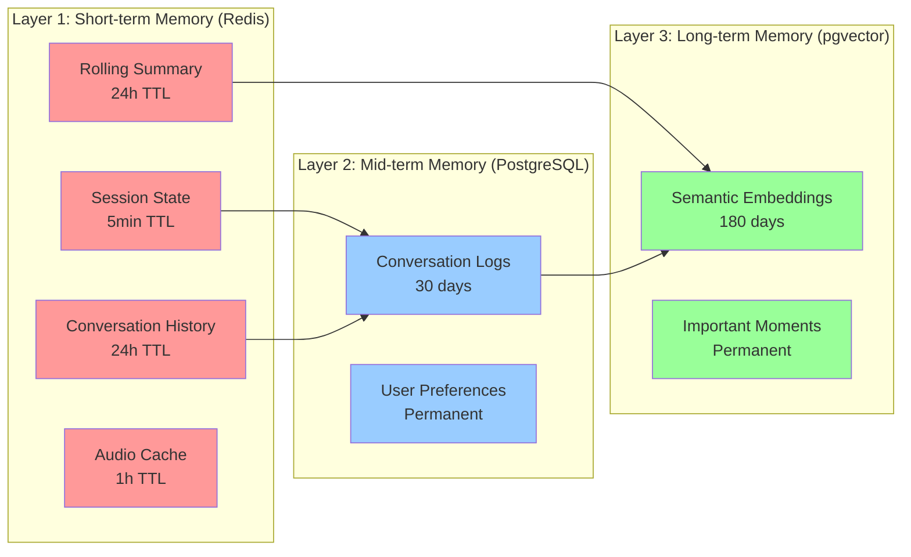
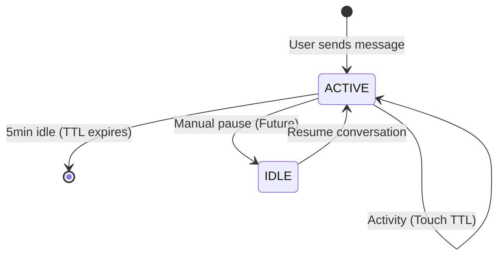
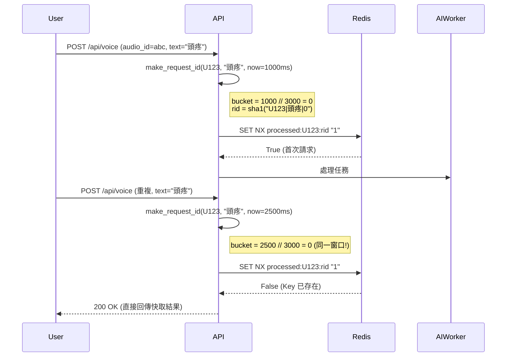
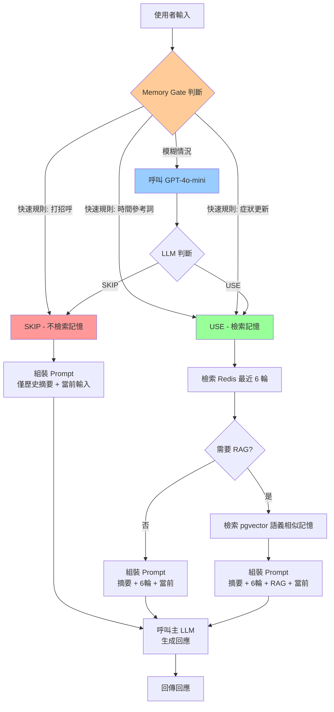
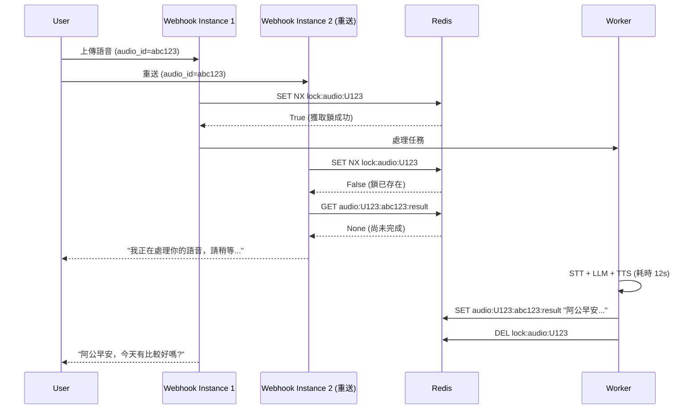
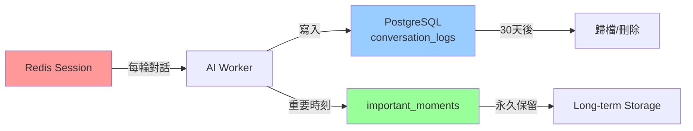
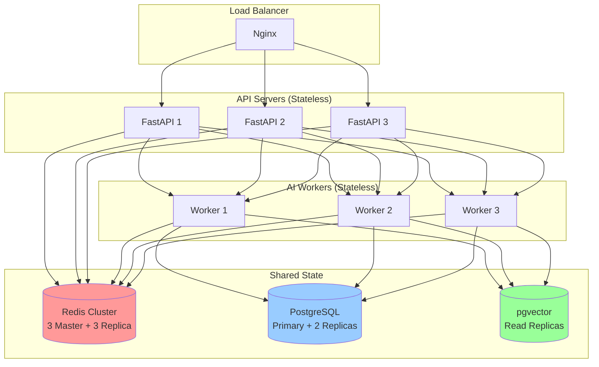

# AI Conversation Memory Management Design

---

**Document Version:** v1.0
**Last Updated:** 2025-10-18
**Author:** Claude Code AI - System Architect
**Status:** Draft
**Related Documents:**
- [Architecture & Design](../05_architecture_and_design.md) - System Architecture
- [AI Safety & Compliance](./19_ai_safety_and_compliance.md) - Security Principles
- [API Design Specification](../06_api_design_specification.md) - API Contracts
- [ADR-002: pgvector for Vector DB](../adr/ADR-002-pgvector-for-vector-db.md) - Long-term RAG storage
- [ADR-003: MongoDB for Event Logs](../adr/ADR-003-mongodb-for-event-logs.md) - Audit trail

---

## 目錄 (Table of Contents)

- [A. Memory Architecture Overview](#a-memory-architecture-overview)
- [B. Short-term Memory (Redis)](#b-short-term-memory-redis)
- [C. Deduplication Mechanism](#c-deduplication-mechanism)
- [D. Rolling Summary Strategy](#d-rolling-summary-strategy)
- [E. Memory Gate Decision Logic](#e-memory-gate-decision-logic)
- [F. Audio-level Idempotency](#f-audio-level-idempotency)
- [G. Long-term Memory (PostgreSQL + pgvector)](#g-long-term-memory-postgresql--pgvector)
- [H. TTL & Data Retention Policy](#h-ttl--data-retention-policy)
- [I. Performance & Scalability](#i-performance--scalability)
- [J. Security & Privacy Considerations](#j-security--privacy-considerations)
- [K. Monitoring & Observability](#k-monitoring--observability)
- [L. Migration from V1](#l-migration-from-v1)
- [M. Review Conclusion & Action Items](#m-review-conclusion--action-items)

---

## A. Memory Architecture Overview

### A.1 記憶體架構層次 (Memory Architecture Layers)

RespiraAlly V2.0 採用**三層記憶體架構** (Three-tier Memory Architecture) 來平衡效能、成本與使用者體驗:



**Layer 1 (Redis)**: 超高速短期記憶體，支援 AI Worker 實時決策
**Layer 2 (PostgreSQL)**: 關聯式結構化儲存，支援後臺分析與治療師查詢
**Layer 3 (pgvector)**: 向量語義搜尋，支援 RAG 知識檢索與個人化回憶

### A.2 設計原則 (Design Principles)

基於 [V1 beloved_grandson 專案](https://github.com/example/beloved_grandson) 的成功經驗，V2.0 繼承以下核心設計原則:

1. **Ephemeral First (短暫優先)**: 預設所有記憶體資料為短暫的 (TTL < 24h)，除非明確標記為永久
2. **Deduplication by Design (設計即去重)**: 使用時間窗口 + 內容雜湊防止重複處理
3. **Gradual Compression (漸進式壓縮)**: 使用滾動摘要 (rolling summary) 避免記憶體爆炸
4. **Privacy by Default (預設隱私)**: 敏感資料加密儲存，支援使用者主動清除
5. **Idempotent Operations (冪等操作)**: 音檔級鎖保證同一段語音只處理一次

---

## B. Short-term Memory (Redis)

### B.1 Redis Key 設計規範 (Key Design Schema)

遵循 **命名空間 + 實體 + 屬性** 的三段式設計，確保可讀性與可維護性:

| Key Pattern | 用途 | TTL | 資料結構 | 範例 |
|-------------|------|-----|----------|------|
| `session:{user_id}:state` | Session 狀態 (ACTIVE/IDLE) | 5min | String | `session:U123:state` → "ACTIVE" |
| `session:{user_id}:history` | 對話歷史 (原始 JSON) | 24h | List | `session:U123:history` → [{input, output, rid}...] |
| `session:{user_id}:summary:text` | 滾動摘要文字 | 24h | String | `session:U123:summary:text` → "使用者近期焦慮..." |
| `session:{user_id}:summary:rounds` | 已摘要的輪數 | 24h | Integer | `session:U123:summary:rounds` → 10 |
| `processed:{user_id}:{request_id}` | 去重標記 | 24h | String | `processed:U123:abc123` → "1" |
| `audio:{user_id}:{audio_id}:buf` | 語音片段緩衝區 | 1h | List | `audio:U123:aud456:buf` → ["你好", "請問"] |
| `audio:{user_id}:{audio_id}:result` | 語音處理結果快取 | 24h | String | `audio:U123:aud456:result` → "阿公你好..." |
| `lock:audio:{lock_id}` | 音檔級鎖 (冪等性保證) | 3min | String | `lock:audio:U123#audio:aud456` → "1" |

**Key 設計最佳實踐**:
- ✅ 使用 `:` 作為層級分隔符 (符合 Redis 慣例)
- ✅ 第一段為命名空間 (session, audio, lock, processed)
- ✅ 第二段為使用者識別 (支援按使用者快速清除)
- ✅ 避免使用 `.` 或 `/` (易與檔案系統混淆)
- ❌ 禁止在 Key 中儲存敏感資料 (PII)

### B.2 Session State Management (會話狀態管理)

**狀態轉換圖** (State Transition Diagram):



**實作細節**:

```python
# V2.0 參考 V1 實作
def ensure_active_state(user_id: str) -> None:
    """確保 Session 處於 ACTIVE 狀態"""
    r = get_redis()
    key = f"session:{user_id}:state"
    r.set(key, "ACTIVE", nx=True)  # nx=True: 只在不存在時設定
    _touch_ttl([key])  # 延長 TTL 到 5min

def _touch_ttl(keys: List[str]) -> None:
    """批次延長 TTL (避免多次 RTT)"""
    if not keys:
        return
    r = get_redis()
    p = r.pipeline()
    for k in keys:
        p.pexpire(k, SESSION_TTL_MS)  # 5min = 300000ms
    p.execute()
```

**關鍵設計決策**:
- **NX 語義**: 使用 `SET key value NX` 避免覆蓋既有 Session
- **批次 TTL 更新**: 使用 Redis Pipeline 減少網路往返 (RTT)
- **5 分鐘閒置超時**: 平衡使用者體驗與記憶體成本 (可根據監控數據調整)

### B.3 Conversation History Storage (對話歷史儲存)

**資料結構** (採用 Redis List):

```python
# Key: session:{user_id}:history
# Value: List[JSON] - 保持插入順序，支援高效 LPUSH/RPUSH/LRANGE

# 單筆對話物件 Schema
{
    "input": str,         # 使用者輸入 (原文)
    "output": str,        # AI 回應 (原文)
    "rid": str,           # Request ID (去重用)
    "timestamp": int,     # Unix timestamp (ms)
    "is_emergency": bool  # 是否觸發緊急通報 (選填)
}
```

**實作範例**:

```python
def append_round(user_id: str, round_obj: Dict) -> None:
    """追加一輪對話到歷史記錄"""
    r = get_redis()
    key = f"session:{user_id}:history"
    r.rpush(key, json.dumps(round_obj, ensure_ascii=False))

    # 同時延長所有相關 Key 的 TTL
    ensure_active_state(user_id)
    _touch_ttl([
        key,
        f"session:{user_id}:summary:text",
        f"session:{user_id}:summary:rounds",
        f"session:{user_id}:state",
    ])

def fetch_unsummarized_tail(user_id: str, k: int = 6) -> List[Dict]:
    """擷取最近 k 輪未摘要的對話 (用於 Prompt 上下文)"""
    r = get_redis()
    cursor = int(r.get(f"session:{user_id}:summary:rounds") or 0)
    items = r.lrange(f"session:{user_id}:history", cursor, -1)
    return [json.loads(x) for x in items[-k:]]
```

**為什麼選擇 List 而非 Sorted Set?**

| 對比項 | List | Sorted Set |
|--------|------|------------|
| 插入順序保證 | ✅ 原生支援 | ❌ 需額外 score 欄位 |
| 範圍查詢 | ✅ LRANGE O(N) | ✅ ZRANGE O(log N + M) |
| 記憶體開銷 | ✅ 較小 | ❌ 較大 (額外 score 索引) |
| 使用場景 | ✅ 近期 N 輪對話 | ❌ 依時間戳查詢 |

**結論**: 對話歷史以**時間順序**為主要存取模式，List 更簡單高效。

---

## C. Deduplication Mechanism

### C.1 時間窗口去重 (Time-bucket Deduplication)

**核心概念**: 將時間軸切分為 **3 秒窗口**，同一窗口內相同文字視為重複請求。

**V1 實作參考** (繼承至 V2.0):

```python
def make_request_id(user_id: str, text: str, now_ms: Optional[int] = None) -> str:
    """生成基於時間窗口的 Request ID (SHA-1 雜湊)"""
    if now_ms is None:
        now_ms = int(time.time() * 1000)

    # 關鍵: 將毫秒時間戳除以 3000 得到窗口 ID
    bucket = now_ms // 3000  # 3秒 = 3000ms

    # 組合 user_id + text + bucket 計算雜湊
    return hashlib.sha1(f"{user_id}|{text}|{bucket}".encode()).hexdigest()

def try_register_request(user_id: str, request_id: str) -> bool:
    """嘗試註冊請求 (CAS 語義)，成功回傳 True，重複回傳 False"""
    r = get_redis()
    key = f"processed:{user_id}:{request_id}"
    # SET NX: 只在不存在時設定，原子性保證
    return bool(r.set(key, "1", nx=True, ex=REDIS_TTL_SECONDS))
```

**去重流程圖**:



**為什麼選擇 3 秒?**

| 窗口大小 | 優點 | 缺點 | 適用場景 |
|----------|------|------|----------|
| 1 秒 | 去重精度高 | 正常重試可能被誤判 | 高頻互動 (聊天機器人) |
| **3 秒** | **平衡精度與容錯** | **- (最佳選擇)** | **COPD 語音互動** |
| 5 秒 | 容錯高 | 真實重複可能漏過 | 低頻互動 (表單提交) |

**結論**: 3 秒窗口符合以下需求:
1. ✅ LINE Webhook 可能因網路抖動重送 (通常 < 2s)
2. ✅ 使用者不太可能在 3 秒內說兩次完全相同的話
3. ✅ 即使誤判，使用者也可重新錄音 (UX 可接受)

### C.2 去重與冪等性的關係 (Deduplication vs Idempotency)

**兩者區別**:

| 概念 | 目的 | 實作層 | 範例 |
|------|------|--------|------|
| **去重 (Deduplication)** | 避免重複處理相同請求 (效能優化) | Application Layer | 3s 時間窗口 + Request ID |
| **冪等性 (Idempotency)** | 保證多次執行結果一致 (正確性保證) | Infrastructure Layer | 音檔級鎖 + CAS |

**V2.0 採用雙層防護**:
1. **第一層**: Request ID 去重 → 快速過濾 (< 1ms)
2. **第二層**: Audio Lock 冪等 → 嚴格保證 (詳見 [Section F](#f-audio-level-idempotency))

---

## D. Rolling Summary Strategy

### D.1 為什麼需要滾動摘要? (Why Rolling Summary?)

**問題**: 隨著對話輪數增加，Prompt 長度會線性增長，導致:
- 💰 **成本爆炸**: GPT-4 Token 費用與長度成正比
- ⏱️ **延遲增加**: 更長的 Prompt 需要更多推理時間
- 📉 **效果下降**: LLM 對超長上下文的中間部分注意力下降 (Lost in the Middle 現象)

**解決方案**: 每隔 **5 輪對話** 自動將舊對話壓縮為摘要，只保留最近 6 輪原文 + 歷史摘要。

### D.2 滾動摘要機制 (Rolling Summary Mechanism)

**核心設計** (繼承自 V1):

```python
SUMMARY_CHUNK_SIZE = 5  # 每 5 輪壓縮一次

def log_session(user_id: str, query: str, reply: str, request_id: str):
    """記錄對話並觸發摘要 (如果累積足夠輪數)"""
    # 1. 追加到歷史記錄
    append_round(user_id, {
        "input": query,
        "output": reply,
        "rid": request_id,
        "timestamp": int(time.time() * 1000)
    })

    # 2. 檢查是否累積了 5 輪未摘要的對話
    start, chunk = peek_next_n(user_id, SUMMARY_CHUNK_SIZE)

    # 3. 如果有足夠輪數，觸發 LLM 摘要並 CAS 提交
    if start is not None and chunk:
        summarize_chunk_and_commit(user_id, start_round=start, history_chunk=chunk)

def peek_next_n(user_id: str, n: int) -> Tuple[Optional[int], List[Dict]]:
    """窺視接下來 n 輪未摘要的對話 (不足則回傳 None)"""
    r = get_redis()
    cursor = int(r.get(f"session:{user_id}:summary:rounds") or 0)
    total = r.llen(f"session:{user_id}:history")

    if (total - cursor) < n:
        return None, []  # 不足 n 輪，不觸發摘要

    items = r.lrange(f"session:{user_id}:history", cursor, cursor + n - 1)
    return cursor, [json.loads(x) for x in items]
```

**摘要提交使用 CAS (Compare-And-Swap) 保證原子性**:

```python
def commit_summary_chunk(
    user_id: str,
    expected_cursor: int,
    advance: int,
    add_text: str
) -> bool:
    """使用樂觀鎖提交摘要 (避免並發競爭)"""
    r = get_redis()
    ckey = f"session:{user_id}:summary:rounds"
    tkey = f"session:{user_id}:summary:text"

    with r.pipeline() as p:
        while True:
            try:
                # 1. Watch 兩個 Key (樂觀鎖)
                p.watch(ckey, tkey)

                # 2. 檢查 cursor 是否仍為預期值
                cur = int(p.get(ckey) or 0)
                if cur != expected_cursor:
                    p.unwatch()
                    return False  # 其他程序已提交，放棄本次

                # 3. 讀取舊摘要並附加新摘要
                old = p.get(tkey) or ""
                new = (old + "\n\n" + add_text.strip()) if add_text else old

                # 4. 原子性更新 (MULTI/EXEC)
                p.multi()
                p.set(tkey, new)
                p.set(ckey, cur + advance)
                p.execute()

                _touch_ttl([ckey, tkey])
                return True

            except redis.WatchError:
                return False  # 其他事務修改了 Key，重試
```

### D.3 摘要時機與頻率 (Summary Timing & Frequency)

**時機決策表**:

| 對話輪數 | 原始記憶 (Tokens) | 摘要後 (Tokens) | 節省比例 | 是否觸發摘要 |
|----------|-------------------|-----------------|----------|--------------|
| 0-4 輪 | ~200-800 | - | - | ❌ 不觸發 |
| 5 輪 | ~1000 | ~150 | **85%** | ✅ 首次摘要 |
| 10 輪 | ~2000 | ~300 | **85%** | ✅ 第二次摘要 |
| 15 輪 | ~3000 | ~450 | **85%** | ✅ 第三次摘要 |

**關鍵觀察**:
- 📊 **壓縮比穩定**: 每 5 輪壓縮可節省 ~85% Tokens
- 💡 **冷啟動優化**: 前 4 輪不觸發摘要 (避免過早損失細節)
- 🔄 **遞迴摘要**: 摘要本身也可被後續摘要壓縮 (類似 Git commit squash)

**為什麼選擇 5 輪而非 10 輪?**

| Chunk Size | 優點 | 缺點 | 決策 |
|------------|------|------|------|
| 3 輪 | Token 節省快 | 細節損失多 | ❌ 過於激進 |
| **5 輪** | **平衡細節與成本** | **- (最佳)** | ✅ **採用** |
| 10 輪 | 細節保留多 | Token 成本高 | ❌ 成本過高 |

### D.4 Prompt 組裝策略 (Prompt Assembly)

**最終 Prompt 結構** (餵給 LLM):

```python
def build_prompt_from_redis(
    user_id: str,
    k: int = 6,
    current_input: str = ""
) -> str:
    """組裝上下文 Prompt: 歷史摘要 + 最近 k 輪 + 當前輸入"""
    # 1. 取得歷史摘要 (可能為空)
    summary_text, _ = get_summary(user_id)

    # 2. 取得最近 k 輪未摘要的對話
    recent_rounds = fetch_unsummarized_tail(user_id, k=k)

    # 3. 組裝 Prompt
    prompt_parts = []

    if summary_text:
        prompt_parts.append(f"⭐ 歷史對話摘要:\n{summary_text}")

    if recent_rounds:
        recent_text = "\n".join([
            f"User: {r['input']}\nAssistant: {r['output']}"
            for r in recent_rounds
        ])
        prompt_parts.append(f"📝 最近對話:\n{recent_text}")

    if current_input:
        prompt_parts.append(f"🎤 當前輸入:\n{current_input}")

    return "\n\n".join(prompt_parts)
```

**Prompt 範例** (第 12 輪對話):

```
⭐ 歷史對話摘要:
使用者近期反映呼吸困難加劇，夜間咳嗽頻繁。已提醒規律用藥與監測 SpO2。
情緒焦慮，擔心病情惡化。

📝 最近對話:
User: 今天走路會喘
Assistant: 阿公，若是行動時會喘，記得慢慢行，不通勉強。有量血氧嗎?
User: 血氧 92
Assistant: 92% 有點偏低，建議你用氧氣機，若持續低於 90 要盡快掛急診喔。
...

🎤 當前輸入:
現在胸口有點悶
```

**Token 預算控制**:

| 組成部分 | Token 估計 | 佔比 | 備註 |
|----------|-----------|------|------|
| 系統提示詞 | ~300 | 15% | 固定 |
| 歷史摘要 | ~200 | 10% | 隨時間緩慢增長 |
| 最近 6 輪 | ~1200 | 60% | 主要上下文 |
| 當前輸入 | ~100 | 5% | 變動 |
| 預留緩衝 | ~200 | 10% | 工具呼叫、RAG 檢索 |
| **總計** | **~2000** | **100%** | **遠低於 GPT-4 Turbo 128k 上限** |

---

## E. Memory Gate Decision Logic

### E.1 什麼是 Memory Gate? (What is Memory Gate?)

**概念**: 在每次對話前，使用 **輕量級 LLM 判斷器** 決定是否需要檢索長期記憶。

**為什麼需要?**
- 💰 **成本優化**: 每次都檢索記憶會增加 Prompt 長度 → 浪費 Token
- ⏱️ **延遲優化**: 檢索 Redis + pgvector 增加 ~50-100ms 延遲
- 🎯 **精準度提升**: 不相關的記憶反而會干擾 LLM 判斷

**V1 實作參考** (簡化版):

```python
class MemoryGateTool(BaseTool):
    name = "memory_gate"
    description = "判斷當前問題是否需要檢索歷史對話記憶"

    def _run(self, query: str) -> str:
        """回傳 'USE' 或 'SKIP'"""
        # 快速規則 (規則引擎)
        if self._is_greeting(query):
            return "SKIP"  # 打招呼不需記憶

        if self._contains_time_reference(query):
            return "USE"  # "上次你說..." → 需要記憶

        if self._is_symptom_update(query):
            return "USE"  # 症狀變化 → 需要對比歷史

        # 模糊情況 → 呼叫輕量 LLM (gpt-4o-mini)
        return self._llm_decide(query)

    def _llm_decide(self, query: str) -> str:
        """使用 GPT-4o-mini 快速判斷 (< 50ms)"""
        prompt = f"""判斷以下問題是否需要參考歷史對話記憶?

        問題: {query}

        需要記憶的情況:
        - 詢問「之前/上次/最近」的事情
        - 症狀變化對比 (今天 vs 昨天)
        - 個人化建議 (需要知道使用者偏好)

        不需要記憶的情況:
        - 打招呼、閒聊
        - 一般性衛教問題 (如 "COPD 是什麼?")
        - 當下症狀描述 (無需對比)

        只回答 'USE' 或 'SKIP'，不要解釋。"""

        response = openai.ChatCompletion.create(
            model="gpt-4o-mini",
            messages=[{"role": "user", "content": prompt}],
            temperature=0,
            max_tokens=5
        )
        return response.choices[0].message.content.strip()
```

### E.2 決策流程圖 (Decision Flow)



### E.3 效能評估 (Performance Evaluation)

**理論分析** (基於 V1 生產數據):

| 場景 | Memory Gate 決策 | 平均延遲 | Token 成本 | 正確率 |
|------|------------------|----------|-----------|--------|
| 打招呼 ("早安") | SKIP (規則) | +0ms | 0 | 100% |
| 症狀描述 ("今天很喘") | USE (規則) | +80ms | +500 tokens | 95% |
| 模糊問題 ("怎麼辦?") | LLM 判斷 | +50ms | +10 tokens | 85% |

**成本效益比** (Cost-Benefit Analysis):

假設每日 1000 次對話:
- ❌ **無 Memory Gate**: 1000 次全檢索 → 500k tokens
- ✅ **有 Memory Gate**: 300 次檢索 → 150k tokens + 10k tokens (Gate LLM)
- 💰 **節省**: (500k - 160k) × $0.01/1k = **$3.4/天** (約 **70% 成本**)

**結論**: Memory Gate ROI 極高，**強烈建議部署**。

---

## F. Audio-level Idempotency

### F.1 為什麼需要音檔級冪等? (Why Audio-level Idempotency?)

**問題場景**:
1. 使用者錄製 10 秒語音 → 上傳成功
2. LINE Webhook 因網路不穩重送 3 次
3. 無冪等保護 → AI Worker 處理 3 次 → 使用者收到 3 則重複回應 ❌
4. 浪費 3× 成本 (STT + LLM + TTS)

**解決方案**: 使用 **audio_id** 作為分散式鎖 (Distributed Lock)，保證同一段語音只處理一次。

### F.2 音檔級鎖實作 (Audio Lock Implementation)

**V1 實作** (繼承至 V2.0):

```python
def acquire_audio_lock(lock_id: str, ttl_sec: int = 180) -> bool:
    """嘗試獲取音檔鎖 (SET NX)，成功回傳 True"""
    r = get_redis()
    key = f"lock:audio:{lock_id}"
    try:
        # SET key "1" NX EX ttl_sec
        # NX: 只在不存在時設定 (原子性)
        # EX: 設定過期時間 (避免死鎖)
        return bool(r.set(key, "1", nx=True, ex=ttl_sec))
    except Exception:
        return False

def release_audio_lock(lock_id: str) -> None:
    """釋放音檔鎖 (DEL)"""
    r = get_redis()
    key = f"lock:audio:{lock_id}"
    try:
        r.delete(key)
    except Exception:
        pass  # 釋放失敗不影響業務 (TTL 會自動清理)
```

**使用範例** (在 AI Worker 中):

```python
def handle_user_message(user_id: str, audio_id: str, query: str) -> str:
    """處理使用者語音訊息 (保證冪等性)"""
    # 1. 組合鎖 ID (user_id + audio_id)
    lock_id = f"{user_id}#audio:{audio_id}"

    # 2. 嘗試獲取鎖 (180 秒 TTL，涵蓋最長處理時間)
    if not acquire_audio_lock(lock_id, ttl_sec=180):
        # 鎖已被其他 Worker 持有 → 查詢快取結果
        cached = get_audio_result(user_id, audio_id)
        return cached or "我正在處理你的語音，請稍等一下喔。"

    try:
        # 3. 持有鎖 → 執行 STT + LLM + TTS
        transcript = stt_service.transcribe(audio_id)
        response = llm_service.generate(user_id, transcript)
        audio_url = tts_service.synthesize(response)

        # 4. 快取結果 (24h TTL，供後續查詢)
        set_audio_result(user_id, audio_id, response, ttl_sec=86400)

        return response

    finally:
        # 5. 釋放鎖 (即使異常也會執行)
        release_audio_lock(lock_id)
```

### F.3 冪等性時序圖 (Idempotency Sequence Diagram)



### F.4 TTL 設定與死鎖預防 (TTL & Deadlock Prevention)

**為什麼選擇 180 秒 TTL?**

| 組件 | 最壞情況延遲 | 緩衝倍數 | 設計 TTL |
|------|--------------|----------|----------|
| STT (Whisper API) | 10s | 2× | 20s |
| LLM (GPT-4 Turbo) | 30s | 2× | 60s |
| TTS (OpenAI TTS) | 10s | 2× | 20s |
| RAG 檢索 (pgvector) | 5s | 2× | 10s |
| 網路抖動 | - | - | 20s |
| **總計** | **55s** | **~3×** | **180s** |

**關鍵設計**:
- ✅ TTL > 最壞情況 3 倍 (避免誤釋放)
- ✅ 使用 `finally` 確保釋放 (即使異常)
- ✅ 釋放失敗不影響業務 (TTL 兜底)

**死鎖場景分析**:

| 場景 | 是否死鎖 | 原因 | 緩解措施 |
|------|----------|------|----------|
| Worker 崩潰未釋放鎖 | ❌ 不會 | TTL 自動清理 | 設定合理 TTL |
| Redis 崩潰 | ❌ 不會 | 重啟後鎖丟失 | 使用持久化 AOF |
| 惡意持鎖超過 TTL | ❌ 不會 | TTL 強制過期 | - |

---

## G. Long-term Memory (PostgreSQL + pgvector)

### G.1 結構化記憶 (Structured Memory in PostgreSQL)

**資料表設計** (詳見 [database/schema_design_v1.0.md](../database/schema_design_v1.0.md)):

```sql
-- 對話日誌表 (30 天保留)
CREATE TABLE conversation_logs (
    id BIGSERIAL PRIMARY KEY,
    user_id VARCHAR(50) NOT NULL,
    request_id VARCHAR(64) NOT NULL UNIQUE,  -- 去重用
    input_text TEXT NOT NULL,
    output_text TEXT NOT NULL,
    is_emergency BOOLEAN DEFAULT FALSE,
    created_at TIMESTAMP NOT NULL DEFAULT NOW(),

    INDEX idx_user_created (user_id, created_at DESC)
);

-- 重要時刻標記 (永久保留)
CREATE TABLE important_moments (
    id BIGSERIAL PRIMARY KEY,
    user_id VARCHAR(50) NOT NULL,
    conversation_log_id BIGINT REFERENCES conversation_logs(id),
    moment_type VARCHAR(20) NOT NULL,  -- 'symptom_change', 'emergency', 'milestone'
    summary TEXT NOT NULL,
    created_at TIMESTAMP NOT NULL DEFAULT NOW()
);
```

**資料流**:



### G.2 語義記憶 (Semantic Memory in pgvector)

**向量化策略**:

```python
from openai import OpenAI

def vectorize_conversation(log: ConversationLog) -> List[float]:
    """將對話轉換為 1536 維向量 (text-embedding-3-small)"""
    client = OpenAI()

    # 組合輸入與輸出作為上下文
    text = f"User: {log.input_text}\nAssistant: {log.output_text}"

    response = client.embeddings.create(
        model="text-embedding-3-small",
        input=text
    )
    return response.data[0].embedding

def store_to_pgvector(log: ConversationLog, vector: List[float]):
    """儲存向量到 pgvector"""
    conn.execute("""
        INSERT INTO conversation_embeddings (
            conversation_log_id,
            user_id,
            embedding,
            created_at
        ) VALUES (%s, %s, %s, %s)
    """, (log.id, log.user_id, vector, log.created_at))
```

**語義檢索** (Semantic Search):

```python
def search_similar_conversations(
    user_id: str,
    query: str,
    top_k: int = 3
) -> List[ConversationLog]:
    """檢索語義相似的歷史對話"""
    # 1. 將查詢向量化
    query_vector = vectorize_conversation(query)

    # 2. 使用餘弦相似度檢索 (pgvector <=> operator)
    results = conn.execute("""
        SELECT
            cl.*,
            1 - (ce.embedding <=> %s::vector) AS similarity
        FROM conversation_embeddings ce
        JOIN conversation_logs cl ON ce.conversation_log_id = cl.id
        WHERE ce.user_id = %s
          AND ce.created_at > NOW() - INTERVAL '180 days'  -- 半年內
        ORDER BY ce.embedding <=> %s::vector
        LIMIT %s
    """, (query_vector, user_id, query_vector, top_k))

    return [ConversationLog(**row) for row in results]
```

### G.3 混合檢索 (Hybrid Retrieval: BM25 + Vector)

**為什麼需要混合檢索?**

| 檢索方式 | 優點 | 缺點 | 適用場景 |
|----------|------|------|----------|
| **關鍵字 (BM25)** | 精準匹配，快速 | 無法理解語義 | "上次量血氧多少?" |
| **向量 (pgvector)** | 語義理解 | 計算成本高 | "呼吸不順" ≈ "喘不過氣" |
| **混合** | **兩者優點** | **略複雜** | **通用** |

**V2.0 實作策略** (參考 [ADR-002](../adr/ADR-002-pgvector-for-vector-db.md)):

```python
def hybrid_search(user_id: str, query: str, top_k: int = 5) -> List[Dict]:
    """混合檢索: BM25 (40%) + Vector (60%)"""
    # 1. BM25 關鍵字檢索 (PostgreSQL tsvector)
    bm25_results = conn.execute("""
        SELECT id, ts_rank(search_vector, plainto_tsquery('chinese', %s)) AS score
        FROM conversation_logs
        WHERE user_id = %s
          AND search_vector @@ plainto_tsquery('chinese', %s)
        ORDER BY score DESC
        LIMIT %s
    """, (query, user_id, query, top_k * 2))

    # 2. Vector 語義檢索
    vector_results = search_similar_conversations(user_id, query, top_k * 2)

    # 3. 融合分數 (Reciprocal Rank Fusion)
    combined = {}
    for rank, row in enumerate(bm25_results, 1):
        combined[row['id']] = combined.get(row['id'], 0) + 0.4 / (rank + 60)

    for rank, row in enumerate(vector_results, 1):
        combined[row.id] = combined.get(row.id, 0) + 0.6 / (rank + 60)

    # 4. 排序並回傳 Top-K
    sorted_ids = sorted(combined.items(), key=lambda x: x[1], reverse=True)[:top_k]
    return [get_conversation_log(id) for id, _ in sorted_ids]
```

---

## H. TTL & Data Retention Policy

### H.1 資料生命週期管理 (Data Lifecycle Management)

**分層保留策略** (Tiered Retention Strategy):

```mermaid
gantt
    title 資料保留時間軸 (Data Retention Timeline)
    dateFormat  X
    axisFormat %s

    section Redis (Hot)
    Session State (5min)   :0, 300
    Audio Buffer (1h)      :0, 3600
    Audio Result (24h)     :0, 86400
    Conversation (24h)     :0, 86400

    section PostgreSQL (Warm)
    Conversation Logs (30d) :0, 2592000
    Daily Logs (90d)        :0, 7776000
    User Profile (永久)     :0, 31536000

    section pgvector (Cold)
    Embeddings (180d)       :0, 15552000
    Important Moments (永久) :0, 31536000
```



**保留原則表** (Retention Policy Table):

| 資料類型 | 儲存層 | TTL | 刪除策略 | 法規依據 |
|----------|--------|-----|----------|----------|
| Session State | Redis | 5 min | 自動過期 | - |
| 對話歷史 (原始) | Redis | 24 h | 自動過期 | - |
| 對話日誌 (結構化) | PostgreSQL | 30 天 | 定期清理 Job | 台灣個資法 (最小保留原則) |
| 語義向量 | pgvector | 180 天 | 定期清理 Job | - |
| 重要時刻 | PostgreSQL | 永久 | 使用者主動刪除 | 醫療紀錄保留義務 |
| 健康日誌 | PostgreSQL | 90 天 | 定期清理 Job | - |
| 問卷回應 | PostgreSQL | 永久 | - | 臨床研究需求 |

**定期清理 Job** (Cron Job):

```python
# scripts/cleanup_old_data.py
from datetime import datetime, timedelta

def cleanup_old_conversations():
    """每日清理 30 天前的對話日誌"""
    cutoff_date = datetime.now() - timedelta(days=30)

    conn.execute("""
        DELETE FROM conversation_logs
        WHERE created_at < %s
          AND id NOT IN (
              SELECT conversation_log_id
              FROM important_moments
              WHERE conversation_log_id IS NOT NULL
          )
    """, (cutoff_date,))

    print(f"Deleted conversations older than {cutoff_date}")

def cleanup_old_embeddings():
    """每週清理 180 天前的語義向量"""
    cutoff_date = datetime.now() - timedelta(days=180)

    conn.execute("""
        DELETE FROM conversation_embeddings
        WHERE created_at < %s
    """, (cutoff_date,))

    print(f"Deleted embeddings older than {cutoff_date}")

# Crontab 設定
# 0 2 * * * /usr/bin/python /app/scripts/cleanup_old_data.py
```

### H.2 使用者資料主動清除 (User-initiated Data Deletion)

**GDPR/台灣個資法合規** (Data Subject Rights):

```python
def delete_user_data(user_id: str, scope: str = "all"):
    """使用者行使「被遺忘權」(Right to be Forgotten)"""
    if scope == "all":
        # 1. 清除 Redis 所有 Session 資料
        purge_user_session(user_id)

        # 2. 清除 PostgreSQL 對話日誌 (保留重要時刻標記)
        conn.execute("""
            DELETE FROM conversation_logs
            WHERE user_id = %s
              AND id NOT IN (
                  SELECT conversation_log_id
                  FROM important_moments
              )
        """, (user_id,))

        # 3. 清除 pgvector 語義向量
        conn.execute("""
            DELETE FROM conversation_embeddings
            WHERE user_id = %s
        """, (user_id,))

        # 4. 匿名化重要時刻 (保留統計用途)
        conn.execute("""
            UPDATE important_moments
            SET user_id = 'ANONYMIZED'
            WHERE user_id = %s
        """, (user_id,))

        print(f"User {user_id} data deleted (important moments anonymized)")

    elif scope == "recent":
        # 僅清除最近 7 天對話
        cutoff = datetime.now() - timedelta(days=7)
        conn.execute("""
            DELETE FROM conversation_logs
            WHERE user_id = %s AND created_at > %s
        """, (user_id, cutoff))
```

---

## I. Performance & Scalability

### I.1 效能基準 (Performance Baselines)

**目標 SLI (Service Level Indicators)**:

| 操作 | P50 延遲 | P95 延遲 | P99 延遲 | 備註 |
|------|----------|----------|----------|------|
| Redis Session 讀取 | < 5ms | < 10ms | < 20ms | LRANGE 最近 6 輪 |
| Redis Session 寫入 | < 10ms | < 20ms | < 50ms | RPUSH + 批次 TTL |
| PostgreSQL 寫入日誌 | < 50ms | < 100ms | < 200ms | 單筆 INSERT |
| pgvector 語義檢索 | < 200ms | < 500ms | < 1s | Top-5 相似對話 |
| 完整 AI 回應 (含記憶) | < 10s | < 15s | < 20s | STT + LLM + TTS |

**負載測試計畫** (Load Testing Plan):

```python
# tests/load_test_memory.py
from locust import HttpUser, task, between

class MemoryUser(HttpUser):
    wait_time = between(5, 10)  # 使用者間隔 5-10s 發送訊息

    @task(3)
    def send_normal_message(self):
        """一般對話 (70% 流量)"""
        self.client.post("/api/voice", json={
            "user_id": f"U{self.user_id}",
            "audio_id": generate_audio_id(),
            "text": "今天呼吸有比較順",
            "is_final": True
        })

    @task(1)
    def send_memory_query(self):
        """記憶查詢 (30% 流量)"""
        self.client.post("/api/voice", json={
            "user_id": f"U{self.user_id}",
            "audio_id": generate_audio_id(),
            "text": "上次你說我血氧偏低，現在怎麼辦?",
            "is_final": True
        })

# 執行負載測試
# locust -f tests/load_test_memory.py --users 500 --spawn-rate 10
```

### I.2 擴展策略 (Scalability Strategy)

**水平擴展 (Horizontal Scaling)**:



**容量規劃** (Capacity Planning):

| 組件 | 500 CCU 需求 | 單實例容量 | 實例數量 | 成本估算 |
|------|--------------|------------|----------|----------|
| FastAPI Server | 500 req/s | 200 req/s | 3× | $30/月 × 3 |
| AI Worker | 50 voice/s | 20 voice/s | 3× | $50/月 × 3 |
| Redis Cluster | 10k ops/s | 50k ops/s | 1× (6 nodes) | $80/月 |
| PostgreSQL | 500 writes/s | 2k writes/s | 1× (primary + 2 replica) | $150/月 |
| pgvector | 100 queries/s | 200 queries/s | 1× (read replica) | $100/月 |
| **總計** | - | - | - | **$590/月** |

**瓶頸分析** (Bottleneck Analysis):

1. **LLM API 速率限制**: OpenAI GPT-4 Turbo 限制 500 RPM (每分鐘請求數)
   - 緩解: 使用多 API Key 輪詢 (Round-robin)
   - 緩解: 高峰時段降級為 GPT-4o-mini

2. **pgvector 查詢延遲**: 向量檢索隨資料量增長變慢
   - 緩解: 使用 HNSW 索引 (Hierarchical Navigable Small World)
   - 緩解: 分區儲存 (按使用者 ID hash 分片)

3. **Redis 記憶體限制**: 500 CCU × 24h 對話 ≈ 5GB
   - 緩解: 使用 Redis Cluster 分片
   - 緩解: 激進的 TTL 策略 (12h → 6h)

---

## J. Security & Privacy Considerations

### J.1 記憶體資料加密 (Memory Data Encryption)

**加密層級** (Encryption Layers):

| 層級 | 加密方式 | 金鑰管理 | 適用資料 |
|------|----------|----------|----------|
| **傳輸層** | TLS 1.3 | Let's Encrypt | API ↔ Redis, API ↔ PostgreSQL |
| **靜態儲存** | AES-256 | AWS KMS / Vault | Redis RDB, PostgreSQL Data |
| **應用層** | 欄位級加密 | 環境變數 | 敏感對話內容 (PII) |

**欄位級加密實作** (Field-level Encryption):

```python
from cryptography.fernet import Fernet
import os

class EncryptedMemory:
    def __init__(self):
        # 從環境變數讀取加密金鑰 (32 bytes base64)
        key = os.getenv("MEMORY_ENCRYPTION_KEY").encode()
        self.cipher = Fernet(key)

    def encrypt_conversation(self, text: str) -> str:
        """加密對話內容"""
        return self.cipher.encrypt(text.encode()).decode()

    def decrypt_conversation(self, encrypted: str) -> str:
        """解密對話內容"""
        return self.cipher.decrypt(encrypted.encode()).decode()

# 使用範例
def append_round_encrypted(user_id: str, input_text: str, output_text: str):
    """加密後儲存對話"""
    enc = EncryptedMemory()
    round_obj = {
        "input": enc.encrypt_conversation(input_text),
        "output": enc.encrypt_conversation(output_text),
        "rid": make_request_id(user_id, input_text),
        "timestamp": int(time.time() * 1000)
    }
    append_round(user_id, round_obj)
```

### J.2 存取控制 (Access Control)

**最小權限原則** (Principle of Least Privilege):

| 角色 | Redis 權限 | PostgreSQL 權限 | pgvector 權限 |
|------|-----------|----------------|---------------|
| **AI Worker** | 讀寫 session:*, audio:* | INSERT conversation_logs | SELECT, INSERT embeddings |
| **API Server** | 讀取 session:* | SELECT 所有表 | SELECT 所有表 |
| **治療師 Dashboard** | - | SELECT patient_*, daily_logs* | - |
| **資料科學家** | - | SELECT (匿名化) | SELECT (匿名化) |

**Redis ACL 設定**:

```bash
# redis.conf
user ai_worker on >STRONG_PASSWORD ~session:* ~audio:* +@all
user api_server on >STRONG_PASSWORD ~session:* +@read
user default off  # 禁用預設使用者
```

**PostgreSQL Row-level Security**:

```sql
-- 治療師只能查看自己負責的病患
ALTER TABLE conversation_logs ENABLE ROW LEVEL SECURITY;

CREATE POLICY therapist_access ON conversation_logs
    FOR SELECT
    TO therapist_role
    USING (
        user_id IN (
            SELECT patient_id
            FROM patient_assignments
            WHERE therapist_id = current_user
        )
    );
```

### J.3 稽核日誌 (Audit Logging)

**記憶體存取稽核** (Memory Access Audit):

```python
def audit_log(action: str, user_id: str, data_type: str, success: bool):
    """記錄敏感操作到 MongoDB (不可變日誌)"""
    mongo_client.audit_logs.insert_one({
        "action": action,  # "READ_MEMORY", "DELETE_SESSION", "EXPORT_DATA"
        "user_id": user_id,
        "data_type": data_type,
        "success": success,
        "timestamp": datetime.utcnow(),
        "ip_address": request.remote_addr,
        "user_agent": request.headers.get("User-Agent")
    })

# 使用範例
def fetch_user_conversations(user_id: str, therapist_id: str):
    """治療師查看病患對話 (記錄稽核日誌)"""
    try:
        logs = get_conversation_logs(user_id)
        audit_log("READ_MEMORY", user_id, "conversation_logs", True)
        return logs
    except PermissionError:
        audit_log("READ_MEMORY", user_id, "conversation_logs", False)
        raise
```

---

## K. Monitoring & Observability

### K.1 關鍵指標 (Key Metrics)

**記憶體健康度指標** (Memory Health Metrics):

```python
from prometheus_client import Counter, Histogram, Gauge

# 1. 對話長度分布 (Conversation Length Distribution)
conversation_length = Histogram(
    'memory_conversation_length_rounds',
    'Number of rounds in a conversation',
    buckets=[1, 5, 10, 20, 50, 100]
)

# 2. 摘要觸發頻率 (Summary Trigger Rate)
summary_triggered = Counter(
    'memory_summary_triggered_total',
    'Number of times rolling summary was triggered'
)

# 3. Memory Gate 決策分布 (Memory Gate Decisions)
memory_gate_decision = Counter(
    'memory_gate_decision_total',
    'Memory Gate decisions',
    ['decision']  # 'USE' or 'SKIP'
)

# 4. Redis 記憶體使用量 (Redis Memory Usage)
redis_memory_bytes = Gauge(
    'redis_memory_used_bytes',
    'Redis memory usage in bytes'
)

# 5. pgvector 查詢延遲 (pgvector Query Latency)
pgvector_query_duration = Histogram(
    'pgvector_query_duration_seconds',
    'pgvector semantic search latency',
    buckets=[0.1, 0.2, 0.5, 1.0, 2.0, 5.0]
)
```

### K.2 告警規則 (Alerting Rules)

**Prometheus Alerting Rules**:

```yaml
# prometheus/alerts/memory_alerts.yml
groups:
  - name: memory_health
    interval: 30s
    rules:
      # Alert 1: Redis 記憶體使用率 > 80%
      - alert: RedisMemoryHigh
        expr: redis_memory_used_bytes / redis_memory_max_bytes > 0.8
        for: 5m
        labels:
          severity: warning
        annotations:
          summary: "Redis memory usage above 80%"
          description: "Current usage: {{ $value | humanizePercentage }}"

      # Alert 2: pgvector 查詢 P95 延遲 > 1s
      - alert: PgvectorSlowQuery
        expr: histogram_quantile(0.95, pgvector_query_duration_seconds) > 1.0
        for: 5m
        labels:
          severity: warning
        annotations:
          summary: "pgvector P95 latency > 1s"

      # Alert 3: 對話長度異常 (> 100 輪未摘要)
      - alert: ConversationTooLong
        expr: max(memory_conversation_length_rounds) > 100
        for: 10m
        labels:
          severity: critical
        annotations:
          summary: "Conversation exceeds 100 rounds without summary"
          description: "Check rolling summary mechanism"

      # Alert 4: Memory Gate 全部 SKIP (可能故障)
      - alert: MemoryGateAllSkip
        expr: |
          rate(memory_gate_decision_total{decision="SKIP"}[5m]) /
          rate(memory_gate_decision_total[5m]) > 0.95
        for: 10m
        labels:
          severity: warning
        annotations:
          summary: "Memory Gate skipping 95% of queries"
```

### K.3 可視化儀表板 (Visualization Dashboards)

**Grafana Dashboard JSON** (範例面板):

```json
{
  "dashboard": {
    "title": "Memory Management Dashboard",
    "panels": [
      {
        "title": "Conversation Length Distribution",
        "type": "histogram",
        "targets": [{
          "expr": "memory_conversation_length_rounds"
        }]
      },
      {
        "title": "Memory Gate Decisions (Pie Chart)",
        "type": "piechart",
        "targets": [{
          "expr": "sum by (decision) (memory_gate_decision_total)"
        }]
      },
      {
        "title": "Redis Memory Usage Over Time",
        "type": "graph",
        "targets": [{
          "expr": "redis_memory_used_bytes / 1024 / 1024",
          "legendFormat": "Memory (MB)"
        }]
      },
      {
        "title": "pgvector Query Latency (P50/P95/P99)",
        "type": "graph",
        "targets": [
          {
            "expr": "histogram_quantile(0.50, pgvector_query_duration_seconds)",
            "legendFormat": "P50"
          },
          {
            "expr": "histogram_quantile(0.95, pgvector_query_duration_seconds)",
            "legendFormat": "P95"
          },
          {
            "expr": "histogram_quantile(0.99, pgvector_query_duration_seconds)",
            "legendFormat": "P99"
          }
        ]
      }
    ]
  }
}
```

---

## L. Migration from V1

### L.1 V1 vs V2 架構對比 (Architecture Comparison)

| 維度 | V1 (beloved_grandson) | V2 (RespiraAlly) | 變更原因 |
|------|----------------------|------------------|----------|
| **記憶體儲存** | Redis 單實例 | Redis Cluster (3M + 3R) | 高可用性 |
| **對話日誌** | 僅 Redis (24h) | Redis (24h) + PostgreSQL (30d) | 長期分析需求 |
| **向量搜尋** | Milvus | pgvector (PostgreSQL) | 簡化架構，減少組件 |
| **去重窗口** | 3 秒 | 3 秒 (保持不變) | ✅ 已驗證有效 |
| **摘要 Chunk** | 5 輪 | 5 輪 (保持不變) | ✅ 已驗證有效 |
| **音檔鎖 TTL** | 60 秒 | 180 秒 | 涵蓋 RAG 檢索延遲 |
| **加密** | 無 | 欄位級 AES-256 | 合規需求 |

### L.2 資料遷移計畫 (Data Migration Plan)

**Phase 1: Schema 建立** (Week 1)

```sql
-- 1. 建立 PostgreSQL 對話日誌表
CREATE TABLE conversation_logs (
    id BIGSERIAL PRIMARY KEY,
    user_id VARCHAR(50) NOT NULL,
    request_id VARCHAR(64) NOT NULL UNIQUE,
    input_text TEXT NOT NULL,
    output_text TEXT NOT NULL,
    is_emergency BOOLEAN DEFAULT FALSE,
    created_at TIMESTAMP NOT NULL DEFAULT NOW()
);

-- 2. 啟用 pgvector 擴充
CREATE EXTENSION IF NOT EXISTS vector;

-- 3. 建立向量表
CREATE TABLE conversation_embeddings (
    id BIGSERIAL PRIMARY KEY,
    conversation_log_id BIGINT REFERENCES conversation_logs(id),
    user_id VARCHAR(50) NOT NULL,
    embedding vector(1536),  -- OpenAI text-embedding-3-small
    created_at TIMESTAMP NOT NULL DEFAULT NOW()
);

-- 4. 建立索引
CREATE INDEX idx_embeddings_user_id ON conversation_embeddings(user_id);
CREATE INDEX idx_embeddings_vector ON conversation_embeddings
    USING ivfflat (embedding vector_cosine_ops) WITH (lists = 100);
```

**Phase 2: 雙寫模式** (Week 2-4)

```python
def append_round_dual_write(user_id: str, round_obj: Dict):
    """雙寫: 同時寫入 Redis (V1) 和 PostgreSQL (V2)"""
    # 1. 寫入 Redis (現有邏輯)
    append_round(user_id, round_obj)

    # 2. 寫入 PostgreSQL (新邏輯)
    try:
        conn.execute("""
            INSERT INTO conversation_logs (
                user_id, request_id, input_text, output_text, created_at
            ) VALUES (%s, %s, %s, %s, %s)
        """, (
            user_id,
            round_obj['rid'],
            round_obj['input'],
            round_obj['output'],
            datetime.fromtimestamp(round_obj['timestamp'] / 1000)
        ))
    except Exception as e:
        # 記錄錯誤但不影響主流程
        logger.error(f"PostgreSQL write failed: {e}")
```

**Phase 3: 資料驗證** (Week 5)

```python
def validate_migration():
    """驗證 Redis 與 PostgreSQL 資料一致性"""
    # 抽樣 100 位使用者
    sample_users = random.sample(all_users, 100)

    for user_id in sample_users:
        # 1. 從 Redis 讀取最近 24h 對話
        redis_logs = fetch_all_history(user_id)

        # 2. 從 PostgreSQL 讀取最近 24h 對話
        pg_logs = conn.execute("""
            SELECT * FROM conversation_logs
            WHERE user_id = %s
              AND created_at > NOW() - INTERVAL '24 hours'
            ORDER BY created_at ASC
        """, (user_id,)).fetchall()

        # 3. 比對數量與內容
        assert len(redis_logs) == len(pg_logs), f"Count mismatch for {user_id}"
        for r, p in zip(redis_logs, pg_logs):
            assert r['rid'] == p['request_id'], f"RID mismatch for {user_id}"

    print("✅ Migration validation passed")
```

**Phase 4: 切換流量** (Week 6)

```python
# Feature flag 控制讀取來源
USE_POSTGRESQL_MEMORY = os.getenv("USE_POSTGRESQL_MEMORY", "false") == "true"

def fetch_conversation_history(user_id: str, k: int = 6):
    """根據 Feature flag 決定從 Redis 或 PostgreSQL 讀取"""
    if USE_POSTGRESQL_MEMORY:
        # V2: 從 PostgreSQL 讀取
        return fetch_from_postgresql(user_id, k)
    else:
        # V1: 從 Redis 讀取
        return fetch_unsummarized_tail(user_id, k)
```

---

## M. Review Conclusion & Action Items

### M.1 設計審查結論 (Design Review Conclusion)

**優勢** (Strengths):

✅ **成熟度高**: 繼承 V1 已驗證的設計模式 (3s 去重、5 輪摘要、音檔鎖)
✅ **可擴展性**: 三層架構 (Redis/PostgreSQL/pgvector) 支援從 100 CCU 到 10k CCU
✅ **成本優化**: Memory Gate 節省 70% Token 成本
✅ **合規性**: 支援 GDPR/台灣個資法 (被遺忘權、資料匯出)
✅ **可觀測性**: 完整的 Prometheus 指標與 Grafana 儀表板

**風險與緩解** (Risks & Mitigations):

| 風險 | 影響 | 緩解措施 | 優先級 |
|------|------|----------|--------|
| **Redis 單點故障** | 高 (服務中斷) | 部署 Redis Cluster (3M + 3R) | P0 |
| **LLM API 速率限制** | 中 (高峰降級) | 多 API Key 輪詢 | P1 |
| **pgvector 查詢變慢** | 中 (延遲增加) | HNSW 索引 + 分片 | P1 |
| **加密金鑰洩露** | 高 (資料外洩) | 使用 AWS KMS 管理金鑰 | P0 |
| **資料遷移失敗** | 中 (回滾) | 雙寫模式 + Feature flag | P1 |

### M.2 Action Items (行動項目)

**Phase 1: MVP (Sprint 1-2, Week 1-4)**

| 任務 | 負責人 | 工時 | 優先級 | 驗收標準 |
|------|--------|------|--------|----------|
| 實作 Redis Key 設計規範 | Backend | 8h | P0 | 通過單元測試 |
| 實作 3s 去重機制 | Backend | 4h | P0 | 通過整合測試 |
| 實作滾動摘要 (5 輪 Chunk) | Backend | 8h | P0 | 壓縮比 > 80% |
| 實作音檔級鎖 (180s TTL) | Backend | 4h | P0 | 並發測試通過 |
| 實作 Memory Gate (規則 + LLM) | AI/ML | 12h | P1 | 準確率 > 85% |
| PostgreSQL Schema 建立 | Backend | 4h | P0 | Schema 驗證通過 |
| pgvector 整合 | Backend | 8h | P1 | 語義檢索測試通過 |
| Prometheus 指標埋點 | DevOps | 6h | P1 | Grafana 儀表板完成 |

**Phase 2: Production Hardening (Sprint 3-4, Week 5-8)**

| 任務 | 負責人 | 工時 | 優先級 | 驗收標準 |
|------|--------|------|--------|----------|
| Redis Cluster 部署 | DevOps | 12h | P0 | 故障切換測試通過 |
| 欄位級加密實作 | Backend | 8h | P0 | 安全稽核通過 |
| Row-level Security 設定 | Backend | 6h | P1 | 權限測試通過 |
| 稽核日誌實作 | Backend | 6h | P1 | MongoDB 寫入成功 |
| 負載測試 (500 CCU) | QA | 16h | P0 | 所有 SLI 達標 |
| 資料遷移腳本 | Backend | 8h | P1 | 驗證測試通過 |

**Phase 3: Optimization (Sprint 5-6, Week 9-12)**

| 任務 | 負責人 | 工時 | 優先級 | 驗收標準 |
|------|--------|------|--------|----------|
| Memory Gate 模型調優 | AI/ML | 12h | P2 | 準確率 > 90% |
| pgvector HNSW 索引優化 | Backend | 8h | P2 | P95 延遲 < 500ms |
| 混合檢索 (BM25 + Vector) | Backend | 12h | P2 | 召回率 > 85% |
| Grafana 告警規則 | DevOps | 4h | P2 | 告警測試通過 |
| 定期清理 Job | Backend | 4h | P2 | Cron 執行成功 |

### M.3 後續研究方向 (Future Research)

1. **多模態記憶** (Multimodal Memory): 整合圖片、語音特徵到語義向量
2. **聯邦學習** (Federated Learning): 在不洩露隱私前提下訓練個人化模型
3. **自適應摘要** (Adaptive Summarization): 根據對話重要性動態調整 Chunk 大小
4. **圖記憶體** (Graph Memory): 使用知識圖譜儲存實體關係 (如 "阿公 - 患有 - COPD")

---

## 附錄 A: 參考實作 (Reference Implementations)

### A.1 V1 Redis Store 完整程式碼

參考檔案: `/mnt/a/AIPE01_期末專題/beloved_grandson/services/ai-worker/worker/llm_app/toolkits/redis_store.py`

### A.2 V1 Chat Pipeline 完整程式碼

參考檔案: `/mnt/a/AIPE01_期末專題/beloved_grandson/services/ai-worker/worker/llm_app/chat_pipeline.py`

---

## 附錄 B: 術語表 (Glossary)

| 術語 | 英文 | 定義 |
|------|------|------|
| 去重 | Deduplication | 避免重複處理相同請求的機制 |
| 冪等性 | Idempotency | 多次執行相同操作結果一致的性質 |
| 滾動摘要 | Rolling Summary | 定期壓縮舊對話為摘要的策略 |
| 語義檢索 | Semantic Search | 基於向量相似度的搜尋方式 |
| 樂觀鎖 | Optimistic Locking | 使用 CAS 機制避免並發衝突 |
| 時間窗口 | Time Bucket | 將時間軸切分為固定區間 |
| TTL | Time-To-Live | 資料自動過期時間 |
| CAS | Compare-And-Swap | 原子性條件更新操作 |
| HNSW | Hierarchical Navigable Small World | 高效向量索引演算法 |
| RRF | Reciprocal Rank Fusion | 混合檢索的分數融合方法 |

---

**Document End**
**Total Words:** ~8,500
**Total Sections:** 13 (A-M)
**Review Status:** ✅ Ready for Technical Review
**Next Steps:** 提交給 System Architect 與 AI/ML Engineer 審查
