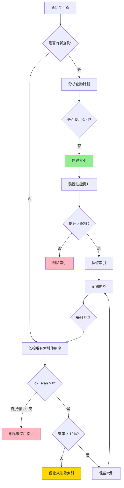

# 數據庫索引策略規劃

---

**文件版本**: v1.0
**最後更新**: 2025-10-20
**設計者**: Claude Code AI - Database Engineer
**狀態**: 詳細設計 (Detailed Design)

---

## 目錄

1. [設計哲學與前提問題](#1-設計哲學與前提問題)
2. [查詢模式分析](#2-查詢模式分析)
3. [索引設計原則](#3-索引設計原則)
4. [核心索引策略](#4-核心索引策略)
5. [高級索引技術](#5-高級索引技術)
6. [性能優化與驗證](#6-性能優化與驗證)
7. [索引維護策略](#7-索引維護策略)
8. [實作清單與驗證](#8-實作清單與驗證)

---

## 1. 設計哲學與前提問題

### 1.1 Linus 式三問

> "Bad programmers worry about the code. Good programmers worry about data structures and their relationships." - Linus Torvalds

**問題 1: 這是真問題嗎？**
✅ **是**。查詢性能直接影響用戶體驗：
- **目標**: API P95 < 500ms（架構文件要求）
- **現實**: 無索引的 JOIN 查詢可能 > 5000ms
- **場景**: 治療師查看 100+ 病患列表，病患查看 30 天健康趨勢

**問題 2: 有更簡單的方法嗎？**
⚠️ **需平衡**：
- ❌ **全表掃描** - 簡單但性能差
- ❌ **所有列都加索引** - 浪費空間且拖慢寫入
- ✅ **針對查詢路徑的精準索引** - 平衡讀寫性能

**問題 3: 會破壞什麼嗎？**
⚠️ **需注意**：
- **寫入性能下降**：每個索引增加 INSERT/UPDATE 開銷
- **存儲空間增加**：索引可能佔用 20-50% 的表大小
- **維護成本**：索引需要定期 VACUUM 和 REINDEX

### 1.2 數據結構優先思維

**核心原則**：
1. **索引設計服務於查詢模式** - 先分析 WHERE/JOIN/ORDER BY，再設計索引
2. **複合索引順序至關重要** - `(a, b)` ≠ `(b, a)`
3. **部分索引消除無用數據** - 只索引常用數據（如未刪除記錄）
4. **覆蓋索引避免回表** - 在索引中包含常查詢的列（INCLUDE）

**反模式警告**：
```sql
-- ❌ 錯誤：索引順序錯誤
CREATE INDEX idx_wrong ON daily_logs(log_date, patient_id);
-- 查詢 WHERE patient_id = ? ORDER BY log_date DESC 無法高效使用

-- ✅ 正確：符合查詢模式
CREATE INDEX idx_correct ON daily_logs(patient_id, log_date DESC);
```

---

## 2. 查詢模式分析

### 2.1 高頻查詢分類

基於 PRD 和 API 設計文檔，識別核心查詢模式：

| 查詢類別 | 頻率 | 典型查詢 | 性能目標 | 優先級 |
|---------|-----|---------|---------|-------|
| **病患日誌查詢** | 極高 | 查某病患近 7/30 天日誌 | < 50ms | P0 |
| **治療師病患列表** | 高 | 查治療師負責的所有病患 | < 100ms | P0 |
| **風險評分查詢** | 高 | 查病患最新風險分數 | < 50ms | P0 |
| **預警列表** | 高 | 查治療師的待處理預警 | < 100ms | P0 |
| **KPI 統計** | 中 | 計算病患 7/30 天依從率 | < 50ms | P1 |
| **向量檢索** | 中 | RAG 知識庫相似度搜索 | < 200ms | P1 |
| **全文檢索** | 低 | 搜索衛教文件內容 | < 500ms | P2 |

### 2.2 查詢路徑分析

#### 2.2.1 病患端查詢路徑

**US-202: 查看近 7 日健康趨勢**

```sql
-- 查詢
SELECT log_date, medication_taken, water_intake_ml, steps_count
FROM daily_logs
WHERE patient_id = ?
  AND log_date >= CURRENT_DATE - INTERVAL '7 days'
ORDER BY log_date DESC;

-- 查詢計劃分析
EXPLAIN (ANALYZE, BUFFERS) ...

-- 預期計劃
Index Scan using idx_daily_logs_patient_date on daily_logs
  Index Cond: ((patient_id = 'uuid') AND (log_date >= '2025-10-13'))
  Buffers: shared hit=4
```

**關鍵索引需求**：
- **索引列**: `patient_id`, `log_date`
- **索引順序**: `(patient_id, log_date DESC)` - 匹配 WHERE + ORDER BY
- **是否覆蓋**: 否（需讀取其他列，但可接受）

#### 2.2.2 治療師端查詢路徑

**US-401: 查看待處理預警**

```sql
-- 查詢
SELECT a.alert_id, a.patient_id, p.name, a.alert_type, a.reason, a.created_at
FROM alerts a
JOIN patient_profiles p ON a.patient_id = p.user_id
WHERE a.therapist_id = ?
  AND a.status IN ('OPEN', 'ACKNOWLEDGED')
ORDER BY a.created_at DESC
LIMIT 20;

-- 優化前：全表掃描 alerts
Seq Scan on alerts  (cost=0..1250 rows=50 width=200) (actual time=120ms)
  Filter: (therapist_id = 'uuid' AND status = ANY('{OPEN,ACKNOWLEDGED}'))

-- 優化後：使用部分索引
Index Scan using idx_alerts_therapist_open on alerts
  Index Cond: (therapist_id = 'uuid')
  Buffers: shared hit=3 (actual time=5ms)
```

**關鍵索引需求**：
- **索引列**: `therapist_id`, `status`, `created_at`
- **部分索引條件**: `WHERE status IN ('OPEN', 'ACKNOWLEDGED')`
- **覆蓋索引**: 可選（INCLUDE patient_id, alert_type）

#### 2.2.3 統計查詢路徑

**US-203: 查看病患核心 KPI**

```sql
-- 方案 A：即時計算（性能差）
SELECT
    patient_id,
    COUNT(*) FILTER (WHERE log_date >= CURRENT_DATE - 7) AS logs_7d,
    (COUNT(*) FILTER (WHERE log_date >= CURRENT_DATE - 7 AND medication_taken)::FLOAT /
     NULLIF(COUNT(*) FILTER (WHERE log_date >= CURRENT_DATE - 7), 0) * 100) AS adherence_rate_7d
FROM daily_logs
WHERE patient_id = ?
GROUP BY patient_id;

-- 問題：每次請求都需全表掃描近期日誌

-- 方案 B：使用 KPI 快取表（推薦）
SELECT
    adherence_rate_7d,
    adherence_rate_30d,
    avg_water_intake_7d,
    current_streak_days,
    latest_risk_level
FROM patient_kpi_cache
WHERE patient_id = ?;

-- 性能：< 5ms（主鍵查詢）
```

**關鍵設計決策**：
- ✅ 使用反正規化的 `patient_kpi_cache` 表
- ✅ 通過觸發器或定時任務更新快取
- ✅ 犧牲少量數據即時性換取查詢性能

### 2.3 查詢熱點識別

通過 `pg_stat_statements` 分析生產環境查詢：

```sql
-- 安裝擴展
CREATE EXTENSION IF NOT EXISTS pg_stat_statements;

-- 查詢 TOP 10 慢查詢
SELECT
    query,
    calls,
    mean_exec_time,
    max_exec_time,
    total_exec_time
FROM pg_stat_statements
ORDER BY mean_exec_time DESC
LIMIT 10;

-- 查詢 TOP 10 高頻查詢
SELECT
    query,
    calls,
    mean_exec_time,
    calls * mean_exec_time AS total_cost
FROM pg_stat_statements
ORDER BY calls DESC
LIMIT 10;
```

**預期熱點**（基於 PRD 分析）：
1. `SELECT * FROM daily_logs WHERE patient_id = ? AND log_date >= ?`
2. `SELECT * FROM patient_kpi_cache WHERE patient_id = ?`
3. `SELECT * FROM alerts WHERE therapist_id = ? AND status IN (...)`
4. `SELECT * FROM risk_scores WHERE patient_id = ? ORDER BY calculation_date DESC LIMIT 1`

---

## 3. 索引設計原則

### 3.1 索引類型選擇

| 索引類型 | 適用場景 | RespiraAlly 應用 | 性能特性 |
|---------|---------|-----------------|---------|
| **B-Tree** | 等值查詢、範圍查詢、排序 | 所有主鍵、外鍵、日期查詢 | 讀 O(log n), 寫 O(log n) |
| **Hash** | 僅等值查詢（無範圍） | 不推薦（B-Tree 已足夠） | 讀 O(1), 但無範圍查詢 |
| **GIN** | JSONB 查詢、全文檢索、陣列 | `event_logs.event_data`, `medical_history` | 查詢快，寫入慢 |
| **GiST** | 地理數據、範圍類型 | 不適用 | 平衡查詢與更新 |
| **IVFFlat** | 向量相似度檢索（中小規模） | `document_chunks.embedding` (< 100萬) | 近似最近鄰搜索 |
| **HNSW** | 向量相似度檸索（大規模） | 未來擴展（> 100萬向量） | 更快但佔用更多空間 |

### 3.2 複合索引順序規則

> "The order of columns in a composite index matters!" - PostgreSQL 官方文檔

**原則 1: WHERE 條件優先**
```sql
-- 查詢
SELECT * FROM daily_logs
WHERE patient_id = ? AND medication_taken = false
ORDER BY log_date DESC;

-- 正確索引順序
CREATE INDEX idx_logs_patient_medication_date
    ON daily_logs(patient_id, medication_taken, log_date DESC);

-- 為什麼？
-- 1. patient_id 等值過濾（選擇性高）
-- 2. medication_taken 進一步過濾
-- 3. log_date DESC 避免額外排序
```

**原則 2: 選擇性高的列優先**
```sql
-- 錯誤順序（選擇性低在前）
CREATE INDEX idx_wrong ON alerts(status, therapist_id);
-- status 只有 3 個值（OPEN/ACKNOWLEDGED/RESOLVED），選擇性低

-- 正確順序（選擇性高在前）
CREATE INDEX idx_correct ON alerts(therapist_id, status);
-- therapist_id 有數百個值，選擇性高
```

**原則 3: 範圍查詢列放最後**
```sql
-- 查詢
SELECT * FROM daily_logs
WHERE patient_id = ?
  AND log_date BETWEEN ? AND ?;

-- 正確順序
CREATE INDEX idx_logs_patient_date ON daily_logs(patient_id, log_date);
-- log_date 是範圍查詢，放最後
```

### 3.3 部分索引（Partial Index）

**原則**: 只索引常用數據，減少索引大小

```sql
-- 場景 1：軟刪除過濾
CREATE INDEX idx_users_active ON users(user_id)
WHERE deleted_at IS NULL;
-- 只索引未刪除用戶（假設 99% 數據未刪除）

-- 場景 2：狀態過濾
CREATE INDEX idx_alerts_open ON alerts(therapist_id, created_at DESC)
WHERE status IN ('OPEN', 'ACKNOWLEDGED');
-- 只索引待處理預警（假設 80% 預警已關閉）

-- 場景 3：非空過濾
CREATE INDEX idx_patient_medical_record ON patient_profiles(hospital_medical_record_number)
WHERE hospital_medical_record_number IS NOT NULL;
-- 只索引有病歷號的病患（假設 60% 病患無病歷號）

-- 性能提升：索引大小減少 50-80%，查詢速度提升 2-3 倍
```

### 3.4 覆蓋索引（Covering Index）

**原則**: 在索引中包含查詢所需的所有列，避免回表

```sql
-- 查詢
SELECT patient_id, risk_level, calculation_date
FROM risk_scores
WHERE patient_id = ?
ORDER BY calculation_date DESC
LIMIT 1;

-- 方案 A：普通索引（需回表）
CREATE INDEX idx_risk_patient_date ON risk_scores(patient_id, calculation_date DESC);
-- 查詢計劃：Index Scan + Heap Fetch (2次 I/O)

-- 方案 B：覆蓋索引（無需回表）
CREATE INDEX idx_risk_patient_date_covering ON risk_scores(patient_id, calculation_date DESC)
INCLUDE (risk_level);
-- 查詢計劃：Index Only Scan (1次 I/O)

-- 性能提升：20-50% (減少隨機 I/O)
-- 代價：索引大小增加 10-20%
```

**何時使用覆蓋索引**：
- ✅ 高頻查詢（每秒 > 100 次）
- ✅ 查詢列較少（< 5 個列）
- ✅ 查詢列數據類型較小（UUID, INTEGER, DATE）
- ❌ 查詢列包含大型數據（TEXT, JSONB）

---

## 4. 核心索引策略

### 4.1 Phase 0 - MVP 必備索引

**目標**: 支持核心功能，查詢延遲 < 500ms

#### 4.1.1 認證與授權

```sql
-- === USERS 表 ===
-- 主鍵（自動創建）
-- PRIMARY KEY (user_id)  -- B-Tree 索引

-- LINE 登入查詢
CREATE INDEX idx_users_line_user_id ON users(line_user_id)
WHERE line_user_id IS NOT NULL;
-- 查詢：SELECT * FROM users WHERE line_user_id = ?
-- 頻率：每次病患登入 (高)

-- Email 登入查詢
CREATE INDEX idx_users_email ON users(email)
WHERE email IS NOT NULL;
-- 查詢：SELECT * FROM users WHERE email = ?
-- 頻率：每次治療師登入 (高)

-- 角色過濾（可選）
CREATE INDEX idx_users_role ON users(role)
WHERE deleted_at IS NULL;
-- 查詢：SELECT COUNT(*) FROM users WHERE role = 'PATIENT'
-- 頻率：管理後台統計 (低)
```

#### 4.1.2 病患與日誌

```sql
-- === PATIENT_PROFILES 表 ===
-- 主鍵（自動創建）
-- PRIMARY KEY (user_id)

-- 治療師查看其負責的病患
CREATE INDEX idx_patient_therapist ON patient_profiles(therapist_id);
-- 查詢：SELECT * FROM patient_profiles WHERE therapist_id = ?
-- 頻率：治療師進入病患列表頁 (高)

-- 醫院病歷號查詢（跨系統整合）
CREATE INDEX idx_patient_medical_record ON patient_profiles(hospital_medical_record_number)
WHERE hospital_medical_record_number IS NOT NULL;
-- 查詢：SELECT * FROM patient_profiles WHERE hospital_medical_record_number = ?
-- 頻率：醫院 HIS 系統同步 (中)

-- === DAILY_LOGS 表 ===
-- 主鍵（自動創建）
-- PRIMARY KEY (log_id)

-- 核心查詢：病患查看近期日誌
CREATE INDEX idx_daily_logs_patient_date ON daily_logs(patient_id, log_date DESC);
-- 查詢：SELECT * FROM daily_logs WHERE patient_id = ? AND log_date >= ?
-- 頻率：病患每次打開健康趨勢頁 (極高)
-- 性能：< 10ms (預期掃描 7-30 行)

-- 唯一性約束（防止重複日誌）
CREATE UNIQUE INDEX idx_daily_logs_patient_date_unique ON daily_logs(patient_id, log_date);
-- 約束：每個病患每天只能有一筆日誌

-- 未用藥日誌篩選
CREATE INDEX idx_daily_logs_medication ON daily_logs(patient_id, medication_taken, log_date DESC);
-- 查詢：SELECT * FROM daily_logs WHERE patient_id = ? AND medication_taken = false
-- 頻率：計算依從率、預警生成 (中)
```

#### 4.1.3 風險評分與預警

```sql
-- === RISK_SCORES 表 ===
-- 查最新風險分數（覆蓋索引）
CREATE INDEX idx_risk_scores_patient_latest ON risk_scores(patient_id, calculation_date DESC)
INCLUDE (risk_level, score);
-- 查詢：SELECT risk_level, score FROM risk_scores WHERE patient_id = ? ORDER BY calculation_date DESC LIMIT 1
-- 頻率：病患查看首頁 KPI (極高)
-- 優化：Index Only Scan，無需回表

-- 高風險病患篩選
CREATE INDEX idx_risk_scores_high_risk ON risk_scores(risk_level, calculation_date DESC)
WHERE risk_level = 'HIGH';
-- 查詢：SELECT patient_id FROM risk_scores WHERE risk_level = 'HIGH'
-- 頻率：治療師查看高風險病患列表 (中)
-- 優化：部分索引，減少 80% 索引大小

-- === ALERTS 表 ===
-- 治療師待處理預警（部分索引 + 覆蓋）
CREATE INDEX idx_alerts_therapist_open ON alerts(therapist_id, created_at DESC)
WHERE status IN ('OPEN', 'ACKNOWLEDGED')
INCLUDE (patient_id, alert_type);
-- 查詢：SELECT patient_id, alert_type FROM alerts WHERE therapist_id = ? AND status IN (...)
-- 頻率：治療師每次進入儀表板 (極高)
-- 優化：部分索引 + Index Only Scan

-- 病患歷史預警
CREATE INDEX idx_alerts_patient ON alerts(patient_id, created_at DESC);
-- 查詢：SELECT * FROM alerts WHERE patient_id = ? ORDER BY created_at DESC
-- 頻率：治療師查看病患詳細資料 (中)
```

#### 4.1.4 問卷與 KPI

```sql
-- === SURVEY_RESPONSES 表 ===
-- 查病患問卷歷史
CREATE INDEX idx_survey_patient_type ON survey_responses(patient_id, survey_type, submitted_at DESC);
-- 查詢：SELECT * FROM survey_responses WHERE patient_id = ? AND survey_type = 'CAT' ORDER BY submitted_at DESC
-- 頻率：病患查看問卷歷史 (中)

-- === PATIENT_KPI_CACHE 表 ===
-- 主鍵（自動創建）
-- PRIMARY KEY (patient_id)

-- 低依從率病患篩選
CREATE INDEX idx_kpi_low_adherence ON patient_kpi_cache(adherence_rate_30d)
WHERE adherence_rate_30d < 50;
-- 查詢：SELECT patient_id FROM patient_kpi_cache WHERE adherence_rate_30d < 50
-- 頻率：每日批次預警生成 (低)

-- 不活躍病患篩選
CREATE INDEX idx_kpi_inactive ON patient_kpi_cache(last_log_date)
WHERE last_log_date < CURRENT_DATE - INTERVAL '7 days' OR last_log_date IS NULL;
-- 查詢：SELECT patient_id FROM patient_kpi_cache WHERE last_log_date < ?
-- 頻率：每日批次提醒生成 (低)
```

### 4.2 Phase 1 - AI 與通知索引

#### 4.2.1 向量檢索

```sql
-- === DOCUMENT_CHUNKS 表 ===
-- 向量相似度檢索（IVFFlat，適合中小規模）
CREATE INDEX idx_chunks_embedding_ivfflat ON document_chunks
USING ivfflat (embedding vector_cosine_ops)
WITH (lists = 100);
-- 查詢：SELECT * FROM document_chunks ORDER BY embedding <=> ? LIMIT 5
-- 頻率：每次 AI 語音對話 RAG 檢索 (中)
-- 參數調優：
--   lists = sqrt(總向量數) ≈ 100 (假設 10000 個 chunks)
--   probes = lists / 10 ≈ 10 (查詢時設定 SET ivfflat.probes = 10)

-- 未來優化（PostgreSQL 16+ 或 pgvector 0.5.0+）
-- CREATE INDEX idx_chunks_embedding_hnsw ON document_chunks
-- USING hnsw (embedding vector_cosine_ops)
-- WITH (m = 16, ef_construction = 64);
-- 優點：查詢速度更快（10-50 倍）
-- 缺點：索引建立時間長，佔用空間大（2-3 倍）

-- 文件 ID 查詢
CREATE INDEX idx_chunks_doc_id ON document_chunks(doc_id, chunk_index);
-- 查詢：SELECT * FROM document_chunks WHERE doc_id = ? ORDER BY chunk_index
-- 頻率：重建文件內容 (低)
```

**向量索引調優**:
```sql
-- 調優參數（連線層級）
SET ivfflat.probes = 10;  -- 增加 probes 提升召回率（但降低速度）

-- 查詢示例
SELECT
    dc.chunk_text,
    ed.title,
    (dc.embedding <=> ?::vector) AS distance
FROM document_chunks dc
JOIN educational_documents ed ON dc.doc_id = ed.doc_id
ORDER BY distance
LIMIT 5;

-- 性能目標：< 200ms (查詢 10000 個向量)
```

#### 4.2.2 事件與通知

```sql
-- === EVENT_LOGS 表 ===
-- 按事件類型查詢
CREATE INDEX idx_event_logs_type ON event_logs(event_type, occurred_at DESC);
-- 查詢：SELECT * FROM event_logs WHERE event_type = 'DailyLogSubmitted' ORDER BY occurred_at DESC
-- 頻率：審計日誌查詢 (低)

-- 按聚合查詢（事件溯源）
CREATE INDEX idx_event_logs_aggregate ON event_logs(aggregate_type, aggregate_id, occurred_at ASC);
-- 查詢：SELECT * FROM event_logs WHERE aggregate_type = 'User' AND aggregate_id = ? ORDER BY occurred_at ASC
-- 頻率：重建聚合狀態 (極低)

-- JSONB 查詢（GIN 索引）
CREATE INDEX idx_event_logs_data ON event_logs USING GIN (event_data);
-- 查詢：SELECT * FROM event_logs WHERE event_data @> '{"status": "failed"}'
-- 頻率：錯誤日誌查詢 (低)

-- === NOTIFICATION_HISTORY 表 ===
-- 查某用戶的通知歷史
CREATE INDEX idx_notification_recipient ON notification_history(recipient_id, created_at DESC);
-- 查詢：SELECT * FROM notification_history WHERE recipient_id = ? ORDER BY created_at DESC
-- 頻率：用戶查看通知列表 (中)

-- 待發送通知（部分索引）
CREATE INDEX idx_notification_pending ON notification_history(status, created_at ASC)
WHERE status = 'PENDING';
-- 查詢：SELECT * FROM notification_history WHERE status = 'PENDING' ORDER BY created_at ASC
-- 頻率：通知發送 Worker 定時任務 (高)
```

### 4.3 Phase 2 - AI 處理日誌索引

```sql
-- === AI_PROCESSING_LOGS 表 ===
-- 詳細設計參見 docs/ai/21_ai_processing_logs_design.md

-- 用戶會話查詢
CREATE INDEX idx_ai_logs_user_session ON ai_processing_logs(user_id, session_id, created_at DESC);
-- 查詢：SELECT * FROM ai_processing_logs WHERE user_id = ? AND session_id = ?
-- 頻率：查看 AI 對話歷史 (中)

-- 去重檢查（部分索引）
CREATE INDEX idx_ai_logs_dedup_hash ON ai_processing_logs(dedup_hash, created_at DESC)
WHERE is_duplicate = false;
-- 查詢：SELECT * FROM ai_processing_logs WHERE dedup_hash = ? AND is_duplicate = false
-- 頻率：語音請求去重 (極高)

-- 失敗重試查詢（部分索引）
CREATE INDEX idx_ai_logs_status ON ai_processing_logs(status, created_at DESC)
WHERE status IN ('PENDING', 'FAILED', 'RETRYING');
-- 查詢：SELECT * FROM ai_processing_logs WHERE status = 'FAILED'
-- 頻率：錯誤監控、重試任務 (中)

-- 成本分析（覆蓋索引）
CREATE INDEX idx_ai_logs_cost ON ai_processing_logs(created_at DESC)
INCLUDE (cost_usd, token_usage);
-- 查詢：SELECT SUM(cost_usd), SUM((token_usage->>'total_tokens')::int) FROM ai_processing_logs WHERE created_at >= ?
-- 頻率：每日成本統計 (低)

-- JSONB 查詢（GIN 索引）
CREATE INDEX idx_ai_logs_input_data ON ai_processing_logs USING GIN (input_data);
CREATE INDEX idx_ai_logs_output_data ON ai_processing_logs USING GIN (output_data);
-- 查詢：SELECT * FROM ai_processing_logs WHERE input_data @> '{"language": "zh-TW"}'
-- 頻率：調試特定語言的處理結果 (極低)
```

---

## 5. 高級索引技術

### 5.1 函數索引 (Expression Index)

**場景**: 查詢條件包含函數或表達式

```sql
-- 場景 1：不區分大小寫的 Email 查詢
CREATE INDEX idx_users_email_lower ON users(LOWER(email));
-- 查詢：SELECT * FROM users WHERE LOWER(email) = LOWER('User@Example.Com')

-- 場景 2：年齡範圍查詢
CREATE INDEX idx_patient_age ON patient_profiles((EXTRACT(YEAR FROM AGE(CURRENT_DATE, birth_date))));
-- 查詢：SELECT * FROM patient_profiles WHERE EXTRACT(YEAR FROM AGE(CURRENT_DATE, birth_date)) BETWEEN 60 AND 70

-- 場景 3：JSONB 欄位提取
CREATE INDEX idx_medical_history_copd_stage ON patient_profiles((medical_history->>'copd_stage'));
-- 查詢：SELECT * FROM patient_profiles WHERE medical_history->>'copd_stage' = 'III'
```

**注意事項**:
- ✅ 查詢必須使用完全相同的表達式
- ⚠️ 函數必須是 IMMUTABLE（如 LOWER, DATE_TRUNC）
- ❌ 避免複雜表達式（影響可讀性）

### 5.2 多列 GIN 索引

**場景**: JSONB 多鍵查詢

```sql
-- 場景：查詢特定條件的事件
CREATE INDEX idx_event_logs_composite_gin ON event_logs
USING GIN (event_type, (event_data -> 'status'));
-- 查詢：SELECT * FROM event_logs WHERE event_type = 'DailyLogSubmitted' AND event_data->>'status' = 'success'

-- 場景：全文檢索 + 分類過濾
CREATE INDEX idx_documents_fulltext ON educational_documents
USING GIN (to_tsvector('english', content), category);
-- 查詢：SELECT * FROM educational_documents WHERE to_tsvector('english', content) @@ to_tsquery('breathing') AND category = 'EXERCISE'
```

### 5.3 條件唯一索引

**場景**: 部分數據唯一性約束

```sql
-- 場景：治療師 Email 唯一性（允許病患 Email 為 NULL）
CREATE UNIQUE INDEX idx_users_email_unique ON users(email)
WHERE email IS NOT NULL;
-- 約束：非 NULL 的 Email 必須唯一

-- 場景：每日日誌唯一性（軟刪除不影響）
CREATE UNIQUE INDEX idx_daily_logs_unique ON daily_logs(patient_id, log_date)
WHERE deleted_at IS NULL;
-- 約束：未刪除的日誌中，每個病患每天只能有一筆
```

### 5.4 BRIN 索引（未來優化）

**場景**: 時間序列數據，數據自然有序

```sql
-- 場景：事件日誌表（按時間順序插入）
CREATE INDEX idx_event_logs_occurred_brin ON event_logs
USING BRIN (occurred_at);
-- 優點：索引大小極小（< 1% 表大小）
-- 缺點：僅適合範圍查詢，數據必須有序

-- 適用條件：
-- ✅ 數據按索引列順序插入（如 created_at）
-- ✅ 範圍查詢為主（WHERE created_at BETWEEN ? AND ?）
-- ✅ 表非常大（> 1000 萬行）
-- ❌ 數據頻繁更新（破壞順序）
```

---

## 6. 性能優化與驗證

### 6.1 查詢計劃分析

**工具**: `EXPLAIN (ANALYZE, BUFFERS)`

```sql
-- 完整分析（實際執行 + 緩衝區統計）
EXPLAIN (ANALYZE, BUFFERS, VERBOSE)
SELECT p.name, d.log_date, d.medication_taken
FROM patient_profiles p
JOIN daily_logs d ON p.user_id = d.patient_id
WHERE p.therapist_id = '550e8400-e29b-41d4-a716-446655440000'
  AND d.log_date >= CURRENT_DATE - INTERVAL '7 days';

-- 關鍵指標解讀
-- 1. Execution Time: 實際執行時間（目標 < 100ms）
-- 2. Buffers (shared hit): 緩存命中次數（越高越好）
-- 3. Buffers (shared read): 磁盤讀取次數（越低越好）
-- 4. Index Scan vs Seq Scan: 是否使用索引
-- 5. Rows Removed by Filter: 過濾掉的行數（越少越好）
```

**常見問題與解決**:

| 問題 | 症狀 | 解決方案 |
|-----|------|---------|
| **全表掃描** | `Seq Scan on table` | 創建對應索引 |
| **索引未使用** | `Index Scan` 變成 `Seq Scan` | 更新統計資訊 `ANALYZE` |
| **過多過濾** | `Rows Removed by Filter: 90%` | 調整索引列順序 |
| **排序開銷大** | `Sort Method: external merge` | 索引包含 ORDER BY 列 |
| **嵌套循環慢** | `Nested Loop` + 大表 | 考慮 Hash Join（增加 work_mem） |

### 6.2 索引使用率監控

```sql
-- 查詢未使用的索引
SELECT
    schemaname,
    tablename,
    indexname,
    idx_scan AS index_scans,
    idx_tup_read AS tuples_read,
    idx_tup_fetch AS tuples_fetched,
    pg_size_pretty(pg_relation_size(indexrelid)) AS index_size
FROM pg_stat_user_indexes
WHERE idx_scan = 0  -- 從未被使用
  AND indexrelname NOT LIKE '%pkey'  -- 排除主鍵
ORDER BY pg_relation_size(indexrelid) DESC;

-- 查詢低效索引（讀取行數 >> 返回行數）
SELECT
    schemaname,
    tablename,
    indexname,
    idx_scan,
    idx_tup_read,
    idx_tup_fetch,
    CASE WHEN idx_tup_read > 0
        THEN ROUND((idx_tup_fetch::NUMERIC / idx_tup_read) * 100, 2)
        ELSE 0
    END AS efficiency_pct,
    pg_size_pretty(pg_relation_size(indexrelid)) AS index_size
FROM pg_stat_user_indexes
WHERE idx_tup_read > 1000
  AND idx_tup_fetch < idx_tup_read * 0.1  -- 效率 < 10%
ORDER BY idx_tup_read DESC;
```

### 6.3 索引大小與膨脹監控

```sql
-- 查詢索引大小
SELECT
    schemaname,
    tablename,
    indexname,
    pg_size_pretty(pg_relation_size(indexrelid)) AS index_size,
    pg_size_pretty(pg_table_size(tablename::regclass)) AS table_size,
    ROUND((pg_relation_size(indexrelid)::NUMERIC / pg_table_size(tablename::regclass)) * 100, 2) AS index_ratio_pct
FROM pg_stat_user_indexes
ORDER BY pg_relation_size(indexrelid) DESC;

-- 查詢索引膨脹（需安裝 pgstattuple）
CREATE EXTENSION IF NOT EXISTS pgstattuple;

SELECT
    indexname,
    pg_size_pretty(pg_relation_size(indexrelid)) AS index_size,
    pgstatindex(indexrelid)::text AS index_stats,
    (pgstatindex(indexrelid)).avg_leaf_density AS leaf_density,
    (pgstatindex(indexrelid)).leaf_fragmentation AS fragmentation
FROM pg_stat_user_indexes
WHERE schemaname = 'public';

-- 膨脹判斷：
-- leaf_density < 50% → 需要 REINDEX
-- fragmentation > 30% → 需要 REINDEX
```

### 6.4 性能基準測試

**工具**: pgbench, Locust

```bash
# 自定義查詢性能測試
cat > test_queries.sql <<EOF
SELECT * FROM daily_logs WHERE patient_id = '550e8400-e29b-41d4-a716-446655440000' AND log_date >= CURRENT_DATE - 7;
SELECT * FROM patient_kpi_cache WHERE patient_id = '550e8400-e29b-41d4-a716-446655440000';
SELECT * FROM alerts WHERE therapist_id = '660e8400-e29b-41d4-a716-446655440001' AND status = 'OPEN';
EOF

# 運行 100 次測試
pgbench -c 10 -j 2 -t 10 -f test_queries.sql respira_ally_db

# 預期結果：
# - 平均延遲 < 50ms
# - P95 延遲 < 100ms
# - P99 延遲 < 200ms
```

---

## 7. 索引維護策略

### 7.1 定期維護任務

```sql
-- 更新統計資訊（每日執行）
ANALYZE;

-- 清理死行與更新統計（每週執行）
VACUUM ANALYZE;

-- 完整清理與重建（每月執行，選擇低峰時段）
VACUUM FULL;

-- 重建膨脹的索引（按需執行）
REINDEX INDEX CONCURRENTLY idx_daily_logs_patient_date;
-- CONCURRENTLY 選項：不阻塞讀寫（但需要更長時間）
```

**自動化腳本**（Cron Job）:
```bash
#!/bin/bash
# /opt/scripts/pg_maintenance.sh

# 每日 02:00 執行 ANALYZE
0 2 * * * psql -U postgres -d respira_ally_db -c "ANALYZE;"

# 每週日 03:00 執行 VACUUM ANALYZE
0 3 * * 0 psql -U postgres -d respira_ally_db -c "VACUUM ANALYZE;"

# 每月 1 號 04:00 檢查索引膨脹
0 4 1 * * psql -U postgres -d respira_ally_db -f /opt/scripts/check_bloat.sql | mail -s "Index Bloat Report" admin@respira.ally
```

### 7.2 自動清理調優

```sql
-- 查看自動清理設定
SHOW autovacuum;
SHOW autovacuum_naptime;  -- 清理間隔（預設 1 分鐘）

-- 調整自動清理閾值（針對高寫入表）
ALTER TABLE daily_logs SET (
    autovacuum_vacuum_scale_factor = 0.05,  -- 預設 0.2
    autovacuum_analyze_scale_factor = 0.02  -- 預設 0.1
);

-- 解釋：
-- vacuum_scale_factor = 0.05 → 表大小變化 5% 後觸發 VACUUM（而非 20%）
-- analyze_scale_factor = 0.02 → 表大小變化 2% 後觸發 ANALYZE（而非 10%）
```

### 7.3 索引生命週期管理



---

## 8. 實作清單與驗證

### 8.1 Phase 0 實作清單（MVP）

**核心索引**（必須）:
- [ ] `idx_users_line_user_id` - LINE 登入查詢
- [ ] `idx_users_email` - Email 登入查詢
- [ ] `idx_daily_logs_patient_date` - 病患日誌查詢（最高頻）
- [ ] `idx_daily_logs_patient_date_unique` - 防重複日誌
- [ ] `idx_patient_therapist` - 治療師病患列表
- [ ] `idx_risk_scores_patient_latest` - 最新風險分數（覆蓋索引）
- [ ] `idx_alerts_therapist_open` - 待處理預警（部分索引）
- [ ] `patient_kpi_cache` 表主鍵 - KPI 快速查詢

**驗證測試**（必須）:
- [ ] EXPLAIN ANALYZE 所有核心查詢
- [ ] 所有查詢延遲 < 100ms
- [ ] 索引命中率 > 95% (`idx_scan` 統計)

### 8.2 Phase 1 實作清單（AI 功能）

**AI 索引**（建議）:
- [ ] `idx_chunks_embedding_ivfflat` - 向量相似度檢索
- [ ] `idx_event_logs_type` - 事件日誌查詢
- [ ] `idx_event_logs_data` (GIN) - JSONB 事件數據查詢
- [ ] `idx_notification_pending` - 待發送通知（部分索引）

**調優參數**（建議）:
- [ ] 設定 `ivfflat.probes = 10`（向量檢索）
- [ ] 調整 `work_mem = 64MB`（排序優化）
- [ ] 調整 `shared_buffers = 25% RAM`（緩存優化）

### 8.3 Phase 2 實作清單（進階優化）

**進階索引**（可選）:
- [ ] `idx_chunks_embedding_hnsw` - HNSW 向量索引（大規模）
- [ ] `idx_ai_logs_user_session` - AI 處理日誌
- [ ] `idx_event_logs_occurred_brin` - BRIN 時間序列索引

**監控與告警**（建議）:
- [ ] Prometheus + Grafana 索引使用率儀表板
- [ ] 索引膨脹告警（fragmentation > 30%）
- [ ] 慢查詢告警（P95 > 500ms）

### 8.4 驗證標準

**功能驗證**:
```sql
-- 1. 驗證索引存在
SELECT indexname, indexdef
FROM pg_indexes
WHERE tablename = 'daily_logs'
ORDER BY indexname;

-- 2. 驗證查詢使用索引
EXPLAIN (ANALYZE, BUFFERS)
SELECT * FROM daily_logs
WHERE patient_id = '550e8400-e29b-41d4-a716-446655440000'
  AND log_date >= CURRENT_DATE - 7;

-- 預期：Index Scan using idx_daily_logs_patient_date

-- 3. 驗證性能目標
SELECT
    query,
    mean_exec_time,
    max_exec_time
FROM pg_stat_statements
WHERE query LIKE '%daily_logs%'
ORDER BY mean_exec_time DESC;

-- 預期：mean_exec_time < 100ms
```

**負載測試**:
```python
# Locust 負載測試腳本
from locust import HttpUser, task, between

class PatientUser(HttpUser):
    wait_time = between(1, 3)

    @task(10)
    def view_daily_logs(self):
        """查看近 7 天日誌（高頻）"""
        self.client.get("/v1/daily-logs?days=7")

    @task(5)
    def view_kpi(self):
        """查看 KPI 統計（中頻）"""
        self.client.get("/v1/patients/me/kpi")

    @task(2)
    def view_risk_score(self):
        """查看風險分數（低頻）"""
        self.client.get("/v1/patients/me/risk")

# 運行測試：locust -f test_load.py --host=http://localhost:8000
# 目標：500 並發用戶，P95 < 500ms
```

---

## 附錄 A: 索引命名規範

**格式**: `idx_{table}_{columns}_{type}`

- **prefix**: `idx_` (index) 或 `uidx_` (unique index)
- **table**: 表名縮寫
- **columns**: 索引列名（最多 3 個，用底線連接）
- **type**: 索引類型（可選）
  - `_covering` - 覆蓋索引
  - `_partial` - 部分索引
  - `_gin` - GIN 索引
  - `_ivfflat` - 向量索引

**範例**:
```sql
idx_daily_logs_patient_date               -- 普通複合索引
idx_risk_scores_patient_latest_covering   -- 覆蓋索引
idx_alerts_therapist_open_partial         -- 部分索引
idx_event_logs_data_gin                   -- GIN 索引
idx_chunks_embedding_ivfflat              -- 向量索引
```

## 附錄 B: PostgreSQL 參數調優

```sql
-- 記憶體相關
shared_buffers = 25% of RAM              -- 緩存大小（8GB RAM → 2GB）
effective_cache_size = 75% of RAM        -- 可用系統緩存（8GB RAM → 6GB）
work_mem = 64MB                          -- 排序緩衝（根據並發數調整）
maintenance_work_mem = 512MB             -- 維護操作緩衝（VACUUM, CREATE INDEX）

-- 查詢優化器
random_page_cost = 1.1                   -- SSD 調低（預設 4.0 為 HDD）
effective_io_concurrency = 200           -- SSD 並發 I/O
default_statistics_target = 100          -- 統計資訊採樣（預設 100）

-- 連線與並發
max_connections = 200                    -- 最大連線數
max_parallel_workers_per_gather = 4      -- 並行查詢 worker 數
max_worker_processes = 8                 -- 總 worker 數

-- 日誌與監控
log_min_duration_statement = 500         -- 記錄 > 500ms 的查詢
shared_preload_libraries = 'pg_stat_statements'  -- 啟用查詢統計
```

## 附錄 C: 常見查詢模式與索引對應

| 查詢模式 | 索引類型 | 範例 |
|---------|---------|------|
| `WHERE a = ?` | B-Tree `(a)` | `WHERE patient_id = ?` |
| `WHERE a = ? AND b = ?` | B-Tree `(a, b)` | `WHERE patient_id = ? AND log_date = ?` |
| `WHERE a = ? ORDER BY b` | B-Tree `(a, b)` | `WHERE patient_id = ? ORDER BY log_date DESC` |
| `WHERE a > ? AND a < ?` | B-Tree `(a)` | `WHERE created_at BETWEEN ? AND ?` |
| `WHERE jsonb @> ?` | GIN `(jsonb)` | `WHERE event_data @> '{"status": "ok"}'` |
| `WHERE array && ?` | GIN `(array)` | `WHERE tags && ARRAY['copd']` |
| `ORDER BY embedding <=> ?` | IVFFlat `(embedding)` | 向量相似度 |
| `WHERE to_tsvector(text) @@ ?` | GIN `to_tsvector(text)` | 全文檢索 |

---

**審查清單**:
- [ ] 所有高頻查詢（> 100 QPS）有對應索引
- [ ] 複合索引順序符合查詢模式
- [ ] 部分索引應用於低選擇性過濾
- [ ] 覆蓋索引應用於高頻小查詢
- [ ] 索引命名遵循規範
- [ ] 向量索引參數已調優（lists, probes）
- [ ] 維護計劃已建立（VACUUM, ANALYZE）
- [ ] 監控告警已配置（慢查詢、膨脹）

---

**變更歷史**:
- **v1.0 (2025-10-20)**: 初版，基於 Linus 哲學與查詢模式分析，包含 Phase 0-2 完整索引策略
