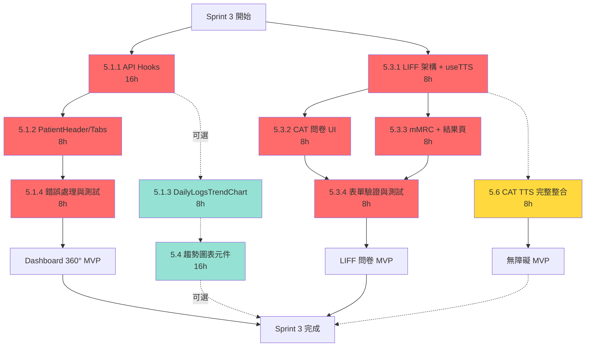

# Sprint 3 任務優先級分析 (Task Priority Analysis)

**版本**: v1.0
**日期**: 2025-10-23
**狀態**: 實作前優先級評估
**目的**: 確定 Sprint 3 任務的最佳實作順序

---

## 📋 執行摘要 (Executive Summary)

### 🎯 推薦實作順序

基於依賴關係、風險、價值與關鍵路徑分析：

```
第一階段 (Week 5, Day 1-2, 16h) - 關鍵基礎設施
├─ 🔴 P0: Task 5.1.1 - API Hooks 與基礎架構 [16h]
│  └─ 理由: 後續所有功能的依賴基礎

第二階段 (Week 5, Day 2-4, 16h) - 核心展示功能
├─ 🔴 P0: Task 5.1.2 - PatientHeader + PatientTabs [8h]
└─ 🔴 P0: Task 5.1.4 - 錯誤處理與測試 [8h]
   └─ 理由: 核心治療師工作流，必須穩定

第三階段 (Week 6, Day 1-2, 16h) - 病患互動核心
├─ 🔴 P0: Task 5.3.1 - LIFF 架構 + useTTS Hook [8h]
└─ 🔴 P0: Task 5.3.2 - CAT 問卷 UI [8h]
   └─ 理由: 病患填答核心功能

第四階段 (Week 6, Day 3-4, 16h) - 功能完善
├─ 🔴 P0: Task 5.3.3 - mMRC + 結果頁 [8h]
└─ 🔴 P0: Task 5.3.4 - 表單驗證與 TTS 測試 [8h]
   └─ 理由: 完整問卷流程驗證

第五階段 (Week 6, Day 5, 8h) - 無障礙加分
└─ 🟡 P1: Task 5.6 - CAT TTS 完整整合 [8h]
   └─ 理由: 無障礙加分項，獨立功能

可選階段 (時間允許)
└─ 🟢 P2: Task 5.4 - 趨勢圖表元件 [16h]
   └─ 理由: 錦上添花，可延後至 Sprint 4
```

**核心結論**: 先完成 API 基礎 → 治療師 360° 視圖 → 病患問卷 → TTS 無障礙 → (可選) 趨勢圖表

---

## 🔍 多維度分析矩陣

### 1️⃣ 依賴關係分析 (Dependency Analysis)

| 任務 | 依賴於 | 被依賴於 | 關鍵路徑 | 優先級 |
|------|--------|----------|----------|--------|
| **5.1.1 API Hooks** | Survey API (✅ 已完成) | 5.1.2, 5.1.3 | ✅ | **P0 - 最高** |
| **5.1.2 PatientHeader/Tabs** | 5.1.1 | 5.1.3 | ✅ | **P0 - 高** |
| **5.1.3 DailyLogsTrendChart** | 5.1.1 | - | ❌ | P2 - 可延後 |
| **5.1.4 錯誤處理與測試** | 5.1.2 | - | ✅ | **P0 - 高** |
| **5.3.1 LIFF 架構 + useTTS** | - (獨立) | 5.3.2, 5.3.3 | ✅ | **P0 - 高** |
| **5.3.2 CAT 問卷 UI** | 5.3.1, useTTS | 5.3.4 | ✅ | **P0 - 高** |
| **5.3.3 mMRC + 結果頁** | 5.3.1 | 5.3.4 | ✅ | **P0 - 高** |
| **5.3.4 表單驗證與測試** | 5.3.2, 5.3.3 | - | ✅ | **P0 - 高** |
| **5.6 CAT TTS 完整整合** | useTTS Hook | - | ❌ | P1 - 中 |
| **5.4 趨勢圖表元件** | 5.1.1 (API Hooks) | - | ❌ | P2 - 低 |

**關鍵發現**:
- ✅ **5.1.1 是整個 Sprint 3 的關鍵基礎** - 所有 Dashboard 功能都依賴它
- ✅ **5.3.1 是 LIFF 的關鍵基礎** - useTTS Hook 必須先完成
- ❌ **5.4 和 5.1.3 不在關鍵路徑上** - 可以延後或平行處理

---

### 2️⃣ 技術風險評估 (Risk Assessment)

| 任務 | 技術風險 | 風險因素 | 緩解策略 | 風險等級 |
|------|----------|----------|----------|----------|
| **5.1.1 API Hooks** | 🟡 中 | TanStack Query 5 整合，錯誤處理 | 參考 ADR-012 模式，早期測試 | **需早期驗證** |
| **5.1.2 PatientHeader/Tabs** | 🟢 低 | 標準 React 組件 | shadcn/ui 模板可用 | 風險可控 |
| **5.1.3 DailyLogsTrendChart** | 🟡 中 | Recharts 學習曲線，數據轉換 | 參考官方範例，簡化需求 | 中等風險 |
| **5.1.4 錯誤處理與測試** | 🟢 低 | 標準錯誤邊界模式 | React Error Boundary + Testing Library | 風險可控 |
| **5.3.1 LIFF 架構 + useTTS** | 🟡 中 | **Web Speech API 瀏覽器相容性** | iOS/Android 早期測試，降級方案 | **需早期驗證** |
| **5.3.2 CAT 問卷 UI** | 🟢 低 | 靜態表單 UI | 參考 cat_form.html，React Hook Form | 風險可控 |
| **5.3.3 mMRC + 結果頁** | 🟢 低 | 簡單單選 + 結果顯示 | 沿用 CAT 模式 | 風險可控 |
| **5.3.4 表單驗證與測試** | 🟡 中 | Zod 驗證規則，端到端測試 | 逐步測試，手動驗證 | 中等風險 |
| **5.6 CAT TTS 完整整合** | 🟡 中 | **iOS Safari 手勢觸發限制** | 用戶點擊觸發，提供視覺反饋 | 中等風險 |
| **5.4 趨勢圖表元件** | 🟡 中 | Recharts 複雜度，數據處理 | 可延後，降低 Sprint 3 風險 | **可延後** |

**風險緩解建議**:
1. **高風險任務提前** (5.1.1, 5.3.1): Week 5-6 前期完成，留出調整時間
2. **TTS 早期測試**: Day 1 就應在 iOS Safari (LINE 瀏覽器) 上測試 Web Speech API
3. **圖表功能延後**: 5.4 如遇問題可延至 Sprint 4，不影響 MVP

---

### 3️⃣ 業務價值評估 (Value Prioritization)

| 任務 | 用戶角色 | 核心價值 | MVP 必要性 | 價值評分 |
|------|----------|----------|------------|----------|
| **5.1.1 API Hooks** | 治療師 | **數據獲取基礎設施** | ✅ P0 | ⭐⭐⭐⭐⭐ |
| **5.1.2 PatientHeader/Tabs** | 治療師 | **核心工作流 - 360° 病患視圖** | ✅ P0 | ⭐⭐⭐⭐⭐ |
| **5.1.3 DailyLogsTrendChart** | 治療師 | 趨勢視覺化 (錦上添花) | ❌ P2 | ⭐⭐ |
| **5.1.4 錯誤處理與測試** | 治療師 | **穩定性保障** | ✅ P0 | ⭐⭐⭐⭐⭐ |
| **5.3.1 LIFF 架構 + useTTS** | 病患 | **問卷填答基礎** | ✅ P0 | ⭐⭐⭐⭐⭐ |
| **5.3.2 CAT 問卷 UI** | 病患 | **核心問卷填答** | ✅ P0 | ⭐⭐⭐⭐⭐ |
| **5.3.3 mMRC + 結果頁** | 病患 | **完整問卷流程** | ✅ P0 | ⭐⭐⭐⭐⭐ |
| **5.3.4 表單驗證與測試** | 病患 | **數據準確性保障** | ✅ P0 | ⭐⭐⭐⭐⭐ |
| **5.6 CAT TTS 完整整合** | 病患 (老年) | 無障礙加分項 | ⚠️ P1 | ⭐⭐⭐ |
| **5.4 趨勢圖表元件** | 治療師 | 數據視覺化 (可選) | ❌ P2 | ⭐⭐ |

**價值排序**:
1. **P0 (必須有)**: 5.1.1, 5.1.2, 5.1.4, 5.3.1, 5.3.2, 5.3.3, 5.3.4 → **MVP 核心**
2. **P1 (應該有)**: 5.6 → 無障礙加分項，獨立功能
3. **P2 (最好有)**: 5.4, 5.1.3 → 錦上添花，可延後

---

### 4️⃣ 關鍵路徑分析 (Critical Path Method)



**圖例**:
- 🔴 紅色 (實線): P0 關鍵路徑任務
- 🟡 黃色 (虛線): P1 重要但非關鍵
- 🟢 綠色 (虛線): P2 可選任務

**關鍵路徑總時長**: 64h (5.1.1 → 5.1.2 → 5.1.4 → 5.3.1 → 5.3.2/5.3.3 → 5.3.4)

**非關鍵路徑**: 5.4, 5.1.3, 5.6 可平行或延後處理

---

## 🎯 推薦實作計畫 (Recommended Implementation Plan)

### 📅 Week 5: Dashboard 360° 頁面 (32h)

#### **Day 1-2 (16h): 關鍵基礎設施**
```
🔴 P0: Task 5.1.1 - TanStack Query Hooks + API 整合
├─ 工時: 16h
├─ 產出:
│  ├─ hooks/api/usePatient.ts
│  ├─ hooks/api/useDailyLogs.ts
│  ├─ hooks/api/useSurveys.ts
│  └─ lib/api-client.ts
└─ 驗收: API 正常回傳資料，錯誤處理完善

⚠️ 風險: TanStack Query 5 新版本，需早期驗證
✅ 緩解: 參考 ADR-012 模式，先測試單一 API
```

**為何最優先？**
- ✅ 所有後續功能都依賴 API Hooks
- ✅ 早期發現 API 整合問題
- ✅ 16h 足夠完成並測試

---

#### **Day 2-3 (8h): 核心展示組件**
```
🔴 P0: Task 5.1.2 - PatientHeader + PatientTabs
├─ 工時: 8h
├─ 產出:
│  ├─ components/patient/PatientHeader.tsx
│  ├─ components/patient/PatientTabs.tsx
│  └─ app/patients/[id]/page.tsx (Container)
└─ 驗收: 病患資訊正確顯示，Tab 切換正常

⚠️ 風險: 低 (標準 React 組件)
✅ 建議: 使用 shadcn/ui Tabs 組件
```

**為何第二優先？**
- ✅ 依賴 5.1.1 完成
- ✅ 治療師核心工作流
- ✅ 風險低，可快速完成

---

#### **Day 3 (8h): 可選圖表功能**
```
🟢 P2: Task 5.1.3 - DailyLogsTrendChart (可延後)
├─ 工時: 8h
├─ 產出:
│  └─ components/charts/DailyLogsTrendChart.tsx (Recharts)
└─ 驗收: 7日趨勢圖正確顯示

⚠️ 風險: 中 (Recharts 學習曲線)
💡 建議: 如時間緊張，延後至 Week 6 或 Sprint 4
```

**為何可延後？**
- ❌ 非關鍵路徑
- ❌ 錦上添花功能
- ✅ 可用靜態數據表格替代

---

#### **Day 4 (8h): 穩定性保障**
```
🔴 P0: Task 5.1.4 - 錯誤處理 + Loading 狀態 + 測試
├─ 工時: 8h
├─ 產出:
│  ├─ components/ui/ErrorBoundary.tsx
│  ├─ components/ui/LoadingSpinner.tsx
│  ├─ components/ui/ErrorAlert.tsx
│  └─ tests/patient-detail-page.test.tsx
└─ 驗收: 所有錯誤情境都有優雅處理

⚠️ 風險: 低 (標準模式)
✅ 必須: Dashboard 上線前必須穩定
```

**為何必須完成？**
- ✅ MVP 必須穩定，不可崩潰
- ✅ 治療師依賴此頁面工作
- ✅ 錯誤處理是品質底線

---

### 📅 Week 6: LIFF 問卷 + TTS 無障礙 (40h)

#### **Day 1 (8h): LIFF 基礎架構**
```
🔴 P0: Task 5.3.1 - LIFF 架構 + useTTS Hook
├─ 工時: 8h
├─ 產出:
│  ├─ hooks/useTTS.ts (Web Speech API)
│  ├─ pages/survey/[patientId].tsx
│  └─ lib/liff-init.ts
└─ 驗收: LIFF 初始化成功，TTS 在 iOS Safari 測試通過

⚠️ 風險: 中 (Web Speech API 相容性)
✅ 緩解: Day 1 立即在 LINE 瀏覽器測試 TTS
```

**為何 Day 1 就做 TTS？**
- ✅ **早期驗證高風險功能** (iOS Safari TTS 相容性)
- ✅ 後續 5.3.2, 5.3.3 都依賴 useTTS Hook
- ✅ 如果 TTS 有問題，有 4 天調整時間

---

#### **Day 2 (8h): 核心問卷 UI**
```
🔴 P0: Task 5.3.2 - CAT 8 題問卷 UI
├─ 工時: 8h
├─ 產出:
│  ├─ components/survey/QuestionCard.tsx
│  ├─ components/survey/CATSurvey.tsx
│  └─ data/cat-questions.ts
└─ 驗收: CAT 8 題正確顯示，選項可點選，TTS 朗讀正常

⚠️ 風險: 低 (靜態 UI)
✅ 參考: docs/frontend/cat_form.html
```

---

#### **Day 3 (8h): 完整問卷流程**
```
🔴 P0: Task 5.3.3 - mMRC 問卷 + SurveyResult 結果頁
├─ 工時: 8h
├─ 產出:
│  ├─ components/survey/mMRCSurvey.tsx
│  ├─ components/survey/SurveyResult.tsx
│  └─ utils/survey-calculator.ts (計分邏輯)
└─ 驗收: mMRC 正確顯示，結果頁分數正確

⚠️ 風險: 低 (沿用 CAT 模式)
✅ 計分邏輯: CAT (0-40), mMRC (0-4)
```

---

#### **Day 4 (8h): 表單驗證與測試**
```
🔴 P0: Task 5.3.4 - 表單驗證 + 提交邏輯 + TTS 整合測試
├─ 工時: 8h
├─ 產出:
│  ├─ schemas/survey-schema.ts (Zod)
│  ├─ api/submit-survey.ts
│  └─ tests/survey-flow.test.tsx
└─ 驗收:
   ├─ 未填完不可提交
   ├─ 提交成功回傳正確
   └─ TTS 在 iOS/Android 都正常

⚠️ 風險: 中 (端到端測試)
✅ 測試: 手動測試 + React Testing Library
```

---

#### **Day 5 (8h): 無障礙完整整合**
```
🟡 P1: Task 5.6 - CAT TTS 完整整合 + 無障礙測試
├─ 工時: 8h
├─ 產出:
│  ├─ 完整 ARIA 標籤
│  ├─ 高對比模式切換
│  ├─ 字體大小調整
│  └─ 完整 iOS/Android TTS 測試報告
└─ 驗收: WCAG 2.1 AA 標準合規

⚠️ 風險: 中 (跨設備測試)
💡 建議: 如 Week 6 前 4 天有延遲，此任務可併入 5.3.2-5.3.4
```

**為何 Day 5？**
- ✅ P1 重要但非關鍵路徑
- ✅ 獨立功能，不阻塞其他任務
- ✅ 如時間不足，基礎 TTS (Day 1) 已可用

---

#### **可選任務 (時間允許)**
```
🟢 P2: Task 5.4 - 趨勢圖表元件 (16h)
├─ 時機: Week 6 末或 Sprint 4
├─ 理由: 非 MVP 必須，可延後
└─ 建議: 若 Week 5-6 進度順利，可於 Week 6 末開始
```

---

## 📊 實作順序總結

### ✅ 必須完成 (P0) - 64h

| 順序 | 任務 | 工時 | Week | 關鍵原因 |
|------|------|------|------|----------|
| 1️⃣ | 5.1.1 API Hooks | 16h | Week 5 Day 1-2 | **關鍵依賴** - 所有功能的基礎 |
| 2️⃣ | 5.1.2 PatientHeader/Tabs | 8h | Week 5 Day 2-3 | **核心價值** - 治療師 360° 視圖 |
| 3️⃣ | 5.1.4 錯誤處理與測試 | 8h | Week 5 Day 4 | **穩定性** - MVP 必須可靠 |
| 4️⃣ | 5.3.1 LIFF + useTTS | 8h | Week 6 Day 1 | **早期驗證** - TTS 高風險功能 |
| 5️⃣ | 5.3.2 CAT 問卷 UI | 8h | Week 6 Day 2 | **核心價值** - 病患填答核心 |
| 6️⃣ | 5.3.3 mMRC + 結果頁 | 8h | Week 6 Day 3 | **完整流程** - 問卷完整性 |
| 7️⃣ | 5.3.4 表單驗證與測試 | 8h | Week 6 Day 4 | **數據準確** - 提交邏輯驗證 |

**總計**: 64h / 96h (66.7% 為 P0 核心任務)

---

### 🟡 應該完成 (P1) - 8h

| 順序 | 任務 | 工時 | Week | 理由 |
|------|------|------|------|------|
| 8️⃣ | 5.6 CAT TTS 完整整合 | 8h | Week 6 Day 5 | 無障礙加分項，獨立功能 |

---

### 🟢 可選完成 (P2) - 24h

| 任務 | 工時 | 建議時機 | 理由 |
|------|------|----------|------|
| 5.1.3 DailyLogsTrendChart | 8h | Week 5 Day 3 或延後 | 可用靜態表格替代 |
| 5.4 趨勢圖表元件 | 16h | Sprint 4 | 錦上添花，非 MVP 必須 |

---

## 🚨 風險管理與應變計畫

### 高風險點與應對

| 風險 | 發生時機 | 影響 | 應對策略 |
|------|----------|------|----------|
| **TanStack Query 整合失敗** | Week 5 Day 1-2 | 🔴 阻塞所有功能 | **提前準備**: 參考 ADR-012，準備 fallback 方案 (SWR) |
| **Web Speech API iOS 不相容** | Week 6 Day 1 | 🟡 TTS 功能受限 | **降級方案**: 提供文字版本，等 Sprint 4 後端 TTS |
| **Recharts 學習曲線過陡** | Week 5 Day 3 | 🟢 延遲圖表功能 | **應對**: 使用靜態數據表格，延後至 Sprint 4 |
| **Week 5 進度落後** | Week 5 末 | 🟡 影響 Week 6 | **應對**: 跳過 5.1.3，確保 5.1.1, 5.1.2, 5.1.4 完成 |
| **Week 6 進度落後** | Week 6 Day 3 | 🟡 影響 TTS 整合 | **應對**: 5.6 簡化為基礎 TTS (已在 5.3.1 完成) |

---

### 關鍵決策點

| 時機 | 決策問題 | 選項 A | 選項 B |
|------|----------|--------|--------|
| **Week 5 Day 2** | 5.1.1 是否完成？ | ✅ 繼續 5.1.2 | ❌ 延長 5.1.1 至 Day 3 |
| **Week 5 Day 3** | 是否做 5.1.3 圖表？ | ✅ 如進度順利 | ❌ 跳過，直接 5.1.4 |
| **Week 6 Day 1** | TTS iOS 測試結果？ | ✅ 通過，繼續 | ❌ 失敗，啟用降級方案 |
| **Week 6 Day 4** | 是否做 5.6 完整 TTS？ | ✅ 如進度順利 | ❌ 基礎 TTS 已足夠 |

---

## ✅ 驗收標準 (Acceptance Criteria)

### Sprint 3 必須達成 (MUST)

- ✅ **Dashboard 360°**: 治療師可查看單一病患的 Patient + DailyLog + Survey
- ✅ **LIFF 問卷**: 病患可在 LINE 中完成 CAT (8 題) + mMRC (1 題)
- ✅ **分數計算**: CAT (0-40), mMRC (0-4) 正確計算並顯示
- ✅ **錯誤處理**: 網路失敗、API 錯誤都有優雅降級
- ✅ **基礎 TTS**: CAT/mMRC 問題可朗讀 (Web Speech API)
- ✅ **手動測試**: 治療師 + 病患角色流程測試通過

---

### Sprint 3 最好達成 (SHOULD)

- 🟡 **完整 TTS**: ARIA 標籤、高對比模式、字體調整
- 🟡 **趨勢圖表**: 7日 DailyLog 趨勢視覺化

---

### Sprint 3 可延後 (COULD)

- 🟢 **趨勢圖表元件**: 通用圖表元件 (可用於 DailyLog + Survey 趨勢)

---

## 🎯 最終建議 (Final Recommendation)

### 立即開始

```bash
# Week 5 Day 1 (今天開始)
🔴 Task 5.1.1 - TanStack Query Hooks (16h)

準備工作:
1. 閱讀 ADR-012 前端架構設計
2. 安裝 Dashboard 專案依賴:
   cd frontend/dashboard
   npm install @tanstack/react-query axios
3. 建立 API Client 基礎檔案
4. 實作 usePatient Hook (最簡單的，先驗證模式)
```

### Linus 式總結

> **"Talk is cheap. Show me the code."** - 分析完了，開始寫。

**我們做對了什麼**:
1. ✅ **識別關鍵路徑** - 5.1.1 API Hooks 是整個 Sprint 的脊梁
2. ✅ **早期驗證風險** - TTS 在 Day 1 就測試，不是 Day 5 才發現問題
3. ✅ **聚焦 MVP** - P2 任務明確標記，可延後不心疼

**接下來就是執行**:
- Week 5: 把 Dashboard 360° 做到能用
- Week 6: 把 LIFF 問卷做到病患能填
- 其他都是錦上添花

**The rest is just typing.** 🚀

---

**變更記錄**:
- [2025-10-23] 創建 Sprint 3 任務優先級分析 v1.0
- [2025-10-23] 完成 4 維度分析 + 關鍵路徑圖 + 實作順序建議

**相關文件**:
- [SPRINT3_DEVELOPMENT_PLAN.md](./SPRINT3_DEVELOPMENT_PLAN.md) - 詳細開發計畫
- [ADR-010](../adr/ADR-010-sprint3-mvp-scope-reduction.md) - MVP 範圍縮減決策
- [ADR-011](../adr/ADR-011-cat-accessibility-tts-solution.md) - TTS 技術方案
- [ADR-012](../adr/ADR-012-frontend-architecture-sprint3.md) - 前端架構設計

---

**維護者**: RespiraAlly Development Team
**審核者**: Technical Lead, Product Manager
