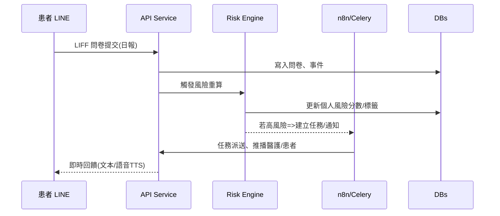

# 全方位 COPD 照護系統（LINE Bot 客戶端 × 醫護後臺）

> 角色對齊：以**產品經理**與**資深系統架構師**視角，結合**敏捷**與**可擴展**技術方案；文字為**教科書式**闡述、含**公式**、**Mermaid 圖**、**型別安全程式碼**與**模組化原型**。
> 資料與範例皆為**脫敏**示意。

---

## 1. 引言與目標

**目標**：打造一個能「**持續互動、個人化、可量化**」的 COPD 慢病照護系統，涵蓋

1. **客戶端（LINE Bot/LIFF）**：日常自我管理（喝水、用藥、運動、抽菸）、量表回填（CAT/mMRC）、語音/文字互動與情緒支持。
2. **醫護端（Web 後臺）**：群體趨勢、風險分群、個案 360°、RAG 衛教管理、任務排程與交班。

**成效指標**（示例）：

* 7日用藥依從率 ≥ 80%
* 週回報完成率 ≥ 70%
* 高風險未接觸（未被跟進）比率 ≤ 10%
* RAG 回覆首次命中率 ≥ 85%，人工覆核成本下降 ≥ 50%

---

## 2. 市場痛點（PM 視角）與 AI 解法

### 2.1 現行產品痛點

* **多系統割裂**：醫院 HIS/EMR、量表工具、訊息系統（LINE/電話）各自為政 → 資料難整合、追蹤耗時。
* **照護人力不足**：追案靠人工與紙本/表單，無法即時掌握風險變化。
* **病患數位門檻**：高齡者不愛安裝新 App、忘記回報、缺乏陪伴感。
* **衛教內容老化**：靜態 PDF 不會學習，對個人狀況缺乏適配。

### 2.2 AI 對應策略

* **情境感知個人化**：以**短期記憶（Redis）+ 長期記憶（向量庫）**維護使用者偏好、節律與風險標籤，調整提醒頻率/語氣/內容。
* **主動式風險預警**：以**行為事件流**+ **簡易風險分數**（見 §7）即時更新，觸發任務派送與交班。
* **RAG 衛教助理**：建立**版本化衛教知識庫**與**檢索回饋閉環**（點擊/互動→依從變化），持續優化內容。
* **多模態入口**：**LINE Bot + LIFF**（免安裝）、**語音輸入**（Whisper/STT）降低門檻、提升互動頻度。
* **流程自動化**：以**任務排程**（APScheduler/Celery）與**工作流（n8n）**統一處理回報→存檔→風險評估→通知。

---

## 3. 系統總覽與架構

```mermaid
flowchart LR
  subgraph Client["Client 層（患者）"]
    A1[LINE Bot]
    A2[LIFF 問卷(喝水/用藥/運動/抽菸)]
    A3[語音輸入(Whisper)]
  end

  subgraph Edge["API Gate / Ingress"]
    G1[Nginx / API Gateway]
  end

  subgraph App["Application 層"]
    B1[Web-App Service (FastAPI)]
    B2[AI-Worker Service (RAG/STT/TTS/Scoring)]
    B3[n8n Workflows]
    B4[Task Scheduler (APScheduler/Celery)]
  end

  subgraph Data["Data 層"]
    D1[(PostgreSQL - EHR-lite/問卷/任務)]
    D2[(MongoDB - 對話/事件log)]
    D3[(Redis - 快取/短期記憶)]
    D4[(Milvus/pgvector - 向量庫)]
    D5[(MinIO - 檔案/音訊)]
    D6[(RabbitMQ - 任務佇列)]
  end

  subgraph Staff["醫護端"]
    C1[Web Dashboard (React/Next.js)]
  end

  A1--Webhook-->G1-->B1
  A2--REST-->B1
  A3--Audio-->B2
  B1<-->D1
  B1<-->D3
  B1--events-->D2
  B1--tasks-->D6
  B2<-->D4
  B2<-->D5
  B3<-->B1
  B4<-->B1
  C1--HTTPS-->B1
  C1<-->D1
```

---

## 4. 使用者故事與核心流程

### 4.1 病患（LINE）

* **每天**：早晚提醒 → LIFF 快速勾選（用藥/喝水/運動/抽菸）→ 即時回饋（鼓勵/建議）。
* **每週**：健康成果回顧卡（趨勢、徽章、下一週目標）。
* **每月**：CAT/mMRC 量表 → 更新**風險分群**與**個人化衛教**。
* **隨時**：用語音/文字提問 → RAG 回答 + 必要時轉人工。



### 4.2 醫護（Dashboard）

* **總覽**：群體 CAT/mMRC 趨勢、依從 KPI、分群動態。
* **個案 360°**：近 7 日依從、行為小面積圖、事件時間軸、警示。
* **RAG**：衛教主題 CRUD、版本化、檢索表現觀測；一鍵投遞至 LINE。
* **行事曆/交班**：高風險個案任務覆蓋率、到期分佈、交辦回報。

---

## 5. 功能規格（對照需求）

### 5.1 客戶端（LINE Bot/LIFF）

* **提醒**：個人化時段（就醫建議/作息學習）、週期/節日規則。
* **量測/回填**：日報（喝水/用藥/運動/抽菸）、月報（CAT/mMRC）。
* **多模態**：語音輸入→STT→NLP→RAG；支援 TTS 回覆（情感友善）。
* **情感與陪伴**：Ally 人設、正向回饋、徽章與小任務。
* **個人儀表**：近 7/30 日趨勢卡片、簡報週報（可分享給家屬）。

### 5.2 醫護端（Dashboard）

1. **登入**（SSO/OIDC、RBAC）。
2. **健康趨勢總覽**：群體 KPI、CAT/mMRC 長期圖、活躍/達標。
3. **個案管理**：360°檢視、行為小面積圖、事件時間軸、警示介面。
4. **RAG 衛教管理**：主題/版本/來源、向量索引、送達/點擊/互動→依從變化關聯。
5. **行事曆/交班**：月/週/日視圖、任務狀態、風險覆蓋率。

---

## 6. 資料模型與 ERD（精簡）

```mermaid
erDiagram
  PATIENT ||--o{ DAILY_LOG : has
  PATIENT ||--o{ SURVEY : fills
  PATIENT ||--o{ EVENT_LOG : generates
  PATIENT ||--o{ TASK : assigned
  SURVEY ||--o{ SURVEY_ITEM : contains
  EDUCATION ||--o{ EDUCATION_VERSION : versions
  EDUCATION_VERSION ||--o{ EDUCATION_METRIC : tracks
  RISK_SCORE }o--|| PATIENT : latest

  PATIENT {
    uuid id PK
    string line_user_id
    string name
    int age
    string gender
    jsonb preferences
    timestamp created_at
  }

  DAILY_LOG {
    uuid id PK
    uuid patient_id FK
    int water_ml
    bool med_taken
    int exercise_min
    int cigarette_count
    date log_date
    timestamp created_at
  }

  SURVEY {
    uuid id PK
    uuid patient_id FK
    string type  // CAT | mMRC
    int score
    date filled_on
  }

  RISK_SCORE {
    uuid patient_id PK
    float score_0_100
    string bucket // low|mid|high
    jsonb factors
    timestamp updated_at
  }

  EDUCATION {
    uuid id PK
    string topic
    string tags
  }

  EDUCATION_VERSION {
    uuid id PK
    uuid edu_id FK
    string lang
    text markdown
    string vector_id
    int version
    timestamp created_at
  }

  EDUCATION_METRIC {
    uuid id PK
    uuid edu_ver_id FK
    int delivered
    int clicked
    int replied
    float delta_adherence_7d
    timestamp updated_at
  }

  TASK {
    uuid id PK
    uuid patient_id FK
    string type // call|visit|remind
    string status // open|in_progress|done
    date due_date
    jsonb payload
  }

  EVENT_LOG {
    uuid id PK
    uuid patient_id FK
    string event_type // form_submitted|alert|rag_reply|task_change
    jsonb detail
    timestamp created_at
  }
```

---

## 7. KPI 與健康分數公式

### 7.1 綜合健康分數（0–100）

定義一個可調權重的分數，用於**個案 360°**與**群體 KPI**：

[
S = w_1 \cdot A_{7} + w_2 \cdot H_{30} + w_3 \cdot (100 - N_{30}) + w_4 \cdot (100 - C) + w_5 \cdot (100 - \hat{R})
]

* (A_{7})：近 7 日用藥依從率（%）
* (H_{30})：近 30 日飲水目標達成率（%）
* (N_{30})：近 30 日**運動未達成**比例（%）
* (C)：近 7 日平均每日香菸支數（標準化 0–100）
* (\hat{R})：CAT/mMRC 標準化風險（0–100；CAT 高、mMRC 高→風險高）
* 預設 (w_1=0.35,w_2=0.15,w_3=0.15,w_4=0.15,w_5=0.20)（可在後臺調整並 A/B）

### 7.2 分群與預警

* **High**：(S < 60) 或 最近 14 日連續 5 日未達成任一核心行為（用藥/運動）。
* **Medium**：(60 \le S < 80)。
* **Low**：(S \ge 80)。

**事件型預警**：如「連續 2 天未用藥」或「香菸激增 > 30%」，即刻產生**任務**與**交班提醒**。

---

## 8. 通知與排程（可觀測）

* **APScheduler/Celery**：

  * 06:30/20:30 個人化提醒（動態退避，避免疲勞）。
  * 週日 18:00 週報推送（可視覺卡片）。
  * 每月 1 日 CAT/mMRC 提醒。
* **n8n 工作流**：Webhook 收單→驗證→寫 DB→風險重算→條件式推播（LINE Push API）→任務派送→記錄 Metrics。
* **指標**：送達、點擊、回覆時延、重試率；告警（重試≥3）。

---

## 9. RAG 衛教管理設計

* **內容資產**：主題→版本（語言、Markdown、來源），向量化（OpenAI/Instructor/SBERT）；**可追蹤**送達/點擊/互動。
* **檢索策略**：Hybrid（BM25 + 向量）＋**個人化 rerank**（考慮年齡、語氣偏好、近況）。
* **閉環**：每次回覆記錄「是否被點開」「之後 7 日依從變化」→計算 **(\Delta) Adherence**，反饋至 `EDUCATION_METRIC`。
* **人工審核**：高風險或低信心回答自動**標註待審**，醫護介入後回灌。

---

## 10. 安全、法規與隱私

* **資料最小化**、**去識別化**（對話/音訊儲存採匿名 ID、敏感欄位加密）。
* **權限**：RBAC、審計日誌、重要操作雙人覆核（刪案/結案）。
* **傳輸/靜態加密**：TLS、KMS/密鑰輪替。
* **備援與恢復**：每日快照、災難演練。
* **法規**：醫療個資在地化（區域雲/自管），第三方模型呼叫採**脫敏前處理**。

---

## 11. 技術選型（建議）

* **前端**：React/Next.js（醫護端）、LIFF（患者）、Tailwind + Recharts。
* **後端**：FastAPI（Typed）、SQLAlchemy、Pydantic v2。
* **資料**：PostgreSQL（主）、MongoDB（對話）、Redis（記憶/快取）、Milvus/pgvector（向量）、MinIO（檔案）、RabbitMQ。
* **AI**：Whisper（STT）、TTS（可接既有 Orpheus-TTS/EmotionVITS）、RAG（Hybrid 檢索 + rerank）。
* **運維**：Zeabur（服務/內網）、Docker Compose、Prometheus + Grafana、OpenTelemetry。
* **自動化**：n8n（ETL/工作流）、APScheduler/Celery（批次與延時任務）。

---

## 12. API 與資料層原型（可執行骨架）

### 12.1 FastAPI（型別安全）— 節錄

```python
from typing import Optional, Literal
from datetime import date, datetime
from fastapi import FastAPI, Depends
from pydantic import BaseModel, Field

app = FastAPI(title="COPD Care API")

class DailyLogIn(BaseModel):
    patient_id: str
    log_date: date
    water_ml: int = Field(ge=0)
    med_taken: bool
    exercise_min: int = Field(ge=0)
    cigarette_count: int = Field(ge=0)

class SurveyIn(BaseModel):
    patient_id: str
    type: Literal["CAT", "mMRC"]
    score: int = Field(ge=0, le=40)  # CAT:0-40; mMRC 0-4 可另欄位

@app.post("/logs/daily")
def submit_daily_log(payload: DailyLogIn):
    # TODO: insert into PostgreSQL + event log
    # TODO: trigger risk recompute via RabbitMQ
    return {"ok": True, "received_at": datetime.utcnow().isoformat()}

@app.post("/surveys")
def submit_survey(payload: SurveyIn):
    # TODO: insert + recompute normalized risk R_hat
    return {"ok": True}
```

### 12.2 風險分數計算（服務層函式）

```python
from typing import Dict
def compute_health_score(
    adherence7: float, water30: float, not_met_ex30: float,
    cig_daily: float, risk_norm: float,
    w=(0.35, 0.15, 0.15, 0.15, 0.20)
) -> float:
    # 所有輸入以 0-100 標準化
    w1,w2,w3,w4,w5 = w
    score = (w1*adherence7 + w2*water30 + w3*(100-not_met_ex30)
             + w4*(100-cig_daily) + w5*(100-risk_norm))
    return max(0.0, min(100.0, score))
```

### 12.3 SQLAlchemy（精簡）

```python
from sqlalchemy.orm import DeclarativeBase, Mapped, mapped_column
from sqlalchemy import String, Integer, Boolean, Date, JSON

class Base(DeclarativeBase): pass

class Patient(Base):
    __tablename__ = "patient"
    id: Mapped[str] = mapped_column(String, primary_key=True)
    line_user_id: Mapped[str] = mapped_column(String, unique=True)
    name: Mapped[str] = mapped_column(String)
    preferences: Mapped[dict] = mapped_column(JSON)

class DailyLog(Base):
    __tablename__ = "daily_log"
    id: Mapped[str] = mapped_column(String, primary_key=True)
    patient_id: Mapped[str] = mapped_column(String, index=True)
    log_date: Mapped[date] = mapped_column(Date, index=True)
    water_ml: Mapped[int] = mapped_column(Integer)
    med_taken: Mapped[bool] = mapped_column(Boolean)
    exercise_min: Mapped[int] = mapped_column(Integer)
    cigarette_count: Mapped[int] = mapped_column(Integer)
```

---

## 13. n8n 工作流雛形（關鍵節點）

```json
{
  "nodes": [
    {"type":"webhook","name":"LINE Webhook","path":"/line","methods":["POST"]},
    {"type":"function","name":"Verify Signature","code":"/* verify X-Line-Signature */"},
    {"type":"httpRequest","name":"Save to API","url":"https://api.copd.app/logs/daily","method":"POST"},
    {"type":"switch","name":"Risk Check","property":"risk_bucket","cases":["high","mid","low"]},
    {"type":"httpRequest","name":"Notify Nurse","when":"high","url":"https://notify/ops"},
    {"type":"httpRequest","name":"Push LINE Reply","url":"https://api.line.me/v2/bot/message/reply"}
  ]
}
```

---

## 14. LIFF 問卷（示意 JSON）

```json
{
  "title": "今天的健康小記錄",
  "sections": [
    {"type":"toggle","key":"med_taken","label":"今天有按時吸藥嗎？"},
    {"type":"number","key":"water_ml","label":"今天喝水 (ml)","step":100},
    {"type":"number","key":"exercise_min","label":"今天運動 (分鐘)","step":5},
    {"type":"number","key":"cigarette_count","label":"今天抽了幾根菸？","step":1}
  ],
  "submit": {"text":"送出"}
}
```

---

## 15. 醫護端畫面資訊設計（要點）

* **總覽 KPI 卡**：綜合健康分數、7日用藥依從、活躍人數、CAT/mMRC 趨勢小圖。
* **個案 360°**：

  * 上方：基本資料 + 最新 CAT/mMRC + 7 日依從。
  * 中間：**行為小面積圖**（飲水/運動/用藥/抽菸）。
  * 下方：事件時間軸（填報、問卷、警示、任務）。
* **RAG 管理**：列表（主題/版本/來源/檢索表現）、右側預覽、相似度檢索測試、送達/點擊圖。
* **行事曆/交班**：篩選高風險覆蓋率、到期群聚熱點、指派/回覆一鍵化。

---

## 16. 敏捷規劃（里程碑與 Backlog）

### 16.1 MVP（6–8 週）

* **必需**：

  1. LINE Webhook/LIFF 日報；2) 月 CAT/mMRC；3) 風險分數 v1；
  2. 醫護儀表（總覽 + 個案 360° 基本版）；5) RAG 卫教 CRUD v1；
  3. 任務排程 + 通知；7) 監控與日誌。
* **不含**：跨院整合、保險申報、自動影像/肺音分析。

**重點 User Story（示例）**

* 作為**患者**，我希望在固定時間收到**簡短提醒**，一鍵完成回報並得到鼓勵。
* 作為**治療師**，我希望能在**一個畫面**看到個案近況，並能**一鍵指派**跟進任務。
* 作為**衛教管理者**，我希望能**快速上版**與**追蹤成效**，持續優化內容。

### 16.2 Sprint 切分（示意）

* **S1**：資料模型/API 骨架、LINE Webhook、LIFF 草版、PostgreSQL schema。
* **S2**：個案 360° v1、風險分數 v1、APScheduler 任務、基本通知。
* **S3**：RAG CRUD v1、向量索引、Hybrid 檢索、回覆落地與記錄。
* **S4**：總覽 KPI、行事曆、交班、觀測告警、A/B 權重調參。

---

## 17. 測試與驗證

* **單元**：API、分數計算、檢索接口。
* **整合**：LINE→API→DB→風險→任務→推播閉環。
* **UAT**：5–10 位志願病友/家屬試用 2 週，指標：完成率/回覆時延/留存/滿意度。
* **安全**：滲透測試、權限掃描、PII 遮罩驗證。

---

## 18. 未來擴充（Roadmap）

* **臨床整合**：與院方 EMR/HIS（雙向）對接、FHIR/HL7。
* **生理感測**：血氧/呼吸頻率裝置資料接入。
* **預測模型**：加護/急診風險預測（時序模型）、智慧個人化目標。
* **社交支持**：家屬查看授權、關懷群組、成就徽章共創。

---

## 19. 風險與對策

* **高齡者操作困難** → **LIFF 超輕量 UI**、語音主導、一步完成。
* **提醒疲勞** → 動態節律學習與退避策略、適時改為**關懷型**訊息。
* **AI 錯答風險** → RAG 低信心升級人工、可視化來源與版本。
* **資料安全** → 去識別、最小權限、審計與密鑰輪替。

---

## 20. 小結

本方案以**使用者故事 → 指標 → 架構 → 資料 → 演算法 → 介面 → 敏捷落地**為主線，透過**LINE 低門檻入口**與**RAG + 風險引擎**實現「**可被執行、可被觀測、可持續優化**」的 COPD 照護閉環。MVP 期間聚焦**回報閉環**與**醫護決策支援**兩大核心，確保最短時間產生臨床與體驗價值。

---

### （附）你可能接下來會需要

* 產生 **PostgreSQL DDL** 與 **DB Migration** 腳本
* 完整 **FastAPI 專案腳手架**（目錄、依賴、測試）
* **Dashboard 原型設計稿**（Figma/元件表）
* **n8n 工作流 .json** 可直接導入
* **RAG 索引與評測腳本**（離線檢索指標 + 在線 A/B）

若你要，我現在就能把上述四項依你的棧（Zeabur/pgvector/Emotion TTS）直接生出**可跑的 MVP 專案骨架**與 **n8n 匯入檔**。
