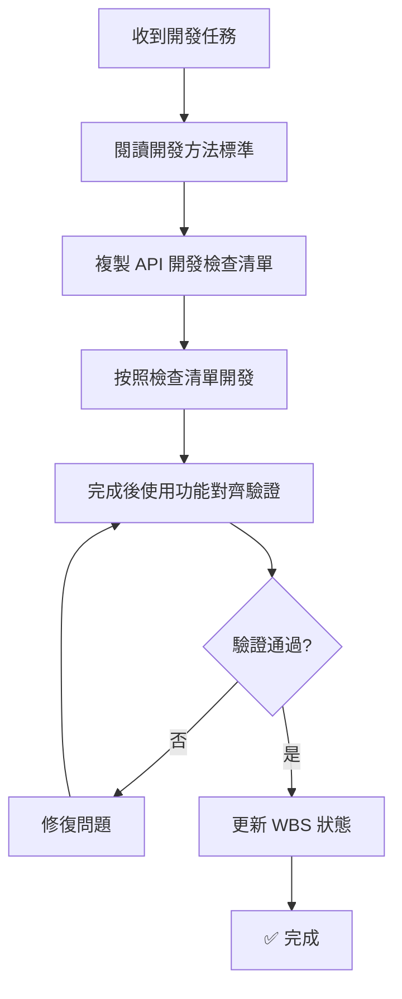

# 開發標準與流程文件索引

> **建立日期**: 2025-10-25
> **目的**: 提供標準化的開發方法與任務追蹤流程
> **適用範圍**: RespiraAlly V2.0 專案全體開發者

---

## 📚 文件清單

### 1. 主要標準文件

#### 📘 [開發方法與任務追蹤標準](./development_methodology_and_tracking_standard.md)
**必讀文件** - 定義完整的開發流程和任務追蹤標準

**內容包含**:
- 完整開發流程 (7 個階段)
- 任務狀態定義與完成度計算
- API 開發標準
- 測試驗證標準
- WBS 更新標準
- 問題修復流程

**適用情境**:
- 新功能開發
- 問題修復
- WBS 狀態更新

---

### 2. 檢查清單模板

#### ✅ [API 開發檢查清單模板](./templates/api_development_checklist_template.md)
**每個 API 開發任務必須使用**

**包含檢查項目**:
- 後端實作 (8 項)
  - 資料庫 Model
  - Pydantic Schemas
  - Repository Layer
  - Use Case Layer
  - API Router
  - 單元測試
  - API 整合測試
  - Code Review
- 前端實作 (5 項)
  - TypeScript Types
  - API Client
  - React Hook
  - UI Components
  - Mock 資料
- 整合驗證 (4 項)
  - 資料流驗證
  - 欄位對齊檢查
  - E2E 測試
  - 手動測試

**使用方式**:
1. 複製模板到新檔案
2. 填寫功能資訊
3. 按順序完成每個檢查點
4. 所有檢查點通過後才標記為完成

---

#### ✅ [功能對齊驗證模板](./templates/feature_alignment_verification_template.md)
**功能完成後必須使用此模板驗證**

**驗證內容**:
- 前端欄位清單
- 後端 Schema 定義
- 資料庫 Model 定義
- 完整對齊檢查表
- 資料流完整性測試
- 測試結果驗證

**通過標準**: 所有檢查項目 100% 一致

**使用方式**:
1. 功能開發完成後使用
2. 填寫每個檢查項目
3. 發現不一致立即修復
4. 100% 通過才能標記為「已完成」

---

## 🚀 快速開始指南

### 新功能開發流程



### 步驟說明

#### 步驟 1: 閱讀標準文件
```bash
📖 閱讀: docs/project_management/development_methodology_and_tracking_standard.md
```
- 理解完整開發流程
- 了解任務狀態定義
- 熟悉完成度標準

#### 步驟 2: 複製檢查清單
```bash
📋 複製模板到: docs/dev_logs/checklists/[feature_name]_api_checklist.md
```

#### 步驟 3: 按照清單開發
- 後端開發 (資料庫 → Repository → Use Case → API Router)
- 前端開發 (Types → API Client → Components)
- 測試驗證 (單元測試 → 整合測試 → E2E 測試)

#### 步驟 4: 功能對齊驗證
```bash
📋 複製模板到: docs/dev_logs/verifications/[feature_name]_alignment_verification.md
```
- 填寫前後端欄位清單
- 完成對齊檢查表
- 執行資料流測試
- 記錄測試結果

#### 步驟 5: 更新 WBS
- 確認所有檢查點通過
- 更新任務狀態為 ✅ 已完成
- 記錄實際工時
- 更新 CHANGELOG

---

## 💡 使用情境範例

### 情境 1: 開發新的 API 功能

**任務**: 實作病患註冊 API

**使用文件**:
1. [開發方法標準](./development_methodology_and_tracking_standard.md) - 了解完整流程
2. [API 開發檢查清單](./templates/api_development_checklist_template.md) - 追蹤開發進度
3. [功能對齊驗證](./templates/feature_alignment_verification_template.md) - 最終驗證

**工作流程**:
```
1. 複製 API 開發檢查清單
2. 實作後端 (Schema → Repository → Use Case → Router)
3. 實作前端 (Types → API Client → UI)
4. 執行測試 (單元 → 整合 → E2E)
5. 執行功能對齊驗證
6. 更新 WBS 狀態
```

### 情境 2: 修復前後端不一致問題

**問題**: 發現前端欄位在後端 Schema 中不存在

**使用文件**:
1. [開發方法標準](./development_methodology_and_tracking_standard.md) - 參考問題修復流程
2. [功能對齊驗證](./templates/feature_alignment_verification_template.md) - 找出所有不一致

**工作流程**:
```
1. 使用功能對齊驗證模板檢查
2. 填寫完整的欄位對齊表
3. 找出所有不一致的欄位
4. 按照開發方法標準修復
5. 重新驗證對齊
6. 更新 WBS 狀態為正確值
```

### 情境 3: WBS 狀態審查

**任務**: 審查 Sprint 2 的 WBS 狀態準確性

**使用文件**:
1. [功能對齊驗證](./templates/feature_alignment_verification_template.md) - 逐一驗證每個功能
2. [開發方法標準](./development_methodology_and_tracking_standard.md) - 參考完成度計算標準

**工作流程**:
```
1. 列出所有標記為「已完成」的任務
2. 對每個任務使用功能對齊驗證
3. 計算實際完成度
4. 更新 WBS 狀態
5. 記錄發現的問題
```

---

## 📊 品質指標

### 必須達成的標準

| 指標 | 最低要求 | 目標 | 說明 |
|------|---------|------|------|
| **功能對齊率** | 100% | 100% | 前後端欄位必須完全一致 |
| **測試覆蓋率** | 80% | 90%+ | 單元測試覆蓋率 |
| **API 測試** | 100% | 100% | 所有端點都有測試 |
| **E2E 測試** | 關鍵流程 | 全流程 | 使用者核心操作必須覆蓋 |
| **WBS 準確度** | 95%+ | 100% | WBS 狀態與實際一致 |

### 檢查點通過率要求

```
✅ 已完成 = 所有檢查點 100% 通過
🟡 部分完成 = 50-99% 檢查點通過（有已知問題）
🔄 進行中 = < 50% 檢查點通過
```

---

## 🔧 工具與輔助資源

### 相關文件

- [WBS 開發計劃](../16_wbs_development_plan.md) - 專案整體進度追蹤
- [API 設計規範](../06_api_design_specification.md) - API 設計標準
- [測試策略](../testing/README.md) - 測試方法與工具
- [Git 工作流程](./git_workflow_sop.md) - 版本控制規範

### 開發工具

- **後端測試**: `pytest backend/tests/ -v`
- **前端測試**: `npm run test`
- **E2E 測試**: `npx playwright test`
- **型別檢查**: `mypy backend/src/`
- **程式碼格式**: `black backend/src/` , `prettier --write frontend/`

### 文件產生器

```bash
# 產生 API 開發檢查清單
cp docs/project_management/templates/api_development_checklist_template.md \
   docs/dev_logs/checklists/[feature_name]_checklist.md

# 產生功能對齊驗證
cp docs/project_management/templates/feature_alignment_verification_template.md \
   docs/dev_logs/verifications/[feature_name]_verification.md
```

---

## 📞 支援與回饋

### 遇到問題？

1. **流程問題**: 參考 [開發方法標準](./development_methodology_and_tracking_standard.md)
2. **模板使用**: 參考模板內的「使用說明」章節
3. **技術問題**: 建立 Issue 並標記 `process-improvement`

### 改善建議

發現這些標準有問題或需要改進：
1. 建立 Issue
2. 標記為 `process-improvement`
3. 描述具體問題和改善建議
4. 指派給 TaskMaster Hub

---

## 📈 版本歷史

| 版本 | 日期 | 變更內容 | 作者 |
|------|------|---------|------|
| v1.0 | 2025-10-25 | 初始版本 - 建立完整開發標準與追蹤流程 | TaskMaster Hub |

---

## 🎯 重要提醒

### ⚠️ 強制執行規則

1. **所有 API 開發必須使用檢查清單** - 無例外
2. **所有功能完成必須執行對齊驗證** - 無例外
3. **WBS 狀態必須基於驗證結果** - 無例外
4. **100% 對齊才能標記為完成** - 無例外

### ✅ 成功標準

```
❌ 錯誤: UI 完成 = 功能完成
✅ 正確: 前端 + 後端 + 測試 + 文件 + 驗證通過 = 功能完成
```

### 🎓 學習路徑

**新加入開發者**:
```
Day 1: 閱讀開發方法標準 (1h)
Day 2: 熟悉檢查清單模板 (1h)
Day 3: 使用模板完成第一個小功能 (4h)
Day 4: Code Review 與回饋 (1h)
```

**經驗豐富開發者**:
```
Week 1: 使用新流程開發 1-2 個功能
Week 2: 協助 Review 其他人的驗證文件
Week 3: 提出流程改善建議
```

---

**最後更新**: 2025-10-25
**維護者**: TaskMaster Hub / Claude Code AI
**狀態**: Active - 持續改進中
