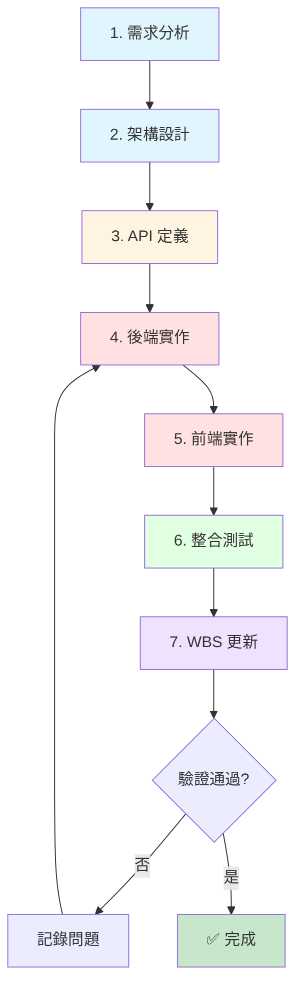
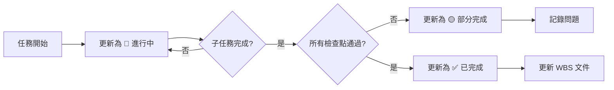
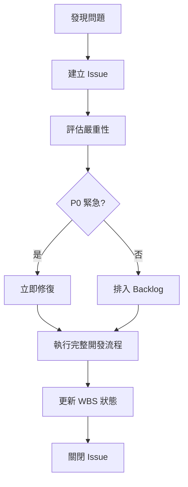

# 開發方法與任務追蹤標準

> **文件版本**: v1.0
> **最後更新**: 2025-10-25
> **作者**: TaskMaster Hub / Claude Code AI
> **狀態**: Active - 強制執行

---

## 📋 目錄

1. [文件目的](#1-文件目的)
2. [開發流程標準](#2-開發流程標準)
3. [任務追蹤標準](#3-任務追蹤標準)
4. [API 開發標準](#4-api-開發標準)
5. [測試驗證標準](#5-測試驗證標準)
6. [WBS 更新標準](#6-wbs-更新標準)
7. [問題修復流程](#7-問題修復流程)
8. [檢查清單模板](#8-檢查清單模板)

---

## 1. 文件目的

### 🎯 核心目標

本文件旨在建立**標準化的開發方法與任務追蹤流程**，確保：

1. ✅ **前後端功能對齊** - 避免前端實作但後端缺失的情況
2. ✅ **WBS 追蹤準確** - 確保 WBS 狀態與實際完成度一致
3. ✅ **資料流完整** - 從前端表單到資料庫的完整資料流
4. ✅ **測試驗證充分** - 每個功能都有對應的測試驗證
5. ✅ **文件同步更新** - API 文件與實作保持一致

### 🚨 問題根源分析

**案例：病患註冊功能的 WBS 追蹤異常**

```
WBS 記錄: ✅ 註冊頁面欄位更新 (移除 COPD 分期、新增醫院病歷號等)

實際狀態:
✅ 前端表單: 有醫院病歷號欄位
✅ 資料庫模型: 有 hospital_medical_record_number 欄位
❌ 後端 API: 不存在 /auth/patient/register 端點
❌ Schema: PatientRegisterRequest 不存在
❌ 資料流: hospital_patient_id 無法儲存到資料庫

結論: WBS 標記「已完成」，但實際只完成前端 UI，後端完全缺失
```

**問題本質**：
- **局部完成** 被標記為 **整體完成**
- **前端實作** 未驗證 **後端對應**
- **UI 層** 完成不等於 **功能層** 完成

---

## 2. 開發流程標準

### 🔄 完整開發流程（7 個階段）



### 📝 各階段標準

#### 階段 1: 需求分析 (Requirements Analysis)

**輸入**：
- 使用者故事 (User Story)
- 驗收標準 (Acceptance Criteria)
- 技術限制 (Technical Constraints)

**輸出**：
- 需求規格文件
- 資料模型初稿
- API 端點清單

**檢查點**：
- [ ] 需求明確且可測試
- [ ] 資料欄位定義清楚
- [ ] 前後端職責劃分明確

#### 階段 2: 架構設計 (Architecture Design)

**輸入**：
- 需求規格文件
- 現有系統架構

**輸出**：
- C4 架構圖（如需要）
- 資料庫 Schema 設計
- API 路由規劃

**檢查點**：
- [ ] 資料庫 Schema 完整定義
- [ ] API 路由與現有系統一致
- [ ] 技術決策有 ADR 記錄

#### 階段 3: API 定義 (API Definition)

**輸入**：
- 架構設計文件
- 資料模型

**輸出**：
- API 規格文件 (OpenAPI/Swagger)
- Request/Response Schema
- 錯誤處理定義

**檢查點**：
- [ ] 所有端點都有完整定義
- [ ] Request Schema 包含所有必要欄位
- [ ] Response Schema 與資料庫模型對應
- [ ] 錯誤情境都有處理

**📋 使用模板**：[API 開發檢查清單](#api-開發檢查清單)

#### 階段 4: 後端實作 (Backend Implementation)

**執行順序**：
```
1. 資料庫 Migration (Alembic)
2. Domain Models (SQLAlchemy)
3. Pydantic Schemas (Request/Response)
4. Repository Layer (資料存取)
5. Use Case Layer (業務邏輯)
6. API Router (端點)
7. 單元測試 (pytest)
```

**檢查點**：
- [ ] 資料庫 Migration 執行成功
- [ ] Domain Models 與 Schema 一致
- [ ] Repository 方法完整實作
- [ ] Use Case 包含所有業務邏輯
- [ ] API Router 正確連接
- [ ] 單元測試覆蓋率 > 80%

#### 階段 5: 前端實作 (Frontend Implementation)

**執行順序**：
```
1. TypeScript Types 定義
2. API Client 函式
3. React Components
4. 表單驗證邏輯
5. 錯誤處理 UI
```

**檢查點**：
- [ ] TypeScript Types 與後端 Schema 一致
- [ ] API Client 使用正確的端點
- [ ] 表單欄位與後端 Schema 對應
- [ ] 必填欄位有前端驗證
- [ ] 錯誤訊息使用者友善

#### 階段 6: 整合測試 (Integration Testing)

**測試類型**：
```
1. API 測試 (pytest)
2. E2E 測試 (Playwright)
3. 手動測試 (Manual QA)
```

**檢查點**：
- [ ] API 測試: 所有端點回應正確
- [ ] E2E 測試: 完整使用者流程通過
- [ ] 資料驗證: 資料正確儲存到資料庫
- [ ] 錯誤處理: 異常情境正確處理

**📋 使用模板**：[功能對齊驗證檢查清單](#功能對齊驗證檢查清單)

#### 階段 7: WBS 更新 (WBS Update)

**更新內容**：
```
1. 任務狀態: pending → in_progress → completed
2. 實際工時記錄
3. 交付物清單
4. 問題與風險記錄
```

**檢查點**：
- [ ] 所有子任務都已完成
- [ ] 整合測試全部通過
- [ ] 文件已同步更新
- [ ] 問題已記錄到 Issues

---

## 3. 任務追蹤標準

### 📊 任務狀態定義

| 狀態 | 符號 | 定義 | 完成標準 |
|------|------|------|----------|
| **未開始** | ⬜ | 任務尚未開始執行 | N/A |
| **進行中** | 🔄 | 任務正在執行中 | 至少完成 1 個子任務 |
| **接近完成** | ⚡ | 任務 > 80% 完成 | 所有子任務完成，待整合測試 |
| **已完成** | ✅ | 任務完全完成並驗證 | **所有檢查點通過** |
| **部分完成** | 🟡 | 任務部分完成但有問題 | 至少 50% 完成，有已知問題 |
| **已阻塞** | 🚫 | 任務因依賴而阻塞 | 等待其他任務完成 |

### 🎯 完成度計算標準

**功能完成度 = (已完成檢查點數 / 總檢查點數) × 100%**

**範例：病患註冊功能**
```
總檢查點: 8
✅ 前端表單 UI           (1/8) = 12.5%
✅ 資料庫 Schema         (1/8) = 12.5%
❌ 後端 API 端點         (0/8) = 0%
❌ Pydantic Schema       (0/8) = 0%
❌ 前端 API Client       (0/8) = 0%
❌ 資料流驗證            (0/8) = 0%
❌ 整合測試             (0/8) = 0%
❌ 文件更新             (0/8) = 0%

完成度 = 2/8 = 25% 🟡 部分完成
```

**正確的 WBS 狀態應該是**：
```diff
- ❌ ✅ 註冊頁面欄位更新 (移除 COPD 分期、新增醫院病歷號等)
+ ✅ 🟡 註冊頁面欄位更新 (25% - 前端 UI 完成，後端 API 缺失)
```

---

## 4. API 開發標準

### 📋 API 開發檢查清單

每個 API 端點必須完成以下所有項目才能標記為「已完成」：

#### 4.1 後端實作 (Backend Implementation)

```yaml
後端必要項目:
  - [ ] 1. 資料庫 Model 定義 (SQLAlchemy)
      - 欄位類型正確
      - 關聯關係正確
      - 索引和約束定義

  - [ ] 2. Pydantic Request Schema
      - 欄位定義完整
      - 驗證規則正確 (min/max, regex, etc.)
      - 必填/選填標示正確

  - [ ] 3. Pydantic Response Schema
      - 欄位與 Model 對應
      - 計算欄位邏輯正確
      - 敏感資料已過濾

  - [ ] 4. Repository 方法
      - CRUD 操作完整
      - 查詢邏輯正確
      - 異常處理完善

  - [ ] 5. Use Case / Service
      - 業務邏輯正確
      - 資料驗證充分
      - 事件發布 (如需要)

  - [ ] 6. API Router 端點
      - 路由路徑正確
      - HTTP 方法正確
      - 權限控制正確
      - OpenAPI 文檔完整

  - [ ] 7. 單元測試
      - Repository 測試
      - Use Case 測試
      - 覆蓋率 > 80%

  - [ ] 8. API 整合測試
      - 正常情境測試
      - 錯誤情境測試
      - 權限測試
```

#### 4.2 前端實作 (Frontend Implementation)

```yaml
前端必要項目:
  - [ ] 1. TypeScript Types 定義
      - Request Type 與後端 Schema 一致
      - Response Type 與後端 Schema 一致
      - Enum 與後端 Enum 一致

  - [ ] 2. API Client 函式
      - 使用正確的端點路徑
      - HTTP 方法正確
      - 請求參數正確
      - 錯誤處理完整

  - [ ] 3. React Hook (如需要)
      - useQuery / useMutation 設定正確
      - Loading / Error 狀態處理
      - 快取策略正確

  - [ ] 4. UI Components
      - 表單欄位與 Schema 對應
      - 驗證規則與後端一致
      - 錯誤訊息顯示

  - [ ] 5. Mock 資料 (開發用)
      - Mock 資料格式正確
      - 模擬成功/失敗情境
```

#### 4.3 整合驗證 (Integration Verification)

```yaml
整合驗證項目:
  - [ ] 1. 資料流驗證
      - 前端表單 → API → 資料庫
      - 資料完整性確認
      - 資料型別正確

  - [ ] 2. E2E 測試
      - 完整使用者流程測試
      - 跨頁面互動測試
      - 錯誤情境測試

  - [ ] 3. 手動測試
      - 實際操作驗證
      - UI/UX 驗證
      - 瀏覽器相容性

  - [ ] 4. 文件同步
      - API 規格文件更新
      - 使用說明更新
      - CHANGELOG 記錄
```

---

## 5. 測試驗證標準

### 🧪 測試金字塔

```
           E2E Tests (10%)
          /            \
         /              \
        /                \
    Integration Tests (30%)
      /                    \
     /                      \
    /                        \
  Unit Tests (60%)
```

### ✅ 測試覆蓋率要求

| 測試類型 | 最低覆蓋率 | 目標覆蓋率 | 說明 |
|---------|-----------|-----------|------|
| 單元測試 | 80% | 90%+ | Repository, Use Case, Utils |
| 整合測試 | 70% | 85%+ | API 端點, 資料流 |
| E2E 測試 | 關鍵流程 100% | 全流程 80%+ | 使用者核心操作 |

### 📋 測試檢查清單

#### 單元測試 (Unit Tests)

```yaml
Repository Layer:
  - [ ] Create 方法測試
  - [ ] Read 方法測試
  - [ ] Update 方法測試
  - [ ] Delete 方法測試
  - [ ] Query 方法測試
  - [ ] 異常情境測試

Use Case Layer:
  - [ ] 正常流程測試
  - [ ] 驗證邏輯測試
  - [ ] 業務規則測試
  - [ ] 異常處理測試
  - [ ] 權限檢查測試
```

#### 整合測試 (Integration Tests)

```yaml
API Tests:
  - [ ] 201 Created - 成功建立
  - [ ] 200 OK - 成功查詢/更新
  - [ ] 204 No Content - 成功刪除
  - [ ] 400 Bad Request - 驗證錯誤
  - [ ] 401 Unauthorized - 未授權
  - [ ] 403 Forbidden - 無權限
  - [ ] 404 Not Found - 資源不存在
  - [ ] 422 Unprocessable Entity - 資料錯誤

資料庫測試:
  - [ ] 資料正確寫入
  - [ ] 關聯關係正確
  - [ ] 約束條件生效
  - [ ] 觸發器/事件執行
```

#### E2E 測試 (End-to-End Tests)

```yaml
使用者流程:
  - [ ] 註冊流程
  - [ ] 登入流程
  - [ ] 資料提交流程
  - [ ] 資料查詢流程
  - [ ] 資料更新流程

跨頁面測試:
  - [ ] 頁面導航正確
  - [ ] 狀態保持正確
  - [ ] 資料一致性
```

---

## 6. WBS 更新標準

### 📊 WBS 更新時機



### 📝 WBS 更新模板

```markdown
#### 任務編號 X.Y.Z - [任務名稱]

**狀態**: [⬜/🔄/⚡/✅/🟡/🚫]
**完成度**: XX%
**實際工時**: Xh / 預估Yh
**完成日期**: YYYY-MM-DD

**檢查點完成情況**:
- [x] 後端 API 實作
- [x] 前端 UI 實作
- [x] 整合測試通過
- [ ] E2E 測試通過 (阻塞原因: XXX)
- [x] 文件更新

**交付物**:
- ✅ API 端點: POST /api/v1/xxx
- ✅ 前端頁面: /xxx
- 🟡 測試報告: 待補充 E2E 測試

**問題與風險**:
- ⚠️ Issue #123: E2E 測試環境配置問題
- 🔄 風險: 第三方 API 穩定性待驗證

**下一步**:
1. 修復 E2E 測試環境
2. 補充測試報告
3. 進行 Code Review
```

---

## 7. 問題修復流程

### 🚨 發現問題時的標準流程



### 📋 Issue 建立模板

```markdown
## 問題描述
[清楚描述發現的問題]

## 重現步驟
1. 步驟 1
2. 步驟 2
3. 步驟 3

## 預期行為
[描述預期應該發生什麼]

## 實際行為
[描述實際發生了什麼]

## 影響範圍
- [ ] 前端 UI
- [ ] 後端 API
- [ ] 資料庫
- [ ] 文件

## 嚴重性
- [ ] P0 - 緊急 (阻塞功能)
- [ ] P1 - 高 (重要功能受影響)
- [ ] P2 - 中 (次要功能受影響)
- [ ] P3 - 低 (優化建議)

## WBS 影響
- 任務編號: X.Y.Z
- 當前狀態: ✅ 已完成
- 應更新為: 🟡 部分完成

## 修復計劃
1. [ ] 步驟 1
2. [ ] 步驟 2
3. [ ] 步驟 3
```

---

## 8. 檢查清單模板

### 📋 API 開發檢查清單

複製此清單到每個 API 開發任務：

```markdown
## API 開發檢查清單 - [功能名稱]

### 後端實作
- [ ] 資料庫 Model (SQLAlchemy)
  - [ ] 欄位定義完整
  - [ ] 關聯關係正確
  - [ ] 索引和約束
- [ ] Pydantic Schema
  - [ ] Request Schema
  - [ ] Response Schema
  - [ ] 驗證規則
- [ ] Repository Layer
  - [ ] CRUD 方法
  - [ ] 查詢方法
  - [ ] 異常處理
- [ ] Use Case Layer
  - [ ] 業務邏輯
  - [ ] 資料驗證
  - [ ] 事件發布
- [ ] API Router
  - [ ] 端點定義
  - [ ] 權限控制
  - [ ] OpenAPI 文檔
- [ ] 測試
  - [ ] 單元測試 (>80%)
  - [ ] API 整合測試

### 前端實作
- [ ] TypeScript Types
  - [ ] Request Type
  - [ ] Response Type
  - [ ] Enum 定義
- [ ] API Client
  - [ ] 端點路徑正確
  - [ ] 請求參數正確
  - [ ] 錯誤處理
- [ ] UI Components
  - [ ] 表單欄位對應
  - [ ] 驗證邏輯
  - [ ] 錯誤訊息

### 整合驗證
- [ ] 資料流測試
  - [ ] 前端 → API → 資料庫
  - [ ] 資料完整性
  - [ ] 資料型別
- [ ] E2E 測試
  - [ ] 使用者流程
  - [ ] 錯誤情境
- [ ] 手動測試
  - [ ] 實際操作驗證
  - [ ] UI/UX 驗證

### 文件更新
- [ ] API 規格文件
- [ ] 使用說明
- [ ] CHANGELOG
- [ ] WBS 狀態更新
```

### 📋 功能對齊驗證檢查清單

```markdown
## 功能對齊驗證 - [功能名稱]

### 前端檢查
- [ ] 表單欄位清單
  - [ ] 欄位1: [name] - [type] - [required/optional]
  - [ ] 欄位2: [name] - [type] - [required/optional]
- [ ] API 呼叫端點
  - [ ] 方法: [GET/POST/PATCH/DELETE]
  - [ ] 路徑: /api/v1/xxx
- [ ] TypeScript Types
  - [ ] Request Type 定義正確
  - [ ] Response Type 定義正確

### 後端檢查
- [ ] API 端點存在
  - [ ] 路徑: /api/v1/xxx
  - [ ] 方法: [GET/POST/PATCH/DELETE]
- [ ] Request Schema
  - [ ] 欄位1: [name] - [type] - [required/optional]
  - [ ] 欄位2: [name] - [type] - [required/optional]
- [ ] 資料庫 Model
  - [ ] 欄位1: [column_name] - [type] - [nullable]
  - [ ] 欄位2: [column_name] - [type] - [nullable]

### 資料流驗證
- [ ] 前端表單欄位 ↔ API Request Schema
  - [ ] 欄位名稱一致
  - [ ] 資料型別一致
  - [ ] 必填/選填一致
- [ ] API Request Schema ↔ 資料庫 Model
  - [ ] 欄位對應完整
  - [ ] 資料型別相容
  - [ ] 約束條件一致

### 測試驗證
- [ ] 單元測試通過
- [ ] API 測試通過
- [ ] E2E 測試通過
- [ ] 手動測試通過

### 結果
- [ ] ✅ 所有檢查通過 → 標記為完成
- [ ] 🟡 部分通過 → 記錄問題並修復
- [ ] ❌ 未通過 → 重新開發
```

---

## 9. 實際案例：修復病患註冊功能

### 📝 問題分析

**問題發現**：
```
前端呼叫: POST /auth/patient/register
後端實際: 端點不存在 (404 Not Found)
WBS 狀態: ✅ 已完成
```

**根本原因**：
- 只完成前端 UI 實作
- 未實作後端 API 端點
- 未驗證前後端整合
- WBS 狀態更新過早

### 🔧 修復計劃

使用**完整開發流程**重新實作：

```markdown
## 病患註冊 API 修復任務

### 階段 1: 需求確認
- [ ] 確認所有必要欄位
- [ ] 確認驗證規則
- [ ] 確認業務邏輯

### 階段 2: 後端實作
- [ ] 新增 PatientRegisterRequest Schema
- [ ] 新增 PatientRegisterUseCase
- [ ] 新增 POST /auth/patient/register 端點
- [ ] 擴展 UserRepository.create_patient 方法
- [ ] 撰寫單元測試

### 階段 3: 前端調整
- [ ] 確認 API Client 使用正確端點
- [ ] 確認 Request Type 與 Schema 一致
- [ ] 更新錯誤處理

### 階段 4: 整合測試
- [ ] API 測試 (pytest)
- [ ] 資料流驗證 (表單 → API → DB)
- [ ] E2E 測試 (Playwright)

### 階段 5: WBS 更新
- [ ] 更新任務狀態
- [ ] 記錄實際工時
- [ ] 更新文件
```

---

## 10. 總結與最佳實踐

### ✅ 開發標準的核心原則

1. **完整性優先** - 功能必須包含前後端+測試+文件
2. **驗證優先** - 測試通過才算完成
3. **對齊優先** - 前後端必須對齊
4. **文件同步** - 程式碼與文件同步更新
5. **漸進式完成** - 狀態反映真實進度

### 🎯 WBS 追蹤的黃金法則

```
❌ 錯誤: UI 完成 = 功能完成
✅ 正確: 前端 + 後端 + 測試 + 文件 = 功能完成
```

### 📋 每日檢查清單

開發者每日自我檢查：

```markdown
今日開發檢查:
- [ ] 我修改的前端程式碼有對應的後端 API 嗎？
- [ ] 我新增的 API 端點有完整的測試嗎？
- [ ] 我的資料流從前端到資料庫是完整的嗎？
- [ ] 我的 WBS 狀態反映真實完成度嗎？
- [ ] 我的變更有更新相關文件嗎？
```

---

## 附錄

### A. 相關文件

- [WBS 開發計劃](../16_wbs_development_plan.md)
- [API 設計規範](../06_api_design_specification.md)
- [測試策略](../testing/README.md)
- [Git 工作流程](./git_workflow_sop.md)

### B. 檢查清單模板

完整的檢查清單模板請參考：
- [API 開發檢查清單模板](./templates/api_development_checklist_template.md)
- [功能對齊驗證模板](./templates/feature_alignment_verification_template.md)

### C. 問題回報

發現本標準有問題或需要改進，請：
1. 建立 Issue
2. 標記為 `process-improvement`
3. 指派給 TaskMaster Hub

---

**版本歷史**:
- v1.0 (2025-10-25) - 初始版本，基於病患註冊功能的 WBS 追蹤異常案例建立
