# 功能對齊驗證 - [功能名稱]

> **驗證日期**: YYYY-MM-DD
> **驗證人員**: [姓名]
> **功能描述**: [簡述功能]
> **相關端點**: [METHOD] /api/v1/[endpoint]

---

## 📋 使用說明

1. 在功能開發完成後使用此模板
2. 填寫每個檢查項目的實際狀態
3. 對齊檢查表必須 100% 一致
4. 發現不一致立即記錄並修復
5. 所有項目通過後才能標記為「已完成」

---

## 1. 功能概述 (Feature Overview)

### 1.1 功能說明
```
[詳細描述此功能的目的、使用場景和預期行為]
```

### 1.2 涉及的層級
- [ ] 前端 UI
- [ ] 前端 API Client
- [ ] 後端 API Router
- [ ] 後端 Use Case
- [ ] 後端 Repository
- [ ] 資料庫 Model
- [ ] 資料庫 Migration

---

## 2. 前端檢查 (Frontend Verification)

### 2.1 表單/頁面資訊

**檔案路徑**: `frontend/[app]/src/[path]/[Component].tsx`

**頁面路由**: `/[route]`

### 2.2 UI 元件欄位清單

| 欄位名稱 | UI 元件類型 | 必填/選填 | 驗證規則 | 預設值 | 備註 |
|---------|-----------|---------|---------|-------|------|
| field1 | text input | 必填 | min:2, max:100 | - | 姓名 |
| field2 | number input | 選填 | min:0, max:100 | 0 | 年齡 |
| field3 | select | 必填 | enum | - | 性別 |
| field4 | date picker | 必填 | ISO 8601 | - | 出生日期 |

**總欄位數**: [N] 個

### 2.3 TypeScript Request Type

**檔案路徑**: `frontend/[app]/src/types/[feature].ts`

```typescript
export interface [Feature]Request {
  field1: string          // 對應 UI 欄位1
  field2?: number         // 對應 UI 欄位2
  field3: 'MALE' | 'FEMALE' | 'OTHER'  // 對應 UI 欄位3
  field4: string          // 對應 UI 欄位4 (ISO date)
}
```

**檢查點**:
- [ ] 所有 UI 欄位都有對應的 Type 定義
- [ ] 必填/選填標記正確 (`?`)
- [ ] 型別定義正確
- [ ] Enum 定義正確

### 2.4 API Client 呼叫

**檔案路徑**: `frontend/[app]/src/api/[feature].ts`

```typescript
async createFeature(data: [Feature]Request): Promise<[Feature]Response> {
  return apiClient.post<[Feature]Response>('/[endpoint]', data)
}
```

**呼叫資訊**:
- **HTTP 方法**: POST / GET / PATCH / DELETE
- **端點路徑**: `/api/v1/[endpoint]`
- **Content-Type**: `application/json`

**檢查點**:
- [ ] HTTP 方法正確
- [ ] 端點路徑正確
- [ ] Request Type 正確
- [ ] Response Type 正確

---

## 3. 後端檢查 (Backend Verification)

### 3.1 API 端點資訊

**檔案路徑**: `backend/src/respira_ally/api/v1/routers/[feature].py`

**端點定義**:
```python
@router.post(
    "/[endpoint]",
    response_model=[Feature]Response,
    status_code=status.HTTP_201_CREATED
)
async def create_[feature](
    request: [Feature]CreateRequest,
    current_user: TokenData = Depends(get_current_user),
) -> [Feature]Response:
    ...
```

**檢查點**:
- [ ] ✅ 端點存在
- [ ] HTTP 方法與前端一致
- [ ] 端點路徑與前端一致
- [ ] 權限控制正確

### 3.2 Pydantic Request Schema

**檔案路徑**: `backend/src/respira_ally/core/schemas/[feature].py`

```python
class [Feature]CreateRequest(BaseModel):
    field1: str = Field(..., min_length=2, max_length=100)
    field2: int | None = Field(None, ge=0, le=100)
    field3: Literal["MALE", "FEMALE", "OTHER"] = Field(...)
    field4: date = Field(...)
```

**欄位清單**:

| 欄位名稱 | Python 型別 | 必填/選填 | 驗證規則 | 預設值 | 備註 |
|---------|-----------|---------|---------|-------|------|
| field1 | str | 必填 | min_length=2, max_length=100 | - | 姓名 |
| field2 | int \| None | 選填 | ge=0, le=100 | None | 年齡 |
| field3 | Literal | 必填 | enum | - | 性別 |
| field4 | date | 必填 | - | - | 出生日期 |

**總欄位數**: [N] 個

**檢查點**:
- [ ] 欄位數量與前端一致
- [ ] 欄位名稱與前端一致 (camelCase → snake_case if needed)
- [ ] 必填/選填與前端一致
- [ ] 型別與前端相容
- [ ] 驗證規則與前端一致

### 3.3 資料庫 Model

**檔案路徑**: `backend/src/respira_ally/infrastructure/database/models/[model].py`

```python
class [Feature]Model(Base):
    __tablename__ = "[table_name]"

    field1: Mapped[str] = mapped_column(String(100), nullable=False)
    field2: Mapped[int | None] = mapped_column(Integer, nullable=True)
    field3: Mapped[str | None] = mapped_column(
        Enum("MALE", "FEMALE", "OTHER", name="gender_enum"),
        nullable=True
    )
    field4: Mapped[date] = mapped_column(Date, nullable=False)
```

**欄位清單**:

| 欄位名稱 | SQL 型別 | Nullable | 約束條件 | 索引 | 備註 |
|---------|---------|---------|---------|------|------|
| field1 | String(100) | False | - | - | 姓名 |
| field2 | Integer | True | - | - | 年齡 |
| field3 | Enum | True | MALE/FEMALE/OTHER | - | 性別 |
| field4 | Date | False | - | - | 出生日期 |

**總欄位數**: [N] 個

**檢查點**:
- [ ] 欄位數量與 Schema 一致
- [ ] 欄位名稱與 Schema 一致 (snake_case)
- [ ] Nullable 與 Schema 的 Optional 一致
- [ ] 型別與 Schema 相容
- [ ] 索引設定合理

---

## 4. 對齊檢查表 (Alignment Matrix)

### 4.1 完整欄位對齊表

| 前端 UI 欄位 | 前端 Type | API Request Schema | 資料庫 Column | 型別一致 | 必填一致 | 驗證一致 | 狀態 |
|------------|----------|-------------------|--------------|---------|---------|---------|------|
| field1 | string | field1: str | field1: String(100) | ✓ | ✓ | ✓ | ✅ |
| field2 | number? | field2?: int | field2: Integer? | ✓ | ✓ | ✓ | ✅ |
| field3 | enum | field3: Literal | field3: Enum | ✓ | ✓ | ✓ | ✅ |
| field4 | string(date) | field4: date | field4: Date | ✓ | ✓ | ✓ | ✅ |

**對齊率**: [X]/[N] = [XX]%

**要求**: 必須達到 **100%** 對齊才能通過

### 4.2 型別對應檢查

| 前端型別 (TypeScript) | 後端型別 (Python) | 資料庫型別 (SQL) | 相容性 |
|---------------------|------------------|----------------|--------|
| string | str | String(N) / Text | ✅ |
| number | int | Integer | ✅ |
| number | float / Decimal | Numeric / Float | ✅ |
| boolean | bool | Boolean | ✅ |
| string (ISO date) | date | Date | ✅ |
| string (ISO datetime) | datetime | DateTime | ✅ |
| enum | Literal / Enum | Enum | ✅ |
| string[] | list[str] | ARRAY / JSON | ✅ |
| object | dict | JSON / JSONB | ✅ |

### 4.3 必填/選填對齊

| 欄位 | 前端必填 | Schema 必填 | 資料庫 NOT NULL | 一致性 |
|------|---------|-----------|----------------|--------|
| field1 | ✓ | ✓ | ✓ | ✅ |
| field2 | ✗ | ✗ | ✗ | ✅ |
| field3 | ✓ | ✓ | ✓ | ✅ |
| field4 | ✓ | ✓ | ✓ | ✅ |

---

## 5. 資料流驗證 (Data Flow Verification)

### 5.1 完整資料流測試

```mermaid
graph LR
    A[前端表單] -->|JSON| B[API Request]
    B -->|Validation| C[Pydantic Schema]
    C -->|Transform| D[Domain Model]
    D -->|Save| E[Database]
    E -->|Load| F[Domain Model]
    F -->|Transform| G[Pydantic Response]
    G -->|JSON| H[前端顯示]
```



#### 測試案例 1: 完整資料流

**前端輸入**:
```json
{
  "field1": "Test Name",
  "field2": 25,
  "field3": "MALE",
  "field4": "1990-01-01"
}
```

**API Request (驗證後)**:
```python
{
  "field1": "Test Name",
  "field2": 25,
  "field3": "MALE",
  "field4": date(1990, 1, 1)
}
```

**資料庫寫入**:
```sql
INSERT INTO table_name (field1, field2, field3, field4)
VALUES ('Test Name', 25, 'MALE', '1990-01-01');
```

**資料庫讀取**:
```python
Model(
  field1='Test Name',
  field2=25,
  field3='MALE',
  field4=date(1990, 1, 1)
)
```

**API Response**:
```json
{
  "id": "uuid-...",
  "field1": "Test Name",
  "field2": 25,
  "field3": "MALE",
  "field4": "1990-01-01",
  "createdAt": "2025-10-25T..."
}
```

**前端顯示**:
```
姓名: Test Name
年齡: 25
性別: 男性
出生日期: 1990-01-01
```

**驗證結果**:
- [ ] 資料正確送出
- [ ] 資料正確寫入
- [ ] 資料正確讀取
- [ ] 資料正確顯示
- [ ] 無資料遺失
- [ ] 無型別轉換錯誤

#### 測試案例 2: 選填欄位 (field2 = null)

**前端輸入**:
```json
{
  "field1": "Test Name",
  "field3": "FEMALE",
  "field4": "1995-05-05"
}
```

**驗證結果**:
- [ ] 選填欄位可以不填
- [ ] null 值正確處理
- [ ] 資料庫 nullable 正確
- [ ] 前端顯示正確（空值顯示）

---

## 6. 測試驗證 (Testing Verification)

### 6.1 後端 API 測試

**檔案路徑**: `backend/tests/integration/api/test_[feature]_api.py`

#### 測試案例清單

- [ ] `test_create_[feature]_success_with_all_fields()`
  - 包含所有欄位（必填+選填）
  - 驗證 201 Created
  - 驗證回應資料正確
- [ ] `test_create_[feature]_success_without_optional_fields()`
  - 只包含必填欄位
  - 驗證 201 Created
  - 驗證選填欄位為 null
- [ ] `test_create_[feature]_validation_error()`
  - 測試各種驗證錯誤
  - 驗證 422 Unprocessable Entity
  - 驗證錯誤訊息清楚
- [ ] `test_create_[feature]_missing_required_field()`
  - 缺少必填欄位
  - 驗證 422 錯誤
- [ ] `test_create_[feature]_invalid_type()`
  - 型別錯誤
  - 驗證 422 錯誤

**測試執行結果**:
```bash
pytest backend/tests/integration/api/test_[feature]_api.py -v

test_create_[feature]_success_with_all_fields ... PASSED
test_create_[feature]_success_without_optional_fields ... PASSED
test_create_[feature]_validation_error ... PASSED
test_create_[feature]_missing_required_field ... PASSED
test_create_[feature]_invalid_type ... PASSED

Total: 5 passed
```

### 6.2 E2E 測試

**檔案路徑**: `frontend/[app]/e2e/[feature].spec.ts`

#### 測試案例清單

- [ ] `test_create_[feature]_e2e_success()`
  ```typescript
  test('should create [feature] from UI', async ({ page }) => {
    // 1. 導航到建立頁面
    await page.goto('/[feature]/create')

    // 2. 填寫表單
    await page.fill('[name="field1"]', 'Test Name')
    await page.fill('[name="field2"]', '25')
    await page.selectOption('[name="field3"]', 'MALE')
    await page.fill('[name="field4"]', '1990-01-01')

    // 3. 送出表單
    await page.click('button[type="submit"]')

    // 4. 驗證成功訊息
    await expect(page.locator('.success-message')).toBeVisible()

    // 5. 驗證資料顯示
    await expect(page.locator('.field1-display')).toHaveText('Test Name')
  })
  ```
- [ ] `test_create_[feature]_e2e_validation_error()`
- [ ] `test_create_[feature]_e2e_without_optional_fields()`

**測試執行結果**:
```bash
npx playwright test e2e/[feature].spec.ts

✓ test_create_[feature]_e2e_success (5s)
✓ test_create_[feature]_e2e_validation_error (3s)
✓ test_create_[feature]_e2e_without_optional_fields (4s)

3 passed (12s)
```

### 6.3 資料庫驗證測試

#### 手動 SQL 查詢驗證

```sql
-- 1. 建立測試資料
INSERT INTO [table_name] (field1, field2, field3, field4)
VALUES ('Test Name', 25, 'MALE', '1990-01-01');

-- 2. 查詢驗證
SELECT * FROM [table_name] WHERE field1 = 'Test Name';

-- 預期結果:
-- field1: 'Test Name'
-- field2: 25
-- field3: 'MALE'
-- field4: '1990-01-01'
-- created_at: [timestamp]
-- updated_at: [timestamp]
```

**驗證結果**:
- [ ] 資料正確寫入
- [ ] 型別正確儲存
- [ ] 約束條件生效
- [ ] 時間戳記自動生成

---

## 7. 手動測試 (Manual Testing)

### 7.1 正常情境測試

**測試步驟**:
1. 開啟前端頁面
2. 填寫所有欄位（包含選填）
3. 送出表單
4. 觀察結果

**預期結果**:
- [ ] 表單順利送出
- [ ] 顯示成功訊息
- [ ] 資料正確顯示
- [ ] 無 Console 錯誤

**實際結果**: [填寫實際情況]

### 7.2 邊界值測試

| 欄位 | 測試值 | 預期結果 | 實際結果 | 狀態 |
|------|--------|---------|---------|------|
| field1 (min) | "A" (1 char) | 驗證錯誤 | [填寫] | ⬜ |
| field1 (max) | "A"*101 (101 chars) | 驗證錯誤 | [填寫] | ⬜ |
| field2 (min) | -1 | 驗證錯誤 | [填寫] | ⬜ |
| field2 (max) | 101 | 驗證錯誤 | [填寫] | ⬜ |

### 7.3 錯誤情境測試

| 測試情境 | 預期行為 | 實際結果 | 狀態 |
|---------|---------|---------|------|
| 缺少必填欄位 | 前端驗證錯誤 | [填寫] | ⬜ |
| 型別錯誤 | 前端驗證錯誤 | [填寫] | ⬜ |
| 網路錯誤 | 顯示錯誤訊息 | [填寫] | ⬜ |
| 伺服器錯誤 (500) | 顯示錯誤訊息 | [填寫] | ⬜ |

### 7.4 UI/UX 測試

- [ ] Loading 狀態顯示正確
- [ ] 錯誤訊息清楚易懂
- [ ] 成功訊息清楚
- [ ] 表單 UX 流暢
- [ ] 響應式設計正常
- [ ] 無障礙功能正常

---

## 8. 問題記錄 (Issues Found)

### 發現的不一致問題

| 問題編號 | 問題描述 | 影響範圍 | 嚴重性 | 狀態 | 解決日期 |
|---------|---------|---------|--------|------|---------|
| #001 | [問題描述] | 前端/後端/資料庫 | P0/P1/P2 | ⬜ 未處理 | - |

**範例**:
```markdown
問題 #001:
- 描述: 前端欄位 hospitalPatientId 在後端 Schema 中不存在
- 影響: 資料無法儲存到資料庫
- 嚴重性: P0 (阻塞功能)
- 解決方案: 新增 hospital_patient_id 到 Schema 和 Model
```

---

## 9. 驗證結果 (Verification Result)

### 9.1 檢查點統計

| 檢查類別 | 總項目數 | 通過數 | 失敗數 | 通過率 |
|---------|---------|--------|--------|--------|
| 前端檢查 | [N] | [X] | [Y] | [X/N]% |
| 後端檢查 | [N] | [X] | [Y] | [X/N]% |
| 對齊檢查 | [N] | [X] | [Y] | [X/N]% |
| 資料流驗證 | [N] | [X] | [Y] | [X/N]% |
| 測試驗證 | [N] | [X] | [Y] | [X/N]% |
| 手動測試 | [N] | [X] | [Y] | [X/N]% |
| **總計** | **[N]** | **[X]** | **[Y]** | **[X/N]%** |

### 9.2 最終判定

**通過標準**: 所有檢查項目 100% 通過

- [ ] ✅ **通過** - 所有檢查項目都通過，功能完全對齊
- [ ] 🟡 **部分通過** - 有少數問題，已記錄並計劃修復
- [ ] ❌ **不通過** - 有重大問題，需要重新開發

**判定結果**: [選擇一個]

**判定理由**: [說明原因]

### 9.3 WBS 狀態建議

基於驗證結果，建議 WBS 狀態為：

- [ ] ✅ 已完成 (100% 通過)
- [ ] 🟡 部分完成 ([XX]% 通過，有已知問題)
- [ ] 🔄 進行中 (< 80% 通過)
- [ ] ❌ 需重做 (< 50% 通過)

---

## 10. 後續行動 (Action Items)

### 10.1 需要修復的問題

- [ ] 問題 #001: [問題描述] - 負責人: [姓名] - 預計完成: [日期]
- [ ] 問題 #002: [問題描述] - 負責人: [姓名] - 預計完成: [日期]

### 10.2 文件更新

- [ ] 更新 WBS 狀態
- [ ] 更新 CHANGELOG
- [ ] 更新 API 文件

### 10.3 下一步

1. [具體行動1]
2. [具體行動2]
3. [具體行動3]

---

## 簽核 (Sign-off)

**驗證人員**: [姓名] - 日期: YYYY-MM-DD
**審查人員**: [姓名] - 日期: YYYY-MM-DD

**驗證狀態**: ✅ 通過 / 🟡 部分通過 / ❌ 不通過

---

**參考文件**:
- [開發方法與任務追蹤標準](../development_methodology_and_tracking_standard.md)
- [API 開發檢查清單](./api_development_checklist_template.md)
- [WBS 開發計劃](../../16_wbs_development_plan.md)
