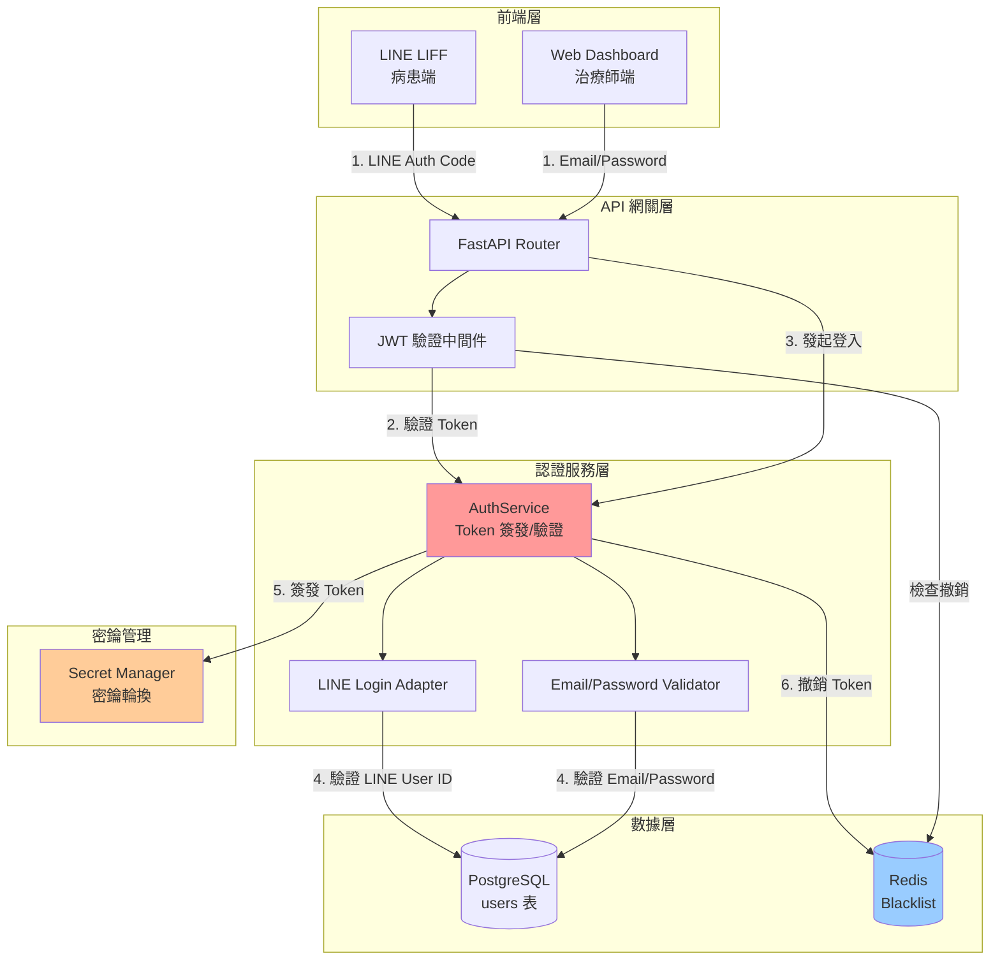
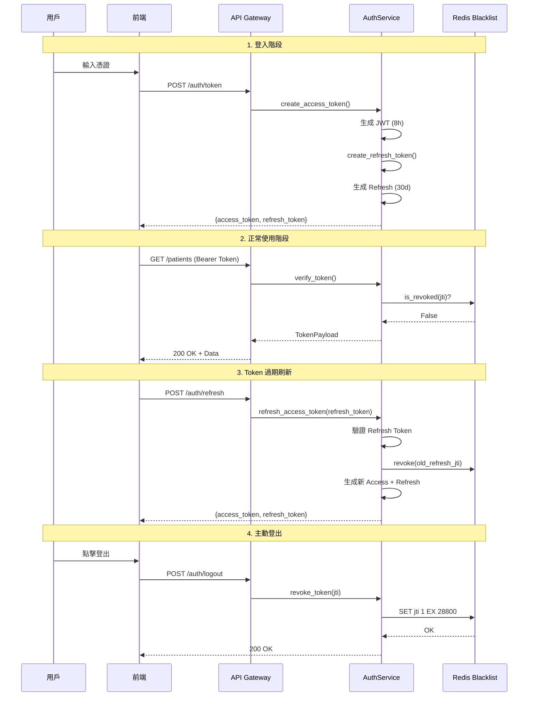
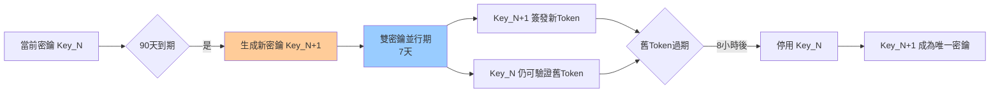
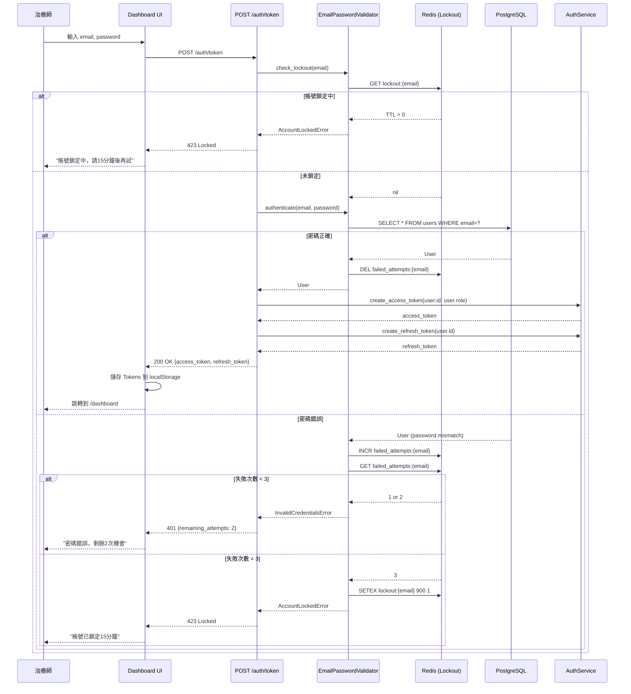
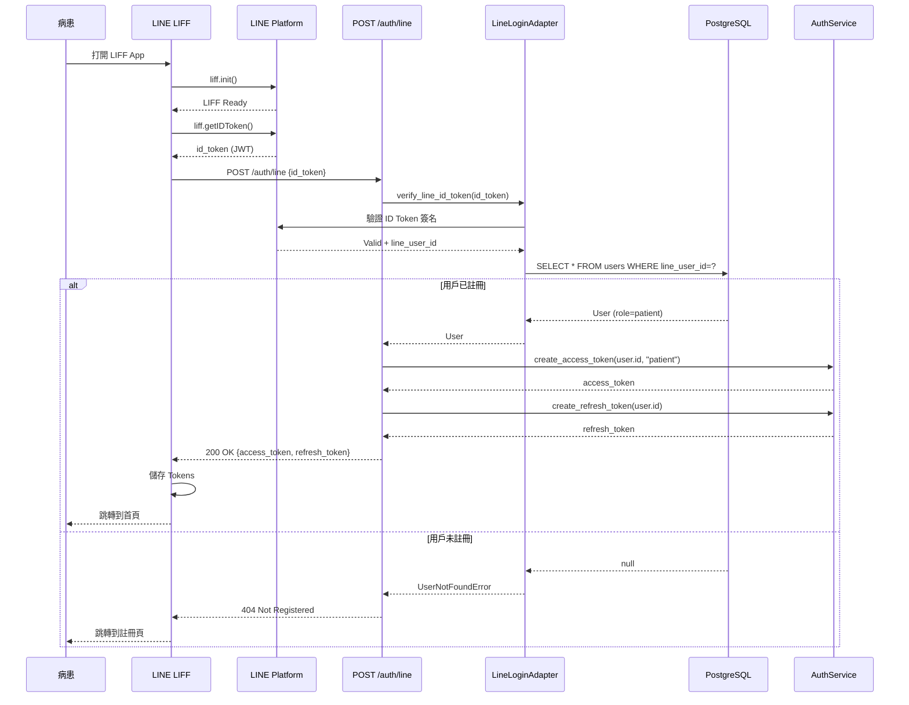
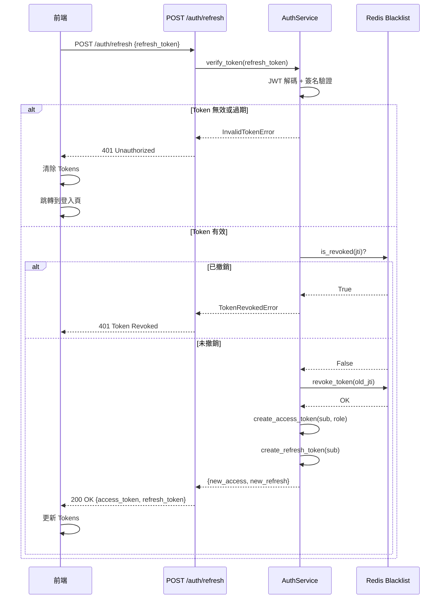

# JWT 認證設計規範

---

**文件版本**: v1.0
**最後更新**: 2025-10-20
**設計者**: Claude Code AI - Security Engineer
**狀態**: 詳細設計 (Detailed Design)

---

## 目錄

1. [設計哲學與前提問題](#1-設計哲學與前提問題)
2. [系統背景與需求](#2-系統背景與需求)
3. [JWT 架構設計](#3-jwt-架構設計)
4. [Token 結構與生命週期](#4-token-結構與生命週期)
5. [密鑰管理策略](#5-密鑰管理策略)
6. [認證流程設計](#6-認證流程設計)
7. [安全加固策略](#7-安全加固策略)
8. [錯誤處理與降級](#8-錯誤處理與降級)
9. [性能優化](#9-性能優化)
10. [實作清單與驗證](#10-實作清單與驗證)

---

## 1. 設計哲學與前提問題

### 1.1 Linus 式三問

> "This is a real problem, not a theoretical one." - Linus Torvalds

**問題 1: 這是真問題嗎？**
✅ **是**。雙角色認證（病患 LINE + 治療師 Email）是系統核心安全需求，直接影響：
- 個資保護合規性（台灣個資法）
- 醫療數據訪問控制
- 跨平台會話管理（LIFF, Web Dashboard）

**問題 2: 有更簡單的方法嗎？**
❌ **Session-based 不適合**：
- LINE LIFF 是無狀態前端，無法共享 Cookie
- 前後端分離架構需要無狀態認證
- 未來可能需要移動 App，Session 擴展性差

✅ **JWT 是最簡方案**：
- 無需 Redis Session Store（減少依賴）
- 前端自主驗證 Token（減少 API 調用）
- 標準化協議（生態系統成熟）

**問題 3: 會破壞什麼嗎？**
⚠️ **需注意**：
- Token 無法主動撤銷（需設計 Blacklist）
- 密鑰洩露影響所有 Token（需密鑰輪換機制）
- Token 過大影響網絡傳輸（需精簡 Payload）

### 1.2 數據結構優先思維

> "Bad programmers worry about the code. Good programmers worry about data structures."

**核心數據**：
```python
# Token Payload 結構（最小化原則）
{
    "sub": "uuid",           # Subject (user_id)
    "role": "patient",       # 單一角色，無複雜權限樹
    "exp": 1234567890,       # 過期時間
    "iat": 1234567800,       # 簽發時間
    "jti": "token_uuid"      # JWT ID（用於撤銷）
}
```

**設計準則**：
1. **消除特殊情況** - 統一 Token 結構，病患和治療師僅 `role` 不同
2. **索引優先** - `jti` 用於 Redis Blacklist 快速查找
3. **約束保證** - Token 過期由 JWT 本身保證，無需額外邏輯

---

## 2. 系統背景與需求

### 2.1 業務需求

| 需求來源 | 具體需求 | 優先級 |
|---------|---------|-------|
| **PRD US-102** | 治療師使用 Email/密碼登入，取得 8 小時 JWT | P0 |
| **PRD US-101** | 病患透過 LINE LIFF 自動登入，取得 JWT | P0 |
| **ADR-008** | 登入失敗 3 次鎖定 15 分鐘 | P0 |
| **架構文件** | API P95 < 500ms，JWT 驗證不可成為瓶頸 | P1 |
| **合規需求** | 符合台灣個資法，支援稽核追蹤 | P0 |

### 2.2 非功能性需求

| 品質屬性 | 目標 | 度量方式 |
|---------|-----|---------|
| **性能** | JWT 驗證 < 10ms | Prometheus 中間件計時 |
| **安全性** | 無 Token 洩露風險 | 滲透測試 |
| **可用性** | Redis 宕機不影響現有 Token 驗證 | 降級測試 |
| **可追蹤性** | 所有 Token 簽發/撤銷可審計 | 日誌稽核 |

### 2.3 技術約束

- **技術棧**: FastAPI + PyJWT + Redis
- **部署環境**: Zeabur（初期單點部署）
- **團隊規模**: 3-5 人（避免過度設計）

---

## 3. JWT 架構設計

### 3.1 整體架構



### 3.2 模組職責劃分

#### 3.2.1 AuthService (核心服務)

**職責**:
- Token 簽發（包含 Access Token 和 Refresh Token）
- Token 驗證（簽名、過期、撤銷檢查）
- Token 刷新（Refresh Token 換取新 Access Token）
- Token 撤銷（加入 Blacklist）

**關鍵接口**:
```python
class AuthService:
    def create_access_token(self, user_id: UUID, role: UserRole) -> str
    def create_refresh_token(self, user_id: UUID) -> str
    def verify_token(self, token: str) -> TokenPayload
    def refresh_access_token(self, refresh_token: str) -> str
    def revoke_token(self, jti: str) -> None
    def is_revoked(self, jti: str) -> bool
```

#### 3.2.2 LINE Login Adapter

**職責**:
- 接收 LINE Authorization Code
- 調用 LINE Token API 換取 ID Token
- 驗證 ID Token 簽名和過期時間
- 提取 LINE User ID
- 查詢 `users` 表確認用戶存在

**關鍵接口**:
```python
class LineLoginAdapter:
    def verify_line_id_token(self, id_token: str) -> LineUserInfo
    def get_user_by_line_id(self, line_user_id: str) -> User | None
```

#### 3.2.3 Email/Password Validator

**職責**:
- 驗證 Email 格式
- 驗證密碼哈希（使用 bcrypt）
- 檢查登入失敗次數（ADR-008 鎖定策略）
- 更新最後登入時間

**關鍵接口**:
```python
class EmailPasswordValidator:
    def authenticate(self, email: str, password: str) -> User | None
    def check_lockout(self, email: str) -> bool
    def increment_failed_attempts(self, email: str) -> None
    def reset_failed_attempts(self, email: str) -> None
```

---

## 4. Token 結構與生命週期

### 4.1 Access Token 結構

```json
{
  "header": {
    "alg": "HS256",
    "typ": "JWT"
  },
  "payload": {
    "sub": "550e8400-e29b-41d4-a716-446655440000",  // user_id (UUID)
    "role": "therapist",                             // patient | therapist
    "exp": 1703001600,                               // 過期時間 (Unix Timestamp)
    "iat": 1702972800,                               // 簽發時間
    "jti": "a1b2c3d4-e5f6-7890-abcd-ef1234567890",   // JWT ID (用於撤銷)
    "token_type": "access"                           // access | refresh
  },
  "signature": "..."
}
```

**字段說明**:
- `sub` (Subject): 用戶唯一標識符（UUID）
- `role`: 用戶角色，簡單枚舉（避免複雜權限樹）
- `exp` (Expiration Time): **8 小時**（治療師工作時長）
- `iat` (Issued At): 簽發時間（用於審計）
- `jti` (JWT ID): Token 唯一 ID（用於 Blacklist）
- `token_type`: 區分 Access 和 Refresh Token

**❌ 不包含的字段**（避免 Token 膨脹）:
- ~~user_name~~（前端可通過 `/me` API 獲取）
- ~~permissions~~（RBAC 在後端 Decorator 中處理）
- ~~patient_id~~（role=patient 時 `sub` 即是 patient_id）

### 4.2 Refresh Token 結構

```json
{
  "payload": {
    "sub": "550e8400-e29b-41d4-a716-446655440000",
    "exp": 1705593600,  // 30 天
    "iat": 1702972800,
    "jti": "b2c3d4e5-f6g7-8901-bcde-f12345678901",
    "token_type": "refresh"
  }
}
```

**特性**:
- **僅包含必要字段**（無 `role`，刷新時重新查詢）
- **更長有效期**（30 天）
- **單次使用**（Refresh 後舊 Token 立即撤銷）

### 4.3 Token 生命週期



**關鍵時間參數**:
- **Access Token TTL**: 8 小時（28800 秒）
- **Refresh Token TTL**: 30 天（2592000 秒）
- **Blacklist TTL**: 等同 Access Token TTL（8 小時後自動清理）

---

## 5. 密鑰管理策略

### 5.1 密鑰類型與用途

| 密鑰類型 | 算法 | 用途 | 輪換週期 |
|---------|-----|-----|---------|
| **JWT_SECRET_KEY** | HS256 | 簽發/驗證 Access/Refresh Token | 90 天 |
| **LINE_CHANNEL_SECRET** | - | 驗證 LINE ID Token | 手動輪換 |
| **PASSWORD_PEPPER** | - | 密碼哈希額外保護 | 180 天 |

### 5.2 密鑰存儲

**開發環境**:
```bash
# .env.local (不提交到 Git)
JWT_SECRET_KEY=dev-secret-key-do-not-use-in-production
JWT_ALGORITHM=HS256
JWT_ACCESS_TOKEN_EXPIRE_HOURS=8
JWT_REFRESH_TOKEN_EXPIRE_DAYS=30
```

**生產環境**:
```bash
# Zeabur 環境變數 (或使用 Secret Manager)
JWT_SECRET_KEY=${ZEABUR_SECRET_JWT_KEY}  # 從 Zeabur 控制台設置
LINE_CHANNEL_SECRET=${ZEABUR_SECRET_LINE_CHANNEL}
```

**安全原則**:
1. ❌ **絕不硬編碼**在代碼中
2. ✅ **使用環境變數**注入
3. ✅ **生產密鑰長度 ≥ 256 位**（使用 `secrets.token_urlsafe(32)`）
4. ✅ **定期輪換**（設置日曆提醒）

### 5.3 密鑰輪換機制



**實作策略**（Phase 2 實現）:
```python
class JWTKeyManager:
    def __init__(self):
        self.current_key = os.getenv("JWT_SECRET_KEY")
        self.previous_key = os.getenv("JWT_SECRET_KEY_PREVIOUS", None)

    def sign(self, payload: dict) -> str:
        """總是使用當前密鑰簽發"""
        return jwt.encode(payload, self.current_key, algorithm="HS256")

    def verify(self, token: str) -> dict:
        """優先使用當前密鑰，失敗則嘗試舊密鑰"""
        try:
            return jwt.decode(token, self.current_key, algorithms=["HS256"])
        except jwt.InvalidSignatureError:
            if self.previous_key:
                return jwt.decode(token, self.previous_key, algorithms=["HS256"])
            raise
```

---

## 6. 認證流程設計

### 6.1 治療師登入流程（Email/Password）



**API 端點定義**:
```python
@router.post("/auth/token", response_model=TokenResponse)
async def login(
    credentials: EmailPasswordCredentials,
    validator: EmailPasswordValidator = Depends(),
    auth_service: AuthService = Depends()
):
    """
    治療師登入端點

    Errors:
        401: Invalid credentials
        423: Account locked (3 failed attempts)
    """
    # 1. 檢查鎖定狀態
    if validator.check_lockout(credentials.email):
        raise HTTPException(423, "Account locked. Try again in 15 minutes.")

    # 2. 驗證憑證
    user = validator.authenticate(credentials.email, credentials.password)
    if not user:
        validator.increment_failed_attempts(credentials.email)
        remaining = 3 - validator.get_failed_count(credentials.email)
        raise HTTPException(401, f"Invalid credentials. {remaining} attempts remaining.")

    # 3. 重置失敗次數
    validator.reset_failed_attempts(credentials.email)

    # 4. 簽發 Tokens
    access_token = auth_service.create_access_token(user.user_id, user.role)
    refresh_token = auth_service.create_refresh_token(user.user_id)

    return TokenResponse(
        access_token=access_token,
        refresh_token=refresh_token,
        token_type="bearer",
        expires_in=28800  # 8 hours
    )
```

### 6.2 病患登入流程（LINE LIFF）



**API 端點定義**:
```python
@router.post("/auth/line", response_model=TokenResponse)
async def line_login(
    request: LineLoginRequest,
    adapter: LineLoginAdapter = Depends(),
    auth_service: AuthService = Depends()
):
    """
    病患 LINE 登入端點

    Errors:
        400: Invalid LINE ID Token
        404: User not registered
    """
    # 1. 驗證 LINE ID Token
    line_user_info = adapter.verify_line_id_token(request.id_token)

    # 2. 查詢用戶
    user = adapter.get_user_by_line_id(line_user_info.user_id)
    if not user:
        raise HTTPException(404, "User not registered. Please complete registration.")

    # 3. 簽發 Tokens
    access_token = auth_service.create_access_token(user.user_id, UserRole.PATIENT)
    refresh_token = auth_service.create_refresh_token(user.user_id)

    return TokenResponse(
        access_token=access_token,
        refresh_token=refresh_token,
        token_type="bearer",
        expires_in=28800
    )
```

### 6.3 Token 刷新流程



---

## 7. 安全加固策略

### 7.1 防止常見攻擊

| 攻擊類型 | 防禦措施 | 實作位置 |
|---------|---------|---------|
| **暴力破解** | ADR-008 登入鎖定（3次/15分鐘） | `EmailPasswordValidator` |
| **Token 竊取** | HTTPS Only, Secure Cookie (未來) | Nginx/Zeabur |
| **XSS** | 前端 CSP Header, Token 存 Memory (建議) | Frontend |
| **CSRF** | SameSite Cookie (未來), CORS 白名單 | FastAPI CORS |
| **重放攻擊** | Token 單次使用（Refresh Token） | `AuthService.refresh_access_token()` |
| **JWT 篡改** | HS256 簽名驗證 | PyJWT 自動處理 |

### 7.2 Token 存儲最佳實踐

**前端存儲對比**:

| 存儲方式 | 安全性 | XSS 風險 | CSRF 風險 | 推薦度 |
|---------|-------|---------|----------|-------|
| **localStorage** | 低 | 高（JS 可讀取） | 無 | ⚠️ MVP 可用 |
| **sessionStorage** | 低 | 高 | 無 | ⚠️ 同上 |
| **Memory (變數)** | 高 | 低（刷新丟失） | 無 | ✅ 理想（需配合 Refresh） |
| **HttpOnly Cookie** | 高 | 無 | 有（需 SameSite） | ✅ 最佳（Phase 2） |

**MVP 階段建議**:
```typescript
// 前端存儲策略（React/Vue）
class TokenManager {
  private accessToken: string | null = null;  // Memory 存儲
  private refreshToken: string;               // localStorage（僅 Refresh）

  constructor() {
    this.refreshToken = localStorage.getItem('refresh_token') || '';
  }

  setTokens(access: string, refresh: string) {
    this.accessToken = access;  // 不寫入 localStorage
    localStorage.setItem('refresh_token', refresh);
  }

  getAccessToken(): string | null {
    return this.accessToken;
  }

  // 頁面刷新時自動刷新 Token
  async initializeOnPageLoad() {
    if (!this.accessToken && this.refreshToken) {
      await this.refreshAccessToken();
    }
  }
}
```

### 7.3 Token 撤銷機制

**使用場景**:
1. 用戶主動登出
2. 管理員強制下線（Phase 2）
3. 檢測到異常行為（Phase 2）
4. 密碼修改後撤銷所有 Token（Phase 2）

**Redis Blacklist 設計**:
```python
class TokenBlacklistService:
    def __init__(self, redis: Redis):
        self.redis = redis

    def revoke_token(self, jti: str, ttl_seconds: int):
        """
        將 Token 加入黑名單
        TTL = Token 剩餘有效時間（過期後自動清理）
        """
        self.redis.setex(f"blacklist:{jti}", ttl_seconds, "1")

    def is_revoked(self, jti: str) -> bool:
        """檢查 Token 是否被撤銷"""
        return self.redis.exists(f"blacklist:{jti}") > 0
```

**性能優化**:
- ✅ 使用 Redis 而非 PostgreSQL（ms 級查詢）
- ✅ TTL 自動過期（無需手動清理）
- ✅ 僅存 `jti`（不存完整 Token）

---

## 8. 錯誤處理與降級

### 8.1 錯誤碼設計

```python
class AuthErrorCode(str, Enum):
    # 4xx Client Errors
    INVALID_CREDENTIALS = "AUTH_001"       # 憑證錯誤
    TOKEN_EXPIRED = "AUTH_002"             # Token 過期
    TOKEN_INVALID = "AUTH_003"             # Token 格式錯誤
    TOKEN_REVOKED = "AUTH_004"             # Token 已撤銷
    ACCOUNT_LOCKED = "AUTH_005"            # 帳號鎖定
    USER_NOT_FOUND = "AUTH_006"            # 用戶不存在

    # 5xx Server Errors
    REDIS_UNAVAILABLE = "AUTH_501"         # Redis 服務不可用
    TOKEN_GENERATION_FAILED = "AUTH_502"   # Token 生成失敗
```

**標準錯誤回應**:
```json
{
  "error": {
    "code": "AUTH_005",
    "message": "Account locked due to multiple failed login attempts.",
    "detail": "Please try again in 12 minutes.",
    "timestamp": "2025-10-20T12:00:00Z",
    "request_id": "550e8400-e29b-41d4-a716-446655440000"
  }
}
```

### 8.2 降級策略

**Redis 宕機降級**:
```python
class AuthService:
    def verify_token(self, token: str) -> TokenPayload:
        # 1. JWT 簽名驗證（不依賴 Redis）
        try:
            payload = jwt.decode(token, self.secret_key, algorithms=["HS256"])
        except jwt.ExpiredSignatureError:
            raise TokenExpiredError()
        except jwt.InvalidTokenError:
            raise TokenInvalidError()

        # 2. Blacklist 檢查（允許降級）
        try:
            if self.blacklist.is_revoked(payload["jti"]):
                raise TokenRevokedError()
        except RedisConnectionError:
            # 降級：Redis 不可用時跳過撤銷檢查
            logger.warning("Redis unavailable, skipping blacklist check")
            # 發送告警到 Prometheus
            metrics.redis_degraded.inc()

        return TokenPayload(**payload)
```

**降級決策**:
- ✅ **Token 驗證**：簽名驗證不依賴 Redis，可繼續服務
- ⚠️ **撤銷檢查**：降級模式下無法撤銷，但舊 Token 仍會在 8 小時後過期
- ❌ **登入鎖定**：無法執行（接受風險，因暴力破解需數小時）

---

## 9. 性能優化

### 9.1 性能目標

| 操作 | 目標延遲 | 測量方式 |
|-----|---------|---------|
| Token 簽發 | < 50ms | `POST /auth/token` P95 |
| Token 驗證 | < 10ms | Middleware 計時 |
| Blacklist 查詢 | < 5ms | Redis GET 延遲 |

### 9.2 優化策略

**1. JWT 驗證緩存（可選）**
```python
from functools import lru_cache

class AuthService:
    @lru_cache(maxsize=1000)
    def _decode_jwt(self, token: str) -> dict:
        """
        緩存 JWT 解碼結果（簽名驗證仍每次執行）
        注意：僅緩存結構解析，不緩存業務邏輯
        """
        return jwt.decode(token, self.secret_key, algorithms=["HS256"])
```

**2. Redis 連接池**
```python
# config.py
REDIS_POOL_CONFIG = {
    "max_connections": 50,
    "socket_timeout": 5,
    "socket_connect_timeout": 5,
    "retry_on_timeout": True
}
```

**3. 批量 Blacklist 檢查（未來）**
```python
def are_revoked_batch(self, jtis: list[str]) -> dict[str, bool]:
    """批量檢查多個 Token（WebSocket 場景）"""
    pipe = self.redis.pipeline()
    for jti in jtis:
        pipe.exists(f"blacklist:{jti}")
    results = pipe.execute()
    return dict(zip(jtis, [r > 0 for r in results]))
```

---

## 10. 實作清單與驗證

### 10.1 Phase 0 實作清單

**核心功能**（必須）:
- [ ] `AuthService.create_access_token()`
- [ ] `AuthService.create_refresh_token()`
- [ ] `AuthService.verify_token()`
- [ ] `EmailPasswordValidator.authenticate()`
- [ ] `EmailPasswordValidator.check_lockout()`
- [ ] `LineLoginAdapter.verify_line_id_token()`
- [ ] `POST /auth/token` 端點
- [ ] `POST /auth/line` 端點
- [ ] JWT 驗證中間件
- [ ] Redis Blacklist 基礎功能

**測試**（必須）:
- [ ] 單元測試：Token 簽發/驗證
- [ ] 單元測試：登入鎖定邏輯
- [ ] 整合測試：完整登入流程
- [ ] 整合測試：Token 刷新流程
- [ ] BDD 場景：`epic_100_authentication.feature`

**文檔**（必須）:
- [ ] API 文檔（OpenAPI Schema）
- [ ] 前端整合指南

### 10.2 Phase 1 擴展功能

**安全增強**（建議）:
- [ ] Token 刷新機制
- [ ] 主動登出（撤銷 Token）
- [ ] HttpOnly Cookie 支持
- [ ] CORS 白名單配置

**監控**（建議）:
- [ ] Prometheus Metrics（登入成功率、Token 驗證延遲）
- [ ] 登入失敗告警（1 分鐘內 > 10 次）

### 10.3 Phase 2 進階功能

**密鑰管理**（進階）:
- [ ] 密鑰輪換機制
- [ ] 雙密鑰並行驗證
- [ ] Secret Manager 整合

**安全審計**（進階）:
- [ ] 所有 Token 簽發日誌（含 IP, User-Agent）
- [ ] 異常登入檢測（異地登入告警）
- [ ] 強制撤銷所有 Token（密碼修改後）

### 10.4 驗證標準

**功能驗證**:
```bash
# 1. 治療師登入
curl -X POST http://localhost:8000/v1/auth/token \
  -H "Content-Type: application/json" \
  -d '{"email": "therapist@test.com", "password": "Test1234"}'

# 預期: 200 OK + access_token + refresh_token

# 2. 使用 Token 訪問 API
curl -X GET http://localhost:8000/v1/patients \
  -H "Authorization: Bearer <access_token>"

# 預期: 200 OK + 病患列表

# 3. 登入失敗 3 次鎖定
for i in {1..3}; do
  curl -X POST http://localhost:8000/v1/auth/token \
    -d '{"email": "therapist@test.com", "password": "wrong"}'
done

# 預期: 第 3 次返回 423 Locked
```

**性能驗證**:
```python
import time
import jwt

# Token 驗證性能測試
def benchmark_token_verification():
    token = "eyJ0eXAiOiJKV1QiLCJhbGc..."

    start = time.perf_counter()
    for _ in range(1000):
        jwt.decode(token, SECRET_KEY, algorithms=["HS256"])
    elapsed = time.perf_counter() - start

    avg_latency = (elapsed / 1000) * 1000  # ms
    assert avg_latency < 10, f"驗證延遲 {avg_latency}ms 超過目標 10ms"
```

---

## 附錄 A: 相關 ADR

- **[ADR-008: 治療師登入失敗鎖定策略](../adr/ADR-008-login-lockout-policy.md)** - 3 次失敗鎖定 15 分鐘
- **[ADR-TBD: JWT vs Session 認證選擇](../adr/ADR-TBD-jwt-vs-session.md)** - 為何選擇 JWT

## 附錄 B: 技術參考

- **PyJWT 文檔**: https://pyjwt.readthedocs.io/
- **LINE Login 文檔**: https://developers.line.biz/en/docs/line-login/
- **OWASP JWT Cheat Sheet**: https://cheatsheetseries.owasp.org/cheatsheets/JSON_Web_Token_for_Java_Cheat_Sheet.html

---

**審查清單**:
- [ ] Token 結構最小化（避免膨脹）
- [ ] 密鑰管理安全（不硬編碼）
- [ ] 錯誤處理完整（包含降級）
- [ ] 性能目標可達成（< 10ms 驗證）
- [ ] 安全風險已緩解（XSS, CSRF, 暴力破解）
- [ ] 實作清單可執行（優先級明確）

---

**變更歷史**:
- **v1.0 (2025-10-20)**: 初版，基於 Linus 哲學設計，包含完整認證流程與安全策略
